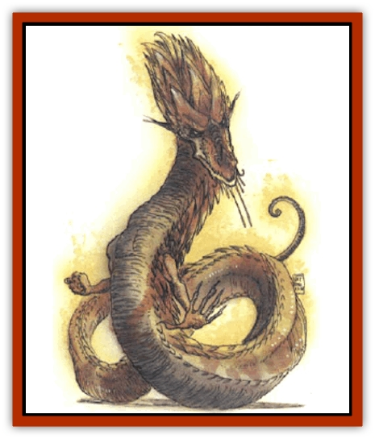

# Dragon - Linnorm - Flame

| Statistic | **Dragon, Linnorm, Flame** |
| --- | --- |
| **Activity Cycle:** | Any |
| **Alignment:** | Neutral evil |
| **Armor Class:** | -4 (base) |
| **Climate/Terrain:** | Any/Land |
| **Damage/Attack:** | 3d6(&times;2)/3d10 |
| **Diet:** | Special |
| **Frequency:** | Very rare |
| **Hit Dice:** | 20 (base) |
| **Intelligence:** | Exceptional (15-16) |
| **Magic Resistance:** | See below |
| **Morale:** | Fanatic (17-18) |
| **Movement:** | 24, Fl 39 (B) |
| **No. Appearing:** | 1 |
| **No. of Attacks:** | 3 + special |
| **Organization:** | Solitary |
| **Size:** | G (40' base length) |
| **Special Attacks:** | Spells, breath weapon |
| **Special Defenses:** | See below |
| **THAC0:** | 1 (base) |
| **Treasure:** | See below |
| **XP Value:** | See below |

Flame linnorms, the most beautiful of the Norse [[Dragon_General_Information|dragons]] and perhaps the most rare, live to bend others to their will and to accumulate wealth.

The scales of a hatchling are black, but they fade to a soft, dull gray by the *juvenile* stage (when the flame is often confused with [[Dragon_Linnorm_Gray|gray linnorms]].) The scales become vibrant, glowing orange in the *young adult*, and pure scarlet in the *wyrm*. *Adult* and older linnorms appear as masses of fire when they walk, and *great wyrms* are said to look like fireballs.

Flames speak their own language and can communicate with all other Norse dragons. *Very young* linnorms have a 20% chance to pick up human tongues, and the percentage chance increases 10% per age category.

**Combat:** In combat a flame linnorm prefers to attack from above, almost always striking first with spells, hoping to take dowm its targets without damaging any valuables. It continues if necessary with its breath weapons and magical fire abilities, fighting with claws and bite only if it has no other choice.

**Breath Weapon/Special Abilities:** A flame linnorm has two breath weapons, inflicting equal damage. One is a cloud of hot ashes 90 feet long, 70 feet wide, and 40 feet deep. The other is a 5-foot-wide, 110-foot-long stream of flame. The linnorm wields magic abilities at 9th level plus its combat modifier.

All flames are immune to nonmagical fire. As they age, they gain other abilities:

*Very young: immunity to magical fire*, plus *heat metal* (three times per day); *Juvenile: pyrotechnics* and *produce fire* (each three times per day); *Adult: fireball* (every three rounds); *Old: fire charm* and *fire trap* (each three times per day); *Venerable: flame strike* and *wall of fire* (each twice per day); *Great wyrm: fire seeds* and *firestorm* (each once per day).

**Habitat/Society:** Flame linnorms attack nonintelligent creatures only for food. They are loners, making their homes in deep caverns that accommodate their huge forms and even larger piles of treasure. They don't hate other linnorms, but they choose to isolate themselves, not wanting to risk the theft of their cherished wealth. They regularly inventory their hoard, and magical treasures are especially prized - they spend long hours trying to discover what those items do. Flame linnorms use their magical items in battle or to enslave humans and demihumans, who help the linnorm acquire yet more treasure. Flames memorize every inch of their territory and guard it zealously. Also, there's a 25% chance for a flame linnorm of *venerable* or greater age to have 1d4 [[Elemental_Fire_Water|fire elementals]] guarding its lair. Sages are uncertain whether the elementals are summoned by magic or whether they willingly serve the linnorm in exchange for treasure.

Flame linnorms mate every 30 years, then separate. The female is left to lay eggs on her own, and she abandons the young as soon as they hatch.

**Ecology:** Flame linnorms eat herd animals, trees, and the very earth. However, their favorite food is any object on fire. These creatures sometimes set sections of forest ablaze just to dine.

| Age | Body Lgt. (') | Tail Lgt. (') | AC | Breath Weapon | Spells W | MR | Treas. Type | XP Value |
| --- | --- | --- | --- | --- | --- | --- | --- | --- |
| 1 Hatchling | 3-24 | 3-24 | -1 | 2d8+1 | 1 | 40% | ½E | 14,000 |
| 2 Very young | 25-42 | 25-42 | -2 | 4d8+2 | 2 | 45% | E | 18,000 |
| 3 Young | 43-57 | 43-57 | -3 | 6d8+3 | 3 | 50% | E,G | 21,000 |
| 4 Juvenile | 58-76 | 58-76 | -4 | 8d8+4 | 3 1 | 55% | E.G | 22,000 |
| 5 Young adult | 77-96 | 77-96 | -5 | 10d8+5 | 3 2 1 | 60% | E,G,H | 24,000 |
| 6 Adult | 97-107 | 97-107 | -6 | 12d8+6 | 4 3 2 | 65% | E,G,H,I | 25,000 |
| 7 Mature adult | 108-129 | 108-129 | -7 | 14d8+7 | 5 3 3 1 | 70% | E,G,H,Ix2 | 26,000 |
| 8 Old | 130-156 | 130-156 | -8 | 16d8+8 | 5 4 3 2 | 75% | E,G,H,Ix2 | 27,000 |
| 9 Very old | 157-186 | 157-186 | -9 | 18d8+9 | 6 4 4 3 | 80% | E,G,H,Ix2 | 28,000 |
| 10 Venerable | 187-217 | 187-217 | -10 | 20d8+10 | 6 4 4 4 1 | 85% | E,G,H,Ix3 | 29,000 |
| 11 Wyrm | 218-237 | 218-237 | -11 | 22d8+11 | 7 5 4 4 2 | 90% | E,G,H,Ix3 | 30,000 |
| 12 Great Wyrm | 238-265 | 238-265 | -12 | 24d8+12 | 7 5 5 4 3 | 95% | E,G,H,Ix3 | 31,000 |

---
## Discovery & Documentation

**Source Publication:** Monstrous Compendium, 1994 Annual, Volume 1 (1995)
**Campaign Setting:** Advanced Dungeons & Dragons 2nd Edition
**Author(s):** David Wise

### Other Creatures Found in This Source Book
   * [[Abyss_Ant|Abyss Ant]]
   * [[Achaierai|Achaierai]]
   * [[Afanc|Afanc]]
   * [[Al-Jahar|Al-Jahar]]
   * [[Baelnorn|Baelnorn]]
   * [[Baneguard|Baneguard]]
   * [[Banelar|Banelar]]
   * [[Bird_Talking|Bird, Talking]]
   * [[Blazing_Bones|Blazing Bones]]
   * [[Campestri|Campestri]]
   * [[Caniquine|Caniquine]]
   * [[Cat_Winged|Cat, Winged]]
   * [[Crypt_Servant|Crypt Servant]]
   * [[Death's_Head_Tree|Death's Head Tree]]
   * [[Dog_Saluqi|Dog, Saluqi]]
   * [[Dragon_Electrum|Dragon, Electrum]]
   * [[Dragon_Fang|Dragon, Fang]]
   * [[Dragon_Linnorm_Corpse_Tearer|Dragon, Linnorm, Corpse Tearer]]
   * [[Dragon_Linnorm_Dread|Dragon, Linnorm, Dread]]
   * [[Dragon_Linnorm_Forest|Dragon, Linnorm, Forest]]
   * [[Dragon_Linnorm_Frost|Dragon, Linnorm, Frost]]
   * [[Dragon_Linnorm_Gray|Dragon, Linnorm, Gray]]
   * [[Dragon_Linnorm_Land|Dragon, Linnorm, Land]]
   * [[Dragon_Linnorm_Midgard|Dragon, Linnorm, Midgard]]
   * [[Dragon_Linnorm_Rain|Dragon, Linnorm, Rain]]
   * [[Dragon_Linnorm_Sea|Dragon, Linnorm, Sea]]
   * [[Dragon_Neutral_Jacinth|Dragon, Neutral, Jacinth]]
   * [[Dragon_Neutral_Jade|Dragon, Neutral, Jade]]
   * [[Dragon_Neutral_Pearl|Dragon, Neutral, Pearl]]
   * [[Dread|Dread]]
   * [[Dragon-kin|Dragon-kin]]
   * [[Elemental_Earth_Kin_Chrysmal|Elemental, Earth Kin, Chrysmal]]
   * [[Elemental_Earth_Kin_Earth_Weird|Elemental, Earth Kin, Earth Weird]]
   * [[Elemental_Fire_Kin_Azer|Elemental, Fire Kin, Azer]]
   * [[Elemental_Sandman|Elemental, Sandman]]
   * [[Elemental_Wind_Walker|Elemental, Wind Walker]]
   * [[Elemental_Vermin|Elemental Vermin]]
   * [[Feystag|Feystag]]
   * [[Flame_Skull|Flame Skull]]
   * [[Foulwing|Foulwing]]
   * [[Gambado|Gambado]]
   * [[Garbug|Garbug]]
   * [[Genie_Tasked_Administrator|Genie, Tasked, Administrator]]
   * [[Genie_Tasked_Deceiver|Genie, Tasked, Deceiver]]
   * [[Genie_Tasked_Harim_Servant|Genie, Tasked, Harim Servant]]
   * [[Genie_Tasked_Messenger|Genie, Tasked, Messenger]]
   * [[Genie_Tasked_Miner|Genie, Tasked, Miner]]
   * [[Genie_Tasked_Oathbinder|Genie, Tasked, Oathbinder]]
   * [[Gibbering_Mouther|Gibbering Mouther]]
   * [[Gnasher|Gnasher]]
   * [[Gnasher_Winged|Gnasher, Winged]]
   * [[Golem_Brain|Golem, Brain]]
   * [[Golem_Hammer|Golem, Hammer]]
   * [[Golem_Metagolem|Golem, Metagolem]]
   * [[Golem_Spiderstone|Golem, Spiderstone]]
   * [[Gorynych|Gorynych]]
   * [[Greelox|Greelox]]
   * [[Helmed_Horror|Helmed Horror]]
   * [[Jarbo|Jarbo]]
   * [[Laraken|Laraken]]
   * [[Lich_Psionic|Lich, Psionic]]
   * [[Living_Steel|Living Steel]]
   * [[Lock_Lurker|Lock Lurker]]
   * [[Loxo|Loxo]]
   * [[Lycanthrope_Loup_de_Noir|Lycanthrope, Loup de Noir]]
   * [[Lycanthrope_Werebadger|Lycanthrope, Werebadger]]
   * [[Lycanthrope_Werejaguar|Lycanthrope, Werejaguar]]
   * [[Lythlyx|Lythlyx]]
   * [[Magebane|Magebane]]
   * [[Marrashi|Marrashi]]
   * [[Metalmaster|Metalmaster]]
   * [[Mimic_House_Hunter|Mimic, House Hunter]]
   * [[Naga_Bone|Naga, Bone]]
   * [[Nautilus_Giant|Nautilus, Giant]]
   * [[Nightshade_Toril|Nightshade (Toril)]]
   * [[Nishruu|Nishruu]]
   * [[Noran|Noran]]
   * [[Opinicus|Opinicus]]
   * [[Ormyrr|Ormyrr]]
   * [[Parasite|Parasite]]
   * [[Pasari-Niml|Pasari-Niml]]
   * [[Plant_Vampire_Moss|Plant, Vampire Moss]]
   * [[Pteraman|Pteraman]]
   * [[Rautym|Rautym]]
   * [[Shadeling|Shadeling]]
   * [[Skum|Skum]]
   * [[Snake_Giant_Cobra|Snake, Giant Cobra]]
   * [[Snake_Stone|Snake, Stone]]
   * [[Spectral_Wizard|Spectral Wizard]]
   * [[Spell_Weaver|Spell Weaver]]
   * [[Spider_Brain|Spider, Brain]]
   * [[Suwyze|Suwyze]]
   * [[Tatalla|Tatalla]]
   * [[Tick_Heart|Tick, Heart]]
   * [[Tree_Dark|Tree, Dark]]
   * [[Tree_Singing|Tree, Singing]]
   * [[Tressym|Tressym]]
   * [[Troll_Snow|Troll, Snow]]
   * [[Tuyewera|Tuyewera]]
   * [[Ulitharid|Ulitharid]]
   * [[Undead_Dwarf|Undead Dwarf]]
   * [[Undead_Lake_Monster|Undead Lake Monster]]
   * [[Whipsting|Whipsting]]
   * [[Windghost|Windghost]]
   * [[Wolf_Dread|Wolf, Dread]]
   * [[Wolf_Stone|Wolf, Stone]]
   * [[Wolf_Vampiric|Wolf, Vampiric]]
   * [[Wraith_Shimmering|Wraith, Shimmering]]
   * [[Xantravar|Xantravar]]
   * [[Xaver|Xaver]]
