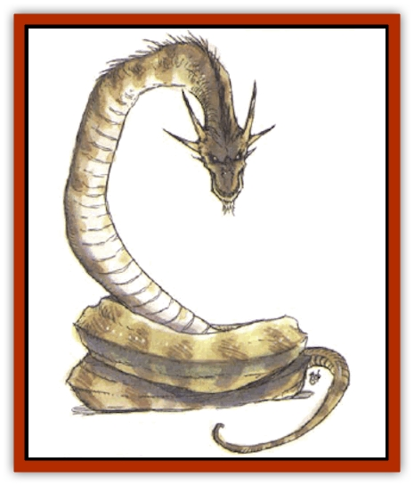

# Dragon - Linnorm - Forest

| Statistic | **Dragon, Linnorm, Forest** |
| --- | --- |
| **Activity Cycle:** | Any |
| **Alignment:** | Chaotic evil |
| **Armor Class:** | 1 (base) |
| **Climate/Terrain:** | Any nonarctic/Forest |
| **Damage/Attack:** | 2d8/special |
| **Diet:** | Special |
| **Frequency:** | Very rare |
| **Hit Dice:** | 11 (base) |
| **Intelligence:** | Average (8-10) |
| **Magic Resistance:** | See below |
| **Morale:** | Champion (15-16) |
| **Movement:** | 24, Sw 12 |
| **No. Appearing:** | 1 |
| **No. of Attacks:** | 1 + special |
| **Organization:** | Solitary |
| **Size:** | H-G (21' base length) |
| **Special Attacks:** | Spells, breath weapon, surprise |
| **Special Defenses:** | Spells |
| **THAC0:** | 9 (base) |
| **Treasure:** | See below |
| **XP Value:** | See below |

A forest linnorm resembles a huge, grotesque [[Snake|snake]] more than a [[Dragon_General_Information|dragon]]. Its body is a mottled green and brown that masks its form in forest undergrowth. This linnorm possesses a great ego, a natural cunning, and unending cruelty. It considers no creature above it and hates all beings possessing more than animal intelligence, especially "beautiful" creatures.

At birth, a forest linnorm could be easily, confused with a large green [[Lizard|lizard]], as it has four legs and a thin, whiplike tail. As the creature matures, its legs atrophy, disappearing by *young adulthood*. Brown splotches appear on its body, its scales become larger and thicker, and its head widens.

Forest linnorms speak the languages of all animals in addition to their own, but can't converse with humans.

**Combat:** Forest linnorms trap prey by mimicked the sounds of injured animals (imposing a +2 bonus upon surprise rolls), and older specimens use illusions to further deceive. Their prized targets are humans, as they find those people beautiful and therefore objects to be injured, punished, and slain. Forests use their breath weapons to weaken victims before physically attacking. They tend to fight to the death, viewing no opponents as too strong or dangerous.

**Breath Weapon/Special Abilities:** This breath weapon is a 1-foot-wide gout of heavy, acidic liquid extending in a straight line 6 feet per age category. The liquid inflicts damage and acts as a *wither* spell upon a randomly selected limb (no save).

Forest linnorms cast spells and use their magical abilities at a level of ability equal to 5 plus their combat modifier. They are limited to learning only illusion/phantasm spells.

Forest linnorms are born with a constant *invisibility to animals* power. At the *young* stage they can *warp wood*, at *young adulthood* they can cause *plant growth*, at *mature adulthood* they can cause *spike growth*, at *very old stage* they can use *sticks to snakes*, and wyrms can *pass plant*. Except for invisibility to animals, each ability is usable three times per day.

**Habitat/Society:** Forest linnorms jealously maintain a 100-square-mile territory, tolerating others only when they mate. When offspring are born, the male returns to its own territory, and the mother forces the young to leave her territory when they pass from the hatchling stage.

These monsters make their lairs in densely overgrown forests, wrapping their bodies about trees and bushes, becoming virtually undistinguishable from roots and trunks. They prefer temperate weather, but can stand great extremes.

Forests usually store their treasure in hollow tree trunks. They prize gems and jewelry, but only so they can break them later. It's rare to find intact objects in a forest linnorm's cache, although there is usually plenty of gold and silver.

**Ecology:** While forest linnorms are omnivorous, they prefer the flesh of what they consider attractive creatures such as stags, [[Eagle|eagles]], swans, humans, and demihumans. The linnorms' natural enemies are giants, who hunt them for food and their hides. Human heroes are also the bane of forest linnorms.

| Age | Body Lgt. (') | Tail Lgt. (') | AC | Breath Weapon | Spells W | MR | Treas. Type | XP Value |
| --- | --- | --- | --- | --- | --- | --- | --- | --- |
| 1 Hatchling | 1-4 | 4-14 | 4 | 1d4+1 | Nil | Nil | Nil | 1,400 |
| 2 Very young | 5-10 | 15-24 | 3 | 2d4+2 | Nil | Nil | Nil | 2,000 |
| 3 Young | 11-18 | 25-40 | 2 | 3d4+3 | Nil | Nil | Nil | 5,000 |
| 4 Juvenile | 19-26 | 41-56 | 1 | 4d4+4 | 1 | 15% | ½E | 9,000 |
| 5 Young adult | 27-34 | 57-70 | 0 | 5d4+5 | 2 | 20% | E | 11,000 |
| 6 Adult | 35-42 | 71-86 | -1 | 6d4+6 | 3 | 25% | E | 14,000 |
| 7 Mature adult | 43-50 | 87-100 | -2 | 7d4+7 | 4 | 30% | E | 17,000 |
| 8 Old | 51-58 | 101-114 | -3 | 8d4+8 | 4 1 | 35% | Ex2 | 18,000 |
| 9 Very old | 59-64 | 115-128 | -4 | 9d4+9 | 4 2 | 40% | Ex2 | 19,000 |
| 10 Venerable | 65-72 | 129-152 | -5 | 10d4+10 | 4 3 | 45% | Ex2 | 21,000 |
| 11 Wyrm | 73-80 | 153-166 | -6 | 11d4+11 | 4 4 | 50% | Ex3 | 22,000 |
| 12 Great Wyrm | 81-88 | 167-180 | -6 | 12d4+12 | 4 4 1 | 55% | Ex3 | 23,000 |

---
## Discovery & Documentation

**Source Publication:** Monstrous Compendium, 1994 Annual, Volume 1 (1995)
**Campaign Setting:** Advanced Dungeons & Dragons 2nd Edition
**Author(s):** David Wise

### Other Creatures Found in This Source Book
   * [[Abyss_Ant|Abyss Ant]]
   * [[Achaierai|Achaierai]]
   * [[Afanc|Afanc]]
   * [[Al-Jahar|Al-Jahar]]
   * [[Baelnorn|Baelnorn]]
   * [[Baneguard|Baneguard]]
   * [[Banelar|Banelar]]
   * [[Bird_Talking|Bird, Talking]]
   * [[Blazing_Bones|Blazing Bones]]
   * [[Campestri|Campestri]]
   * [[Caniquine|Caniquine]]
   * [[Cat_Winged|Cat, Winged]]
   * [[Crypt_Servant|Crypt Servant]]
   * [[Death's_Head_Tree|Death's Head Tree]]
   * [[Dog_Saluqi|Dog, Saluqi]]
   * [[Dragon_Electrum|Dragon, Electrum]]
   * [[Dragon_Fang|Dragon, Fang]]
   * [[Dragon_Linnorm_Corpse_Tearer|Dragon, Linnorm, Corpse Tearer]]
   * [[Dragon_Linnorm_Dread|Dragon, Linnorm, Dread]]
   * [[Dragon_Linnorm_Flame|Dragon, Linnorm, Flame]]
   * [[Dragon_Linnorm_Frost|Dragon, Linnorm, Frost]]
   * [[Dragon_Linnorm_Gray|Dragon, Linnorm, Gray]]
   * [[Dragon_Linnorm_Land|Dragon, Linnorm, Land]]
   * [[Dragon_Linnorm_Midgard|Dragon, Linnorm, Midgard]]
   * [[Dragon_Linnorm_Rain|Dragon, Linnorm, Rain]]
   * [[Dragon_Linnorm_Sea|Dragon, Linnorm, Sea]]
   * [[Dragon_Neutral_Jacinth|Dragon, Neutral, Jacinth]]
   * [[Dragon_Neutral_Jade|Dragon, Neutral, Jade]]
   * [[Dragon_Neutral_Pearl|Dragon, Neutral, Pearl]]
   * [[Dread|Dread]]
   * [[Dragon-kin|Dragon-kin]]
   * [[Elemental_Earth_Kin_Chrysmal|Elemental, Earth Kin, Chrysmal]]
   * [[Elemental_Earth_Kin_Earth_Weird|Elemental, Earth Kin, Earth Weird]]
   * [[Elemental_Fire_Kin_Azer|Elemental, Fire Kin, Azer]]
   * [[Elemental_Sandman|Elemental, Sandman]]
   * [[Elemental_Wind_Walker|Elemental, Wind Walker]]
   * [[Elemental_Vermin|Elemental Vermin]]
   * [[Feystag|Feystag]]
   * [[Flame_Skull|Flame Skull]]
   * [[Foulwing|Foulwing]]
   * [[Gambado|Gambado]]
   * [[Garbug|Garbug]]
   * [[Genie_Tasked_Administrator|Genie, Tasked, Administrator]]
   * [[Genie_Tasked_Deceiver|Genie, Tasked, Deceiver]]
   * [[Genie_Tasked_Harim_Servant|Genie, Tasked, Harim Servant]]
   * [[Genie_Tasked_Messenger|Genie, Tasked, Messenger]]
   * [[Genie_Tasked_Miner|Genie, Tasked, Miner]]
   * [[Genie_Tasked_Oathbinder|Genie, Tasked, Oathbinder]]
   * [[Gibbering_Mouther|Gibbering Mouther]]
   * [[Gnasher|Gnasher]]
   * [[Gnasher_Winged|Gnasher, Winged]]
   * [[Golem_Brain|Golem, Brain]]
   * [[Golem_Hammer|Golem, Hammer]]
   * [[Golem_Metagolem|Golem, Metagolem]]
   * [[Golem_Spiderstone|Golem, Spiderstone]]
   * [[Gorynych|Gorynych]]
   * [[Greelox|Greelox]]
   * [[Helmed_Horror|Helmed Horror]]
   * [[Jarbo|Jarbo]]
   * [[Laraken|Laraken]]
   * [[Lich_Psionic|Lich, Psionic]]
   * [[Living_Steel|Living Steel]]
   * [[Lock_Lurker|Lock Lurker]]
   * [[Loxo|Loxo]]
   * [[Lycanthrope_Loup_de_Noir|Lycanthrope, Loup de Noir]]
   * [[Lycanthrope_Werebadger|Lycanthrope, Werebadger]]
   * [[Lycanthrope_Werejaguar|Lycanthrope, Werejaguar]]
   * [[Lythlyx|Lythlyx]]
   * [[Magebane|Magebane]]
   * [[Marrashi|Marrashi]]
   * [[Metalmaster|Metalmaster]]
   * [[Mimic_House_Hunter|Mimic, House Hunter]]
   * [[Naga_Bone|Naga, Bone]]
   * [[Nautilus_Giant|Nautilus, Giant]]
   * [[Nightshade_Toril|Nightshade (Toril)]]
   * [[Nishruu|Nishruu]]
   * [[Noran|Noran]]
   * [[Opinicus|Opinicus]]
   * [[Ormyrr|Ormyrr]]
   * [[Parasite|Parasite]]
   * [[Pasari-Niml|Pasari-Niml]]
   * [[Plant_Vampire_Moss|Plant, Vampire Moss]]
   * [[Pteraman|Pteraman]]
   * [[Rautym|Rautym]]
   * [[Shadeling|Shadeling]]
   * [[Skum|Skum]]
   * [[Snake_Giant_Cobra|Snake, Giant Cobra]]
   * [[Snake_Stone|Snake, Stone]]
   * [[Spectral_Wizard|Spectral Wizard]]
   * [[Spell_Weaver|Spell Weaver]]
   * [[Spider_Brain|Spider, Brain]]
   * [[Suwyze|Suwyze]]
   * [[Tatalla|Tatalla]]
   * [[Tick_Heart|Tick, Heart]]
   * [[Tree_Dark|Tree, Dark]]
   * [[Tree_Singing|Tree, Singing]]
   * [[Tressym|Tressym]]
   * [[Troll_Snow|Troll, Snow]]
   * [[Tuyewera|Tuyewera]]
   * [[Ulitharid|Ulitharid]]
   * [[Undead_Dwarf|Undead Dwarf]]
   * [[Undead_Lake_Monster|Undead Lake Monster]]
   * [[Whipsting|Whipsting]]
   * [[Windghost|Windghost]]
   * [[Wolf_Dread|Wolf, Dread]]
   * [[Wolf_Stone|Wolf, Stone]]
   * [[Wolf_Vampiric|Wolf, Vampiric]]
   * [[Wraith_Shimmering|Wraith, Shimmering]]
   * [[Xantravar|Xantravar]]
   * [[Xaver|Xaver]]
