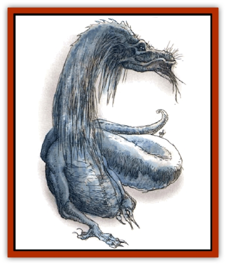

# Dragon - Linnorm - Frost

| Statistic | **Dragon, Linnorm, Frost** |
| --- | --- |
| **Activity Cycle:** | Any |
| **Alignment:** | Neutral evil |
| **Armor Class:** | -4 (base) |
| **Climate/Terrain:** | Arctic, subarctic/Land |
| **Damage/Attack:** | 3d10/4d10/special |
| **Diet:** | Special |
| **Frequency:** | Very rare |
| **Hit Dice:** | 15 (base) |
| **Intelligence:** | Genius (17-18) |
| **Magic Resistance:** | See below |
| **Morale:** | Elite (13-14) |
| **Movement:** | 12, Sw 18 |
| **No. Appearing:** | 1d8 |
| **No. of Attacks:** | 2 + special |
| **Organization:** | Family |
| **Size:** | G (48' base length) |
| **Special Attacks:** | Spells, breath weapon |
| **Special Defenses:** | Spells |
| **THAC0:** | 5 (base) |
| **Treasure:** | See below |
| **XP Value:** | See below |

Frost linnorms are perhaps the most territorial of all Norse [[Dragon_General_Information|dragons]], never resting until all other intelligent creatures within their domains are destroyed.

At birth, frosts appear to have fur, but small pearly scales appear by the time they pass the hatchling stage. Eventually the scales become thicker and sharp like jagged ice, ever shifting in hue from white to pale blue to transparent, blending with the environment. Frosts have small forelegs with manipulative claws, though they are too weak for combat.

These creatures speak their own language and those of other Norse dragons. Hatchlings have a 25% chance to magically communicate with any creature with an Intelligence of 2 or higher, and that chance increases by 15% per age category.

**Combat:** Frosts spend months plotting against enemies, play ing out battles in their minds until all strategies are worked out. They like to attack in the winter and play upon victims' weaknesses, always using breath weapons, runes (see the Viking Campaign Sourcebook, TSR #9322), and magical items and abilities before fighting with a bite and tail slap. They often attempt to confront their foes on ice, as they never lose their balance, timing or orientation on slippery terrain.

**Breath Weapon/Special Abilities:** The frost's breath weapon is a cloud of ice particles 80 feet long, 60 feet wide, and 40 feet high (save for half damage). They are immune to natural and magical cold, and gain the following abilities as they age, each usable at will, three times a day:

*Young adult: audible glamer*, *meld into ice*; *Adult: phantasmal force*, *ice shape*;*Mature adult: improved phantasmal force*, *control temperature 40' radius*; *Old: spectral force*, *transmute rock to ice*; *Very old: heal*; *Venerable: advanceed illusions*, transport via ice; *Wyrm: transmute wood to ice*; *Great wyrm: programmed illusion*, *transmute metal to ice*. (*Ice* spells are variants of those found in the *PHB*.) All magic is wielded at a level equal to 7 plus the dragon's combat modifier. They are always successful casting rune spells.

**Habitat/Society:** Frost linnorms are found in frigid climes ranging from the poles in winter months to devastate and plunder human settlements. Older linnorms use their magical abilities to transform their territories into ice and shape them into elaborate, reflective lairs.

Frosts are familial and keep their young close until they reach adulthood. Offspring are frequently included in the complex battle plans conceived by the eldest dragon. The smaller the number of frost linnorms encountered, the older they will tend to be; solitary frosts are always *venerable* or older, their mates dead and their offspring long gone.

Frost linnorms bury treasure within their lairs, usually beneath sheets of ice. They value gems, jewelry, coins, and especially art. Some objects are considered so beautiful that they place them about the lair where they can be admired.

**Ecology:** Frost linnorms require little sustenance and don't eat creatures they kill. Sages believe they gain nourishment from inhaling frigid winds.

| Age | Body Lgt. (') | Tail Lgt. (') | AC | Breath Weapon | Rune Spells | MR | Treas. Type | XP Value |
| --- | --- | --- | --- | --- | --- | --- | --- | --- |
| 1 Hatchling | 1-12 | 3-12 | -1 | 1d10+1 | Nil | 10% | Z | 6,000 |
| 2 Very young | 13-23 | 13-21 | -2 | 3d10+2 | Nil | 15% | Zx2 | 8,000 |
| 3 Young | 24-42 | 22-30 | -3 | 5d10+3 | Nil | 20% | Zx3 | 9,000 |
| 4 Juvenile | 43-61 | 31-49 | -4 | 7d10+4 | 1 | 25% | Zx4 | 11,000 |
| 5 Young adult | 62-80 | 50-68 | -5 | 9d10+5 | 1 | 30% | Zx5 | 12,000 |
| 6 Adult | 81-99 | 69-87 | -6 | 11d10+6 | 2 | 35% | Zx6 | 13,000 |
| 7 Mature adult | 100-118 | 88-106 | -7 | 13d10+7 | 2 | 40% | Zx7 | 14,000 |
| 8 Old | 119-137 | 107-125 | -8 | 15d10+8 | 3 | 45% | Zx8 | 16,000 |
| 9 Very old | 138-156 | 126-144 | -9 | 17d10+9 | 3 | 50% | Zx9 | 17,000 |
| 10 Venerable | 157-165 | 154-162 | -10 | 19d10+10 | 4 | 55% | Zx10 | 18,000 |
| 11 Wyrm | 165-174 | 154-162 | -11 | 21d10+11 | 4 | 60% | Zx11 | 19,000 |
| 12 Great Wyrm | 175-183 | 163-171 | -12 | 23d10+12 | 5 | 65% | Zx12 | 21,000 |

---
## Discovery & Documentation

**Source Publication:** Monstrous Compendium, 1994 Annual, Volume 1 (1995)
**Campaign Setting:** Advanced Dungeons & Dragons 2nd Edition
**Author(s):** David Wise

### Other Creatures Found in This Source Book
   * [[Abyss_Ant|Abyss Ant]]
   * [[Achaierai|Achaierai]]
   * [[Afanc|Afanc]]
   * [[Al-Jahar|Al-Jahar]]
   * [[Baelnorn|Baelnorn]]
   * [[Baneguard|Baneguard]]
   * [[Banelar|Banelar]]
   * [[Bird_Talking|Bird, Talking]]
   * [[Blazing_Bones|Blazing Bones]]
   * [[Campestri|Campestri]]
   * [[Caniquine|Caniquine]]
   * [[Cat_Winged|Cat, Winged]]
   * [[Crypt_Servant|Crypt Servant]]
   * [[Death's_Head_Tree|Death's Head Tree]]
   * [[Dog_Saluqi|Dog, Saluqi]]
   * [[Dragon_Electrum|Dragon, Electrum]]
   * [[Dragon_Fang|Dragon, Fang]]
   * [[Dragon_Linnorm_Corpse_Tearer|Dragon, Linnorm, Corpse Tearer]]
   * [[Dragon_Linnorm_Dread|Dragon, Linnorm, Dread]]
   * [[Dragon_Linnorm_Flame|Dragon, Linnorm, Flame]]
   * [[Dragon_Linnorm_Forest|Dragon, Linnorm, Forest]]
   * [[Dragon_Linnorm_Gray|Dragon, Linnorm, Gray]]
   * [[Dragon_Linnorm_Land|Dragon, Linnorm, Land]]
   * [[Dragon_Linnorm_Midgard|Dragon, Linnorm, Midgard]]
   * [[Dragon_Linnorm_Rain|Dragon, Linnorm, Rain]]
   * [[Dragon_Linnorm_Sea|Dragon, Linnorm, Sea]]
   * [[Dragon_Neutral_Jacinth|Dragon, Neutral, Jacinth]]
   * [[Dragon_Neutral_Jade|Dragon, Neutral, Jade]]
   * [[Dragon_Neutral_Pearl|Dragon, Neutral, Pearl]]
   * [[Dread|Dread]]
   * [[Dragon-kin|Dragon-kin]]
   * [[Elemental_Earth_Kin_Chrysmal|Elemental, Earth Kin, Chrysmal]]
   * [[Elemental_Earth_Kin_Earth_Weird|Elemental, Earth Kin, Earth Weird]]
   * [[Elemental_Fire_Kin_Azer|Elemental, Fire Kin, Azer]]
   * [[Elemental_Sandman|Elemental, Sandman]]
   * [[Elemental_Wind_Walker|Elemental, Wind Walker]]
   * [[Elemental_Vermin|Elemental Vermin]]
   * [[Feystag|Feystag]]
   * [[Flame_Skull|Flame Skull]]
   * [[Foulwing|Foulwing]]
   * [[Gambado|Gambado]]
   * [[Garbug|Garbug]]
   * [[Genie_Tasked_Administrator|Genie, Tasked, Administrator]]
   * [[Genie_Tasked_Deceiver|Genie, Tasked, Deceiver]]
   * [[Genie_Tasked_Harim_Servant|Genie, Tasked, Harim Servant]]
   * [[Genie_Tasked_Messenger|Genie, Tasked, Messenger]]
   * [[Genie_Tasked_Miner|Genie, Tasked, Miner]]
   * [[Genie_Tasked_Oathbinder|Genie, Tasked, Oathbinder]]
   * [[Gibbering_Mouther|Gibbering Mouther]]
   * [[Gnasher|Gnasher]]
   * [[Gnasher_Winged|Gnasher, Winged]]
   * [[Golem_Brain|Golem, Brain]]
   * [[Golem_Hammer|Golem, Hammer]]
   * [[Golem_Metagolem|Golem, Metagolem]]
   * [[Golem_Spiderstone|Golem, Spiderstone]]
   * [[Gorynych|Gorynych]]
   * [[Greelox|Greelox]]
   * [[Helmed_Horror|Helmed Horror]]
   * [[Jarbo|Jarbo]]
   * [[Laraken|Laraken]]
   * [[Lich_Psionic|Lich, Psionic]]
   * [[Living_Steel|Living Steel]]
   * [[Lock_Lurker|Lock Lurker]]
   * [[Loxo|Loxo]]
   * [[Lycanthrope_Loup_de_Noir|Lycanthrope, Loup de Noir]]
   * [[Lycanthrope_Werebadger|Lycanthrope, Werebadger]]
   * [[Lycanthrope_Werejaguar|Lycanthrope, Werejaguar]]
   * [[Lythlyx|Lythlyx]]
   * [[Magebane|Magebane]]
   * [[Marrashi|Marrashi]]
   * [[Metalmaster|Metalmaster]]
   * [[Mimic_House_Hunter|Mimic, House Hunter]]
   * [[Naga_Bone|Naga, Bone]]
   * [[Nautilus_Giant|Nautilus, Giant]]
   * [[Nightshade_Toril|Nightshade (Toril)]]
   * [[Nishruu|Nishruu]]
   * [[Noran|Noran]]
   * [[Opinicus|Opinicus]]
   * [[Ormyrr|Ormyrr]]
   * [[Parasite|Parasite]]
   * [[Pasari-Niml|Pasari-Niml]]
   * [[Plant_Vampire_Moss|Plant, Vampire Moss]]
   * [[Pteraman|Pteraman]]
   * [[Rautym|Rautym]]
   * [[Shadeling|Shadeling]]
   * [[Skum|Skum]]
   * [[Snake_Giant_Cobra|Snake, Giant Cobra]]
   * [[Snake_Stone|Snake, Stone]]
   * [[Spectral_Wizard|Spectral Wizard]]
   * [[Spell_Weaver|Spell Weaver]]
   * [[Spider_Brain|Spider, Brain]]
   * [[Suwyze|Suwyze]]
   * [[Tatalla|Tatalla]]
   * [[Tick_Heart|Tick, Heart]]
   * [[Tree_Dark|Tree, Dark]]
   * [[Tree_Singing|Tree, Singing]]
   * [[Tressym|Tressym]]
   * [[Troll_Snow|Troll, Snow]]
   * [[Tuyewera|Tuyewera]]
   * [[Ulitharid|Ulitharid]]
   * [[Undead_Dwarf|Undead Dwarf]]
   * [[Undead_Lake_Monster|Undead Lake Monster]]
   * [[Whipsting|Whipsting]]
   * [[Windghost|Windghost]]
   * [[Wolf_Dread|Wolf, Dread]]
   * [[Wolf_Stone|Wolf, Stone]]
   * [[Wolf_Vampiric|Wolf, Vampiric]]
   * [[Wraith_Shimmering|Wraith, Shimmering]]
   * [[Xantravar|Xantravar]]
   * [[Xaver|Xaver]]
