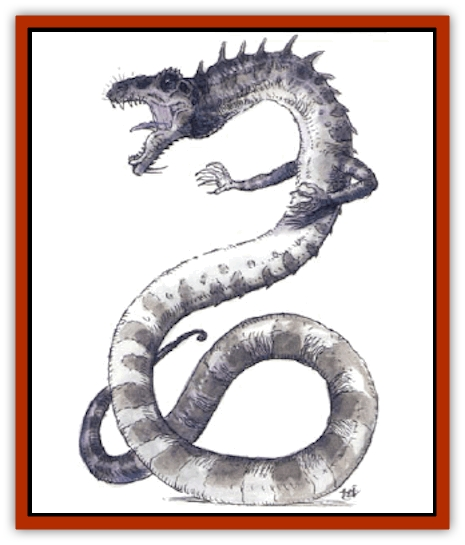

# Dragon - Linnorm - Gray

| Statistic | **Dragon, Linnorm, Gray** |
| --- | --- |
| **Activity Cycle:** | Any |
| **Alignment:** | Chaotic evil |
| **Armor Class:** | -1 (base) |
| **Climate/Terrain:** | Any/Land |
| **Damage/Attack:** | 4d6(&times;2)/4d10/2d6 |
| **Diet:** | Special |
| **Frequency:** | Very rare |
| **Hit Dice:** | 13 (base) |
| **Intelligence:** | Very (11-12) |
| **Magic Resistance:** | See below |
| **Morale:** | Fearless (19-20) |
| **Movement:** | 12, F1 36 (C), Sw 12 |
| **No. Appearing:** | 1 |
| **No. of Attacks:** | 4 + special |
| **Organization:** | Solitary |
| **Size:** | H-G (18' base length) |
| **Special Attacks:** | Spells, poisonous tail, breath weapon |
| **Special Defenses:** | Spells |
| **THAC0:** | 7 (base) |
| **Treasure:** | See below |
| **XP Value:** | See below |

Gray linnorms are ruthless and revel in harming intelligent creatures. They have the smallest bodies of all Norse [[Dragon_General_Information|dragons]], but have long, whiplike tails which they employ in combat.

At birth a gray linnorm has shiny black scales so small they appear to be smooth skin. They grow larger and thicker until the dragon reaches *juvenile* stage, when their color begins to fade. By *mature adulthood* the scales are the color of lead. The gray can make them appear shinier or duller by concentrating.

Gray linnorms speak their own language and can talk with other Norse dragons. A hatchling has a 40% chance of being able to speak with any other intelligent creature, and the chance to do so increases at a rate of 15% per age category.

**Combat:** A gray linnorm spends little time plotting attacks. Further, it doesn't attempt to kill from a distance; rather, the gray relishes killing with its two foreclaws, its bite, and its whiplike tail. An especially malicious gray captures victims and toys with them before eventually finishing them. Grays (*adult* and older) often use *shape change* to appear as different types of linnorms, attempting to blame others for their attacks.

**Breath Weapon/Special Abilities:** The gray's breath weapon is a jet of black slime 3 feet wide and 60 feet long. It is a caustic substance that corrodes metal in 3d4 rounds unless it's washed off; the metal is allowed a save vs. acid to avoid this effect (magical bouses apply). The tail of a gray oozes type B poison: Those struck by it suffer 2d6 damage, plus 20 points from the venom (unless they successfully save vs. poison). Grays gain abilities as they age:

*Very young: protection from normal missiles* (constant); *Juvenile: contagion* (3/day); *Adult: shape change* (at will, 3/day); *Old: wraithform* (3/day); *Venerable: distance distortion* (3/day); *Great wyrm: sink* (2/day). Their spells come from the spheres of All, Charm, Elemental, Protection, and Weather. A gray uses magic at a level equal to 7 plus its combat modifier.

**Habitat/Society:** Gray linnorms are found on high places, considering their territory to be everything within line of sight. Their lairs are tunnels into hillsides, the entrances of which are carefully concealed and trapped.

Grays mate every 20-30 years. The parents stay with their offspring until they reach the *young* stage, at which time the parents separate, meeting again in 20-30 years. They are solitary creatures, but they may join forces with other grays to stage raids. They immediately attack any intelligent creature encroaching upon their territories, fearing the creature might be after their wealth, but they especially hate [[Dragon_Linnorm_Frost|frost linnorms]]. While grays collect almost anything (including cloth, furniture, and ship gear), they are especially fond of coins of all types.

**Ecology:** Gray linnorms can digest nearly anything, but have a taste for cattle and sheep, so they are a terror to farmers. They have no natural predators, but they are sometimes hunted by adventurers, who use their scales for armor and their poison and other body parts in potions and spell components.

| Age | Body Lgt. (') | Tail Lgt. (') | AC | Breath Weapon | Spells P | MR | Treas. Type | XP Value |
| --- | --- | --- | --- | --- | --- | --- | --- | --- |
| 1 Hatchling | 1-4 | 4-10 | 2 | 4d4+1 | 1 | 10% | C | 7,000 |
| 2 Very young | 5-9 | 11-20 | 1 | 6d4+2 | 1 1 | 15% | C | 9,000 |
| 3 Young | 10-15 | 21-32 | 0 | 8d4+3 | 1 1 1 | 20% | C,E | 10,000 |
| 4 Juvenile | 16-25 | 33-52 | -1 | 10d4+4 | 2 1 1 | 25% | C,E | 11,000 |
| 5 Young adult | 26-35 | 53-73 | -2 | 12d4+5 | 2 2 1 | 30% | C,Ex2 | 13,000 |
| 6 Adult | 36-47 | 73-96 | -3 | 14d4+6 | 2 2 2 1 | 35% | C,Ex2 | 15,000 |
| 7 Mature adult | 48-59 | 97-121 | -4 | 16d4+7 | 3 2 2 2 | 40% | C,E,Fx2 | 16,000 |
| 8 Old | 60-72 | 122-150 | -5 | 18d4+8 | 3 3 2 2 1 | 45% | C,E,Fx2 | 17,000 |
| 9 Very old | 73-87 | 151-178 | -6 | 20d4+9 | 3 3 3 2 1 | 50% | C,E,Fx3 | 18,000 |
| 10 Venerable | 88-116 | 179-235 | -7 | 22d4+10 | 3 3 3 3 2 | 55% | C,E,Fx3 | 20,000 |
| 11 Wyrm | 117-136 | 236-277 | -8 | 24d4+11 | 4 3 3 3 3 | 60% | C,E,Fx4 | 21,000 |
| 12 Great Wyrm | 137-157 | 278-325 | -9 | 26d4+12 | 4 4 3 3 3 1 | 65% | C,E,Fx4 | 22,000 |

---
## Discovery & Documentation

**Source Publication:** Monstrous Compendium, 1994 Annual, Volume 1 (1995)
**Campaign Setting:** Advanced Dungeons & Dragons 2nd Edition
**Author(s):** David Wise

### Other Creatures Found in This Source Book
   * [[Abyss_Ant|Abyss Ant]]
   * [[Achaierai|Achaierai]]
   * [[Afanc|Afanc]]
   * [[Al-Jahar|Al-Jahar]]
   * [[Baelnorn|Baelnorn]]
   * [[Baneguard|Baneguard]]
   * [[Banelar|Banelar]]
   * [[Bird_Talking|Bird, Talking]]
   * [[Blazing_Bones|Blazing Bones]]
   * [[Campestri|Campestri]]
   * [[Caniquine|Caniquine]]
   * [[Cat_Winged|Cat, Winged]]
   * [[Crypt_Servant|Crypt Servant]]
   * [[Death's_Head_Tree|Death's Head Tree]]
   * [[Dog_Saluqi|Dog, Saluqi]]
   * [[Dragon_Electrum|Dragon, Electrum]]
   * [[Dragon_Fang|Dragon, Fang]]
   * [[Dragon_Linnorm_Corpse_Tearer|Dragon, Linnorm, Corpse Tearer]]
   * [[Dragon_Linnorm_Dread|Dragon, Linnorm, Dread]]
   * [[Dragon_Linnorm_Flame|Dragon, Linnorm, Flame]]
   * [[Dragon_Linnorm_Forest|Dragon, Linnorm, Forest]]
   * [[Dragon_Linnorm_Frost|Dragon, Linnorm, Frost]]
   * [[Dragon_Linnorm_Land|Dragon, Linnorm, Land]]
   * [[Dragon_Linnorm_Midgard|Dragon, Linnorm, Midgard]]
   * [[Dragon_Linnorm_Rain|Dragon, Linnorm, Rain]]
   * [[Dragon_Linnorm_Sea|Dragon, Linnorm, Sea]]
   * [[Dragon_Neutral_Jacinth|Dragon, Neutral, Jacinth]]
   * [[Dragon_Neutral_Jade|Dragon, Neutral, Jade]]
   * [[Dragon_Neutral_Pearl|Dragon, Neutral, Pearl]]
   * [[Dread|Dread]]
   * [[Dragon-kin|Dragon-kin]]
   * [[Elemental_Earth_Kin_Chrysmal|Elemental, Earth Kin, Chrysmal]]
   * [[Elemental_Earth_Kin_Earth_Weird|Elemental, Earth Kin, Earth Weird]]
   * [[Elemental_Fire_Kin_Azer|Elemental, Fire Kin, Azer]]
   * [[Elemental_Sandman|Elemental, Sandman]]
   * [[Elemental_Wind_Walker|Elemental, Wind Walker]]
   * [[Elemental_Vermin|Elemental Vermin]]
   * [[Feystag|Feystag]]
   * [[Flame_Skull|Flame Skull]]
   * [[Foulwing|Foulwing]]
   * [[Gambado|Gambado]]
   * [[Garbug|Garbug]]
   * [[Genie_Tasked_Administrator|Genie, Tasked, Administrator]]
   * [[Genie_Tasked_Deceiver|Genie, Tasked, Deceiver]]
   * [[Genie_Tasked_Harim_Servant|Genie, Tasked, Harim Servant]]
   * [[Genie_Tasked_Messenger|Genie, Tasked, Messenger]]
   * [[Genie_Tasked_Miner|Genie, Tasked, Miner]]
   * [[Genie_Tasked_Oathbinder|Genie, Tasked, Oathbinder]]
   * [[Gibbering_Mouther|Gibbering Mouther]]
   * [[Gnasher|Gnasher]]
   * [[Gnasher_Winged|Gnasher, Winged]]
   * [[Golem_Brain|Golem, Brain]]
   * [[Golem_Hammer|Golem, Hammer]]
   * [[Golem_Metagolem|Golem, Metagolem]]
   * [[Golem_Spiderstone|Golem, Spiderstone]]
   * [[Gorynych|Gorynych]]
   * [[Greelox|Greelox]]
   * [[Helmed_Horror|Helmed Horror]]
   * [[Jarbo|Jarbo]]
   * [[Laraken|Laraken]]
   * [[Lich_Psionic|Lich, Psionic]]
   * [[Living_Steel|Living Steel]]
   * [[Lock_Lurker|Lock Lurker]]
   * [[Loxo|Loxo]]
   * [[Lycanthrope_Loup_de_Noir|Lycanthrope, Loup de Noir]]
   * [[Lycanthrope_Werebadger|Lycanthrope, Werebadger]]
   * [[Lycanthrope_Werejaguar|Lycanthrope, Werejaguar]]
   * [[Lythlyx|Lythlyx]]
   * [[Magebane|Magebane]]
   * [[Marrashi|Marrashi]]
   * [[Metalmaster|Metalmaster]]
   * [[Mimic_House_Hunter|Mimic, House Hunter]]
   * [[Naga_Bone|Naga, Bone]]
   * [[Nautilus_Giant|Nautilus, Giant]]
   * [[Nightshade_Toril|Nightshade (Toril)]]
   * [[Nishruu|Nishruu]]
   * [[Noran|Noran]]
   * [[Opinicus|Opinicus]]
   * [[Ormyrr|Ormyrr]]
   * [[Parasite|Parasite]]
   * [[Pasari-Niml|Pasari-Niml]]
   * [[Plant_Vampire_Moss|Plant, Vampire Moss]]
   * [[Pteraman|Pteraman]]
   * [[Rautym|Rautym]]
   * [[Shadeling|Shadeling]]
   * [[Skum|Skum]]
   * [[Snake_Giant_Cobra|Snake, Giant Cobra]]
   * [[Snake_Stone|Snake, Stone]]
   * [[Spectral_Wizard|Spectral Wizard]]
   * [[Spell_Weaver|Spell Weaver]]
   * [[Spider_Brain|Spider, Brain]]
   * [[Suwyze|Suwyze]]
   * [[Tatalla|Tatalla]]
   * [[Tick_Heart|Tick, Heart]]
   * [[Tree_Dark|Tree, Dark]]
   * [[Tree_Singing|Tree, Singing]]
   * [[Tressym|Tressym]]
   * [[Troll_Snow|Troll, Snow]]
   * [[Tuyewera|Tuyewera]]
   * [[Ulitharid|Ulitharid]]
   * [[Undead_Dwarf|Undead Dwarf]]
   * [[Undead_Lake_Monster|Undead Lake Monster]]
   * [[Whipsting|Whipsting]]
   * [[Windghost|Windghost]]
   * [[Wolf_Dread|Wolf, Dread]]
   * [[Wolf_Stone|Wolf, Stone]]
   * [[Wolf_Vampiric|Wolf, Vampiric]]
   * [[Wraith_Shimmering|Wraith, Shimmering]]
   * [[Xantravar|Xantravar]]
   * [[Xaver|Xaver]]
