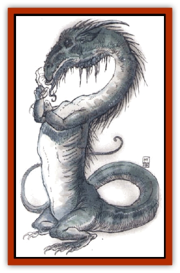

# Dragon - Linnorm - Land

| Statistic | **Dragon, Linnorm, Land** |
| --- | --- |
| **Activity Cycle:** | Any |
| **Alignment:** | Chaotic evil |
| **Armor Class:** | -1 (base) |
| **Climate/Terrain:** | Any nonarctic/Land |
| **Damage/Attack:** | 1d10(&times;2)/3d10/2d10/see below |
| **Diet:** | Omnivore |
| **Frequency:** | Very rare |
| **Hit Dice:** | 13 (base) |
| **Intelligence:** | Exceptional (15-16) |
| **Magic Resistance:** | See below |
| **Morale:** | Fanatic (17-18) |
| **Movement:** | 18, Sw 12, Br 12 |
| **No. Appearing:** | 1 |
| **No. of Attacks:** | 4 + special |
| **Organization:** | Solitary |
| **Size:** | G (48' base length) |
| **Special Attacks:** | Spells, breath weapon |
| **Special Defenses:** | Spells |
| **THAC0:** | 7 (base) |
| **Treasure:** | See below |
| **XP Value:** | See below |

Land linnorms are driven solely by greed, and they enjoy twisting humans and the land to their own corrupt desires.

Land linnorms have four legs, and the forelimbs are useful in combat. The scales of hatchlings are small, green, and glisten like gems. As the linnorms age, their scales enlarge, lose their luster, and begin to change at the individual's whim, from various shades of greens to browns to grays.

Lands speak their own language and those of Norse [[Dragon_General_Information|dragons]]. Further, there is a 10% chance that a hatchling can magically speak with all intelligent creatures, and that chance increases 10% per age category.

**Combat:** Land linnorms are cautious, sizing up their intended victims before engaging them in Combat. They sometimes follow a target for days, in human or animal form if the linnorm is old enough to polymorph, studying the target's strengths and weaknesses before attacking. They usually begin an assault with their breath and spells before closing to attack with claws, a bite, and a tail slap. Lands use physical attacks only if they're certain they can beat their victims, abandoning targets that seem too dangerous.

**Breath Weapon/Special Abilities:** This dragon's breath weapon is a blast of heat 120 feet long, 5 feet wide at the mouth and 40 feet wide at its terminus; those caught within the cone may attempt to save vs. breath weapon for half damage. The searing heat instantly fatigues victims, even if the save succeeds, and Strength scores are reduced by half (round down). Land linnorms' runes, selected at random from the *Viking Campaing Sourcebook* (TSR stock #9322), are always cast successfully.

Lands are born able to cast *transmute rock to mud* and its reverse once per day each. They gain other powers as they age, each usable three times per day:

*Young: invisibility*; *Young adult: dig*; *Maturee adult: polymorph self*; *Very old: stone shape*; *Wyrm:* *conjure earth elemental*; *great wyrm: earthquake*.

**Habitat/Society:** These dragons prefer hilly terrain near human settlements, where they can perch and note the passage of any wealth. They lair in caves; older linnorms use their *stone shape* ability to fashion their own homes, complete with traps.

Land linnorms join only to mate, separating after the offspring pass *hatchling* stage. However, some land linnorms have been reported to join forces to attack adversaries too strong for a single linnorm to face. Such alliances are brief, ending after the division of the spoils.

Lands loathe humans and demihumans, for they are jealous of creatures who accumulate the treasure they love. However, a few of them have been known to capture humans with magic skills, forcing the prisoners to instruct them or reveal treasures. In rare cases a land dragon has formed a long-term relationship with a "lesser being", receiving magic training and material wealth in exchange for the human's continued life.

**Ecology:** Land linnorms can even eat stones, but they prefer flesh. They have no natural enemies. Abandoned young are often preyed upon by adventurers, giants, and other monsters.

| Age | Body Lgt. (') | Tail Lgt. (') | AC | Breath Weapon | Rune Spells | MR | Treas. Type | XP Value |
| --- | --- | --- | --- | --- | --- | --- | --- | --- |
| 1 Hatchling | 1-12 | 3-12 | 2 | 1d12+1 | Nil | 10% | Nil | 8,000 |
| 2 Very young | 13-23 | 13-21 | 1 | 3d12+2 | 1 | 15% | A | 12,000 |
| 3 Young | 24-42 | 22-30 | 0 | 5d12+3 | 2 | 20% | A | 17,000 |
| 4 Juvenile | 43-61 | 31-49 | -1 | 7d12+4 | 3 | 25% | A,B | 18,000 |
| 5 Young adult | 62-80 | 50-68 | -2 | 9d12+5 | 4 | 30% | A,B | 19,000 |
| 6 Adult | 81-99 | 69-87 | -3 | 11d12+6 | 5 | 35% | A,Bx2 | 21,000 |
| 7 Mature adult | 100-118 | 88-106 | -4 | 13d12+7 | 6 | 40% | A,Bx2 | 22,000 |
| 8 Old | 119-137 | 107-125 | -5 | 15d12+8 | 7 | 45% | A,Bx3 | 23,000 |
| 9 Very old | 138-156 | 126-144 | -6 | 17d12+9 | 8 | 50% | A,Bx3 | 24,000 |
| 10 Venerable | 157-165 | 145-153 | -7 | 19d12+10 | 9 | 55% | A,B,Cx3 | 25,000 |
| 11 Wyrm | 166-174 | 154-162 | -8 | 21d12+11 | 10 | 60% | A,B,Cx3 | 28,000 |
| 12 Great Wyrm | 175-183 | 163-171 | -9 | 23d12+12 | 11 | 65% | A,B,Cx3 | 31,000 |

---
## Discovery & Documentation

**Source Publication:** Monstrous Compendium, 1994 Annual, Volume 1 (1995)
**Campaign Setting:** Advanced Dungeons & Dragons 2nd Edition
**Author(s):** David Wise

### Other Creatures Found in This Source Book
   * [[Abyss_Ant|Abyss Ant]]
   * [[Achaierai|Achaierai]]
   * [[Afanc|Afanc]]
   * [[Al-Jahar|Al-Jahar]]
   * [[Baelnorn|Baelnorn]]
   * [[Baneguard|Baneguard]]
   * [[Banelar|Banelar]]
   * [[Bird_Talking|Bird, Talking]]
   * [[Blazing_Bones|Blazing Bones]]
   * [[Campestri|Campestri]]
   * [[Caniquine|Caniquine]]
   * [[Cat_Winged|Cat, Winged]]
   * [[Crypt_Servant|Crypt Servant]]
   * [[Death's_Head_Tree|Death's Head Tree]]
   * [[Dog_Saluqi|Dog, Saluqi]]
   * [[Dragon_Electrum|Dragon, Electrum]]
   * [[Dragon_Fang|Dragon, Fang]]
   * [[Dragon_Linnorm_Corpse_Tearer|Dragon, Linnorm, Corpse Tearer]]
   * [[Dragon_Linnorm_Dread|Dragon, Linnorm, Dread]]
   * [[Dragon_Linnorm_Flame|Dragon, Linnorm, Flame]]
   * [[Dragon_Linnorm_Forest|Dragon, Linnorm, Forest]]
   * [[Dragon_Linnorm_Frost|Dragon, Linnorm, Frost]]
   * [[Dragon_Linnorm_Gray|Dragon, Linnorm, Gray]]
   * [[Dragon_Linnorm_Midgard|Dragon, Linnorm, Midgard]]
   * [[Dragon_Linnorm_Rain|Dragon, Linnorm, Rain]]
   * [[Dragon_Linnorm_Sea|Dragon, Linnorm, Sea]]
   * [[Dragon_Neutral_Jacinth|Dragon, Neutral, Jacinth]]
   * [[Dragon_Neutral_Jade|Dragon, Neutral, Jade]]
   * [[Dragon_Neutral_Pearl|Dragon, Neutral, Pearl]]
   * [[Dread|Dread]]
   * [[Dragon-kin|Dragon-kin]]
   * [[Elemental_Earth_Kin_Chrysmal|Elemental, Earth Kin, Chrysmal]]
   * [[Elemental_Earth_Kin_Earth_Weird|Elemental, Earth Kin, Earth Weird]]
   * [[Elemental_Fire_Kin_Azer|Elemental, Fire Kin, Azer]]
   * [[Elemental_Sandman|Elemental, Sandman]]
   * [[Elemental_Wind_Walker|Elemental, Wind Walker]]
   * [[Elemental_Vermin|Elemental Vermin]]
   * [[Feystag|Feystag]]
   * [[Flame_Skull|Flame Skull]]
   * [[Foulwing|Foulwing]]
   * [[Gambado|Gambado]]
   * [[Garbug|Garbug]]
   * [[Genie_Tasked_Administrator|Genie, Tasked, Administrator]]
   * [[Genie_Tasked_Deceiver|Genie, Tasked, Deceiver]]
   * [[Genie_Tasked_Harim_Servant|Genie, Tasked, Harim Servant]]
   * [[Genie_Tasked_Messenger|Genie, Tasked, Messenger]]
   * [[Genie_Tasked_Miner|Genie, Tasked, Miner]]
   * [[Genie_Tasked_Oathbinder|Genie, Tasked, Oathbinder]]
   * [[Gibbering_Mouther|Gibbering Mouther]]
   * [[Gnasher|Gnasher]]
   * [[Gnasher_Winged|Gnasher, Winged]]
   * [[Golem_Brain|Golem, Brain]]
   * [[Golem_Hammer|Golem, Hammer]]
   * [[Golem_Metagolem|Golem, Metagolem]]
   * [[Golem_Spiderstone|Golem, Spiderstone]]
   * [[Gorynych|Gorynych]]
   * [[Greelox|Greelox]]
   * [[Helmed_Horror|Helmed Horror]]
   * [[Jarbo|Jarbo]]
   * [[Laraken|Laraken]]
   * [[Lich_Psionic|Lich, Psionic]]
   * [[Living_Steel|Living Steel]]
   * [[Lock_Lurker|Lock Lurker]]
   * [[Loxo|Loxo]]
   * [[Lycanthrope_Loup_de_Noir|Lycanthrope, Loup de Noir]]
   * [[Lycanthrope_Werebadger|Lycanthrope, Werebadger]]
   * [[Lycanthrope_Werejaguar|Lycanthrope, Werejaguar]]
   * [[Lythlyx|Lythlyx]]
   * [[Magebane|Magebane]]
   * [[Marrashi|Marrashi]]
   * [[Metalmaster|Metalmaster]]
   * [[Mimic_House_Hunter|Mimic, House Hunter]]
   * [[Naga_Bone|Naga, Bone]]
   * [[Nautilus_Giant|Nautilus, Giant]]
   * [[Nightshade_Toril|Nightshade (Toril)]]
   * [[Nishruu|Nishruu]]
   * [[Noran|Noran]]
   * [[Opinicus|Opinicus]]
   * [[Ormyrr|Ormyrr]]
   * [[Parasite|Parasite]]
   * [[Pasari-Niml|Pasari-Niml]]
   * [[Plant_Vampire_Moss|Plant, Vampire Moss]]
   * [[Pteraman|Pteraman]]
   * [[Rautym|Rautym]]
   * [[Shadeling|Shadeling]]
   * [[Skum|Skum]]
   * [[Snake_Giant_Cobra|Snake, Giant Cobra]]
   * [[Snake_Stone|Snake, Stone]]
   * [[Spectral_Wizard|Spectral Wizard]]
   * [[Spell_Weaver|Spell Weaver]]
   * [[Spider_Brain|Spider, Brain]]
   * [[Suwyze|Suwyze]]
   * [[Tatalla|Tatalla]]
   * [[Tick_Heart|Tick, Heart]]
   * [[Tree_Dark|Tree, Dark]]
   * [[Tree_Singing|Tree, Singing]]
   * [[Tressym|Tressym]]
   * [[Troll_Snow|Troll, Snow]]
   * [[Tuyewera|Tuyewera]]
   * [[Ulitharid|Ulitharid]]
   * [[Undead_Dwarf|Undead Dwarf]]
   * [[Undead_Lake_Monster|Undead Lake Monster]]
   * [[Whipsting|Whipsting]]
   * [[Windghost|Windghost]]
   * [[Wolf_Dread|Wolf, Dread]]
   * [[Wolf_Stone|Wolf, Stone]]
   * [[Wolf_Vampiric|Wolf, Vampiric]]
   * [[Wraith_Shimmering|Wraith, Shimmering]]
   * [[Xantravar|Xantravar]]
   * [[Xaver|Xaver]]
