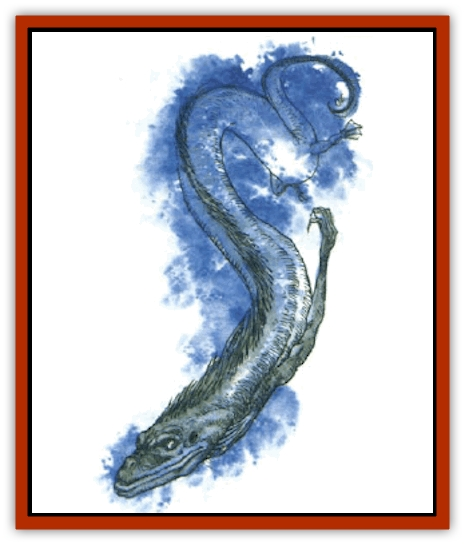

# Dragon - Linnorm - Midgard

| Statistic | **Dragon, Linnorm, Midgard** |
| --- | --- |
| **Activity Cycle:** | Any |
| **Alignment:** | Lawful evil |
| **Armor Class:** | -12 |
| **Climate/Terrain:** | Deep ocean/any |
| **Damage/Attack:** | 3d10(&times;2)/2d12/4d10/special |
| **Diet:** | Special |
| **Frequency:** | Unique |
| **Hit Dice:** | 25 (200 hp) |
| **Intelligence:** | Supra-genius (20) |
| **Magic Resistance:** | 70% |
| **Morale:** | Fearless (19) |
| **Movement:** | 18, Sw 39 |
| **No. Appearing:** | 1 |
| **No. of Attacks:** | 4 + special |
| **Organization:** | Solitary |
| **Size:** | G (500' long) |
| **Special Attacks:** | Spells, breath, constriction |
| **Special Defenses:** | Spells, +2 weapon to hit |
| **THAC0:** | 2 |
| **Treasure:** | S,T,U,V,W,X (all &times;5) |
| **XP Value:** | 31,000 |

The Midgard linnorm may be the sole offspring of the Midgard Serpent, child of Loki - sages believe (and hope) there is only one. This great wingless serpent may be as immortal as its sire.

The linnorm's body is covered with blue, green, and silver scales that glisten like opals. Its head, filled with a double row of pale-blue teeth, stretches 50 feet wide and twice that long. Its emerald-green, lidless and pupil-less eyes are round and mirror whatever looks into them. The head is topped with a ridge of coarse, midnight blue hair that extends partway down its massive neck, where it becomes a lighter-blue spinal ruff that runs to the tip of the barbed tail. The creature's rear legs are stumpy for its massive form, appearing too weak to support it; its longer front legs end in razor-sharp claws.

The Midgard linnorm speaks the languages of all Norse [[Dragon_General_Information|dragons]] and can telepathically communicate with all other intelligent creatures as well.

**Combat:** Despite its malicious nature, the Midgard avoids battle, considering combat beneath it. It prefers to meddle in the affairs of other creatures through its magic, keeping its distance yet maintaining control of the situation. The dragon relies upon guards to fight for it, but if a threat menaces, it uses its deadly breath and spells. The Midgard attacks with its claws, bite, and tail slap only if necessary.

**Breath Weapon/Special Abilities:** The Midgard possesses three breath weapons. The first is a spray of boiling water 10' wide and 200' long. Struck creatures with fewer than 4 HD drown unless they can breathe water; creatures of 5-7 HD drown if they fail to save (those with more than 7 HD aren't subject to drowning). All victims suffer 20d20+12 points of damage (save for half) and are thrust back 100'. The second breath weapon is a cloud of dust 200' long, 80' wide, and 60' deep that inflicts 16d20+12 damage (save for half). Those who fail to save are affected as if subjected to *dust of sneezing and choking*. The third breath weapon is a cone of wind 20' wide at the mouth, 200' long, and 50' wide at the base, inflicting 12d20+12 damage (save for half) and pushing victims back 200'. The dragon can breathe every other round, as often as it likes. Victims of any breath attack save with a -3 penalty due to this creature's power.

This dragon can constrict creatures with its tail, inflicting 20 points of damage per round; a successful bend bars roll at half-normal chance is needed to wriggle free.

The linnorm has the following abilities, usable at will: *create water*, *ESP*, *protection from fire*, *telepathy*, and *water breathing*. It can perform at will, once per day: *airy water*, *charm person*, *charm monster*, *death fog*, *detect invisibility*, *hypnotic pattern*, *improved invisibility*, *power word blind*, *power word stun*, *raise water*, *shape change*, *solid fog*, *telekinesis*, *teleport without error*, *veil*, *wall of fog*, *whispering wind*, *wizard eye*. It uses magic at 14th level.

**Habitat/Society:** The Midgard lives at the bottom of the ocean, considering the company of others inconsequential. Its lair is a huge, dark underwater sea cave guarded by four venerable [[Dragon_Linnorm_Sea|sea linnorms]] with maximum hit points. The creature stores its wealth within the deepest chambers. Discarding coins and gems, the dragon primarily keeps magical treasure, which it wields when venturing out of its lair. Also in the lair are remnants of visits to the surface: prows of ships, statues from villages, large shields, and other trinkets.

This dragon considers the sea floor its domain and is quick to dispatch any creature that claims territory in its presence.

**Ecology:** The Midgard requires little sustenance, dining once every 40 or 50 years upon vast amounts of sea foam - and anything floating on it. It has no known predators, but many enemies in human and demihuman communities. All other linnorms bow to the Midgard.

---
## Discovery & Documentation

**Source Publication:** Monstrous Compendium, 1994 Annual, Volume 1 (1995)
**Campaign Setting:** Advanced Dungeons & Dragons 2nd Edition
**Author(s):** David Wise

### Other Creatures Found in This Source Book
   * [[Abyss_Ant|Abyss Ant]]
   * [[Achaierai|Achaierai]]
   * [[Afanc|Afanc]]
   * [[Al-Jahar|Al-Jahar]]
   * [[Baelnorn|Baelnorn]]
   * [[Baneguard|Baneguard]]
   * [[Banelar|Banelar]]
   * [[Bird_Talking|Bird, Talking]]
   * [[Blazing_Bones|Blazing Bones]]
   * [[Campestri|Campestri]]
   * [[Caniquine|Caniquine]]
   * [[Cat_Winged|Cat, Winged]]
   * [[Crypt_Servant|Crypt Servant]]
   * [[Death's_Head_Tree|Death's Head Tree]]
   * [[Dog_Saluqi|Dog, Saluqi]]
   * [[Dragon_Electrum|Dragon, Electrum]]
   * [[Dragon_Fang|Dragon, Fang]]
   * [[Dragon_Linnorm_Corpse_Tearer|Dragon, Linnorm, Corpse Tearer]]
   * [[Dragon_Linnorm_Dread|Dragon, Linnorm, Dread]]
   * [[Dragon_Linnorm_Flame|Dragon, Linnorm, Flame]]
   * [[Dragon_Linnorm_Forest|Dragon, Linnorm, Forest]]
   * [[Dragon_Linnorm_Frost|Dragon, Linnorm, Frost]]
   * [[Dragon_Linnorm_Gray|Dragon, Linnorm, Gray]]
   * [[Dragon_Linnorm_Land|Dragon, Linnorm, Land]]
   * [[Dragon_Linnorm_Rain|Dragon, Linnorm, Rain]]
   * [[Dragon_Linnorm_Sea|Dragon, Linnorm, Sea]]
   * [[Dragon_Neutral_Jacinth|Dragon, Neutral, Jacinth]]
   * [[Dragon_Neutral_Jade|Dragon, Neutral, Jade]]
   * [[Dragon_Neutral_Pearl|Dragon, Neutral, Pearl]]
   * [[Dread|Dread]]
   * [[Dragon-kin|Dragon-kin]]
   * [[Elemental_Earth_Kin_Chrysmal|Elemental, Earth Kin, Chrysmal]]
   * [[Elemental_Earth_Kin_Earth_Weird|Elemental, Earth Kin, Earth Weird]]
   * [[Elemental_Fire_Kin_Azer|Elemental, Fire Kin, Azer]]
   * [[Elemental_Sandman|Elemental, Sandman]]
   * [[Elemental_Wind_Walker|Elemental, Wind Walker]]
   * [[Elemental_Vermin|Elemental Vermin]]
   * [[Feystag|Feystag]]
   * [[Flame_Skull|Flame Skull]]
   * [[Foulwing|Foulwing]]
   * [[Gambado|Gambado]]
   * [[Garbug|Garbug]]
   * [[Genie_Tasked_Administrator|Genie, Tasked, Administrator]]
   * [[Genie_Tasked_Deceiver|Genie, Tasked, Deceiver]]
   * [[Genie_Tasked_Harim_Servant|Genie, Tasked, Harim Servant]]
   * [[Genie_Tasked_Messenger|Genie, Tasked, Messenger]]
   * [[Genie_Tasked_Miner|Genie, Tasked, Miner]]
   * [[Genie_Tasked_Oathbinder|Genie, Tasked, Oathbinder]]
   * [[Gibbering_Mouther|Gibbering Mouther]]
   * [[Gnasher|Gnasher]]
   * [[Gnasher_Winged|Gnasher, Winged]]
   * [[Golem_Brain|Golem, Brain]]
   * [[Golem_Hammer|Golem, Hammer]]
   * [[Golem_Metagolem|Golem, Metagolem]]
   * [[Golem_Spiderstone|Golem, Spiderstone]]
   * [[Gorynych|Gorynych]]
   * [[Greelox|Greelox]]
   * [[Helmed_Horror|Helmed Horror]]
   * [[Jarbo|Jarbo]]
   * [[Laraken|Laraken]]
   * [[Lich_Psionic|Lich, Psionic]]
   * [[Living_Steel|Living Steel]]
   * [[Lock_Lurker|Lock Lurker]]
   * [[Loxo|Loxo]]
   * [[Lycanthrope_Loup_de_Noir|Lycanthrope, Loup de Noir]]
   * [[Lycanthrope_Werebadger|Lycanthrope, Werebadger]]
   * [[Lycanthrope_Werejaguar|Lycanthrope, Werejaguar]]
   * [[Lythlyx|Lythlyx]]
   * [[Magebane|Magebane]]
   * [[Marrashi|Marrashi]]
   * [[Metalmaster|Metalmaster]]
   * [[Mimic_House_Hunter|Mimic, House Hunter]]
   * [[Naga_Bone|Naga, Bone]]
   * [[Nautilus_Giant|Nautilus, Giant]]
   * [[Nightshade_Toril|Nightshade (Toril)]]
   * [[Nishruu|Nishruu]]
   * [[Noran|Noran]]
   * [[Opinicus|Opinicus]]
   * [[Ormyrr|Ormyrr]]
   * [[Parasite|Parasite]]
   * [[Pasari-Niml|Pasari-Niml]]
   * [[Plant_Vampire_Moss|Plant, Vampire Moss]]
   * [[Pteraman|Pteraman]]
   * [[Rautym|Rautym]]
   * [[Shadeling|Shadeling]]
   * [[Skum|Skum]]
   * [[Snake_Giant_Cobra|Snake, Giant Cobra]]
   * [[Snake_Stone|Snake, Stone]]
   * [[Spectral_Wizard|Spectral Wizard]]
   * [[Spell_Weaver|Spell Weaver]]
   * [[Spider_Brain|Spider, Brain]]
   * [[Suwyze|Suwyze]]
   * [[Tatalla|Tatalla]]
   * [[Tick_Heart|Tick, Heart]]
   * [[Tree_Dark|Tree, Dark]]
   * [[Tree_Singing|Tree, Singing]]
   * [[Tressym|Tressym]]
   * [[Troll_Snow|Troll, Snow]]
   * [[Tuyewera|Tuyewera]]
   * [[Ulitharid|Ulitharid]]
   * [[Undead_Dwarf|Undead Dwarf]]
   * [[Undead_Lake_Monster|Undead Lake Monster]]
   * [[Whipsting|Whipsting]]
   * [[Windghost|Windghost]]
   * [[Wolf_Dread|Wolf, Dread]]
   * [[Wolf_Stone|Wolf, Stone]]
   * [[Wolf_Vampiric|Wolf, Vampiric]]
   * [[Wraith_Shimmering|Wraith, Shimmering]]
   * [[Xantravar|Xantravar]]
   * [[Xaver|Xaver]]
