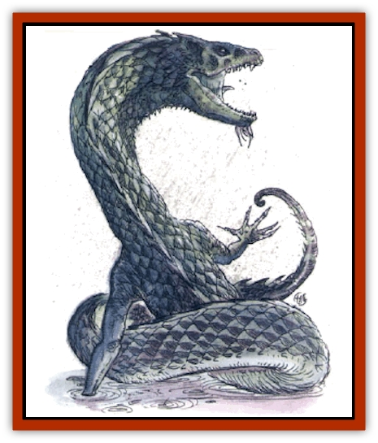

# Dragon - Linnorm - Rain

| Statistic | **Dragon, Linnorm, Rain** |
| --- | --- |
| **Activity Cycle:** | Any |
| **Alignment:** | Chaotic evil |
| **Armor Class:** | 3 (base) |
| **Climate/Terrain:** | Any/Land |
| **Damage/Attack:** | 1d12(&times;2)/3d10/see below |
| **Diet:** | Special |
| **Frequency:** | Very rare |
| **Hit Dice:** | 10 (base) |
| **Intelligence:** | Average (8-10) |
| **Magic Resistance:** | See below |
| **Morale:** | Fanatic (17-18) |
| **Movement:** | 18, Fl 39 (B), Sw 9 |
| **No. Appearing:** | 1 |
| **No. of Attacks:** | 3 + special |
| **Organization:** | Solitary |
| **Size:** | H-G (20' base length) |
| **Special Attacks:** | Spells, breath weapon |
| **Special Defenses:** | See below |
| **THAC0:** | 11 (base) |
| **Treasure:** | See below |
| **XP Value:** | See below |

Rain linnorms are quite vain, to the point of demanding credit for their atrocities. The more heinous the act, the more powerful the rain linnorm feels. Rain linnorms desire more treasure than other [[Dragon_General_Information|dragons]] could possibly accumulate.

*Hatchling* rain linnorms' teardrop-shaped scales are shiny and white. As they age, the scales grow larger and thicker, and turn gray, blue, green, or white at the creature's whim.

Rains speak their own language and can communicate with other Norse dragons, though they rarely lower themselves to do so. A hatchling has a 5% chance to communicate with all other animals, and that chance increases 5% per age category.

**Combat:** *Young* and *juvenile* rains are quick to rush into battle for treasure, attacking first with breath weapons and magical abilities. (A favorite stratagem of juveniles is to *call lightning*.) However, if a target appears nonthreatening, the linnorm fights with claws and bite, hoping to leave valuables intact. *Adult* and older ones hate to sully their claws, so they always attack first with spells, then assault their targets with breath weapons.

**Breath Weapon/Special Abilities:** The rain linnorm's breath is a stream of boiling water 3 feet wide and 90 feet long (saving throw for half damage applies). A rain linnorm casts spells at a level equal to 8 plus the dragon's combat modifier.

Rains are born invulnerable to electrical attacks, and they gain abilities as they age:

*Very young: create food and water* (twice per day); *Young: plant growth* and *entangle* (three times per day each); *Juvenile: call lightning* (twice per day); *Young adult: lightning bolt* (twice per day) and *water breathing* (at will); *Adult: control winds* (twice per day); *Mature adult: moonbeam* and *rainbow* (each three times per day); *Old:* immune to missile weapons and *transmute dust to water* (three times per day); *Very old:* immune to nonmagical blunt weapons, and *weather summoning* (twice per day); *Venerable:* immune to nonmagical edged weapons, and *conjure water elemental*; *Wyrm:* regenerate 10 hp/round and *control weather* (once per day); *Great wyrm:* regenerate 20 hp/round and *wind walk* (once per day).

**Habitat/Society:** Rain linnorms live on hills, where they can be comfortably buffeted by wind and rain. Their lairs within the hills have treasure hidden inside many chambers. A rain stays in its lair only when the weather is pleasant. *Wyrms* and *great wyrms* have been known to control the weather when the land has been too long without inclement weather.

Rain linnorms consider all others beneath them, and therefore improper company. Indeed, the only time more than one is encountered is when a pair has mated - they separate when the eggs hatch, abandoning the young.

Rains attempt to kill all intelligent creatures that come too near their lairs. If one believes the location of its lair is known, it will painstakingly move its treasure to a new lair.

**Ecology:** Rain linnorms subsist on almost anything, but their favorite food is lightning bolts. They have no known predators except adventurers.

| Age | Body Lgt. (') | Tail Lgt. (') | AC | Breath Weapon | Spells W | MR | Treas. Type | XP Value |
| --- | --- | --- | --- | --- | --- | --- | --- | --- |
| 1 Hatchling | 1-4 | 1-8 | 6 | 3d6+1 | Nil | Nil | ½B | 2,000 |
| 2 Very young | 5-10 | 9-20 | 5 | 5d6+2 | Nil | Nil | B | 7,000 |
| 3 Young | 11-17 | 21-34 | 4 | 7d6+3 | Nil | Nil | B | 10,000 |
| 4 Juvenile | 18-24 | 35-48 | 3 | 9d6+4 | Nil | Nil | Bx2 | 11,000 |
| 5 Young adult | 25-32 | 49-64 | 2 | 11d6+5 | Nil | Nil | Bx2 | 12,000 |
| 6 Adult | 33-41 | 65-82 | 1 | 13d6+6 | Nil | Nil | B,Zx2 | 13,000 |
| 7 Mature adult | 42-51 | 83-102 | 0 | 15d6+7 | Nil | Nil | C,Zx3 | 14,000 |
| 8 Old | 52-62 | 103-106 | -1 | 17d6+8 | 1 | 25% | C,Zx3 | 18,000 |
| 9 Very old | 63-75 | 107-109 | -2 | 19d6+9 | 2 1 | 35% | C,Zx4 | 20,000 |
| 10 Venerable | 76-91 | 110-112 | -3 | 21d6+10 | 3 2 | 45% | D,Zx4 | 22,000 |
| 11 Wyrm | 92-108 | 113-115 | -4 | 23d6+11 | 4 3 | 55% | D,Zx5 | 24,000 |
| 12 Great Wyrm | 109-130 | 116-118 | -5 | 25d6+12 | 5 4 | 65% | E,Zx5 | 25,000 |

---
## Discovery & Documentation

**Source Publication:** Monstrous Compendium, 1994 Annual, Volume 1 (1995)
**Campaign Setting:** Advanced Dungeons & Dragons 2nd Edition
**Author(s):** David Wise

### Other Creatures Found in This Source Book
   * [[Abyss_Ant|Abyss Ant]]
   * [[Achaierai|Achaierai]]
   * [[Afanc|Afanc]]
   * [[Al-Jahar|Al-Jahar]]
   * [[Baelnorn|Baelnorn]]
   * [[Baneguard|Baneguard]]
   * [[Banelar|Banelar]]
   * [[Bird_Talking|Bird, Talking]]
   * [[Blazing_Bones|Blazing Bones]]
   * [[Campestri|Campestri]]
   * [[Caniquine|Caniquine]]
   * [[Cat_Winged|Cat, Winged]]
   * [[Crypt_Servant|Crypt Servant]]
   * [[Death's_Head_Tree|Death's Head Tree]]
   * [[Dog_Saluqi|Dog, Saluqi]]
   * [[Dragon_Electrum|Dragon, Electrum]]
   * [[Dragon_Fang|Dragon, Fang]]
   * [[Dragon_Linnorm_Corpse_Tearer|Dragon, Linnorm, Corpse Tearer]]
   * [[Dragon_Linnorm_Dread|Dragon, Linnorm, Dread]]
   * [[Dragon_Linnorm_Flame|Dragon, Linnorm, Flame]]
   * [[Dragon_Linnorm_Forest|Dragon, Linnorm, Forest]]
   * [[Dragon_Linnorm_Frost|Dragon, Linnorm, Frost]]
   * [[Dragon_Linnorm_Gray|Dragon, Linnorm, Gray]]
   * [[Dragon_Linnorm_Land|Dragon, Linnorm, Land]]
   * [[Dragon_Linnorm_Midgard|Dragon, Linnorm, Midgard]]
   * [[Dragon_Linnorm_Sea|Dragon, Linnorm, Sea]]
   * [[Dragon_Neutral_Jacinth|Dragon, Neutral, Jacinth]]
   * [[Dragon_Neutral_Jade|Dragon, Neutral, Jade]]
   * [[Dragon_Neutral_Pearl|Dragon, Neutral, Pearl]]
   * [[Dread|Dread]]
   * [[Dragon-kin|Dragon-kin]]
   * [[Elemental_Earth_Kin_Chrysmal|Elemental, Earth Kin, Chrysmal]]
   * [[Elemental_Earth_Kin_Earth_Weird|Elemental, Earth Kin, Earth Weird]]
   * [[Elemental_Fire_Kin_Azer|Elemental, Fire Kin, Azer]]
   * [[Elemental_Sandman|Elemental, Sandman]]
   * [[Elemental_Wind_Walker|Elemental, Wind Walker]]
   * [[Elemental_Vermin|Elemental Vermin]]
   * [[Feystag|Feystag]]
   * [[Flame_Skull|Flame Skull]]
   * [[Foulwing|Foulwing]]
   * [[Gambado|Gambado]]
   * [[Garbug|Garbug]]
   * [[Genie_Tasked_Administrator|Genie, Tasked, Administrator]]
   * [[Genie_Tasked_Deceiver|Genie, Tasked, Deceiver]]
   * [[Genie_Tasked_Harim_Servant|Genie, Tasked, Harim Servant]]
   * [[Genie_Tasked_Messenger|Genie, Tasked, Messenger]]
   * [[Genie_Tasked_Miner|Genie, Tasked, Miner]]
   * [[Genie_Tasked_Oathbinder|Genie, Tasked, Oathbinder]]
   * [[Gibbering_Mouther|Gibbering Mouther]]
   * [[Gnasher|Gnasher]]
   * [[Gnasher_Winged|Gnasher, Winged]]
   * [[Golem_Brain|Golem, Brain]]
   * [[Golem_Hammer|Golem, Hammer]]
   * [[Golem_Metagolem|Golem, Metagolem]]
   * [[Golem_Spiderstone|Golem, Spiderstone]]
   * [[Gorynych|Gorynych]]
   * [[Greelox|Greelox]]
   * [[Helmed_Horror|Helmed Horror]]
   * [[Jarbo|Jarbo]]
   * [[Laraken|Laraken]]
   * [[Lich_Psionic|Lich, Psionic]]
   * [[Living_Steel|Living Steel]]
   * [[Lock_Lurker|Lock Lurker]]
   * [[Loxo|Loxo]]
   * [[Lycanthrope_Loup_de_Noir|Lycanthrope, Loup de Noir]]
   * [[Lycanthrope_Werebadger|Lycanthrope, Werebadger]]
   * [[Lycanthrope_Werejaguar|Lycanthrope, Werejaguar]]
   * [[Lythlyx|Lythlyx]]
   * [[Magebane|Magebane]]
   * [[Marrashi|Marrashi]]
   * [[Metalmaster|Metalmaster]]
   * [[Mimic_House_Hunter|Mimic, House Hunter]]
   * [[Naga_Bone|Naga, Bone]]
   * [[Nautilus_Giant|Nautilus, Giant]]
   * [[Nightshade_Toril|Nightshade (Toril)]]
   * [[Nishruu|Nishruu]]
   * [[Noran|Noran]]
   * [[Opinicus|Opinicus]]
   * [[Ormyrr|Ormyrr]]
   * [[Parasite|Parasite]]
   * [[Pasari-Niml|Pasari-Niml]]
   * [[Plant_Vampire_Moss|Plant, Vampire Moss]]
   * [[Pteraman|Pteraman]]
   * [[Rautym|Rautym]]
   * [[Shadeling|Shadeling]]
   * [[Skum|Skum]]
   * [[Snake_Giant_Cobra|Snake, Giant Cobra]]
   * [[Snake_Stone|Snake, Stone]]
   * [[Spectral_Wizard|Spectral Wizard]]
   * [[Spell_Weaver|Spell Weaver]]
   * [[Spider_Brain|Spider, Brain]]
   * [[Suwyze|Suwyze]]
   * [[Tatalla|Tatalla]]
   * [[Tick_Heart|Tick, Heart]]
   * [[Tree_Dark|Tree, Dark]]
   * [[Tree_Singing|Tree, Singing]]
   * [[Tressym|Tressym]]
   * [[Troll_Snow|Troll, Snow]]
   * [[Tuyewera|Tuyewera]]
   * [[Ulitharid|Ulitharid]]
   * [[Undead_Dwarf|Undead Dwarf]]
   * [[Undead_Lake_Monster|Undead Lake Monster]]
   * [[Whipsting|Whipsting]]
   * [[Windghost|Windghost]]
   * [[Wolf_Dread|Wolf, Dread]]
   * [[Wolf_Stone|Wolf, Stone]]
   * [[Wolf_Vampiric|Wolf, Vampiric]]
   * [[Wraith_Shimmering|Wraith, Shimmering]]
   * [[Xantravar|Xantravar]]
   * [[Xaver|Xaver]]
