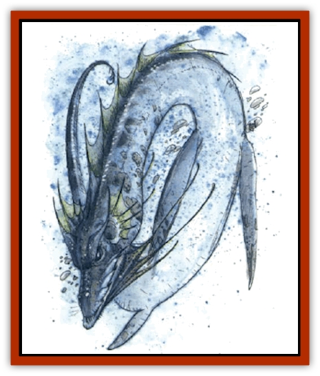

# Dragon - Linnorm - Sea

| Statistic | **Dragon, Linnorm, Sea** |
| --- | --- |
| **Activity Cycle:** | Any |
| **Alignment:** | Lawful evil |
| **Armor Class:** | -2 (base) |
| **Climate/Terrain:** | Any/Fresh water, salt water |
| **Damage/Attack:** | 3d10/2d10/special |
| **Diet:** | Herbivore |
| **Frequency:** | Very rare |
| **Hit Dice:** | 13 (base) |
| **Intelligence:** | Exceptional (15-16) |
| **Magic Resistance:** | See below |
| **Morale:** | Fanatic (17-18) |
| **Movement:** | 9, Sw 24 |
| **No. Appearing:** | 1 |
| **No. of Attacks:** | 2 + special |
| **Organization:** | Solitary |
| **Size:** | G (48' base length) |
| **Special Attacks:** | Spells, breath weapon, capsize ships, surprise |
| **Special Defenses:** | Spells |
| **THAC0:** | 7 (base) |
| **Treasure:** | See below |
| **XP Value:** | See below |

Sea linnorms are cold and vicious, viewing land dwellers as a threat to all marine life.

The sea *hatchling* is nearly translucent, but its scales become pearly and thick as it ages. From the *young* stage, this linnorm can shift its color like a chameleon.

Sea linnorms speak their own language, can communicate with all sea life, and have a 5% chance per age category to learn how to speak any human or demihuman language.

**Combat:** This [[Dragon_General_Information|dragon]] (*young* and older) comes up beneath ships and capsizes them - the ship makes a seaworthiness check (see the *DMG*), and a modifier equaling the linnorm's combat modifier times 5 is subtracted from the roll. Hence, a Viking longship attacked by an old linnorm has a (60 - [8 x 5] =) 20% chance to avoid capsizing. Seas use breath weapons, spells, and special abilities to kill any survivors, attacking with their bites and long, barbed tails only if necessary.

To attack humans on land, the linnorm slithers out of the sea by night and uses spells, magical abilities, and its breath weapon on structures and ships. It then attacks survivors with its breath weapon, biting, and tail slaps. Seriously wounded sea linnorms retreat to the sea and plot revenge.

**Breath Weapon/Special Abilities:** Sea linnorm breath is a cloud of caustic acid droplets 60 feet long, 60 feet wide, and 30 feet high (saving throw for half damage applies). This weapon cannot be employed underwater. A sea linnorm casts spells at a level equal to 8 plus its combat modifier. Spells come from the spheres of Animal, Elemental, and Weather.

Sea linnorms gain the following abilities as they age, each useable twice per day:

*Very young: wall of fog*; *Young: fog cloud*; *Juvenile: gust of wind*; *Young adult: solid fog*; *Adult: airy water*; *Mature adult: Death fog*; *Old: raise water*; *Very old: part water*; *Venerable: transmute dust to water*; *Wyrm: reverse gravity*; *Great wyrm: shape change*.

The linnorm's ability to change the color of its scales at will gives it a chance equal to its magic resistance to remain unseen, and it imposes a +4 modifier uphon surprise rolls.

**Habitat/Society:** Sea linnorms are found in cool waters. While they can maneuver equally well above or below the waves, they spend most of their days underwater, surfacing only to attack humans and demihumans. The lair of a sea linnorm is always deep underwater, usually in multichambered caves. Sea linnorms of *mature adult* and older stages frequently have 1d4 [[Squid_Giant|giant squid]], 1d4 [[Turtle_Giant|giant sea turtles]], or a [[Squid_Giant|kraken]] guarding their lairs. The linnorms hide treasure in the recesses of these caves, herding gold, silver, and especially gems, jewelry, and objects of art. Such lairs are also likely to contain spoils of battle: anchors, sails, and other parts of boats or docks.

**Ecology:** Sea linnorms require little food. As herbivores, they eat primarily sea plants and are especially fond of dried seaweed, gathering it and placing it on rocky shores, then waiting for it to become its tastiest in the afternoon sun.

| Age | Body Lgt. (') | Tail Lgt. (') | AC | Breath Weapon | Spells P | MR | Treas. Type | XP Value |
| --- | --- | --- | --- | --- | --- | --- | --- | --- |
| 1 Hatchling | 1-12 | 12-32 | 1 | 2d10+1 | Nil | 15% | Nil | 5,0000 |
| 2 Very young | 13-23 | 33-43 | 0 | 4d10+2 | 1 | 20% | ½D | 11,000 |
| 3 Young | 24-42 | 44-62 | -1 | 6d10+3 | 2 | 25% | ½D | 15,000 |
| 4 Juvenile | 43-61 | 63-81 | -2 | 8d10+4 | 2 1 | 30% | D | 16,000 |
| 5 Young adult | 62-80 | 82-100 | -3 | 10d10+5 | 2 1 1 | 35% | D,A | 18,000 |
| 6 Adult | 81-99 | 101-119 | -4 | 12d10+6 | 2 2 1 | 40% | D,A,B | 19,000 |
| 7 Mature adult | 100-118 | 120-138 | -5 | 14d10+7 | 2 2 2 1 | 45% | D,A,Bx2 | 20,000 |
| 8 Old | 119-137 | 139-157 | -6 | 16d10+8 | 2 2 2 2 | 50% | D,A,Bx2 | 21,000 |
| 9 Very old | 138-156 | 158-176 | -7 | 18d10+9 | 3 2 2 2 | 55% | D,A,Bx2 | 22,000 |
| 10 Venerable | 157-165 | 177-185 | -8 | 20d10+10 | 3 3 2 2 | 65% | D,A,Bx3 | 23,000 |
| 11 Wyrm | 166-174 | 186-194 | -9 | 22d10+11 | 3 3 3 2 | 70% | D,A,Bx3 | 24,000 |
| 12 Great Wyrm | 175-183 | 195-203 | -10 | 24d10+12 | 3 3 3 3 | 75% | D,A,Bx4 | 25,000 |

---
## Discovery & Documentation

**Source Publication:** Monstrous Compendium, 1994 Annual, Volume 1 (1995)
**Campaign Setting:** Advanced Dungeons & Dragons 2nd Edition
**Author(s):** David Wise

### Other Creatures Found in This Source Book
   * [[Abyss_Ant|Abyss Ant]]
   * [[Achaierai|Achaierai]]
   * [[Afanc|Afanc]]
   * [[Al-Jahar|Al-Jahar]]
   * [[Baelnorn|Baelnorn]]
   * [[Baneguard|Baneguard]]
   * [[Banelar|Banelar]]
   * [[Bird_Talking|Bird, Talking]]
   * [[Blazing_Bones|Blazing Bones]]
   * [[Campestri|Campestri]]
   * [[Caniquine|Caniquine]]
   * [[Cat_Winged|Cat, Winged]]
   * [[Crypt_Servant|Crypt Servant]]
   * [[Death's_Head_Tree|Death's Head Tree]]
   * [[Dog_Saluqi|Dog, Saluqi]]
   * [[Dragon_Electrum|Dragon, Electrum]]
   * [[Dragon_Fang|Dragon, Fang]]
   * [[Dragon_Linnorm_Corpse_Tearer|Dragon, Linnorm, Corpse Tearer]]
   * [[Dragon_Linnorm_Dread|Dragon, Linnorm, Dread]]
   * [[Dragon_Linnorm_Flame|Dragon, Linnorm, Flame]]
   * [[Dragon_Linnorm_Forest|Dragon, Linnorm, Forest]]
   * [[Dragon_Linnorm_Frost|Dragon, Linnorm, Frost]]
   * [[Dragon_Linnorm_Gray|Dragon, Linnorm, Gray]]
   * [[Dragon_Linnorm_Land|Dragon, Linnorm, Land]]
   * [[Dragon_Linnorm_Midgard|Dragon, Linnorm, Midgard]]
   * [[Dragon_Linnorm_Rain|Dragon, Linnorm, Rain]]
   * [[Dragon_Neutral_Jacinth|Dragon, Neutral, Jacinth]]
   * [[Dragon_Neutral_Jade|Dragon, Neutral, Jade]]
   * [[Dragon_Neutral_Pearl|Dragon, Neutral, Pearl]]
   * [[Dread|Dread]]
   * [[Dragon-kin|Dragon-kin]]
   * [[Elemental_Earth_Kin_Chrysmal|Elemental, Earth Kin, Chrysmal]]
   * [[Elemental_Earth_Kin_Earth_Weird|Elemental, Earth Kin, Earth Weird]]
   * [[Elemental_Fire_Kin_Azer|Elemental, Fire Kin, Azer]]
   * [[Elemental_Sandman|Elemental, Sandman]]
   * [[Elemental_Wind_Walker|Elemental, Wind Walker]]
   * [[Elemental_Vermin|Elemental Vermin]]
   * [[Feystag|Feystag]]
   * [[Flame_Skull|Flame Skull]]
   * [[Foulwing|Foulwing]]
   * [[Gambado|Gambado]]
   * [[Garbug|Garbug]]
   * [[Genie_Tasked_Administrator|Genie, Tasked, Administrator]]
   * [[Genie_Tasked_Deceiver|Genie, Tasked, Deceiver]]
   * [[Genie_Tasked_Harim_Servant|Genie, Tasked, Harim Servant]]
   * [[Genie_Tasked_Messenger|Genie, Tasked, Messenger]]
   * [[Genie_Tasked_Miner|Genie, Tasked, Miner]]
   * [[Genie_Tasked_Oathbinder|Genie, Tasked, Oathbinder]]
   * [[Gibbering_Mouther|Gibbering Mouther]]
   * [[Gnasher|Gnasher]]
   * [[Gnasher_Winged|Gnasher, Winged]]
   * [[Golem_Brain|Golem, Brain]]
   * [[Golem_Hammer|Golem, Hammer]]
   * [[Golem_Metagolem|Golem, Metagolem]]
   * [[Golem_Spiderstone|Golem, Spiderstone]]
   * [[Gorynych|Gorynych]]
   * [[Greelox|Greelox]]
   * [[Helmed_Horror|Helmed Horror]]
   * [[Jarbo|Jarbo]]
   * [[Laraken|Laraken]]
   * [[Lich_Psionic|Lich, Psionic]]
   * [[Living_Steel|Living Steel]]
   * [[Lock_Lurker|Lock Lurker]]
   * [[Loxo|Loxo]]
   * [[Lycanthrope_Loup_de_Noir|Lycanthrope, Loup de Noir]]
   * [[Lycanthrope_Werebadger|Lycanthrope, Werebadger]]
   * [[Lycanthrope_Werejaguar|Lycanthrope, Werejaguar]]
   * [[Lythlyx|Lythlyx]]
   * [[Magebane|Magebane]]
   * [[Marrashi|Marrashi]]
   * [[Metalmaster|Metalmaster]]
   * [[Mimic_House_Hunter|Mimic, House Hunter]]
   * [[Naga_Bone|Naga, Bone]]
   * [[Nautilus_Giant|Nautilus, Giant]]
   * [[Nightshade_Toril|Nightshade (Toril)]]
   * [[Nishruu|Nishruu]]
   * [[Noran|Noran]]
   * [[Opinicus|Opinicus]]
   * [[Ormyrr|Ormyrr]]
   * [[Parasite|Parasite]]
   * [[Pasari-Niml|Pasari-Niml]]
   * [[Plant_Vampire_Moss|Plant, Vampire Moss]]
   * [[Pteraman|Pteraman]]
   * [[Rautym|Rautym]]
   * [[Shadeling|Shadeling]]
   * [[Skum|Skum]]
   * [[Snake_Giant_Cobra|Snake, Giant Cobra]]
   * [[Snake_Stone|Snake, Stone]]
   * [[Spectral_Wizard|Spectral Wizard]]
   * [[Spell_Weaver|Spell Weaver]]
   * [[Spider_Brain|Spider, Brain]]
   * [[Suwyze|Suwyze]]
   * [[Tatalla|Tatalla]]
   * [[Tick_Heart|Tick, Heart]]
   * [[Tree_Dark|Tree, Dark]]
   * [[Tree_Singing|Tree, Singing]]
   * [[Tressym|Tressym]]
   * [[Troll_Snow|Troll, Snow]]
   * [[Tuyewera|Tuyewera]]
   * [[Ulitharid|Ulitharid]]
   * [[Undead_Dwarf|Undead Dwarf]]
   * [[Undead_Lake_Monster|Undead Lake Monster]]
   * [[Whipsting|Whipsting]]
   * [[Windghost|Windghost]]
   * [[Wolf_Dread|Wolf, Dread]]
   * [[Wolf_Stone|Wolf, Stone]]
   * [[Wolf_Vampiric|Wolf, Vampiric]]
   * [[Wraith_Shimmering|Wraith, Shimmering]]
   * [[Xantravar|Xantravar]]
   * [[Xaver|Xaver]]
