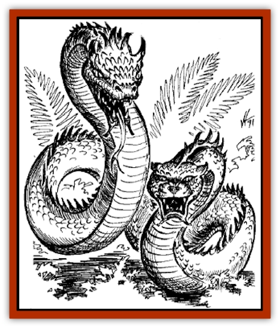
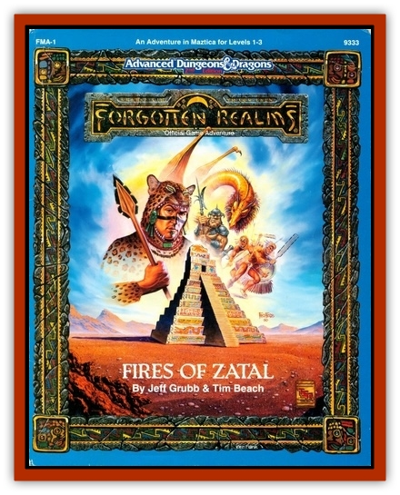

# Dragon - Maztica

| Statistic | **Dragon (Maztica)** |
| --- | --- |
| **Activity Cycle:** | Any |
| **Alignment:** | Lawful evil |
| **Armor Class:** | 0 (base) |
| **Climate/Terrain:** | Tropical clouds and mountain caves |
| **Damage/Attack:** | 3-24/3-18/2-8 |
| **Diet:** | Special |
| **Frequency:** | Very rare |
| **Hit Dice:** | 12 (base) |
| **Intelligence:** | Average (8-10) |
| **Magic Resistance:** | Variable |
| **Morale:** | Fanatic (17) |
| **Movement:** | 3, Fl 30 (B) |
| **No. Appearing:** | 1 |
| **No. of Attacks:** | 3 + special |
| **Organization:** | Solitary |
| **Size:** | G (30' base) |
| **Special Attacks:** | Special |
| **Special Defenses:** | Variable |
| **THAC0:** | 7 (base) |
| **Treasure:** | Special |
| **XP Value:** | Variable |

Also called rain [[Dragon_General_Information|dragons]], rain serpents, or tlalocoatls, Maztican dragons are limbless and serpentine, with a head at each end. One head is snake-like; the other resembles a reptilian jaguar head. A tlalocoatl is bluish in color, ranging from sky blue on its underside to turquoise blue on top.

Tlalocoatls help dispense rain in Maztica. They will aid an arid area with moisture if properly appeased, but they sometimes act capriciously, causing floods or allowing droughts.

They have the standard dragon characteristics, except for age categories, maneuverability class, and attacks, as noted herein.

**Combat:** Tlalocoatls fly using natural magical ability and are more maneuverable than most other dragons.

They prefer to use spells and special abilities before melee. In melee, they may bite once per head, constrict, snatch (using a mouth), or plummet, but may not use other special dragon attack forms. The fanged snake head bites for 3d6 points of damage and injects poison, against which victims must make a saving throw or die. The jaguar head does 3d8 points of damage. A constriction attack causes 2d4 points of damage per round until the victim or the dragon is slain. A tlalocoatl can constrict one victim for each 8' of body length.

**Breath Weapon/Special Abilities:** A tlalocoatl has two breath weapons, each usable once every three rounds. The jaguar head breathes a cloud of water vapor 90' long, 30' wide, and 30' high. The cloud may be scalding steam, doing damage as indicated above, or cool fog which does no damage. Either form lasts for 1d4 + 4 rounds, obscuring vision as does normal darkness. The serpent head breathes a cone of ice crystals 75' long, 5' wide at the mouth, and 25' wide at the base. Damage indicated is caused half by cold and half by abrasion. If used together, the breath weapons cause normal damage, then cause rain, making as much water as a create water cast by the dragon. The rain continues for one round per four gallons of water. Creatures take 1d4 points of drowning damage for each round they stay within the storm, which has the same dimensions as the original vapor cloud.

A tlalocoatl casts spells and uses magical abilities at 5th level plus its combat modifier. Rain dragons are immune to electricity and cold. As they age, they gain the following additional powers:

*Very young: water breathing* three times a day; *Young: obscurement* twice a day; *Juvenile: solid fog* twice a day; *Adult: call lightning* twice a day; *Mature adult: transmute water to dust* twice a day; *Old: weather summoning* twice a day; *Very old: transmute rock to mud* once a day; *Venerable: control weather* once a day.

**Habitat/Society:** Rain serpents lair in caves in cloudshrouded mountains, sometimes accompanied by [[Chac|chacs]] (jaguar-like rain spirits). Every tlalocoatl is a priest of Azul, and is both male and female, producing offspring when Azul gives permission. Many die young because they mature so slowly. However, they age rapidly in later years. They have a maximum age of 676 years.

**Ecology:** Tlalocoatls are not as greedy as other dragons, but they do collect treasure. Substitute Maztican valuables for coinage: cocoa beans for copper pieces, copper blades for silver pieces, coral buds for electrum, jade or turquoise for gold, and quills of gold dust for platinum. Magical items will also be Maztican.

Tlalocoatls are especially fond of cocoa beans, turquoise, and jade, which they consume. They also drink a great deal of water, possibly increasing the dangers of a local drought. They are fond of meat, particularly that of young animals or human children.

The scales from the tops of their bodies are beautiful turquoise, worth up to 1 gq each. A skilled craftsman can shape them like rock, but they are as tough as metal. Weapons made with the scales do not break like bone or stone weapons.

| Age Category | Age (years) | Body Lgt. (') | AC | Breath Weapon | Spells (P) | MR | Treas. Type | XP Value |
| --- | --- | --- | --- | --- | --- | --- | --- | --- |
| 1 Hatchling | 0-51 | 5-8 | 3 | 2d6+2 | 1 | 20% | Nil | 10,000 |
| 2 Very young | 52-103 | 9-12 | 2 | 3d6+3 | 2 | 25% | Nil | 12,000 |
| 3 Young | 104-155 | 13-16 | 1 | 4d6+4 | 2 1 | 30% | Nil | 14,000 |
| 4 Juvenile | 156-207 | 17-20 | 0 | 5d6+5 | 3 1 | 35% | B | 17,000 |
| 5 Young adult | 208-259 | 21-24 | -1 | 6d6+6 | 3 2 | 40% | B | 18,000 |
| 6 Adult | 260-311 | 25-28 | -2 | 7d6+7 | 3 2 1 | 45% | B | 20,000 |
| 7 Mature adult | 312-363 | 29-32 | -3 | 8d6+8 | 3 3 1 | 50% | B,U | 21,000 |
| 8 Old | 364-415 | 33-36 | -4 | 9d6+9 | 3 3 2 | 55% | B,U | 22,000 |
| 9 Very old | 416-467 | 37-40 | -5 | 10d6+10 | 3 3 2 1 | 60% | B,U | 23,000 |
| 10 Venerable | 468-519 | 41-44 | -6 | 11d6+11 | 3 3 3 1 | 65% | Bx2,U | 24,000 |
| 11 Wyrm | 520-571 | 45-48 | -7 | 12d6+12 | 3 3 3 2 | 70% | Bx2,U | 25,000 |
| 12 Great Wyrm | 572-676 | 49-52 | -8 | 13d6+13 | 3 3 3 2 1 | 75% | Bx2,U,Yx2 | 26,000 |

---
## Discovery & Documentation

**Source Publication:** FMA1 Fires of Zatal (1991)
**Campaign Setting:** Maztica (Forgotten Realms)
**Author(s):** Jeff Grub and Tim Beach

### Other Creatures Found in This Source Book
   * [[Ahuizotl|Ahuizotl]]
   * [[Tabaxi|Tabaxi]]
