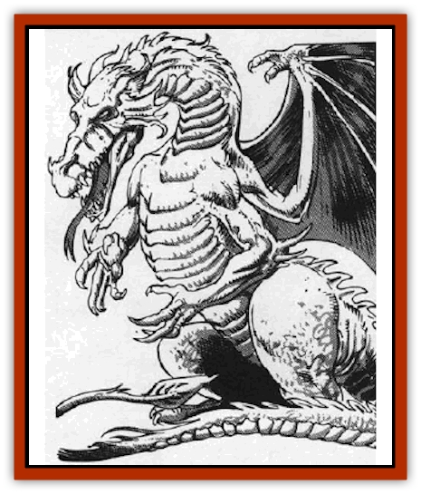

# Dragon - Moon

| Statistic | **Dragon, Moon** |
| --- | --- |
| **Activity Cycle:** | Night |
| **Alignment:** | Variable |
| **Armor Class:** | 4 (base) |
| **Climate/Terrain:** | Moons |
| **Damage/Attack:** | 1d4/1d4/2d10 |
| **Diet:** | Omnivore |
| **Frequency:** | Rare |
| **Hit Dice:** | 9 (base) |
| **Intelligence:** | Highly (13-14) |
| **Magic Resistance:** | Variable |
| **Morale:** | Elite (15) |
| **Movement:** | 12, Fl 18 (C) |
| **No. Appearing:** | 1 (1-3) |
| **No. of Attacks:** | 3 + special |
| **Organization:** | Solitary or clan |
| **Size:** | G (25' base) |
| **Special Attacks:** | Special |
| **Special Defenses:** | Variable |
| **THAC0:** | 12 (base) |
| **Treasure:** | Special |
| **XP Value:** | Variable |

Moon [[Dragon_General_Information|dragons]] are evil dragons that exclusively inhabit caves on moons. Like most dragons, they prize wealth and power. The coloration of moon dragons changes every 30 days, starting out as brilliant white. Slowly, what appears to be a large black shadow forms on the dragon's left side, and gradually moves across the beast until it is all black. This process takes 15 days, whereupon a small sliver of white appears on the left side and moves across the dragon until, 15 days later, it is all white again. The dragon's strength and alignment vary with its coloration. Each "phase" lasts seven days. When the dragon is all black, it is at full strength and chaotic evil. When either black-white or white-black, its powers and combat modifiers are half the dragon's age category, its alignment neutral evil. When all white, it is lawful evil and its power is one quarter of its age category (e.g., an old dragon during the all-white phase fights as a very young dragon). Size and Intelligence do not change. When the moon dragon is all white, [[Lycanthrope_General_Information|lycanthropes]] immediately change into were-form and, unless they save vs. magic, obey the moon dragon's commands as though *charmed*.

Moon dragons speak the tongue common to all evil dragons, and 20% of all *hatchlings* can speak with any living being, this chance increasing 5% per age category.

**Combat:** The moon dragon dislikes lowering itself to mere combat. If provoked, it leads with its breath weapon and hopes this attack panics the enemy. If the dragon's opponents dare not flee, the dragon breathes again, sometimes casting a spell or two "for variety's sake". Moon dragons dislike using their claws and bite (each 1d4), considering such brawling beneath them. Moon dragons breathe a cone of black frost 160' long, 40' wide at the base, and 10' wide at the dragon's mouth. Besides causing 2d10 damage, the black frost hardens rapidly. Those who fail to save vs. breath weapon are encased in a tomb of black ice, with only enough air for 1d4+1 rounds. After that time, the victim suffocates. Breaking the ice from the inside requires the victim to make a Strength ability check at -2 (allowed once per round).

Breaking the ice from outside requires 1d6 rounds of uninterrupted chipping. Magical fire melts the ice in 1d4-1 rounds. Excess magical fire damages the victim.

Moon dragons are immune to cold. They have superior vision and are not affected by either light or darkness spells. As they age, moon dragons gain the following spell abilities, each usable three times a day:

*Young: light*; *Juvenile: darkness, 25' radius*; *Adult: continual light*; *Old: Melf's minute meteors*; *Very old: repulsion*; *Venerable: reverse gravity*.

**Habitat/Society:** Moon dragons have a strong feeling of superiority. Arrogant and elitist, moon dragons are obsessed with the moon motif and the dichotomy of light and darkness. Their treasure consists mainly of white or black pearls and diamonds, moonstones, and any coin called a "moon" by its society.

**Ecology:** The average moon dragon brood holds 1d4 eggs.

Moon dragons eat almost anything, and they keep a wellstoeked larder of frozen victims. Only rarely do they range about their moon for food. Moon dragons are the mortal enemies of [[Dragon_Sun|sun dragons]] and attack them on sight.

| Age | Body Lgt. (') | Tail Lgt. (') | AC | Breath Weapon | Spells W | MR | Treas. Type | XP Value |
| --- | --- | --- | --- | --- | --- | --- | --- | --- |
| 1 Hatchling | 1-12 | 2-12 | 7 | 2d6+1 | Nil | Nil | Nil | 1,400 |
| 2 Very young | 13-24 | 13-20 | 6 | 3d6+2 | Nil | Nil | Nil | 2,000 |
| 3 Young | 25-36 | 21-28 | 5 | 4d6+3 | Nil | Nil | Nil | 4,000 |
| 4 Juvenile | 37-48 | 29-36 | 4 | 5d6+4 | 1 | Nil | F | 6,000 |
| 5 Young adult | 49-60 | 37-44 | 3 | 6d6+5 | 2 | Nil | F | 8,000 |
| 6 Adult | 61-72 | 45-52 | 2 | 7d6+6 | 3 | 15% | F | 11,000 |
| 7 Mature adult | 73-84 | 53-60 | 1 | 8d6+7 | 3 1 | 20% | F | 14,000 |
| 8 Old | 85-96 | 61-68 | 0 | 9d6+8 | 3 2 | 25% | D,F | 16,000 |
| 9 Very old | 97-108 | 69-76 | -1 | 10d6+9 | 3 2 1 | 30% | D,F | 18,000 |
| 10 Venerable | 109-120 | 77-84 | -2 | 11d6+10 | 3 3 2 | 35% | A,D,F | 20,000 |
| 11 Wyrm | 121-132 | 85-92 | -3 | 12d6+11 | 3 3 2 1 | 40% | A,D,F | 22,000 |
| 12 Great Wyrm | 133-144 | 93-100 | -4 | 13d6+12 | 4 3 2 1 | 50% | A,D,F,Z | 25,000 |

---
## Discovery & Documentation

**Source Publication:** MC9 Spelljammer Appendix II (1991)
**Campaign Setting:** Planescape
**Author(s):** Scott Davis, Newton Ewell, John Terra

### Other Creatures Found in This Source Book
   * [[Alchemy_Plant|Alchemy Plant]]
   * [[Allura|Allura]]
   * [[Aperusa|Aperusa]]
   * [[Autognome|Autognome]]
   * [[Bionoid|Bionoid]]
   * [[Bloodsac|Bloodsac]]
   * [[Buzzjewel|Buzzjewel]]
   * [[Constellate|Constellate]]
   * [[Contemplator|Contemplator]]
   * [[Dohwar|Dohwar]]
   * [[Dragon_Stellar|Dragon, Stellar]]
   * [[Dragon_Sun|Dragon, Sun]]
   * [[Dreamslayer|Dreamslayer]]
   * [[Dweomerborn|Dweomerborn]]
   * [[Fal|Fal]]
   * [[Feesu|Feesu]]
   * [[Fire_Bat|Fire Bat]]
   * [[Firebird|Firebird]]
   * [[Firelich|Firelich]]
   * [[Flowfiend|Flowfiend]]
   * [[Gadabout|Gadabout]]
   * [[Gammaroid|Gammaroid]]
   * [[Gonn|Gonn]]
   * [[Gossamer|Gossamer]]
   * [[Grav|Grav]]
   * [[Great_Dreamer|Great Dreamer]]
   * [[Greatswan|Greatswan]]
   * [[Grell_Colonial|Grell, Colonial]]
   * [[Gullion|Gullion]]
   * [[Insectare|Insectare]]
   * [[Lhee|Lhee]]
   * [[Mercurial_Slime|Mercurial Slime]]
   * [[Meteorspawn|Meteorspawn]]
   * [[Monitor|Monitor]]
   * [[Owl_Space|Owl, Space]]
   * [[Pristatic|Pristatic]]
   * [[Scro|Scro]]
   * [[Selkie_Star|Selkie, Star]]
   * [[Silatic|Silatic]]
   * [[Skullbird|Skullbird]]
   * [[Sleek|Sleek]]
   * [[Sluk|Sluk]]
   * [[Space_Swine|Space Swine]]
   * [[Sphinx_Astro-|Sphinx, Astro-]]
   * [[Spirit_Warrior|Spirit Warrior]]
   * [[Starfly_Plant|Starfly Plant]]
   * [[Stargazer|Stargazer]]
   * [[Undead_Stellar|Undead, Stellar]]
   * [[Witchlight_Marauder|Witchlight Marauder]]
   * [[Xixchil|Xixchil]]
   * [[Yitsan|Yitsan]]
   * [[Zurchin|Zurchin]]
