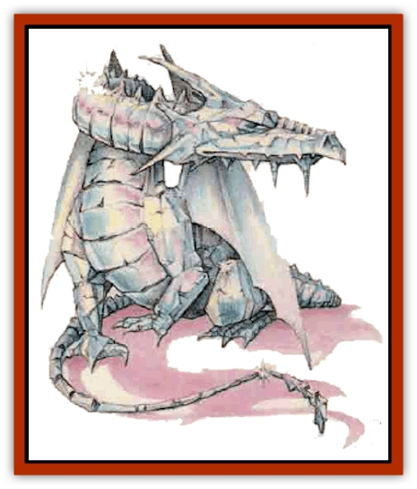

# Dragon - Mystara - Crystalline

| Statistic | **Dragon (Mystara), Crystalline** |
| --- | --- |
| **Activity Cycle:** | Any |
| **Alignment:** | Lawful neutral |
| **Armor Class:** | -2 (base) |
| **Climate/Terrain:** | Cold mountains and any arctic |
| **Damage/Attack:** | 1d12/1d12/2d12 (claw/claw/bite) |
| **Diet:** | Ore, gems, crystal |
| **Frequency:** | Very rare |
| **Hit Dice:** | 15 (base) |
| **Intelligence:** | Genius (17-18) |
| **Magic Resistance:** | Varies |
| **Morale:** | Fanatic (18) |
| **Movement:** | 9, FL 30 (C), Br 9 |
| **No. Appearing:** | 1 (1d4+1) |
| **No. of Attacks:** | 3 |
| **Organization:** | Solitary or clan |
| **Size:** | G (40' base) |
| **Special Attacks:** | Varies |
| **Special Defenses:** | Varies |
| **THAC0:** | 5 (base) |
| **Treasure:** | Special |
| **XP Value:** | Variable |

Though they share many traits with the [[Dragon_Gem_Crystal|crystal dragons]] of other worlds, Mystara's crystalline [[Dragon_Mystara_General_Information|dragons]] stand apart. They boast more Hit Dice and are larger. Further, crystalline [[Dragon_General_Information|dragons]] can employ a unique breath weapon.

At birth, crystalline dragons have white scales that are glossy and opaque, like packed snow. As they age, the scales acquire greater translucence, as if the once-snowy scales were transformed into gleaming glacial ice. Under faint light, the scales of a mature dragon luminesce softly. In bright light, venerable crystalline dragons shine so brillliantly that it pains others to look upon them.

Crystalline dragons speak their own language and the tongue common to all gem dragons.

**Combat:** The crystalline dragon's breath weapon is a blast of freezing cold identical in effect to that of a [[Dragon_Chromatic_White|white dragon]]. The breath appears as a cone of scintillating particles, like brilliant shards of ice. The breath weapon's secondary effect makes it unique. A victim who fails the saving throw not only takes full damage (per the table below), but all his nonliving carried items must save vs. disintegration or turn to crystal. If the victim makes his saving throw, the victim takes only half damage and his items are unaffected. Any weapon, tooth or claw turned to crystal can still be used to attack, but will probably (1 to 5 on 1d6) shatter with a successful hit.

If the weapon shatters, it inflicts the minimum possible damage for that blow and is destroyed. A *stone to flesh* spell can be used to permanently turn up to 100 cubic feet of crystal items (easily inluding all items normally carried by 1 to 3 persons) back to their normal forms (This is, of course, provided they haven't been shattered already.) A *dispel magic* spell also restores crystallized items (use the age category of the dragon as the opposing caster level).

**Habitat/Society:** The crystalline dragon especially favors glaciers in arctic and high mountainous regions, making its lair in caves burrowed out of theliving ice. It prefers cold regions, where its shimmering scales make it difficult to be seen against a background of ice and snow.

Mystara's crystalline dragons are more serious and orderly than their frolicking crystal kin found in other worlds.

**Ecology:** Crystalline dragons subsist on a diet of ore and gems. They are also particularly fond of the crystallized remnants of adventurers' equipment, considering them a special taste treat. Glaciers are an ideal home, because as they slowly crawl across continents they scrape up tons of rock and soil. The crystalline dragon uses its massive, sharp claws to burrow through the hard-packed ice in search of veins of mineral-rich strata scraped centuries before from the earth's skin.

| Age | Body Lgt. (') | Tail Lgt. (') | AC | Breath Weapon | Spells W/P | MR | Treas. Type | XP Value |
| --- | --- | --- | --- | --- | --- | --- | --- | --- |
| 1 Hatchling | 1-10 | 1-6 | 1 | 2d4+1 | Nil | Nil | Nil | 5,000 |
| 2 Very young | 10-22 | 6-12 | 0 | 4d4+2 | Nil | Nil | Nil | 8,000 |
| 3 Young | 22-32 | 12-19 | -1 | 6d4+3 | Nil | Nil | Nil | 10,000 |
| 4 Juvenile | 32-50 | 19-27 | -2 | 8d4+4 | Nil/1 | Nil | Nil | 13,000 |
| 5 Young adult | 50-69 | 27-35 | -3 | 10d4+5 | 1/1 | 15% | A,Q | 16,000 |
| 6 Adult | 69-88 | 35-43 | -4 | 12d4+6 | 1/1 1 | 20% | A,Qx2,U | 17,000 |
| 7 Mature adult | 88-97 | 43-50 | -5 | 14d4+7 | 1 1/1 1 | 25% | A,H,Qx2,Ux2 | 18,000 |
| 8 Old | 97-106 | 50-57 | -6 | 16d4+8 | 2 1/2 1 | 30% | Ax2,H,Qx3,Ux3 | 19,000 |
| 9 Very old | 106-115 | 57-64 | -7 | 18d4+9 | 2 1/2 1 1 | 35% | Ax2,H,Qx4,Ux4 | 22,000 |
| 10 Venerable | 115-124 | 64-73 | -8 | 20d4+10 | 2 1 1/2 2 1 | 40% | Ax3,H,Qx6,Ux6 | 23,000 |
| 11 Wyrm | 124-133 | 73-80 | -9 | 22d4+11 | 2 2 1/2 2 1 1 | 45% | Ax4,H,Qx12,Ux8 | 24,000 |
| 12 Great Wyrm | 133-142 | 80-87 | -10 | 24d4+12 | 2 2 1 1/2 2 2 1 | 50% | Ax4,H,Qx24,Ux10 | 25,000 |

---
## Discovery & Documentation

**Source Publication:** Mystara Appendix (1994)
**Campaign Setting:** Mystara
**Author(s):** John Nephew, Teeuwynn Woodruff, John Terra, Skip Williams

### Other Creatures Found in This Source Book
   * [[Actaeon|Actaeon]]
   * [[Agarat|Agarat]]
   * [[Ash_Crawler|Ash Crawler]]
   * [[Baldandar|Baldandar]]
   * [[Bargda|Bargda]]
   * [[Bhut|Bhut]]
   * [[Bird_Mystara|Bird (Mystara)]]
   * [[Blackball|Blackball]]
   * [[Choker|Choker]]
   * [[Coltpixie|Coltpixie]]
   * [[Crone_of_Chaos|Crone of Chaos]]
   * [[Darkhood|Darkhood]]
   * [[Darkwing|Darkwing]]
   * [[Decapus|Decapus]]
   * [[Deep_Glaurant|Deep Glaurant]]
   * [[Diabolus|Diabolus]]
   * [[Dimensional_Warper|Dimensional Warper]]
   * [[Dragon_Mystara_Jade|Dragon (Mystara), Jade]]
   * [[Dragon_Mystara_Onyx|Dragon (Mystara), Onyx]]
   * [[Dragon_Mystara_Ruby|Dragon (Mystara), Ruby]]
   * [[Drake_Mystara|Drake (Mystara)]]
   * [[Dragonfly|Dragonfly]]
   * [[Dusanu|Dusanu]]
   * [[Elemental_of_Chaos_Air_Earth|Elemental of Chaos, Air/Earth]]
   * [[Elemental_of_Chaos_Fire_Water|Elemental of Chaos, Fire/Water]]
   * [[Elemental_of_Law_Air_Earth|Elemental of Law, Air/Earth]]
   * [[Elemental_of_Law_Fire_Water|Elemental of Law, Fire/Water]]
   * [[Familiar_Mystara|Familiar (Mystara)]]
   * [[Frost_Salamander|Frost Salamander]]
   * [[Fundamental_Air_Earth|Fundamental, Air/Earth]]
   * [[Fundamental_Fire_Water|Fundamental, Fire/Water]]
   * [[Gargantua_Mystara|Gargantua (Mystara)]]
   * [[Geonid|Geonid]]
   * [[Ghostly_Horde|Ghostly Horde]]
   * [[Giant_Athach|Giant, Athach]]
   * [[Giant_Hephaeston|Giant, Hephaeston]]
   * [[Golem_Drolem|Golem, Drolem]]
   * [[Golem_Mystara_I|Golem (Mystara) I]]
   * [[Golem_Mystara_II|Golem (Mystara) II]]
   * [[Golem_Mystara_III|Golem (Mystara) III]]
   * [[Gray_Philosopher|Gray Philosopher]]
   * [[Guardian_Warrior|Guardian Warrior]]
   * [[Gyerian|Gyerian]]
   * [[Herex|Herex]]
   * [[Hivebrood|Hivebrood]]
   * [[Horde|Horde]]
   * [[Hsiao|Hsiao]]
   * [[Huptzeen|Huptzeen]]
   * [[Hutaakan|Hutaakan]]
   * [[Imp_Mystara|Imp (Mystara)]]
   * [[Jellyfish_Giant_Mystara|Jellyfish, Giant (Mystara)]]
   * [[Kna|Kna]]
   * [[Kopru|Kopru]]
   * [[Lizard_Mystara|Lizard (Mystara)]]
   * [[Lizard-kin_Mystara|Lizard-kin (Mystara)]]
   * [[Lupin|Lupin]]
   * [[Lycanthrope_Werejaguar_Mystara|Lycanthrope, Werejaguar (Mystara)]]
   * [[Lycanthrope_Wereswine|Lycanthrope, Wereswine]]
   * [[Magen|Magen]]
   * [[Manikin|Manikin]]
   * [[Mek|Mek]]
   * [[Mujina|Mujina]]
   * [[Nagpa|Nagpa]]
   * [[Neh-thalggu|Neh-thalggu]]
   * [[Nightshade_Mystara|Nightshade (Mystara)]]
   * [[Nuckalavee|Nuckalavee]]
   * [[Pegataur|Pegataur]]
   * [[Phanaton|Phanaton]]
   * [[Plant_Dangerous_Mystara|Plant, Dangerous (Mystara)]]
   * [[Plasm|Plasm]]
   * [[Rakasta|Rakasta]]
   * [[Rock_Man|Rock Man]]
   * [[Sabreclaw|Sabreclaw]]
   * [[Sacrol|Sacrol]]
   * [[Scamille|Scamille]]
   * [[Shapeshifter|Shapeshifter]]
   * [[Shargugh|Shargugh]]
   * [[Shark-kin|Shark-kin]]
   * [[Sollux|Sollux]]
   * [[Spectral_Death|Spectral Death]]
   * [[Spectral_Hound|Spectral Hound]]
   * [[Spider-kin|Spider-kin]]
   * [[Spirit_Mystara|Spirit (Mystara)]]
   * [[Statue_Living|Statue, Living]]
   * [[Surtaki|Surtaki]]
   * [[Tabi|Tabi]]
   * [[Thoul|Thoul]]
   * [[Thunderhead|Thunderhead]]
   * [[Tiger_Ebon|Tiger, Ebon]]
   * [[Topi|Topi]]
   * [[Tortle|Tortle]]
   * [[Vampire_Velya|Vampire, Velya]]
   * [[White_Fang|White Fang]]
   * [[Worm_Mystara|Worm (Mystara)]]
   * [[Wyrd|Wyrd]]
   * [[Yowler|Yowler]]
   * [[Zombie_Lightning|Zombie, Lightning]]
