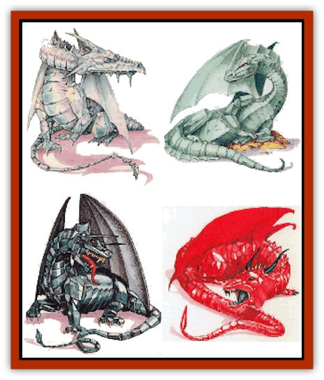

# Dragon - Mystara - General Information

* The "Hit Dice" column lists standard hit dice for a juvenile specimen.
** The percentages listed give an idea of the alignment variations in Mystaran dragons. These are guidelines only; an individual dragon's alignment can be whatever the DM needs it to be for a given adventure. Only the law/chaos part of the alignment is rigid.
&dagger; Mystara's crystalline dragons are quite different from the [[Dragon_Gem_Crystal|crystal dragons]] from other AD&D game worlds. They have their own entry, therefore, in this appendix.
&dagger;&dagger; Like their crystalline cousins, the ruby, jade, and onyx dragons are new species of gem dragons unique to Mystara. Each has a full entry on the upcoming pages. (Cf. also the [[Dragon_Neutral_Jade|Dragon, Neutral, Jade]] page.)
&ddagger; The Monstrous Manual includes a "brown dragon". Mystarans know this creature as the "amber dragon" because its scales, which are normally opaque and brown, become as translucent as amber during key stages of its development (adolescence and extreme age - roughly, the very young and young age categories, plus very old and older). Apart from this variation in appearance, and amber dragons' tendency toward chaotic good alignment, they are practically identical to the brown dragon described in the Monstrous Manual in terms of habitat, combat, and special abilities.(Cf. also the [[Dragon_Neutral_Amber|Dragon, Neutral, Amber]] page.)
**Gem Dragons:** The gem dragons of Mystara differ from those of other AD&D game worlds in one key area: Mystaran dragons lack psionic ability. As far as anyone knows, the pionic species of gem dragons do not exist here.

As mentioned above, Mystara offers four species of gem dragon all its own: crystalline, jade, onyx, and ruby. Like standard gem dragons, these creatures have a smaller chance of causing fear than other dragons. The parenthetical fear save modifiers on the [[Dragon_General_Information|Dragon, General Information]] page's Dragon Table apply.

**Languages:** All of the new Mystaran dragons have a chance of being able to communicate with any intelligent creature. The chance is 15% for hatchlings, and increases 5% per age category of the dragon. In addition, these dragons speak their own languages and the tongue of all gem dragons (and perhaps others, as mentioned in their descriptions).

**Special Attacks and Defenses:** Remember, besides breath weapons and spellcasting, dragons have a whole arsenal of special attacks, ranging from fear to tail slaps. Even the least intelligent dragon is very crafty, and will use all possible attacks and strategies to the best possible benefit.

---
## Discovery & Documentation

**Source Publication:** Unknown Legacy Archive Source
