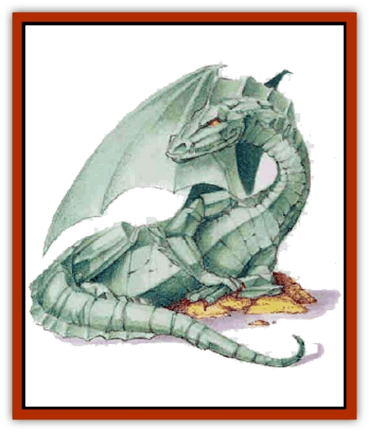

# Dragon - Mystara - Jade

| Statistic | **Dragon (Mystara), Jade** |
| --- | --- |
| **Activity Cycle:** | Any |
| **Alignment:** | Neutral |
| **Armor Class:** | -1 (base) |
| **Climate/Terrain:** | Any wooded region |
| **Damage/Attack:** | 1d8/1d8/2d10 (claw/claw/bite) |
| **Diet:** | Omnivore |
| **Frequency:** | Very rare |
| **Hit Dice:** | 13 (base) |
| **Intelligence:** | Very (11-12) |
| **Magic Resistance:** | Varies |
| **Morale:** | Fanatic (18) |
| **Movement:** | 9, Fl 30 (C), Sw 9 |
| **No. Appearing:** | 1 (1d4+1) |
| **No. of Attacks:** | 3 |
| **Organization:** | Solitary or clan |
| **Size:** | G (base 35') |
| **Special Attacks:** | Varies |
| **Special Defenses:** | Varies |
| **THAC0:** | 7 (base) |
| **Treasure:** | Special |
| **XP Value:** | Varies |

The jade [[Dragon_Mystara_General_Information|dragon]] is among the most conversational and least hostile on the planet Mystara. At a distance of 120 feet or more, it cannot be distinguished from a [[Dragon_Chromatic_Green|green dragon]]. (An expert viewer might notice that the jade dragon is somewhat smaller than its green cousin, more heavyset, with a thicker and shorter tail, however.) At closer range the [[Dragon_General_Information|dragon's]] translucent scales shimmer and sparkle in the light, revealing the mighty reptile�s true nature.

Jade dragons speak their own language and the tongue common to all gem dragons.

**Combat:** The jade dragon's breath weapon is a putrid cloud of gas, swirling brown and yellow and green. It has two effects. The first, identical the green dragon's breath, is a blast of choking chlorine gas. It inflicts damage based on the age of the dragon, as described on the table below; and the damage is reduced by half if a save vs. breath weapon is successful.

The second effect comes into play only if the first saving throw is missed. The victim must make a second saving throw - this time vs. poison - or he will become infected with a rotting disease. A living victim cannot be helped by any healing spell or healing item except a *cure disease* spell. The disease also inflicts 1 point of damage per turn. (Characters cannot be reinfected; that is, if a jade dragon breathes three times, and a character fails all three saving throws, the character still suffers only 1 point of damage per turn until the disease is cured - assuming he survives that long.

This disease also causes all nonmetal items in the victim's possession to rot away (magic items get a save vs. acid) in 1d6 turns unless a *cure disease* spell is cast on them during that time.

**Habitat/Society:** Wooded areas are home to the jade dragon. Jade dragons pride themselves on being cultured, almost urbane creatures. They love to converse philosophically with creatures of all alignments, so as to show off their wisdom (which they, at least, seem to think is prodigious).

In collecting their hoards, jade dragons take a special interest in art objects. They may look favorably upon characters who offer them new artwork, or interesting pieces of information related to pieces that the dragons already possess. Even a hungry jade dragon will be tempted by these prizes.

**Ecology:** The jade dragon is omnivorous. It devours all manner of forest creatures when hunger strikes. It may also eat plants; young saplings and bamboo are its favorite vegetables.

| Age | Body Lgt. (') | Tail Lgt. (') | AC | Breath Weapon | Spells W/P | MR | Treas. Type | XP Value |
| --- | --- | --- | --- | --- | --- | --- | --- | --- |
| 1 Hatchling | 2-6 | 2-4 | 2 | 2d6+1 | Nil | Nil | Nil | 5,000 |
| 2 Very young | 6-14 | 4-12 | 1 | 4d6+2 | Nil | Nil | Nil | 7,000 |
| 3 Young | 14-30 | 12-16 | 0 | 6d6+3 | Nil | Nil | Nil | 10,000 |
| 4 Juvenile | 30-38 | 16-22 | -1 | 8d6+4 | Nil/1 | Nil | I,Z | 13,000 |
| 5 Young adult | 38-48 | 22-28 | -2 | 10d6+5 | 1/1 1 | 30% | H,I,Z | 16,000 |
| 6 Adult | 48-55 | 28-34 | -3 | 12d6+6 | 2/2 1 | 35% | H,I,U,Zx2 | 17,000 |
| 7 Mature adult | 55-66 | 34-40 | -4 | 14d6+7 | 2/2 2 1 | 40% | H,I,Ux2,Zx4 | 19,000 |
| 8 Old | 66-75 | 40-46 | -5 | 16d6+8 | 2 1/3 2 1 | 45% | H,I,Ux4,Zx6 | 20,000 |
| 9 Very old | 75-85 | 46-52 | -6 | 18d6+9 | 2 2/3 3 2 | 50% | H,I,Ux8,Zx8 | 21,000 |
| 10 Venerable | 85-96 | 52-58 | -7 | 20d6+10 | 2 2 1/3 3 2 1 | 55% | H,I,Ux12,Zx10 | 22,000 |
| 11 Wyrm | 96-105 | 58-64 | -8 | 22d6+11 | 2 2 2/4 3 2 2 | 60% | H,I,Ux14,Zx12 | 23,000 |
| 12 Great Wyrm | 105-115 | 64-70 | -9 | 24d6+12 | 2 2 2 1/4 4 3 2 | 65% | H,I,Ux16,Zx12 | 24,000 |

---
## Discovery & Documentation

**Source Publication:** Mystara Appendix (1994)
**Campaign Setting:** Mystara
**Author(s):** John Nephew, Teeuwynn Woodruff, John Terra, Skip Williams

### Other Creatures Found in This Source Book
   * [[Actaeon|Actaeon]]
   * [[Agarat|Agarat]]
   * [[Ash_Crawler|Ash Crawler]]
   * [[Baldandar|Baldandar]]
   * [[Bargda|Bargda]]
   * [[Bhut|Bhut]]
   * [[Bird_Mystara|Bird (Mystara)]]
   * [[Blackball|Blackball]]
   * [[Choker|Choker]]
   * [[Coltpixie|Coltpixie]]
   * [[Crone_of_Chaos|Crone of Chaos]]
   * [[Darkhood|Darkhood]]
   * [[Darkwing|Darkwing]]
   * [[Decapus|Decapus]]
   * [[Deep_Glaurant|Deep Glaurant]]
   * [[Diabolus|Diabolus]]
   * [[Dimensional_Warper|Dimensional Warper]]
   * [[Dragon_Mystara_Crystalline|Dragon (Mystara), Crystalline]]
   * [[Dragon_Mystara_Onyx|Dragon (Mystara), Onyx]]
   * [[Dragon_Mystara_Ruby|Dragon (Mystara), Ruby]]
   * [[Drake_Mystara|Drake (Mystara)]]
   * [[Dragonfly|Dragonfly]]
   * [[Dusanu|Dusanu]]
   * [[Elemental_of_Chaos_Air_Earth|Elemental of Chaos, Air/Earth]]
   * [[Elemental_of_Chaos_Fire_Water|Elemental of Chaos, Fire/Water]]
   * [[Elemental_of_Law_Air_Earth|Elemental of Law, Air/Earth]]
   * [[Elemental_of_Law_Fire_Water|Elemental of Law, Fire/Water]]
   * [[Familiar_Mystara|Familiar (Mystara)]]
   * [[Frost_Salamander|Frost Salamander]]
   * [[Fundamental_Air_Earth|Fundamental, Air/Earth]]
   * [[Fundamental_Fire_Water|Fundamental, Fire/Water]]
   * [[Gargantua_Mystara|Gargantua (Mystara)]]
   * [[Geonid|Geonid]]
   * [[Ghostly_Horde|Ghostly Horde]]
   * [[Giant_Athach|Giant, Athach]]
   * [[Giant_Hephaeston|Giant, Hephaeston]]
   * [[Golem_Drolem|Golem, Drolem]]
   * [[Golem_Mystara_I|Golem (Mystara) I]]
   * [[Golem_Mystara_II|Golem (Mystara) II]]
   * [[Golem_Mystara_III|Golem (Mystara) III]]
   * [[Gray_Philosopher|Gray Philosopher]]
   * [[Guardian_Warrior|Guardian Warrior]]
   * [[Gyerian|Gyerian]]
   * [[Herex|Herex]]
   * [[Hivebrood|Hivebrood]]
   * [[Horde|Horde]]
   * [[Hsiao|Hsiao]]
   * [[Huptzeen|Huptzeen]]
   * [[Hutaakan|Hutaakan]]
   * [[Imp_Mystara|Imp (Mystara)]]
   * [[Jellyfish_Giant_Mystara|Jellyfish, Giant (Mystara)]]
   * [[Kna|Kna]]
   * [[Kopru|Kopru]]
   * [[Lizard_Mystara|Lizard (Mystara)]]
   * [[Lizard-kin_Mystara|Lizard-kin (Mystara)]]
   * [[Lupin|Lupin]]
   * [[Lycanthrope_Werejaguar_Mystara|Lycanthrope, Werejaguar (Mystara)]]
   * [[Lycanthrope_Wereswine|Lycanthrope, Wereswine]]
   * [[Magen|Magen]]
   * [[Manikin|Manikin]]
   * [[Mek|Mek]]
   * [[Mujina|Mujina]]
   * [[Nagpa|Nagpa]]
   * [[Neh-thalggu|Neh-thalggu]]
   * [[Nightshade_Mystara|Nightshade (Mystara)]]
   * [[Nuckalavee|Nuckalavee]]
   * [[Pegataur|Pegataur]]
   * [[Phanaton|Phanaton]]
   * [[Plant_Dangerous_Mystara|Plant, Dangerous (Mystara)]]
   * [[Plasm|Plasm]]
   * [[Rakasta|Rakasta]]
   * [[Rock_Man|Rock Man]]
   * [[Sabreclaw|Sabreclaw]]
   * [[Sacrol|Sacrol]]
   * [[Scamille|Scamille]]
   * [[Shapeshifter|Shapeshifter]]
   * [[Shargugh|Shargugh]]
   * [[Shark-kin|Shark-kin]]
   * [[Sollux|Sollux]]
   * [[Spectral_Death|Spectral Death]]
   * [[Spectral_Hound|Spectral Hound]]
   * [[Spider-kin|Spider-kin]]
   * [[Spirit_Mystara|Spirit (Mystara)]]
   * [[Statue_Living|Statue, Living]]
   * [[Surtaki|Surtaki]]
   * [[Tabi|Tabi]]
   * [[Thoul|Thoul]]
   * [[Thunderhead|Thunderhead]]
   * [[Tiger_Ebon|Tiger, Ebon]]
   * [[Topi|Topi]]
   * [[Tortle|Tortle]]
   * [[Vampire_Velya|Vampire, Velya]]
   * [[White_Fang|White Fang]]
   * [[Worm_Mystara|Worm (Mystara)]]
   * [[Wyrd|Wyrd]]
   * [[Yowler|Yowler]]
   * [[Zombie_Lightning|Zombie, Lightning]]
