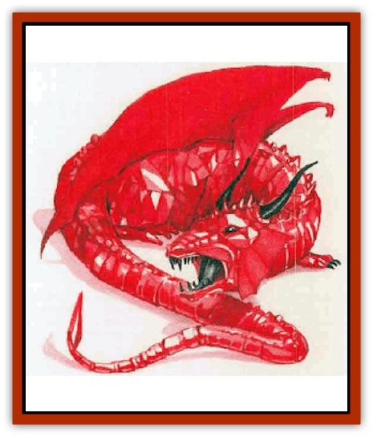

# Dragon - Mystara - Ruby

| Statistic | **Dragon (Mystara), Ruby** |
| --- | --- |
| **Activity Cycle:** | Any |
| **Alignment:** | Lawful neutral |
| **Armor Class:** | 4 (base) |
| **Climate/Terrain:** | Non-arctic hills and mountains, and any subterranean |
| **Damage/Attack:** | 1d8/1d8/3d8 (claw/claw/bite) |
| **Diet:** | Special |
| **Frequency:** | Very rare |
| **Hit Dice:** | 14 (base) |
| **Intelligence:** | Very (11-12) |
| **Magic Resistance:** | Varies |
| **Morale:** | Fanatic (18) |
| **Movement:** | 9, Fl 30 (C), Jump 3 |
| **No. Appearing:** | 1 (1d4+1) |
| **No. of Attacks:** | 3 |
| **Organization:** | Solitary or clan |
| **Size:** | G (48' base) |
| **Special Attacks:** | Varies |
| **Special Defenses:** | Varies |
| **THAC0:** | 7 (base) |
| **Treasure:** | Special |
| **XP Value:** | Vanes |

At a distance of 120 feet or more, the ruby [[Dragon_Mystara_General_Information|dragon]] cannot be distinguished from a [[Dragon_Chromatic_Red|red dragon]]. At closer ranges the [[Dragon_General_Information|dragon's]] scales shimmer, revealing the mighty reptile's true nature.

Ruby dragons speak their own tongue, the language common to all gem dragons, plus Red Dragon.

**Combat:** The ruby dragon's breath weapon appears as a wave of incredible fiery, melting heat. This weapon has two effects. The first is a blast of fire (identical to the red dragon's power). The blast's force increases as the dragon ages; see the table below. Anyone caught in the blast can halve the damage with a successful save vs. breath weapon.

The second effect comes into play only if the first saving throw is missed. The victim must make a second saving throw - this time vs. magical fire - for all nonliving items he is carrying. A failed save means these items start to burn or melt. Paper items are destroyed instantly; leather items in one round; all other nonmetal items in two rounds; nonmagical metal items in three rounds; and magical items of all sorts in four or more rounds. If the item has a bonus ("pluses") add one round to the four-round period for each plus. Items that give immunity or resistance to fire also melt, but in double the normal time. The burning or melting items may be saved if immersed in water before they are destroyed. (Cooling is the key here, not water, so magical remedies such as a *cone of cold* or *ice storm* also halt the damage.) The DM may choose to deduct one or more "pluses" from partly damaged items.

Whatever their age, ruby dragons are completely immune to damage from fire and heat. They delight in frolicking in flows of magma and lava. Their tough jeweled hide also provides solid protection against cold; they receive a +1 bonus on saving throws vs. cold attacks, and -1 points of cold damage per die.

**Habitat/Society:** Ruby dragons exist in the same habitat red dragons favor. However, they are more willing to venture into higher altitude, colder climes, and deep underground.

**Ecology:** Ruby dragons are ravenous carnivores. They also have a great fondness for the most precious of gems, fused in the mightiest of the earth's furnaces. These dragons will attack dwarves gleefully, knowing the little demihumans hoazd the gems these dragons find so delicious.

Characters who find themselves trapped by a ruby dragon have a good chance of buying their freedom by offering to lead the dragon to a cache of gems.

| Age | Body Lgt. (') | Tail Lgt. (') | AC | Breath Weapon | Spells W/P | MR | Treas. Type | XP Value |
| --- | --- | --- | --- | --- | --- | --- | --- | --- |
| 1 Hatchling | 2-11 | 3-12 | 1 | 2d8+1 | Nil | Nil | Nil | 4,000 |
| 2 Very young | 11-21 | 12-21 | 0 | 4d8+2 | Nil | Nil | Nil | 7,000 |
| 3 Young | 21-39 | 21-30 | -2 | 6d8+3 | Nil | Nil | Nil | 9,000 |
| 4 Juvenile | 39-57 | 30-49 | -4 | 8d8+4 | Nil/1 | Nil | E,S,Q | 12,000 |
| 5 Young adult | 57-75 | 49-69 | -5 | 10d8+5 | Nil/2 | 25% | H,S,Q | 15,000 |
| 6 Adult | 75-98 | 69-87 | -6 | 12d8+6 | Nil/2 1 | 30% | H,S,Q | 16,000 |
| 7 Mature adult | 98-111 | 87-107 | -7 | 14d8+7 | Nil/2 1 | 35% | H,S,Qx2 | 17,000 |
| 8 Old | 111-129 | 107-124 | -8 | 16d8+8 | Nil/2 2 | 40% | H,S,Qx2 | 19,000 |
| 9 Very old | 129-145 | 124-144 | -8 | 18d8+9 | Nil/2 2 1 | 45% | H,S,Qx2 | 20,000 |
| 10 Venerable | 145-155 | 144-155 | -9 | 20d8+10 | 1/2 2 2 1 | 50% | H,S,Qx3 | 21,000 |
| 11 Wyrm | 155-163 | 155-162 | -9 | 22d8+11 | 2/2 2 2 2 | 55% | H,S,Qx3 | 22,000 |
| 12 Great Wyrm | 163-171 | 162-171 | -10 | 24d8+12 | 2 1/2 2 2 2 1 | 60% | H,S,Qx3 | 23,000 |

---
## Discovery & Documentation

**Source Publication:** Mystara Appendix (1994)
**Campaign Setting:** Mystara
**Author(s):** John Nephew, Teeuwynn Woodruff, John Terra, Skip Williams

### Other Creatures Found in This Source Book
   * [[Actaeon|Actaeon]]
   * [[Agarat|Agarat]]
   * [[Ash_Crawler|Ash Crawler]]
   * [[Baldandar|Baldandar]]
   * [[Bargda|Bargda]]
   * [[Bhut|Bhut]]
   * [[Bird_Mystara|Bird (Mystara)]]
   * [[Blackball|Blackball]]
   * [[Choker|Choker]]
   * [[Coltpixie|Coltpixie]]
   * [[Crone_of_Chaos|Crone of Chaos]]
   * [[Darkhood|Darkhood]]
   * [[Darkwing|Darkwing]]
   * [[Decapus|Decapus]]
   * [[Deep_Glaurant|Deep Glaurant]]
   * [[Diabolus|Diabolus]]
   * [[Dimensional_Warper|Dimensional Warper]]
   * [[Dragon_Mystara_Crystalline|Dragon (Mystara), Crystalline]]
   * [[Dragon_Mystara_Jade|Dragon (Mystara), Jade]]
   * [[Dragon_Mystara_Onyx|Dragon (Mystara), Onyx]]
   * [[Drake_Mystara|Drake (Mystara)]]
   * [[Dragonfly|Dragonfly]]
   * [[Dusanu|Dusanu]]
   * [[Elemental_of_Chaos_Air_Earth|Elemental of Chaos, Air/Earth]]
   * [[Elemental_of_Chaos_Fire_Water|Elemental of Chaos, Fire/Water]]
   * [[Elemental_of_Law_Air_Earth|Elemental of Law, Air/Earth]]
   * [[Elemental_of_Law_Fire_Water|Elemental of Law, Fire/Water]]
   * [[Familiar_Mystara|Familiar (Mystara)]]
   * [[Frost_Salamander|Frost Salamander]]
   * [[Fundamental_Air_Earth|Fundamental, Air/Earth]]
   * [[Fundamental_Fire_Water|Fundamental, Fire/Water]]
   * [[Gargantua_Mystara|Gargantua (Mystara)]]
   * [[Geonid|Geonid]]
   * [[Ghostly_Horde|Ghostly Horde]]
   * [[Giant_Athach|Giant, Athach]]
   * [[Giant_Hephaeston|Giant, Hephaeston]]
   * [[Golem_Drolem|Golem, Drolem]]
   * [[Golem_Mystara_I|Golem (Mystara) I]]
   * [[Golem_Mystara_II|Golem (Mystara) II]]
   * [[Golem_Mystara_III|Golem (Mystara) III]]
   * [[Gray_Philosopher|Gray Philosopher]]
   * [[Guardian_Warrior|Guardian Warrior]]
   * [[Gyerian|Gyerian]]
   * [[Herex|Herex]]
   * [[Hivebrood|Hivebrood]]
   * [[Horde|Horde]]
   * [[Hsiao|Hsiao]]
   * [[Huptzeen|Huptzeen]]
   * [[Hutaakan|Hutaakan]]
   * [[Imp_Mystara|Imp (Mystara)]]
   * [[Jellyfish_Giant_Mystara|Jellyfish, Giant (Mystara)]]
   * [[Kna|Kna]]
   * [[Kopru|Kopru]]
   * [[Lizard_Mystara|Lizard (Mystara)]]
   * [[Lizard-kin_Mystara|Lizard-kin (Mystara)]]
   * [[Lupin|Lupin]]
   * [[Lycanthrope_Werejaguar_Mystara|Lycanthrope, Werejaguar (Mystara)]]
   * [[Lycanthrope_Wereswine|Lycanthrope, Wereswine]]
   * [[Magen|Magen]]
   * [[Manikin|Manikin]]
   * [[Mek|Mek]]
   * [[Mujina|Mujina]]
   * [[Nagpa|Nagpa]]
   * [[Neh-thalggu|Neh-thalggu]]
   * [[Nightshade_Mystara|Nightshade (Mystara)]]
   * [[Nuckalavee|Nuckalavee]]
   * [[Pegataur|Pegataur]]
   * [[Phanaton|Phanaton]]
   * [[Plant_Dangerous_Mystara|Plant, Dangerous (Mystara)]]
   * [[Plasm|Plasm]]
   * [[Rakasta|Rakasta]]
   * [[Rock_Man|Rock Man]]
   * [[Sabreclaw|Sabreclaw]]
   * [[Sacrol|Sacrol]]
   * [[Scamille|Scamille]]
   * [[Shapeshifter|Shapeshifter]]
   * [[Shargugh|Shargugh]]
   * [[Shark-kin|Shark-kin]]
   * [[Sollux|Sollux]]
   * [[Spectral_Death|Spectral Death]]
   * [[Spectral_Hound|Spectral Hound]]
   * [[Spider-kin|Spider-kin]]
   * [[Spirit_Mystara|Spirit (Mystara)]]
   * [[Statue_Living|Statue, Living]]
   * [[Surtaki|Surtaki]]
   * [[Tabi|Tabi]]
   * [[Thoul|Thoul]]
   * [[Thunderhead|Thunderhead]]
   * [[Tiger_Ebon|Tiger, Ebon]]
   * [[Topi|Topi]]
   * [[Tortle|Tortle]]
   * [[Vampire_Velya|Vampire, Velya]]
   * [[White_Fang|White Fang]]
   * [[Worm_Mystara|Worm (Mystara)]]
   * [[Wyrd|Wyrd]]
   * [[Yowler|Yowler]]
   * [[Zombie_Lightning|Zombie, Lightning]]
