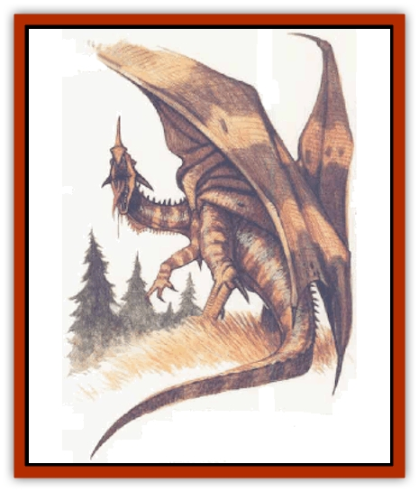

# Dragon - Neutral - Amber

| Statistic | **Dragon, Neutral, Amber** |
| --- | --- |
| **Activity Cycle:** | Any |
| **Alignment:** | Neutral |
| **Armor Class:** | 3 (base) |
| **Climate/Terrain:** | Any/Coniferous forest |
| **Damage/Attack:** | 1d6(&times;2)/3d8 |
| **Diet:** | Herbivore (tree sap) |
| **Frequency:** | Very rare |
| **Hit Dice:** | 8 (base) |
| **Intelligence:** | Exceptional (15-16) |
| **Magic Resistance:** | See below |
| **Morale:** | Fanatic (17-18) |
| **Movement:** | 9, Fl 21 (C) |
| **No. Appearing:** | 1 |
| **No. of Attacks:** | 3 + special |
| **Organization:** | Solitary |
| **Size:** | H to G (20' base length) |
| **Special Attacks:** | Breath weapon, spells, special |
| **Special Defenses:** | Spells, special |
| **THAC0:** | 13 (base) |
| **Treasure:** | Incidental |
| **XP Value:** | See below |

Amber [[Dragon_General_Information|dragons]] are perhaps the most solitary and aloof of all the neutral dragons, preferring to wander throughout the heavily forested regions that they call home. Although not unfriendly, these dragons are so closely attuned to their natural surroundings that their moods often reflect the capricious nature of the elements.

Amber dragons possess a thick, bark-like skin that ranges from dull gray to dark brown. Their eyes are the color of rich amber, and they have a long (1-foot) homed prow. In addition, an amber dragon's feet end in sharp, scythe-like claws.

These dragons speak their own language as well as various druidic tongues. They can communicate telepathically with druids and other forest-dwelling creatures, such as [[Elf|elves]], [[Gnome|gnomes]], [[Sprite|sprites]], and [[Brownie|brownies]].

**Combat:** The amber dragon is relatively small, so opponents have a +4 bonus to saving throws against its fear aura. Their cartilaginous teeth are not well-formed for biting; instead amber dragons thrust with their beak-like prow. Amber dragons avoid combat whenever possible, but can employ two scythe-like claw attacks and a prow attack if forced into melee. Though smaller and weaker than their more common relatives, they enjoy good spellcasting ability, being able to cast all spells normally cast by druids.

**Breath Weapon/Special Abilities:** An amber dragon is able to breathe a spray of scalding, sticky sap. The scalding sap sprays out in a cone 1 foot wide at the base, 30 feet long, and 50 feet wide at the terminus. The sap's effect is to soak the amber dragon's opponent, who will find that the sap hardens rapidly (in 1d4 rounds) into an immobilizing resin shell. Characters who successfully save vs. breath weapon can shatter the resin shell on a successful Strength check. Those failing their check are solidly encased; only one chance is allowed thereafter, using the bend bars roll at -15% to shatter the hard resin shell and escape.

The amber dragon has the innate ability to magnetize an opponent up to three times per day. An individual failing a saving throw vs. breath weapon is magnetized for 3d4 rounds (half this time, rounded down, if the saving how is made). A magnetized individual cannot with accuracy hurl, cast, sling, or shoot weapons that have any metal parts (daggers, axes, arrows with netal heads, etc.) In addition, magnetized individuals wearing metal armor have their Armor Class worsened by 1 and suffer a -2 penalty to all attack rolls, as the metal of their armor binds. Other situational effects may occur, for example, if a floor is metal, the character may be *slowed*.

The amber dragon of at least *young adult* age can *shape change* like a 7th-level druid three times a day. In addition, they have the innate ability to *blink*, as the 3rd-level wizard spell, once for every two age categories (round down)

**Habitat/Society:** Amber dragons dwell alone in large, primeval coniferous forests. They make no permanent lair, but range throughout the thickly carpeted expanse of their forest - often an area as large as 900 square miles. Unlike most other dragons, these creatures regard gold and other metallic treasures with disdain. They do not hoard material objects, thus any treasure found with an amber dragon is purely incidental.

Amber dragons are not exactly territorial, though they have been known to quickly dispatch creatures who enter a forest's depths with hostile intent. However, the amber dragon is in no way a "defender of the forest". Rather, these creatures are a force of nature, as many of their abilities stem from their close connection to the natural world.

This attunement to nature influences their reactions to other species. An amber dragon's personality is as mercurial as the shifting winds; they can be as gentle as a spring breeze, or as violent as a summer lightning storm. Though they share similar abilities and philosophies with druids, amber dragons merely tolerate the presence of these prieste; an alliance between a druid and an amber dragon is by no means an automatic, or even common, occurrence.

**Ecology:** Amber dragons subsist by drinking the thick sap of coniferous trees. They extract the sap by plunging their horned prow beneath the bark of a tree. Druids and rangers famliar with amber dragons can detect their presence by the distinctive triangular mark they leave.

| Age | Body Lgt. (') | Tail Lgt. (') | AC | Breath Weapon | Spells D | MR | Treas. Type | XP Value |
| --- | --- | --- | --- | --- | --- | --- | --- | --- |
| 1 Hatchling | 2-6 | 1-5 | 6 | 1d4+2 | 1 | Nil | Nil | 8,000 |
| 2 Very young | 7-12 | 6-11 | 5 | 2d4+3 | 1 1 | Nil | Nil | 9,000 |
| 3 Young | 13-18 | 11-15 | 4 | 3d4+4 | 2 1 1 | 5% | D | 10,000 |
| 4 Juvenile | 19-24 | 16-21 | 3 | 4d4+5 | 2 2 1 1 | 10% | E | 12,000 |
| 5 Young adult | 25-30 | 22-27 | 2 | 5d4+6 | 2 2 2 1 1 | 15% | E,H | 14,000 |
| 6 Adult | 31-36 | 28-32 | 1 | 6d4+7 | 3 2 2 2 1 1 | 20% | H,I | 15,000 |
| 7 Mature adult | 37-43 | 33-38 | 0 | 7d4+8 | 3 3 2 2 2 1 1 | 25% | H,I | 16,000 |
| 8 Old | 44-50 | 39-45 | -1 | 8d4+9 | 3 3 3 2 2 2 1 1 | 30% | H,Ix2 | 17,000 |
| 9 Very old | 51-56 | 46-51 | -2 | 9d4+10 | 4 3 3 3 2 2 2 2 1 | 40% | H,Ix3,R | 18,000 |
| 10 Venerable | 57-62 | 52-56 | -3 | 10d4+11 | 4 4 3 3 3 2 2 2 2 1 | 50% | H,Ix4,R | 19,000 |
| 11 Wyrm | 63-68 | 57-62 | -4 | 11d4+12 | 4 4 4 3 3 3 2 2 2 2 1 | 60% | H,Ix4,R | 20,000 |
| 12 Great Wyrm | 69-73 | 63-66 | -5 | 12d4+13 | 5 4 4 4 3 3 3 2 2 2 1 | 70% | H,Ix4,R,U | 21,000 |

---
## Discovery & Documentation

**Source Publication:** Monstrous Compendium, 1996 Annual, Volume 3 (1995)
**Campaign Setting:** Advanced Dungeons & Dragons 2nd Edition
**Author(s):** Jon Pickens

### Other Creatures Found in This Source Book
   * [[Alaghi|Alaghi]]
   * [[Alhoon|Alhoon]]
   * [[Aranea_Savage_Coast|Aranea (Savage Coast)]]
   * [[Arcane_Head|Arcane Head]]
   * [[Banedead|Banedead]]
   * [[Banelich|Banelich]]
   * [[Bat_Bonebat|Bat, Bonebat]]
   * [[Beetle|Beetle]]
   * [[Belgoi|Belgoi]]
   * [[Bladeling|Bladeling]]
   * [[Braxat|Braxat]]
   * [[Bunyip|Bunyip]]
   * [[Burbur|Burbur]]
   * [[Bvanen|Bvanen]]
   * [[Cat_Great_Snow_Tiger|Cat, Great, Snow Tiger]]
   * [[Chosen_One|Chosen One]]
   * [[Chronovoid|Chronovoid]]
   * [[Cildabrin|Cildabrin]]
   * [[Coffer_Corpse|Coffer Corpse]]
   * [[Disenchanter|Disenchanter]]
   * [[Dog_Temporal|Dog, Temporal]]
   * [[Dragon_Cerilia|Dragon (Cerilia)]]
   * [[Dragon_Ghost|Dragon, Ghost]]
   * [[Dragon_Lesser_Undead|Dragon, Lesser Undead]]
   * [[Dread_Warrior|Dread Warrior]]
   * [[Dreamweaver|Dreamweaver]]
   * [[Dream_Spawn_Greater_Ennui|Dream Spawn, Greater, Ennui]]
   * [[Dream_Spawn_Lesser_Morph|Dream Spawn, Lesser, Morph]]
   * [[Dwarf_Arctic|Dwarf, Arctic]]
   * [[Dwarf_Urdunnir|Dwarf, Urdunnir]]
   * [[Eel_Giant_Moray|Eel, Giant Moray]]
   * [[Elemental_Fire_Kin_Tome_Guardian|Elemental, Fire Kin, Tome Guardian]]
   * [[Elf_Rockseer|Elf, Rockseer]]
   * [[Ethyk|Ethyk]]
   * [[Faerie_Faerie_Fiddler|Faerie, Faerie Fiddler]]
   * [[Faerie_Petty_Bramble|Faerie, Petty, Bramble]]
   * [[Faerie_Petty_Gorse|Faerie, Petty, Gorse]]
   * [[Faerie_Petty|Faerie, Petty]]
   * [[Firenewt|Firenewt]]
   * [[Formian|Formian]]
   * [[Gargoyle_II|Gargoyle II]]
   * [[Giant_Cerilia|Giant (Cerilia)]]
   * [[Goblin_Cerilia|Goblin (Cerilia)]]
   * [[Golem_Magic|Golem, Magic]]
   * [[Golem_Shaboath|Golem, Shaboath]]
   * [[Hag_Bheur|Hag, Bheur]]
   * [[Hamadryad|Hamadryad]]
   * [[Hound_of_Ill-Omen|Hound of Ill-Omen]]
   * [[Human_Cerilia|Human (Cerilia)]]
   * [[Hybsil|Hybsil]]
   * [[Ibrandlin|Ibrandlin]]
   * [[Imp_Chaos|Imp, Chaos]]
   * [[Ixitxachitl_Ixzan|Ixitxachitl, Ixzan]]
   * [[Jabberwock|Jabberwock]]
   * [[Kyton|Kyton]]
   * [[Kyuss_Son_of|Kyuss, Son of]]
   * [[Lillend|Lillend]]
   * [[Life-Shaped_Creation_Guardian|Life-Shaped Creation, Guardian]]
   * [[Life-Shaped_Creation_Transport|Life-Shaped Creation, Transport]]
   * [[Lycanthrope_Werecrocodile|Lycanthrope, Werecrocodile]]
   * [[Lycanthrope_Werespider|Lycanthrope, Werespider]]
   * [[Magedoom|Magedoom]]
   * [[Manotaur|Manotaur]]
   * [[Mastiff_Shadow|Mastiff, Shadow]]
   * [[Meazel|Meazel]]
   * [[Mist_Scarlet_Dancer|Mist, Scarlet Dancer]]
   * [[Needleman|Needleman]]
   * [[Orc_Neo-Orog|Orc, Neo-Orog]]
   * [[Orc_Ondonti|Orc, Ondonti]]
   * [[Owlbear_II|Owlbear II]]
   * [[Pegataur|Pegataur]]
   * [[Phaerimm|Phaerimm]]
   * [[Reggelid|Reggelid]]
   * [[Render|Render]]
   * [[Saurial|Saurial]]
   * [[Scalamagdrion|Scalamagdrion]]
   * [[Sharn|Sharn]]
   * [[Snake_Messenger|Snake, Messenger]]
   * [[Spirit_Forest_Uthraki|Spirit, Forest, Uthraki]]
   * [[Spirit_Forest_Wood_Man|Spirit, Forest, Wood Man]]
   * [[Spirit_Ice_Orglash|Spirit, Ice, Orglash]]
   * [[Spirit_Rock_Thomil|Spirit, Rock, Thomil]]
   * [[Strider_Giant|Strider, Giant]]
   * [[Tembo|Tembo]]
   * [[Temporal_Glider|Temporal Glider]]
   * [[Temporal_Stalker|Temporal Stalker]]
   * [[Tether_Beast|Tether Beast]]
   * [[Thessalmonster|Thessalmonster]]
   * [[Time_Dimensional|Time Dimensional]]
   * [[Tomb_Tapper|Tomb Tapper]]
   * [[Undead_Dragon_Slayer|Undead Dragon Slayer]]
   * [[Unicorn_Black_Toril|Unicorn, Black (Toril)]]
   * [[Vaath|Vaath]]
   * [[Vortex_Spider|Vortex Spider]]
   * [[Weredragon|Weredragon]]
   * [[Zhentarim_Spirit|Zhentarim Spirit]]
