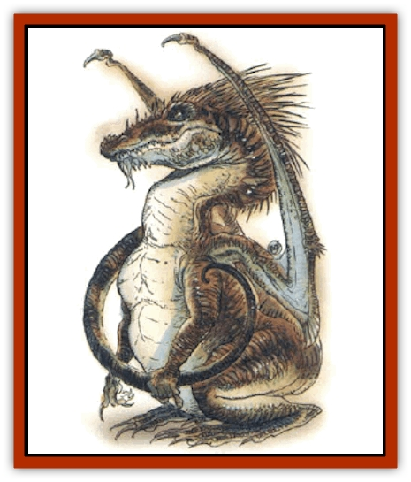

# Dragon - Neutral - Jacinth

| Statistic | **Dragon, Neutral, Jacinth** |
| --- | --- |
| **Activity Cycle:** | Any |
| **Alignment:** | Neutral |
| **Armor Class:** | 1 (base) |
| **Climate/Terrain:** | Any/Desert |
| **Damage/Attack:** | 1d6+1(&times;2)/4d6 |
| **Diet:** | Special |
| **Frequency:** | Very rare |
| **Hit Dice:** | 9 (base) |
| **Intelligence:** | Genius (17-18) |
| **Magic Resistance:** | See below |
| **Morale:** | Fanatic (17-18) |
| **Movement:** | 9, F1 27 (B) |
| **No. Appearing:** | 1 |
| **No. of Attacks:** | 3 + special |
| **Organization:** | Solitary |
| **Size:** | H-G (16' base length) |
| **Special Attacks:** | Spells, breathe weapon, special |
| **Special Defenses:** | Spells, special |
| **THAC0:** | 13 (base) |
| **Treasure:** | See below |
| **XP Value:** | See below |

Jacinth [[Dragon_General_Information|dragons]] may be the rarest of any nonunique dragon species; only a dozen at most exist on any given world.

The hide of a jacinth sparkles and shifts with many shades of flame-bright orange in seemingly constant motion.

Jacinth dragons speak their own language, and they can communicate telepathically with any other creature having that ability, as well as creatures with Intelligences of 18 or higher.

**Combat:** The jacinth would prefer to rely upon its breath weapon and magical abilities in battle, but it can employ two claw attacks and a bite if forced into close combat. Although it is smaller than most other dragons, this specimen enjoys superior magical abilities - casting both wizard and priest spells - making it more than a match for most adversaries.

**Breath Weapon/Special Abilities:** A jacinth dragon breathes a cone of scalding air 1 foot wide at the mouth, 50 feet long, and 20 feet wide at its terminus, igniting easily combustible materials (e.g., paper, oil, and cloth) unless they successfully save vs. normal fire. A successful save vs. breath weapon indicates, as with most dragons, that a character suffers only half damage from such an attack.

Using riddling talk and personal charm, jacinths can entrance those who are not involved in combat or otherwise distracted. Anyone within 90 feet who listens to a jacinth has a 10%. cumulative chance per round to become affected as by a *suggestion* spell. A successful save vs. spell indicates that the character can resist the charm for at least six rounds, after which there's a 5% cumulative chance to be charmed. Those who successfully save twice can't be charmed by that dragon.

Furthermore, the jacinth dragon has the innate ability to interplay the shades of its skin so as to have a hypnotic effect on viewers. Thus, after three rounds of a peaceful encounters the dragon can attack with a +3 bonus to surprise rolls if necessary. In addition, the hide reflects sunlight so brightly that any creature who gazes for more than two rounds upon the dragon on a particularly sunny day is blinded for 5d6 rounds unless the victim rolls a successful saving throw vs. spell.

Due to its relatively small size, the fear aura of a neutral dragon allows a +4 bonus to opponents' saving throws. Also, neutrals cannot polymorph themselves unless they carry the spell of the same name. However, they do have the innate ability to *blink* six times per day (as a 10th-level caster).

**Habitat/Society:** Jacinth dragons make their homes in large deserts, enjoying the hot, dry climate. Over the years, this species has developed the ability to go for weeks without water or food. They shun all other forms of life and enjoy their solitude, though they can at time be overly curious of visitors.

Like all dragons, jacinths have a passion for treasure, especially for the stone after which they are named. Hence, they venture out to obtain what little treasure they have, and it is by these excursions that they are known to humans.

**Ecology:** No jacinth dragon hides have ever been taken or sold. The only creatures known to prey upon them are adventurers.

| Age | Body Lgt. (') | Tail Lgt. (') | AC | Breath Weapon | Spells W/P | MR | Treas. Type | XP Value |
| --- | --- | --- | --- | --- | --- | --- | --- | --- |
| 1 Hatchling | 1-4 | 1-4 | 4 | 2d4 | Nil | Nil | Nil | 7,000 |
| 2 Very young | 5-8 | 5-7 | 3 | 3d4 | 2/1 | Nil | Nil | 8,000 |
| 3 Young | 9-14 | 8-10 | 2 | 4d4 | 2 2/2 | Nil | Nil | 9,000 |
| 4 Juvenile | 15-18 | 11-13 | 1 | 5d4 | 2 2 2/2 1 | Nil | E,T | 11,000 |
| 5 Young adult | 19-20 | 14-16 | 0 | 6d4 | 2 2 2 2/2 2 | 15% | H,R,T | 14,000 |
| 6 Adult | 21-22 | 17-19 | -1 | 7d4 | 2 2 2 2 2/2 2 1 | 20% | H,R,Tx2 | 15,000 |
| 7 Mature adult | 23-26 | 20-22 | -2 | 8d4 | 2 2 2 2 2 2/2 2 2 | 25% | H,R,Tx2 | 16,000 |
| 8 Old | 27-28 | 23-25 | -3 | 9d4 | 2 2 2 2 2 2 2/2 2 2 1 | 30% | H,I,R,Tx3 | 17,000 |
| 9 Very old | 29-30 | 26-28 | -4 | 10d4 | 3 3 2 2 2 2 2/2 2 2 2 | 35% | H,I,R,Tx4 | 18,000 |
| 10 Venerable | 31-32 | 29-31 | -5 | 11d4 | 3 3 3 3 2 2 2/2 2 2 2 1 | 40% | H,Ix2,R,Tx4 | 19,000 |
| 11 Wyrm | 33-34 | 32-34 | -6 | 12d4 | 3 3 3 3 3 3 2/2 2 2 2 2 | 45% | H,Ix2,R,Tx4 | 20,000 |
| 12 Great Wyrm | 35-36 | 35-37 | -7 | 13d4 | 4 4 3 3 3 3 2/3 3 3 2 2 | 50% | H,Ix3,R,Tx5 | 21,000 |

---
## Discovery & Documentation

**Source Publication:** Monstrous Compendium, 1994 Annual, Volume 1 (1995)
**Campaign Setting:** Advanced Dungeons & Dragons 2nd Edition
**Author(s):** David Wise

### Other Creatures Found in This Source Book
   * [[Abyss_Ant|Abyss Ant]]
   * [[Achaierai|Achaierai]]
   * [[Afanc|Afanc]]
   * [[Al-Jahar|Al-Jahar]]
   * [[Baelnorn|Baelnorn]]
   * [[Baneguard|Baneguard]]
   * [[Banelar|Banelar]]
   * [[Bird_Talking|Bird, Talking]]
   * [[Blazing_Bones|Blazing Bones]]
   * [[Campestri|Campestri]]
   * [[Caniquine|Caniquine]]
   * [[Cat_Winged|Cat, Winged]]
   * [[Crypt_Servant|Crypt Servant]]
   * [[Death's_Head_Tree|Death's Head Tree]]
   * [[Dog_Saluqi|Dog, Saluqi]]
   * [[Dragon_Electrum|Dragon, Electrum]]
   * [[Dragon_Fang|Dragon, Fang]]
   * [[Dragon_Linnorm_Corpse_Tearer|Dragon, Linnorm, Corpse Tearer]]
   * [[Dragon_Linnorm_Dread|Dragon, Linnorm, Dread]]
   * [[Dragon_Linnorm_Flame|Dragon, Linnorm, Flame]]
   * [[Dragon_Linnorm_Forest|Dragon, Linnorm, Forest]]
   * [[Dragon_Linnorm_Frost|Dragon, Linnorm, Frost]]
   * [[Dragon_Linnorm_Gray|Dragon, Linnorm, Gray]]
   * [[Dragon_Linnorm_Land|Dragon, Linnorm, Land]]
   * [[Dragon_Linnorm_Midgard|Dragon, Linnorm, Midgard]]
   * [[Dragon_Linnorm_Rain|Dragon, Linnorm, Rain]]
   * [[Dragon_Linnorm_Sea|Dragon, Linnorm, Sea]]
   * [[Dragon_Neutral_Jade|Dragon, Neutral, Jade]]
   * [[Dragon_Neutral_Pearl|Dragon, Neutral, Pearl]]
   * [[Dread|Dread]]
   * [[Dragon-kin|Dragon-kin]]
   * [[Elemental_Earth_Kin_Chrysmal|Elemental, Earth Kin, Chrysmal]]
   * [[Elemental_Earth_Kin_Earth_Weird|Elemental, Earth Kin, Earth Weird]]
   * [[Elemental_Fire_Kin_Azer|Elemental, Fire Kin, Azer]]
   * [[Elemental_Sandman|Elemental, Sandman]]
   * [[Elemental_Wind_Walker|Elemental, Wind Walker]]
   * [[Elemental_Vermin|Elemental Vermin]]
   * [[Feystag|Feystag]]
   * [[Flame_Skull|Flame Skull]]
   * [[Foulwing|Foulwing]]
   * [[Gambado|Gambado]]
   * [[Garbug|Garbug]]
   * [[Genie_Tasked_Administrator|Genie, Tasked, Administrator]]
   * [[Genie_Tasked_Deceiver|Genie, Tasked, Deceiver]]
   * [[Genie_Tasked_Harim_Servant|Genie, Tasked, Harim Servant]]
   * [[Genie_Tasked_Messenger|Genie, Tasked, Messenger]]
   * [[Genie_Tasked_Miner|Genie, Tasked, Miner]]
   * [[Genie_Tasked_Oathbinder|Genie, Tasked, Oathbinder]]
   * [[Gibbering_Mouther|Gibbering Mouther]]
   * [[Gnasher|Gnasher]]
   * [[Gnasher_Winged|Gnasher, Winged]]
   * [[Golem_Brain|Golem, Brain]]
   * [[Golem_Hammer|Golem, Hammer]]
   * [[Golem_Metagolem|Golem, Metagolem]]
   * [[Golem_Spiderstone|Golem, Spiderstone]]
   * [[Gorynych|Gorynych]]
   * [[Greelox|Greelox]]
   * [[Helmed_Horror|Helmed Horror]]
   * [[Jarbo|Jarbo]]
   * [[Laraken|Laraken]]
   * [[Lich_Psionic|Lich, Psionic]]
   * [[Living_Steel|Living Steel]]
   * [[Lock_Lurker|Lock Lurker]]
   * [[Loxo|Loxo]]
   * [[Lycanthrope_Loup_de_Noir|Lycanthrope, Loup de Noir]]
   * [[Lycanthrope_Werebadger|Lycanthrope, Werebadger]]
   * [[Lycanthrope_Werejaguar|Lycanthrope, Werejaguar]]
   * [[Lythlyx|Lythlyx]]
   * [[Magebane|Magebane]]
   * [[Marrashi|Marrashi]]
   * [[Metalmaster|Metalmaster]]
   * [[Mimic_House_Hunter|Mimic, House Hunter]]
   * [[Naga_Bone|Naga, Bone]]
   * [[Nautilus_Giant|Nautilus, Giant]]
   * [[Nightshade_Toril|Nightshade (Toril)]]
   * [[Nishruu|Nishruu]]
   * [[Noran|Noran]]
   * [[Opinicus|Opinicus]]
   * [[Ormyrr|Ormyrr]]
   * [[Parasite|Parasite]]
   * [[Pasari-Niml|Pasari-Niml]]
   * [[Plant_Vampire_Moss|Plant, Vampire Moss]]
   * [[Pteraman|Pteraman]]
   * [[Rautym|Rautym]]
   * [[Shadeling|Shadeling]]
   * [[Skum|Skum]]
   * [[Snake_Giant_Cobra|Snake, Giant Cobra]]
   * [[Snake_Stone|Snake, Stone]]
   * [[Spectral_Wizard|Spectral Wizard]]
   * [[Spell_Weaver|Spell Weaver]]
   * [[Spider_Brain|Spider, Brain]]
   * [[Suwyze|Suwyze]]
   * [[Tatalla|Tatalla]]
   * [[Tick_Heart|Tick, Heart]]
   * [[Tree_Dark|Tree, Dark]]
   * [[Tree_Singing|Tree, Singing]]
   * [[Tressym|Tressym]]
   * [[Troll_Snow|Troll, Snow]]
   * [[Tuyewera|Tuyewera]]
   * [[Ulitharid|Ulitharid]]
   * [[Undead_Dwarf|Undead Dwarf]]
   * [[Undead_Lake_Monster|Undead Lake Monster]]
   * [[Whipsting|Whipsting]]
   * [[Windghost|Windghost]]
   * [[Wolf_Dread|Wolf, Dread]]
   * [[Wolf_Stone|Wolf, Stone]]
   * [[Wolf_Vampiric|Wolf, Vampiric]]
   * [[Wraith_Shimmering|Wraith, Shimmering]]
   * [[Xantravar|Xantravar]]
   * [[Xaver|Xaver]]
