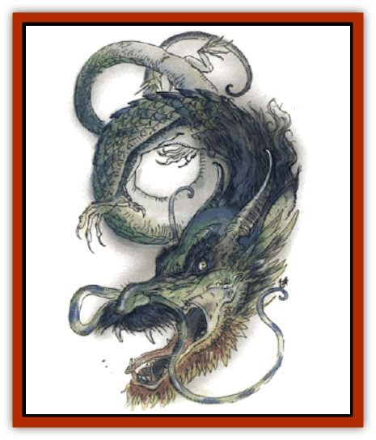

# Dragon - Neutral - Jade

| Statistic | **Dragon, Neutral, Jade** |
| --- | --- |
| **Activity Cycle:** | Any |
| **Alignment:** | Neutral |
| **Armor Class:** | 0 (base) |
| **Climate/Terrain:** | Temperate/Oriental forests |
| **Damage/Attack:** | 1d6(&times;2)/5d4 |
| **Diet:** | Omnivore |
| **Frequency:** | Very rare |
| **Hit Dice:** | 7 (base) |
| **Intelligence:** | Genius (17-18) |
| **Magic Resistance:** | See below |
| **Morale:** | Fanatic (17-18) |
| **Movement:** | 9, Fl 24 (B) |
| **No. Appearing:** | 1d3 |
| **No. of Attacks:** | 3 + special |
| **Organization:** | Solitary or clan |
| **Size:** | H-G (18' base length) |
| **Special Attacks:** | Breath weapon, spells, special |
| **Special Defenses:** | Spells, special |
| **THAC0:** | 13 (base) |
| **Treasure:** | See below |
| **XP Value:** | See below |

The jade [[Dragon_General_Information|dragon]] is the [[Dragon_Mystara_Jade|Oriental cousin]] to the [[Dragon_Gem_Emerald|emerald dragon]] of the western world. This dragon is usually cosidered mythical by humans and is sought by only a few adventurous thrill seekers. Slightly more powerful than its western cousin, this creature looks the same as other [[Dragon_Oriental_Lung_General_Information|Oriental dragons]], except that it has wings with which to fly. The hide of a jade dragon is made up of several different shades of green, swirled about in a random pattern.

Jade dragons speak their own language, and they can communicate telepathically with any other creature having that ability, as well as creatures with Intelligences of 18 or higher.

**Combat:** Jade dragons use their breath weapons and magical abilities to defend themselves if possible, but they can also employ two claw attacks and a bite if forced into melee. Although they are smaller and weaker than their more common relative, they enjoy excellent spellcasting abilities, possessing both wizard and priest spells.

**Breath Weapon/Special Abilities:** A jade dragon is able to breathe a powerful sonic wail. All those within a 90-foot radius suffer damage and must successfully save vs. Breath weapon or be deafened for 1d6 x 10 rounds. Even if the save is successful, the victim is deafened for 2d6 rounds. In addition, all victims must make a successful system shock check in order to avoid being knocked unconscious for 5d4 rounds.

Using riddling talk and personal charm, jade dragons can entrance those who are not involved in combat or otherwise distracted. Anyone within 90 feet who listens to a jade has a 10% cumulative chance per round to become affected as by a *suggestion* spell. A successful save vs. spell indicates that the character can resist the charm for at least six rounds, after which there's a 5% cumulative chance to be charmed. Those who successfully save twice can't be charmed by that dragon. Due to its relatively small size, the fear aura of a neutral dragon allows a +4 bonus to opponents' saving throws. Also, neutrals cannot polymorph themselves unless they carry the spell of the same name. However, they do have the innate ability to *blink* six times per day (as a 10th-level caster).

**Habitat/Society:** Jade dragons make their lairs in dense forests, as they are avid collectors of rare woods. Like other neutral dragons, they are extremely reclusive creatures, preferring remote lairs, and they aren't very hospitable to unexpected visitors. They love treasure, especially jade, and will bargain for precious and semiprecious stones.

**Ecology:** Jades live entirely on forest vegetation and animal life, and will not eat humans. No jade dragon hide has ever been sold, so its value is unknown. The few jade dragons that have been seen were reported to be exquisitely beautiful, and there are many who would pay great sums to acquire such a hide.

| Age | Body Lgt. (') | Tail Lgt. (') | AC | Breath Weapon | Spells W/P | MR | Treas. Type | XP Value |
| --- | --- | --- | --- | --- | --- | --- | --- | --- |
| 1 Hatchling | 2-5 | 1-4 | 3 | 1d6+1 | Nil | Nil | Nil | 7,000 |
| 2 Very young | 6-10 | 5-8 | 2 | 2d6+2 | Nil | Nil | Nil | 8,000 |
| 3 Young | 11-15 | 9-12 | 1 | 3d6+3 | 2/1 | Nil | D | 9,000 |
| 4 Juvenile | 16-20 | 13-16 | 0 | 4d6+4 | 2 2/2 | 5% | E | 11,000 |
| 5 Young adult | 21-25 | 17-20 | -1 | 5d6+5 | 2 2 2/2 1 | 10% | H | 13,000 |
| 6 Adult | 26-30 | 21-24 | -2 | 6d6+6 | 2 2 2 2/2 2 | 15% | H,I | 14,000 |
| 7 Mature adult | 31-35 | 25-28 | -3 | 7d6+7 | 2 2 2 2 2/2 2 1 | 20% | H,I | 15,000 |
| 8 Old | 36-40 | 29-32 | -4 | 8d6+8 | 2 2 2 2 2 2/2 2 2 | 25% | H,Ix2 | 16,000 |
| 9 Very old | 41-45 | 33-36 | -5 | 9d6+9 | 2 2 2 2 2 2 2/2 2 2 1 | 30% | H,Ix2 | 17,000 |
| 10 Venerable | 46-50 | 37-40 | -6 | 10d6+10 | 3 3 2 2 2 2 2/2 2 2 2 | 35% | H,Ix2,R | 18,000 |
| 11 Wyrm | 51-55 | 41-44 | -7 | 11d6+11 | 3 3 3 3 2 2 2/2 2 2 2 1 | 45% | H,Ix2,R | 19,000 |
| 12 Great Wyrm | 56-60 | 45-48 | -8 | 12d6+12 | 3 3 3 3 3 3 2/2 2 2 2 2 | 55% | H,Ix3,R,U | 20,000 |

---
## Discovery & Documentation

**Source Publication:** Monstrous Compendium, 1994 Annual, Volume 1 (1995)
**Campaign Setting:** Advanced Dungeons & Dragons 2nd Edition
**Author(s):** David Wise

### Other Creatures Found in This Source Book
   * [[Abyss_Ant|Abyss Ant]]
   * [[Achaierai|Achaierai]]
   * [[Afanc|Afanc]]
   * [[Al-Jahar|Al-Jahar]]
   * [[Baelnorn|Baelnorn]]
   * [[Baneguard|Baneguard]]
   * [[Banelar|Banelar]]
   * [[Bird_Talking|Bird, Talking]]
   * [[Blazing_Bones|Blazing Bones]]
   * [[Campestri|Campestri]]
   * [[Caniquine|Caniquine]]
   * [[Cat_Winged|Cat, Winged]]
   * [[Crypt_Servant|Crypt Servant]]
   * [[Death's_Head_Tree|Death's Head Tree]]
   * [[Dog_Saluqi|Dog, Saluqi]]
   * [[Dragon_Electrum|Dragon, Electrum]]
   * [[Dragon_Fang|Dragon, Fang]]
   * [[Dragon_Linnorm_Corpse_Tearer|Dragon, Linnorm, Corpse Tearer]]
   * [[Dragon_Linnorm_Dread|Dragon, Linnorm, Dread]]
   * [[Dragon_Linnorm_Flame|Dragon, Linnorm, Flame]]
   * [[Dragon_Linnorm_Forest|Dragon, Linnorm, Forest]]
   * [[Dragon_Linnorm_Frost|Dragon, Linnorm, Frost]]
   * [[Dragon_Linnorm_Gray|Dragon, Linnorm, Gray]]
   * [[Dragon_Linnorm_Land|Dragon, Linnorm, Land]]
   * [[Dragon_Linnorm_Midgard|Dragon, Linnorm, Midgard]]
   * [[Dragon_Linnorm_Rain|Dragon, Linnorm, Rain]]
   * [[Dragon_Linnorm_Sea|Dragon, Linnorm, Sea]]
   * [[Dragon_Neutral_Jacinth|Dragon, Neutral, Jacinth]]
   * [[Dragon_Neutral_Pearl|Dragon, Neutral, Pearl]]
   * [[Dread|Dread]]
   * [[Dragon-kin|Dragon-kin]]
   * [[Elemental_Earth_Kin_Chrysmal|Elemental, Earth Kin, Chrysmal]]
   * [[Elemental_Earth_Kin_Earth_Weird|Elemental, Earth Kin, Earth Weird]]
   * [[Elemental_Fire_Kin_Azer|Elemental, Fire Kin, Azer]]
   * [[Elemental_Sandman|Elemental, Sandman]]
   * [[Elemental_Wind_Walker|Elemental, Wind Walker]]
   * [[Elemental_Vermin|Elemental Vermin]]
   * [[Feystag|Feystag]]
   * [[Flame_Skull|Flame Skull]]
   * [[Foulwing|Foulwing]]
   * [[Gambado|Gambado]]
   * [[Garbug|Garbug]]
   * [[Genie_Tasked_Administrator|Genie, Tasked, Administrator]]
   * [[Genie_Tasked_Deceiver|Genie, Tasked, Deceiver]]
   * [[Genie_Tasked_Harim_Servant|Genie, Tasked, Harim Servant]]
   * [[Genie_Tasked_Messenger|Genie, Tasked, Messenger]]
   * [[Genie_Tasked_Miner|Genie, Tasked, Miner]]
   * [[Genie_Tasked_Oathbinder|Genie, Tasked, Oathbinder]]
   * [[Gibbering_Mouther|Gibbering Mouther]]
   * [[Gnasher|Gnasher]]
   * [[Gnasher_Winged|Gnasher, Winged]]
   * [[Golem_Brain|Golem, Brain]]
   * [[Golem_Hammer|Golem, Hammer]]
   * [[Golem_Metagolem|Golem, Metagolem]]
   * [[Golem_Spiderstone|Golem, Spiderstone]]
   * [[Gorynych|Gorynych]]
   * [[Greelox|Greelox]]
   * [[Helmed_Horror|Helmed Horror]]
   * [[Jarbo|Jarbo]]
   * [[Laraken|Laraken]]
   * [[Lich_Psionic|Lich, Psionic]]
   * [[Living_Steel|Living Steel]]
   * [[Lock_Lurker|Lock Lurker]]
   * [[Loxo|Loxo]]
   * [[Lycanthrope_Loup_de_Noir|Lycanthrope, Loup de Noir]]
   * [[Lycanthrope_Werebadger|Lycanthrope, Werebadger]]
   * [[Lycanthrope_Werejaguar|Lycanthrope, Werejaguar]]
   * [[Lythlyx|Lythlyx]]
   * [[Magebane|Magebane]]
   * [[Marrashi|Marrashi]]
   * [[Metalmaster|Metalmaster]]
   * [[Mimic_House_Hunter|Mimic, House Hunter]]
   * [[Naga_Bone|Naga, Bone]]
   * [[Nautilus_Giant|Nautilus, Giant]]
   * [[Nightshade_Toril|Nightshade (Toril)]]
   * [[Nishruu|Nishruu]]
   * [[Noran|Noran]]
   * [[Opinicus|Opinicus]]
   * [[Ormyrr|Ormyrr]]
   * [[Parasite|Parasite]]
   * [[Pasari-Niml|Pasari-Niml]]
   * [[Plant_Vampire_Moss|Plant, Vampire Moss]]
   * [[Pteraman|Pteraman]]
   * [[Rautym|Rautym]]
   * [[Shadeling|Shadeling]]
   * [[Skum|Skum]]
   * [[Snake_Giant_Cobra|Snake, Giant Cobra]]
   * [[Snake_Stone|Snake, Stone]]
   * [[Spectral_Wizard|Spectral Wizard]]
   * [[Spell_Weaver|Spell Weaver]]
   * [[Spider_Brain|Spider, Brain]]
   * [[Suwyze|Suwyze]]
   * [[Tatalla|Tatalla]]
   * [[Tick_Heart|Tick, Heart]]
   * [[Tree_Dark|Tree, Dark]]
   * [[Tree_Singing|Tree, Singing]]
   * [[Tressym|Tressym]]
   * [[Troll_Snow|Troll, Snow]]
   * [[Tuyewera|Tuyewera]]
   * [[Ulitharid|Ulitharid]]
   * [[Undead_Dwarf|Undead Dwarf]]
   * [[Undead_Lake_Monster|Undead Lake Monster]]
   * [[Whipsting|Whipsting]]
   * [[Windghost|Windghost]]
   * [[Wolf_Dread|Wolf, Dread]]
   * [[Wolf_Stone|Wolf, Stone]]
   * [[Wolf_Vampiric|Wolf, Vampiric]]
   * [[Wraith_Shimmering|Wraith, Shimmering]]
   * [[Xantravar|Xantravar]]
   * [[Xaver|Xaver]]
