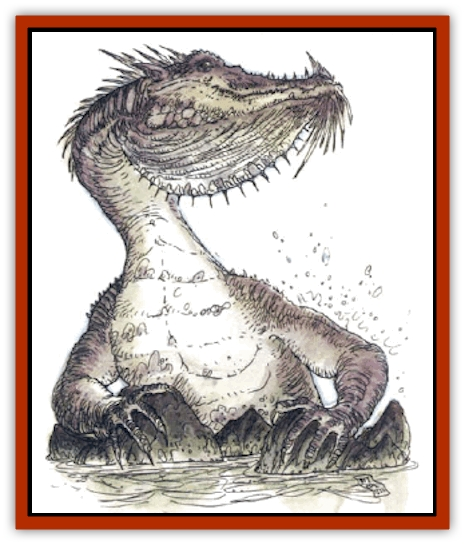

# Dragon - Neutral - Pearl

| Statistic | **Dragon, Neutral, Pearl** |
| --- | --- |
| **Activity Cycle:** | Any |
| **Alignment:** | Neutral |
| **Armor Class:** | 2 (base) |
| **Climate/Terrain:** | Any/Rocky coastlines, cliffs |
| **Damage/Attack:** | 1d4+1(&times;2)/3d6/special |
| **Diet:** | Carnivore |
| **Frequency:** | Very rare |
| **Hit Dice:** | 6 (base) |
| **Intelligence:** | Exceptional (15-16) |
| **Magic Resistance:** | See below |
| **Morale:** | Fanatic (17-18) |
| **Movement:** | 9, Fl 18(C), Sw 12 |
| **No. Appearing:** | 1d3 |
| **No. of Attacks:** | 3 + special |
| **Organization:** | Solitary or clan |
| **Size:** | H-G (14' base) |
| **Special Attacks:** | Spells, breath weapon, special |
| **Special Defenses:** | Spells, special |
| **THAC0:** | 15 (base) |
| **Treasure:** | See below |
| **XP Value:** | See below |

Pearl [[Dragon_General_Information|dragons]] are easily identifiable because their scales appear to be made of that precious substance for which they are named. As they age, their scales become increasingly lustrous.

Pearl dragons speak their own language, and they can communicate telepathically with any other creature having that ability, as well as creatures with Intelligences of 18 or higher.

**Combat:** Pearls prefer to employ their breath weapons and magical abilities in combat, but they can deliver two claw attacks and a bite if necessary. They are smaller and weaker than many other dragons, but they possess superior magic capabilities and are able to cast both wizard and priest spells.

**Breath Weapon/Special Abilities:** Pearl dragons can breathe a cloud of scalding steam once every three rounds, measuring 90 feet long, 30 feet wide, and 20 feet high. A successful saving throw vs. breath weapon halves the inflicted damage.

Using riddling talk and personal charm, pearl dragons can entrance those who are not involved in combat or otherwise distracted. Anyone within 90 feet who listens to a pearl has a 10% cumulative chance per round to become affected as by a suggestion spell. A successful save vs. spell indicates that the character can resist the charm for at least six rounds, after which there's a 5% cumulative chance to be charmed. Those who successfully save twice can't be charmed by that dragon.

Due to its relatively small size, the fear aura of a neutral dragon allows a +4 bonus to opponents' saving throws. Also, neutrals cannot polymorph themselves unless they carry that spell, but, they have the ability to *blink* six times per day (as a 10th-level caster).

**Habitat/Society:** Pearl dragons reside on steep, rocky coastlines or along sandy beaches, as long as they are near the water. They love the salty air and the open expanse of the sea.

It is not surprising that pearl dragons spend most of the day pearl hunting. Over the centuries, this species has developed powerful lungs exclusively for this purpose, and a pearl dragon can stay under water for up to an hour without surfacing for air. For this reason, a pearl dragon hoard can contain up to 5,000 gp in pearls for every age level the dragon has (these pearls are in addition to normal treasure types).

Pearl dragons are somewhat nomadic, leaving one place for another once the food or pearl supply has run low. The moving process is very slow, for the dragon refusss to leave a single object behind in its previous lair.

Like all neutral dragons, pearl dragons remain at a safe distance from human civilization. They rarely attack sailing vessels, though they have been known to attack bothersome pirate ships and take whatever treasure they can find.

**Ecology:** Pearl dragons are natural enemies of [[Dragon_Turtle|dragon turtles]]. Their diet consists mainly of sharks and fish, with an occasional hundred lobsters or a small whale as a treat. The hide of a pearl dragon is extremely beautiful and can be sold for as much as 60,000 gp.

| Age | Body Lgt. (') | Tail Lgt. (') | AC | Breath Weapon | Spells W/P | MR | Treas. Type | XP Value |
| --- | --- | --- | --- | --- | --- | --- | --- | --- |
| 1 Hatchling | 1-4 | 1-3 | 5 | 1d4+1 | Nil | Nil | Nil | 1,490 |
| 2 Very young | 5-8 | 4-6 | 4 | 2d4+2 | Nil | Nil | Nil | 2,000 |
| 3 Young | 9-12 | 7-9 | 3 | 3d4+3 | Nil | Nil | Nil | 3,000 |
| 4 Juvenile | 13-16 | 10-12 | 2 | 4d4+4 | 2/1 | 5% | E | 4,000 |
| 5 Young adult | 17-20 | 13-15 | 1 | 5d4+5 | 2 2/2 1 | 10% | H | 5,000 |
| 6 Adult | 21-24 | 16-18 | 0 | 6d4+6 | 2 2 2/2 2 | 15% | H,U* | 7,000 |
| 7 Mature adult | 25-28 | 19-21 | -1 | 7d4+7 | 2 2 2 2/2 2 1 | 20% | H,Ux2* | 9,000 |
| 8 Old | 29-32 | 22-24 | -2 | 8d4+8 | 2 2 2 2 2/2 2 2 | 25% | H,Ux2* | 10,000 |
| 9 Very old | 33-36 | 25-28 | -3 | 9d4+9 | 2 2 2 2 2 2/2 2 2 1 | 30& | H,Ux2* | 11,000 |
| 10 Venerable | 37-40 | 29-31 | -4 | 10d4+10 | 2 2 2 2 2 2 2/2 2 2 2 | 35% | H,Ux3* | 12,000 |
| 11 Wyrm | 41-44 | 32-34 | -5 | 11d4+11 | 3 3 2 2 2 2 2/2 2 2 2 1 | 40% | H,Ux4* | 13,000 |
| 12 Great Wyrm | 45-48 | 35-38 | -6 | 12d4+12 | 3 3 3 3 2 2 2/2 2 2 2 2 | 45% | H,Ux4* | 14,000 |

* All gems in treasure type U are actually pearls.

---
## Discovery & Documentation

**Source Publication:** Monstrous Compendium, 1994 Annual, Volume 1 (1995)
**Campaign Setting:** Advanced Dungeons & Dragons 2nd Edition
**Author(s):** David Wise

### Other Creatures Found in This Source Book
   * [[Abyss_Ant|Abyss Ant]]
   * [[Achaierai|Achaierai]]
   * [[Afanc|Afanc]]
   * [[Al-Jahar|Al-Jahar]]
   * [[Baelnorn|Baelnorn]]
   * [[Baneguard|Baneguard]]
   * [[Banelar|Banelar]]
   * [[Bird_Talking|Bird, Talking]]
   * [[Blazing_Bones|Blazing Bones]]
   * [[Campestri|Campestri]]
   * [[Caniquine|Caniquine]]
   * [[Cat_Winged|Cat, Winged]]
   * [[Crypt_Servant|Crypt Servant]]
   * [[Death's_Head_Tree|Death's Head Tree]]
   * [[Dog_Saluqi|Dog, Saluqi]]
   * [[Dragon_Electrum|Dragon, Electrum]]
   * [[Dragon_Fang|Dragon, Fang]]
   * [[Dragon_Linnorm_Corpse_Tearer|Dragon, Linnorm, Corpse Tearer]]
   * [[Dragon_Linnorm_Dread|Dragon, Linnorm, Dread]]
   * [[Dragon_Linnorm_Flame|Dragon, Linnorm, Flame]]
   * [[Dragon_Linnorm_Forest|Dragon, Linnorm, Forest]]
   * [[Dragon_Linnorm_Frost|Dragon, Linnorm, Frost]]
   * [[Dragon_Linnorm_Gray|Dragon, Linnorm, Gray]]
   * [[Dragon_Linnorm_Land|Dragon, Linnorm, Land]]
   * [[Dragon_Linnorm_Midgard|Dragon, Linnorm, Midgard]]
   * [[Dragon_Linnorm_Rain|Dragon, Linnorm, Rain]]
   * [[Dragon_Linnorm_Sea|Dragon, Linnorm, Sea]]
   * [[Dragon_Neutral_Jacinth|Dragon, Neutral, Jacinth]]
   * [[Dragon_Neutral_Jade|Dragon, Neutral, Jade]]
   * [[Dread|Dread]]
   * [[Dragon-kin|Dragon-kin]]
   * [[Elemental_Earth_Kin_Chrysmal|Elemental, Earth Kin, Chrysmal]]
   * [[Elemental_Earth_Kin_Earth_Weird|Elemental, Earth Kin, Earth Weird]]
   * [[Elemental_Fire_Kin_Azer|Elemental, Fire Kin, Azer]]
   * [[Elemental_Sandman|Elemental, Sandman]]
   * [[Elemental_Wind_Walker|Elemental, Wind Walker]]
   * [[Elemental_Vermin|Elemental Vermin]]
   * [[Feystag|Feystag]]
   * [[Flame_Skull|Flame Skull]]
   * [[Foulwing|Foulwing]]
   * [[Gambado|Gambado]]
   * [[Garbug|Garbug]]
   * [[Genie_Tasked_Administrator|Genie, Tasked, Administrator]]
   * [[Genie_Tasked_Deceiver|Genie, Tasked, Deceiver]]
   * [[Genie_Tasked_Harim_Servant|Genie, Tasked, Harim Servant]]
   * [[Genie_Tasked_Messenger|Genie, Tasked, Messenger]]
   * [[Genie_Tasked_Miner|Genie, Tasked, Miner]]
   * [[Genie_Tasked_Oathbinder|Genie, Tasked, Oathbinder]]
   * [[Gibbering_Mouther|Gibbering Mouther]]
   * [[Gnasher|Gnasher]]
   * [[Gnasher_Winged|Gnasher, Winged]]
   * [[Golem_Brain|Golem, Brain]]
   * [[Golem_Hammer|Golem, Hammer]]
   * [[Golem_Metagolem|Golem, Metagolem]]
   * [[Golem_Spiderstone|Golem, Spiderstone]]
   * [[Gorynych|Gorynych]]
   * [[Greelox|Greelox]]
   * [[Helmed_Horror|Helmed Horror]]
   * [[Jarbo|Jarbo]]
   * [[Laraken|Laraken]]
   * [[Lich_Psionic|Lich, Psionic]]
   * [[Living_Steel|Living Steel]]
   * [[Lock_Lurker|Lock Lurker]]
   * [[Loxo|Loxo]]
   * [[Lycanthrope_Loup_de_Noir|Lycanthrope, Loup de Noir]]
   * [[Lycanthrope_Werebadger|Lycanthrope, Werebadger]]
   * [[Lycanthrope_Werejaguar|Lycanthrope, Werejaguar]]
   * [[Lythlyx|Lythlyx]]
   * [[Magebane|Magebane]]
   * [[Marrashi|Marrashi]]
   * [[Metalmaster|Metalmaster]]
   * [[Mimic_House_Hunter|Mimic, House Hunter]]
   * [[Naga_Bone|Naga, Bone]]
   * [[Nautilus_Giant|Nautilus, Giant]]
   * [[Nightshade_Toril|Nightshade (Toril)]]
   * [[Nishruu|Nishruu]]
   * [[Noran|Noran]]
   * [[Opinicus|Opinicus]]
   * [[Ormyrr|Ormyrr]]
   * [[Parasite|Parasite]]
   * [[Pasari-Niml|Pasari-Niml]]
   * [[Plant_Vampire_Moss|Plant, Vampire Moss]]
   * [[Pteraman|Pteraman]]
   * [[Rautym|Rautym]]
   * [[Shadeling|Shadeling]]
   * [[Skum|Skum]]
   * [[Snake_Giant_Cobra|Snake, Giant Cobra]]
   * [[Snake_Stone|Snake, Stone]]
   * [[Spectral_Wizard|Spectral Wizard]]
   * [[Spell_Weaver|Spell Weaver]]
   * [[Spider_Brain|Spider, Brain]]
   * [[Suwyze|Suwyze]]
   * [[Tatalla|Tatalla]]
   * [[Tick_Heart|Tick, Heart]]
   * [[Tree_Dark|Tree, Dark]]
   * [[Tree_Singing|Tree, Singing]]
   * [[Tressym|Tressym]]
   * [[Troll_Snow|Troll, Snow]]
   * [[Tuyewera|Tuyewera]]
   * [[Ulitharid|Ulitharid]]
   * [[Undead_Dwarf|Undead Dwarf]]
   * [[Undead_Lake_Monster|Undead Lake Monster]]
   * [[Whipsting|Whipsting]]
   * [[Windghost|Windghost]]
   * [[Wolf_Dread|Wolf, Dread]]
   * [[Wolf_Stone|Wolf, Stone]]
   * [[Wolf_Vampiric|Wolf, Vampiric]]
   * [[Wraith_Shimmering|Wraith, Shimmering]]
   * [[Xantravar|Xantravar]]
   * [[Xaver|Xaver]]
