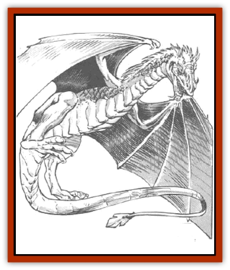

# Dragon - Oerth - Greyhawk

| Statistic | **Dragon (Oerth), Greyhawk** |
| --- | --- |
| **Activity Cycle:** | Any |
| **Alignment:** | Lawful neutral (good) |
| **Armor Class:** | 0 (base) |
| **Climate/Terrain:** | Temparate/Cities (rarely Temperate/Hills, plains and forests) |
| **Damage/Attack:** | 1-10/1-10/3-30 |
| **Diet:** | Special |
| **Frequency:** | Very rare |
| **Hit Dice:** | 11 (base) |
| **Intelligence:** | Supra-genius (19-20) |
| **Magic Resistance:** | Variable |
| **Morale:** | Fanatic (17) |
| **Movement:** | 9, Fl 30 (D), Sw 6 |
| **No. Appearing:** | 1 |
| **No. of Attacks:** | 3 + special |
| **Organization:** | Solitary |
| **Size:** | H (25' base) |
| **Special Attacks:** | Special |
| **Special Defenses:** | Variable |
| **THAC0:** | 9 (base) |
| **Treasure:** | Special |
| **XP Value:** | Variable |

Greyhawk [[Dragon_General_Information|dragons]] love to have human and demihuman companions, and, unlike other species of dragons, prefer to live amid the hustle and bustle of great cities. They often pose as sages, scholars, mages, or other intellectuals.

At birth, a Greyhawk dragon's scales are deep blue-gray with steely highlights. As the dragon approaches adulthood, its color slowly lightens to that of lusterous burnished steel. When these dragons take human form they always have one steel-gray feature - hair, eyes, nails, or sometimes a ring or other ornament.

Greyhawk dragons speak their own tongue and a tongue common to all neutral dragons. Also, 19% of *hatchling* Greyhawk dragons can speak with any intelligent creature. The chance to possess this ability increases 5% per age category.

**Combat:** Greyhawk dragons favor repartee over combat. If pressed, they usually begin with a spell assault and avoid melee. If seriously harmed or threatened, they resume their dragon forms and use their breath weapons. They always breathe on any foe they plan to engage in melee, and they seek to keep their foes within the cloud until the gas loses its potency.

**Breath Weapon/Special Abilities:** A Greyhawk dragon's breath weapon is a cube of toxic gas. The dragon can monitor the amount of gas released so dosely that it can make the cube as small as it wishes, or as large as shown in the table above. The listing is the maximum length of a side of the cube. Creatures caught in the gas must roll successful saving throws vs. poison, with a -2 penalty, or die instantly. The gas is quickly absorbed through the skin and is just as lethal if inhaled. Coating all exposed skin with lard or grease offers some protection saving throw penalty negated). Victims who succeed with the save automatically suffer the indicated amount of damage unless immune to poison. In still air, the gas stays active for two melee rounds.

Greyhawk dragons are immune to all poisons.

A Greyhawk dragon can *polymorph self* five times a day. Each change in form lasts until the dragon chooses a different form. Reverting to the dragon's normal form does not count as a change.

Greyhawk dragons are immune to wizard spells of 1st-4th level.

As they age, they gain the following additional powers:

*Young: cantrip* twice a day; *Juvenile: friends* once a day; *Adult: charm person* three times a day; *Mature adult: suggestion* once a day; *Old: enthrall* once a day.

A Greyhawk dragon casts its spells and uses its special abilities at 8th level plus its combat modifier.

**Habitat/Society:** Greyhawk dragons prefer human lodgings, but always ones that are well equipped with strong rooms or vaults to protect their treasures.

Greyhawk dragons prefer human form to their own, and they always have mortal companions. They are endlessly curious about human and demihuman art, culture, history, and politics. In their human identities, Greyhawk dragons often are well-known patrons of the arts. They always keep their true natures secret, but they are able to recognize each other.

**Ecology:** Greyhawk dragons prefer human food. Unlike other formshifting dragons, they cannot live on such fare indefinitely, as they must eat enough to maintain their true bulk. Once or twice a month,they leave their adopted cities and go into the wilderness to hunt for food. They explain their absences in a way consistent with their human identities. For example, a dragon posing as a historian might claim to be out looking at ruins or questioning a grizzled survivor of an old battle.

Greyhawk dragons hate chaotic creatures who seek to disrupt life in cities or despoiI their hunting grounds. In the city the dragons never hesitate to report troublemakers or to use their special abilities to hunt down criminals. In the wilderness, they prefer swifter forms of justice.

| Age | Body Lgt. (') | Tail Lgt. (') | AC | Breath Weapon | Spells W/P | MR | Treas. Type | XP Value |
| --- | --- | --- | --- | --- | --- | --- | --- | --- |
| 1 Hatchling | 2-8 | 1-4 | 3 | 15'/1d4+1 | Nil | 25% | Nil | 2,000 |
| 2 Very young | 8-14 | 4-9 | 2 | 20'/2d4 | Nil | 30% | Nil | 4,000 |
| 3 Young | 14-20 | 9-14 | 1 | 25'/2d4+1 | Nil | 35% | Nil | 8,000 |
| 4 Juvenile | 20-26 | 14-19 | 0 | 30'/3d4 | 4 | 40% | E,R | 10,000 |
| 5 Young adult | 26-32 | 19-24 | -1 | 35'/3d4+1 | 4 4 | 45% | H,R | 12,000 |
| 6 Adult | 32-38 | 24-29 | -2 | 40'/4d4 | 4 4 4 | 50% | H,R | 14,000 |
| 7 Mature adult | 38-44 | 29-34 | -3 | 45'/4d4+1 | 4 4 4 4 | 55% | H,R | 15,000 |
| 8 Old | 44-50 | 34-39 | -4 | 50'/5d4 | 4 4 4 4 4 | 60% | H,Rx2 | 17,000 |
| 9 Very old | 50-56 | 39-44 | -5 | 55'/5d4+1 | 4 4 4 4 4 4 | 65% | H,Rx2 | 18,000 |
| 10 Venerable | 56-62 | 44-49 | -6 | 60'/6d4 | 5 4 4 4 4 4/2 | 70% | H,Rx2 | 19,000 |
| 11 Wyrm | 62-68 | 49-54 | -7 | 65'/6d4+1 | 5 5 4 4 4 4/2 2 | 75% | H,Rx3 | 20,000 |
| 12 Great Wyrm | 68-74 | 54-59 | -8 | 70'/7d4 | 5 5 5 4 4 4/2 2 2 | 80% | H,Rx3 | 21,000 |

---
## Discovery & Documentation

**Source Publication:** MC5 Greyhawk Appendix (1989)
**Campaign Setting:** Advanced Dungeons & Dragons 2nd Edition
**Author(s):** Grant Boucher, William W. Connors, Steve Gilbert, Bruce Nesmith, Chris Mortika, Skip Williams

### Other Creatures Found in This Source Book
   * [[Aspis|Aspis]]
   * [[Beastman|Beastman]]
   * [[Bonesnapper|Bonesnapper]]
   * [[Booka|Booka]]
   * [[Brownie_Buckawn|Brownie, Buckawn]]
   * [[Brownie_Quickling|Brownie, Quickling]]
   * [[Crystalmist|Crystalmist]]
   * [[Dragon_Cloud|Dragon, Cloud]]
   * [[Dragonfly_Giant|Dragonfly, Giant]]
   * [[Dragonnel|Dragonnel]]
   * [[Elf_Grugach|Elf, Grugach]]
   * [[Elf_Valley|Elf, Valley]]
   * [[Golem_Necrophidius|Golem, Necrophidius]]
   * [[Grell_Wild|Grell, Wild]]
   * [[Grung|Grung]]
   * [[Hobgoblin_Norker|Hobgoblin, Norker]]
   * [[Hook_Horror|Hook Horror]]
   * [[Horgar|Horgar]]
   * [[Hound_Yeth|Hound, Yeth]]
   * [[Iguana_Giant|Iguana, Giant]]
   * [[Ingundi|Ingundi]]
   * [[Kech|Kech]]
   * [[Kyuss_Son_of|Kyuss, Son of]]
   * [[Mite|Mite]]
   * [[Needleman|Needleman]]
   * [[Plant_Carnivorous_Oerth|Plant, Carnivorous (Oerth)]]
   * [[Plant_Carnivorous_Vampire_Cactus|Plant, Carnivorous, Vampire Cactus]]
   * [[Plasmoid_General_Information|Plasmoid, General Information]]
   * [[Rat_Oerth|Rat (Oerth)]]
   * [[Raven_Crow|Raven/Crow]]
   * [[Scarecrow|Scarecrow]]
   * [[Shadow_Slow|Shadow, Slow]]
   * [[Skulk|Skulk]]
   * [[Snail|Snail]]
   * [[Sprite|Sprite]]
   * [[Taer|Taer]]
   * [[Tentamort|Tentamort]]
   * [[Turtle_Giant|Turtle, Giant]]
   * [[Tyrg|Tyrg]]
   * [[Wolf_Mist|Wolf, Mist]]
   * [[Wraith_Oerth|Wraith (Oerth)]]
   * [[Zygom|Zygom]]
