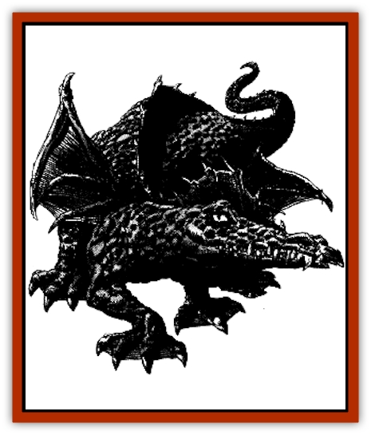

# Dragon - Orange - Sodium

| Statistic | **Dragon, Orange (Sodium)** |
| --- | --- |
| **Activity Cycle:** | Any |
| **Alignment:** | Neutral evil |
| **Armor Class:** | -1 (base) |
| **Climate/Terrain:** | Tropical rain forest riverbanks and lakeshores |
| **Damage/Attack:** | 1-8/1-8/3-24 |
| **Diet:** | Special |
| **Frequency:** | Very rare |
| **Hit Dice:** | 12 (base) |
| **Intelligence:** | High (13-14) |
| **Magic Resistance:** | Varies |
| **Morale:** | Fanatic (17) |
| **Movement:** | 9, Fl 30(C), Sw 9 |
| **No. Appearing:** | 1 (2-5) |
| **No. of Attacks:** | 3+special |
| **Organization:** | Solitary or family |
| **Size:** | G (39' base) |
| **Special Attacks:** | Special |
| **Special Defenses:** | Varies |
| **THAC0:** | 8 |
| **Treasure:** | Special |
| **XP Value:** | Varies |

Orange [[Dragon_General_Information|Dragons]] are as likely to roar a defiant challenge as to attack from ambush, whichever they think will more terrify their intended victim.

At birth, an orange dragon's scales are a blazing orange. As the dragon matures, the scales become larger and thick, hardening like metal. Most retain their bold orange color, some developing splotches of yellow or red, providing excellent camouflage amid the continually blooming rain forest flowers.

Orange dragons speak their own tongue and a language common to all evil dragons. Fourteen percent of hatchling orange dragons have an ability to communicate with any intelligent creature. The chance to possess this ability increases five percent per age category of the dragon.

**Combat:** An orange dragon attacks with its claw/claw/bite routine or with its breath weapon, a metallic silvery stream, similar to [[Dragon_Chromatic_Black|black dragon]] acid. Although well suited for ambush, they have much of their red ancestor's impulse to attack on sight and are equally likely to attack boldly.

**Breath Weapon/Special Abilities:** Orange dragons are found along the riverbanks and lakeshores of steamy tropical rain forests. The wetter the better, both for limiting the spread of fire and providing pools of standing water for spitting. They are solitary creatures except when paired for mating and raising young. Both parents participate equally in foraging for food, teaching the young, and defending the lair.

Orange dragons often ally with evil jungle or rain forest dwelling creatures, providing protection in exchange for obedience and information. This practice puts them into competition with black dragons, but usually the black dragon avoids fighting with the stronger, larger and more dangerous orange and either leaves or grudgingly accepts a subordinate role.

**Habitat/Society:** Orange dragons are excellent swimmers, but being exclusively air-breathers, they live on land other than when hunting for food in rivers or lakes.

Orange dragons are mostly meat eaters, feeding on rain forest creatures and fish, but enjoying tropical fruits as well. [[Elf|Elves]] and human tribesmen are appreciated for the sport they provide, until finally caught and devoured. If nothing is available, giant insects or fungus may be consumed (although with little enthusiasm) thanks to the dragon's natural poison resistance and, if necessary, *neutralize poison*. For the same reason the orange dragon can drink from pools of reeking, stagnant water, although they much prefer fresh.

[[Ettercap|Ettercap]] prize the meat of Hatchling dragons but won't attempt to catch larger ones. Orange dragons have a natural enemy in [[Dragon_Metallic_Bronze|bronze dragons]], who compete with them for food and living space in tropical forests and lakeshores. In a comparison of orange and bronze dragons of equivalent age, the bronze is slightly smarter, tougher, and larger, and its lightning weapon has a longer reach. Sometimes an orange dragon attacking from ambush can negate this advantage, but the majority of "even" battles result in victory for the bronze.

| Age | Body | Tail | AC | Br. Weapon | Spells W/P | MR | Treas.Type | XP Value |
| --- | --- | --- | --- | --- | --- | --- | --- | --- |
| 1 Hatchling | 2-9 | 2-9 | 2 | 2d6+2 | Nil | Nil | Nil | 1,400 |
| 2 Very young | 9-20 | 9-17 | 1 | 4d6+4 | Nil | Nil | Nil | 2,000 |
| 3 Young | 20-30 | 17-25 | 0 | 6d6+6 | Nil | Nil | Nil | 4,000 |
| 4 Juvenile | 30-46 | 25-39 | -1 | 8d6+8 | 1 | Nil | ½H,S | 7,000 |
| 5 Young adult | 46-61 | 39-56 | -2 | 10d6+10 | 2 | 25% | H,S | 9,000 |
| 6 Adult | 61-76 | 56-72 | -3 | 12d6+12 | 3 | 30% | H,S | 10,000 |
| 7 Mature adult | 76-91 | 72-86 | -4 | 14d6+14 | 3 1 | 35% | H,S | 11,000 |
| 8 Old | 91-107 | 86-100 | -5 | 16d6+16 | 3 2 | 40% | H,S,T | 13,000 |
| 9 Very old | 107-123 | 100-114 | -6 | 18d6+18 | 3 3 | 45% | H,S,T | 14,000 |
| 10 Venerable | 123-131 | 114-124 | -7 | 20d6+20 | 3 3 1/1 | 50% | H/S/T | 15,000 |
| 11 Wyrm | 131-139 | 124-134 | -8 | 22d6+22 | 3 3 2/2 | 55% | Hx2,S,T | 16,000 |
| 12 Great Wyrm | 139-152 | 134-144 | -9 | 24d6+24 | 3 3 3/3 | 60% | Hx2,S,T | 17,000 |

---
## Discovery & Documentation

**Source Publication:** Dragon248 (1998)
**Campaign Setting:** Dragon Magazine
**Author(s):** Gregory W. Detwiler, Terry Dykstra

### Other Creatures Found in This Source Book
   * [[Amphitere|Amphitere]]
   * [[Cetus_Lesser|Cetus, Lesser]]
   * [[Dragonet|Dragonet]]
   * [[Dragon_Purple_Energy|Dragon, Purple (Energy)]]
   * [[Dragon_Yellow_Salt|Dragon, Yellow (Salt)]]
   * [[Gargouille|Gargouille]]
   * [[Hai_Riyo|Hai Riyo]]
   * [[Peluda|Peluda]]
   * [[Sirrush|Sirrush]]
   * [[Vore_Lekiniskiy_Master_Fire_Worm|Vore Lekiniskiy, Master Fire Worm]]
