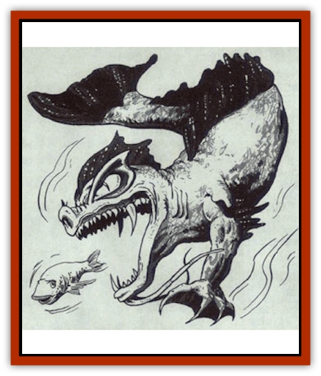

# Dragon - Oriental - Carp - Yu Lung

| Statistic | **Dragon, Oriental, Carp (Yu Lung)** |
| --- | --- |
| **Activity Cycle:** | Any |
| **Alignment:** | Neutral |
| **Armor Class:** | 1 (base) |
| **Climate/Terrain:** | Tropical, subtropical, temperate/Lakes, rivers |
| **Damage/Attack:** | 1-8/1-8/2-12 |
| **Diet:** | Special |
| **Frequency:** | Rare |
| **Hit Dice:** | 10 (base) |
| **Intelligence:** | Low (5-7) |
| **Magic Resistance:** | Varies |
| **Morale:** | Champion (16) |
| **Movement:** | 6, Sw 18 |
| **No. Appearing:** | 1-4 |
| **No. of Attacks:** | 3+special |
| **Organization:** | Solitary or clan |
| **Size:** | H (18' base) |
| **Special Attacks:** | Swallow whole and magical |
| **Special Defenses:** | Varies |
| **THAC0:** | 11 |
| **Treasure:** | Special |
| **XP Value:** | Varies |

Yu lung, also known as carp dragons, live in all types of fresh water rivers and lakes. They have no positions in the Celestial Bureaucracy; instead, they metamorphose into other subspecies upon reaching the age of adult and are then relocated and charged with specific duties as determined by the Celestial Emperor. Reclusive and shy, yu lung are the smallest of the [[Dragon_Oriental_Lung_General_Information|oriental dragons]] and the most docile.

Yu lung have [[Dragon_General_Information|dragons']] heads and the bodies and tails of [[Carp_Giant|giant carp]]. Their scales are blue-gray with variously colored markings. They have two arms, long wispy beards, and bright yellow eyes resembling those of [[Cat_Small|cats]]. They cannot fly and are able to move on land only by dragging themselves along the ground with their claws.

Yu lung speak their own language, the languages of all fresh water creatures, and the Celestial Court, and all human languages.

**Combat:** The timid yu lung shun combat. If provoked or threatened, yu lung attack with their claws and bite; if their opponents withdraw, yu lung seldom pursue. The yu lung's tail is too flaccid for tail slap attacks, and they are physically unable to perform kicks or snatches.

When a yu lung reaches the age of young adult, it can unhinge its jaw like a serpent and swallow a victim whole (the victim can be no larger than a small man). A swallowed victim suffers bite damage, plus 1 point of damage per round thereafter from the yu lung's digestive juices. The victim also has a 5% cumulative chance per round of suffocating. (When the yu lung loses 50% of its hit points, the victim can be freed. The swallowed victim suffers a - 2 penalty to his attack rolls when attempting to cut himself free; thrusting and stabbing attacks originating from outside the yu lung have a 20% chance of striking the swallowed victim.)

**Breath Weapon/Special Abilities:** Unlike other oriental dragons, yu lung are unable to polymorph or turn invisible. They can breathe only water, although they are able to exist on land for up to one hour, after which they have a 5% cumulative chance per round of suffocating. At the age of very young they acquire the ability to cast *bless* and *curse*, each once per day. Juvenile and young adult yu lung can exhale a ten-foot-diameter cloud of gas that has the same effect as a *potion of healing* (restores 2d4+1 hit points) on all those within its area of effect; they can breathe these clouds once per day. When yu lung reach the age of adult, they metamorphose into an adult of another oriental dragon subspecies, determined randomly as follows (roll percentile dice):

| Roll | Result |
| --- | --- |
| 01-30 | Shen lung |
| 31-50 | Pan lung |
| 51-65 | Chiang lung |
| 66-80 | Li lung |
| 81-90 | Lung wang |
| 91-95 | Tun mi lung |
| 96-00 | T'ien lung |

This transformation, which occurs exactly at midnight on the dragon's 101st birthday, is instantaneous and accompanied by a loud crack of thunder. The newly transformed dragon is then relocated to a new domain and given an assignment by the Celestial Bureaucracy befitting its new status.

**Habitat/Society:** Yu lung lair in small mansions made of mud and stone located deep in the murkiest waters of the lake or river they inhabit. Though neat and well-built, yu lung mansions are crude by oriental dragon standards. They are also relatively barren, as yu lung do not collect treasure.

**Ecology:** Yu lung are scavengers, eating the organic and inorganic matter dug from the ooze at the bottom of their lake or river. They peacefully co-exist with all forms of aquatic life. Yu lung occasionally befriend humans, and these friendships are notable for their longevity; a yu lung's bond with a human persists even after its transformation into another subspecies.

| Age Category | Body Lgt. (') | Tail Lgt. (') | AC | MR | X.P. Value |
| --- | --- | --- | --- | --- | --- |
| 1 Hatchling | 1-3 | 1-2 | 4 | Nil | 420 |
| 2 Very young | 4-10 | 3-9 | 3 | Nil | 975 |
| 3 Young | 11-17 | 10-15 | 2 | Nil | 2,000 |
| 4 Juvenile | 18-25 | 16-22 | 1 | Nil | 3,000 |
| 5 Young adult | 26-35 | 23-30 | 0 | 10% | 7,000 |

---
## Discovery & Documentation

**Source Publication:** MC3 Volume III Forgotten Realms Appendix I (1989)
**Campaign Setting:** Forgotten Realms
**Author(s):** William Connors, David Martin, Rick Swan, Gary Thomas

### Other Creatures Found in This Source Book
   * [[Asperii|Asperii]]
   * [[Belabra|Belabra]]
   * [[Berbalang|Berbalang]]
   * [[Bhaergala|Bhaergala]]
   * [[Bichir|Bichir]]
   * [[Bunyip|Bunyip]]
   * [[Burbur|Burbur]]
   * [[Cloaker|Cloaker]]
   * [[Crawling_Claw|Crawling Claw]]
   * [[Darkenbeast|Darkenbeast]]
   * [[Dracolich|Dracolich]]
   * [[Dragon_Oriental_Celestial_T'ien_Lung|Dragon, Oriental, Celestial (T'ien Lung)]]
   * [[Dragon_Oriental_Coiled_Pan_Lung|Dragon, Oriental, Coiled (Pan Lung)]]
   * [[Dragon_Oriental_Earth_Li_Lung|Dragon, Oriental, Earth (Li Lung)]]
   * [[Dragon_Oriental_Lung_General_Information|Dragon, Oriental (Lung), General Information]]
   * [[Dragon_Oriental_River_Chiang_Lung|Dragon, Oriental, River (Chiang Lung)]]
   * [[Dragon_Oriental_Sea_Lung_Wang|Dragon, Oriental, Sea (Lung Wang)]]
   * [[Dragon_Oriental_Spirit_Shen_Lung|Dragon, Oriental, Spirit (Shen Lung)]]
   * [[Dragon_Oriental_Typhoon_Tun_Mi_Lung|Dragon, Oriental, Typhoon (Tun Mi Lung)]]
   * [[Dragonet_Faerie_Dragon|Dragonet, Faerie Dragon]]
   * [[Firenewt|Firenewt]]
   * [[Firestar|Firestar]]
   * [[Fish_Ascallion|Fish, Ascallion]]
   * [[Fish_Vurgens|Fish, Vurgens]]
   * [[Meazel|Meazel]]
   * [[Medusa_Maedar|Medusa, Maedar]]
   * [[Mist_Crimson_Death|Mist, Crimson Death]]
   * [[Revenant|Revenant]]
   * [[Rhaumbusun|Rhaumbusun]]
   * [[Strider_Giant|Strider, Giant]]
   * [[Thessalmonster|Thessalmonster]]
   * [[Web_Living|Web, Living]]
   * [[Wemic|Wemic]]
