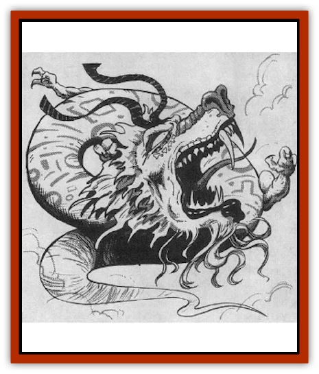

# Dragon - Oriental - Celestial - T'ien Lung

| Statistic | **Dragon, Oriental, Celestial (T'ien Lung)** |
| --- | --- |
| **Activity Cycle:** | Any |
| **Alignment:** | Lawful neutral |
| **Armor Class:** | -4 (base) |
| **Climate/Terrain:** | Tropical, subtropical, temperate/Mountains |
| **Damage/Attack:** | 1-8/1-8/4-40 |
| **Diet:** | Special |
| **Frequency:** | Very rare |
| **Hit Dice:** | 15 (base) |
| **Intelligence:** | Exceptional (15-16) |
| **Magic Resistance:** | Varies |
| **Morale:** | Fanatic (18) |
| **Movement:** | 9, Fl 48 (D), Sw 6 |
| **No. Appearing:** | 1 |
| **No. of Attacks:** | 3 + special |
| **Organization:** | Solitary |
| **Size:** | G (50' base) |
| **Special Attacks:** | Breath weapon, snatch, tail slap, kick, and magical abilities |
| **Special Defenses:** | Varies |
| **THAC0:** | 5 |
| **Treasure:** | Special |
| **XP Value:** | Varies |

A t'ien [[Dragon_Oriental_Lung_General_Information|lung's]] scales are dull gold at birth, but brighten to a brilliant yellow when it reaches the young adult age; orange and light green varieties have also been seen. Multi-hued manes surround their necks, and similarly colorful whiskers branch from their snouts and rise over the tops of their heads like antlers. Wispy golden beards dangle beneath their chins. From the age of young adult and up, their scales give off a sweet aroma resembling that of cherry blossoms. Though wingless, t'ien lung can fly through the power of a magical yellow pearl imbedded in their brains; the pearl is similar to that of the shen lung.

T'ien lung speak their own tongue, the languages of air elementals and the Celestial Court, and all human languages.

**Combat:** Whenever possible, t'ien lung attempt to warn away potential opponents with a fiery blast from their breath weapon. If their warnings go unheeded, they fight ferociously. T'ien lung prefer to fight from the air, circling their opponents and attacking with their breath weapons, then swooping for snatch and claw/claw/bite attacks when given an opening. T'ien lung can perform tail slaps (only adult or older t'ien lung can attack with tail slaps, inflicting damage equal to two claw attacks and affecting as many opponents as the dragon's age category; those within the sweep of the dragon's tail must roll successful saving throws vs. petrification or be stunned for Id4 +1 rounds) and can kick opponents behind them (kicks inflict claw damage; victims must roll their Dexterity or less on 1d20 or be kicked back 1d6' +1' per age category of the dragon and must also roll successful saving throws vs. petrification, adjusted by the dragon's combat modifier, or fall).

**Breath Weapon/Special Abilities:** A t'ien lung's breath weapon is a cone of fire 90' long, 5' wide at the dragon's mouth, and 30' wide at the end. Victims within the breath weapon cone must save vs. breath weapon for half damage. A t'ien lung can use its breath weapon once every three rounds.

From birth, t'ien lung can breathe both water and air. They can cast *control weather* a number of times per day equal to twice their age level.

As they age, t'ien lung gain the following additional abilities:

Young: *Pyrotechnics* three times per day; Adult: *Suggestion* three times per day; Old: *Fire storm* once per day

**Habitat/Society:** T'ien lung live in resplendent castles in cloud banks and on high mountain peaks. Male t'ien lung never remain with their mates, and females banish their offspring as soon as the reach the age of young. Adult and older t'ien lung have a 50% chance of being accompanied by 1d4 [[Elemental_Air_Earth|air elementals]] (of 8 Hit Dice) that act as their servants and bodyguards; these elementals unquestioningly obey their masters, defending them to the death if necessary.

**Ecology:** T'ien lung enjoy eating opals and pearls and look kindly on any mortal who gives them such delicacies. Farmers who rely on the good will of t'ien lung for good weather often make sizeable offerings of these precious gems. T'ien lung are thought to be among the most favored officials of the Celestial Bureaucracy; true or not, t'ien lung do little to discourage their reputation. [[Dragon_Oriental_Coiled_Pan_Lung|Pan lung]] in particular resent the power and position of t'ien lung and have been known to attack them in jealous frenzies. Though such battles can last for weeks, the powerful t'ien lung usually triumph in the end.

| Age Category | Body Lgt. (') | Tail Lgt. (') | AC | Breath Weapon | MR | Treas. Type | X.P. Value |
| --- | --- | --- | --- | --- | --- | --- | --- |
| 1 Hatchling | 4-13 | 3-9 | -1 | 2d10+1 | � | � | 4,000 |
| 2 Very young | 14-24 | 10-19 | -2 | 4d10+2 | � | � | 6,000 |
| 3 Young | 24-37 | 20-29 | -3 | 6d10+3 | � | � | 8,000 |
| 4 Juvenile | 37-49 | 30-39 | -4 | 8d10+4 | � | H | 9,000 |
| 5 Young adult | 49-62 | 40-49 | -5 | 10d10+5 | 30% | Hx2 | 12,000 |
| 6 Adult | 62-75 | 50-60 | -6 | 12d10+6 | 35% | Hx2 | 13,000 |
| 7 Mature adult | 75-88 | 61-71 | -7 | 14d10+7 | 40% | Hx2 | 14,000 |
| 8 Old | 88-101 | 72-82 | -8 | 16d10+8 | 45% | HFx2 | 15,000 |
| 9 Very old | 101-114 | 83-93 | -9 | 18d10+9 | 50% | HFx2 | 16,000 |
| 10 Venerable | 114-127 | 94-104 | -10 | 20d10+10 | 55% | HFx2 | 17,000 |
| 11 Wyrm | 127-141 | 105-116 | -11 | 22d10+11 | 60% | HFx3 | 18,000 |
| 12 Great Wyrm | 141-155 | 117-128 | -12 | 24d10+12 | 65% | HFx3 | 19,000 |

---
## Discovery & Documentation

**Source Publication:** MC3 Volume III Forgotten Realms Appendix I (1989)
**Campaign Setting:** Forgotten Realms
**Author(s):** William Connors, David Martin, Rick Swan, Gary Thomas

### Other Creatures Found in This Source Book
   * [[Asperii|Asperii]]
   * [[Belabra|Belabra]]
   * [[Berbalang|Berbalang]]
   * [[Bhaergala|Bhaergala]]
   * [[Bichir|Bichir]]
   * [[Bunyip|Bunyip]]
   * [[Burbur|Burbur]]
   * [[Cloaker|Cloaker]]
   * [[Crawling_Claw|Crawling Claw]]
   * [[Darkenbeast|Darkenbeast]]
   * [[Dracolich|Dracolich]]
   * [[Dragon_Oriental_Carp_Yu_Lung|Dragon, Oriental, Carp (Yu Lung)]]
   * [[Dragon_Oriental_Coiled_Pan_Lung|Dragon, Oriental, Coiled (Pan Lung)]]
   * [[Dragon_Oriental_Earth_Li_Lung|Dragon, Oriental, Earth (Li Lung)]]
   * [[Dragon_Oriental_Lung_General_Information|Dragon, Oriental (Lung), General Information]]
   * [[Dragon_Oriental_River_Chiang_Lung|Dragon, Oriental, River (Chiang Lung)]]
   * [[Dragon_Oriental_Sea_Lung_Wang|Dragon, Oriental, Sea (Lung Wang)]]
   * [[Dragon_Oriental_Spirit_Shen_Lung|Dragon, Oriental, Spirit (Shen Lung)]]
   * [[Dragon_Oriental_Typhoon_Tun_Mi_Lung|Dragon, Oriental, Typhoon (Tun Mi Lung)]]
   * [[Dragonet_Faerie_Dragon|Dragonet, Faerie Dragon]]
   * [[Firenewt|Firenewt]]
   * [[Firestar|Firestar]]
   * [[Fish_Ascallion|Fish, Ascallion]]
   * [[Fish_Vurgens|Fish, Vurgens]]
   * [[Meazel|Meazel]]
   * [[Medusa_Maedar|Medusa, Maedar]]
   * [[Mist_Crimson_Death|Mist, Crimson Death]]
   * [[Revenant|Revenant]]
   * [[Rhaumbusun|Rhaumbusun]]
   * [[Strider_Giant|Strider, Giant]]
   * [[Thessalmonster|Thessalmonster]]
   * [[Web_Living|Web, Living]]
   * [[Wemic|Wemic]]
