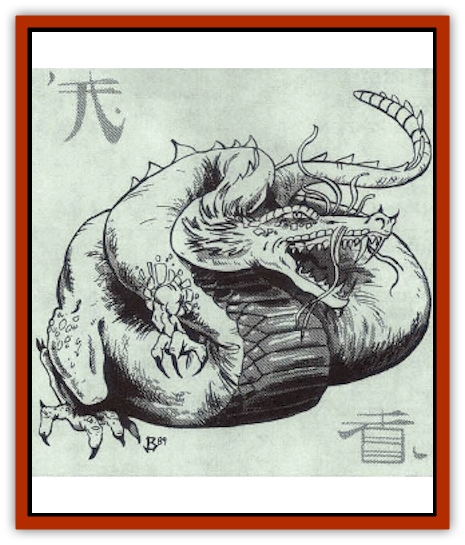

# Dragon - Oriental - Coiled - Pan Lung

| Statistic | **Dragon, Oriental, Coiled (Pan Lung)** |
| --- | --- |
| **Activity Cycle:** | Any |
| **Alignment:** | Chaotic neutral |
| **Armor Class:** | 0 (base) |
| **Climate/Terrain:** | Tropical, subtropical, temperate/Swamp and jungle |
| **Damage/Attack:** | 1-6/1-6/2-16 |
| **Diet:** | Special |
| **Frequency:** | Rare |
| **Hit Dice:** | 12 (base) |
| **Intelligence:** | High (13-14) |
| **Magic Resistance:** | Varies |
| **Morale:** | Fanatic (17) |
| **Movement:** | 12, Fl 18 (E), Sw 1 |
| **No. Appearing:** | 1-4 |
| **No. of Attacks:** | 3 + special |
| **Organization:** | Solitary or clan |
| **Size:** | G (54' base) |
| **Special Attacks:** | Snatch, tail slap, constriction and magical abilities |
| **Special Defenses:** | Varies |
| **THAC0:** | 9 |
| **Treasure:** | Special |
| **XP Value:** | Varies |

Pan lung are a thinner and longer variety of [[Dragon_Oriental_Spirit_Shen_Lung|shen lung]]. A hatchling has grey scales at birth, which change color as the [[Dragon_General_Information|dragon]] grows. Pan lung can be found in a number of brilliant hues, with various shades of red, orange, and green among the most common. A multi-colored mane surrounds its neck, and dark whiskers grow from its snout. Pan lung scales are naturally oily, which makes them gleam in the sunlight. Though wingless, pan lung have magical blood-red pearls imbedded in their brains that give them the ability to fly.

Pan lung speak their own tongue, which they share with the shen lung. They also speak the languages of fishes, reptiles, and the Celestial Court.

**Combat:** Pan lung prefer to appraise their adversaries before attacking, usually by casting *ventriloquism* or *phantasmal force* spells to distract them or by ordering minions to engage them in combat. Once the pan lung have evaluated their enemies' performance, they attack savagely, using claw/claw/bite attacks along with tail slaps (only adult or older pan lung can attack with a tail slap, inflicting damage equal to two claw attacks and affecting as many opponents as the dragon's age category; those within the sweep of the dragon's tail must roll successful saving throws vs. petrification or be stunned for 1d4+1 rounds).

Instead of a tail slap, a pan lung that is adult or older can encoil a victim in its tail, automatically inflicting 2d6 points of constriction damage per round (though there is a 50% chance that an encoiled victim's arms are pinned, making him unable to attack the dragon).

**Breath Weapon/Special Abilities:** From birth, pan lung can breathe both air and water and can cast *charm monster* spells three times per day. Additionally, they have the *scaly command* power over 1d10 creatures per age category of the dragon (a young pan lung, for instance, has the *scaly command* power over 3d10 creatures). They also can produce *water fire* that inflicts 1d6 points of damage from pan lung of age hatchling through young adult, 2d6 points of damage from pan lung of age adult through very old, and 3d6 points of damage from pan lung of age venerable through great wyrm.

As they age, pan lung gain the following additional abilities (each usable Ihree times per day):

*Young:* *Bless* or *curse*. *Young adult*: *Ventriloquism*. *Mature adult:* *Phantasmal force*.

**Habitat/Society:** A pan lung makes its lair in the crypt or temple it has been assigned to guard by the Celestial Bureaucracy. Guardianship is passed through successive generations; it is not unusual for a family to maintain the same lair for tens of thousands of years.

The gods often punish unfaithful human husbands and wives by making them minions of a pan lung. Pan lung minions do not age, and are typically condemned to serve for a term in years equal to the number of tears they have caused their mate to shed. A pan lung's minions obey it implicitly, fighting to the death if so ordered. There is a 25% chance a pan lung will have slaves (equal to half the number of creatures it can control by scaly command).

**Ecology:** Pan lung prefer to eat fruits and vegetables, often maintaining elaborate gardens that are cultivated by their minions. Generally, they are indifferent to the affairs of other [[Dragon_Oriental_Lung_General_Information|oriental dragons]] and cooperate with them only if so ordered by the Celestial Bureaucracy. 

They particularly resent the power and position of the [[Dragon_Oriental_Celestial_T'ien_Lung|t'ien lung (celestial dragons)]], and they have been known to attack them in a jealous frenzy.

| Age Category | Body Lgt. (') | Tail Lgt. (') | AC | MR | Treas. Type | XP Value |
| --- | --- | --- | --- | --- | --- | --- |
| 1 Hatchling | 6-18 | 4-14 | 3 | - | - | 1,400 |
| 2 Very young | 18-29 | 14-26 | 2 | - | - | 3,000 |
| 3 Young | 29-41 | 26-38 | 1 | - | - | 6,000 |
| 4 Juvenile | 41-53 | 38-49 | 0 | - | �H | 7,000 |
| 5 Young adult | 53-65 | 49-61 | -1 | 25% | ½H | 10,000 |
| 6 Adult | 65-77 | 61-73 | -2 | 30% | ½H | 11,000 |
| 7 Mature adult | 77-90 | 73-84 | -3 | 35% | ½H | 12,000 |
| 8 Old | 90-102 | 84-95 | -4 | 40% | H | 13,000 |
| 9 Very old | 102-114 | 95-106 | -5 | 45% | H | 14,000 |
| 10 Venerable | 114-126 | 106-118 | -6 | 50% | H | 15,000 |
| 11 Wyrm | 126-139 | 118-129 | -7 | 55% | Hx2 | 16,000 |
| 12 Great Wyrm | 139-142 | 129-141 | -8 | 60% | Hx2 | 17,000 |

---
## Discovery & Documentation

**Source Publication:** MC3 Volume III Forgotten Realms Appendix I (1989)
**Campaign Setting:** Forgotten Realms
**Author(s):** William Connors, David Martin, Rick Swan, Gary Thomas

### Other Creatures Found in This Source Book
   * [[Asperii|Asperii]]
   * [[Belabra|Belabra]]
   * [[Berbalang|Berbalang]]
   * [[Bhaergala|Bhaergala]]
   * [[Bichir|Bichir]]
   * [[Bunyip|Bunyip]]
   * [[Burbur|Burbur]]
   * [[Cloaker|Cloaker]]
   * [[Crawling_Claw|Crawling Claw]]
   * [[Darkenbeast|Darkenbeast]]
   * [[Dracolich|Dracolich]]
   * [[Dragon_Oriental_Carp_Yu_Lung|Dragon, Oriental, Carp (Yu Lung)]]
   * [[Dragon_Oriental_Celestial_T'ien_Lung|Dragon, Oriental, Celestial (T'ien Lung)]]
   * [[Dragon_Oriental_Earth_Li_Lung|Dragon, Oriental, Earth (Li Lung)]]
   * [[Dragon_Oriental_Lung_General_Information|Dragon, Oriental (Lung), General Information]]
   * [[Dragon_Oriental_River_Chiang_Lung|Dragon, Oriental, River (Chiang Lung)]]
   * [[Dragon_Oriental_Sea_Lung_Wang|Dragon, Oriental, Sea (Lung Wang)]]
   * [[Dragon_Oriental_Spirit_Shen_Lung|Dragon, Oriental, Spirit (Shen Lung)]]
   * [[Dragon_Oriental_Typhoon_Tun_Mi_Lung|Dragon, Oriental, Typhoon (Tun Mi Lung)]]
   * [[Dragonet_Faerie_Dragon|Dragonet, Faerie Dragon]]
   * [[Firenewt|Firenewt]]
   * [[Firestar|Firestar]]
   * [[Fish_Ascallion|Fish, Ascallion]]
   * [[Fish_Vurgens|Fish, Vurgens]]
   * [[Meazel|Meazel]]
   * [[Medusa_Maedar|Medusa, Maedar]]
   * [[Mist_Crimson_Death|Mist, Crimson Death]]
   * [[Revenant|Revenant]]
   * [[Rhaumbusun|Rhaumbusun]]
   * [[Strider_Giant|Strider, Giant]]
   * [[Thessalmonster|Thessalmonster]]
   * [[Web_Living|Web, Living]]
   * [[Wemic|Wemic]]
