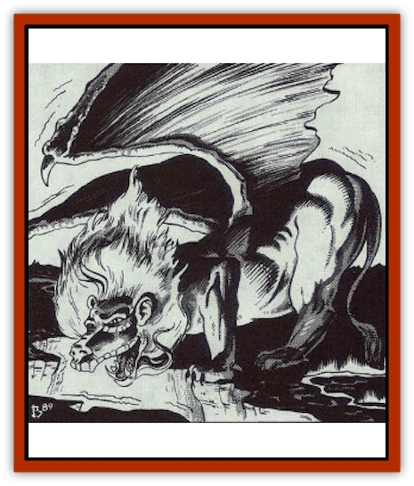

# Dragon - Oriental - Earth - Li Lung

| Statistic | **Dragon, Oriental, Earth (Li Lung)** |
| --- | --- |
| **Activity Cycle:** | Any |
| **Alignment:** | Neutral |
| **Armor Class:** | 2 (base) |
| **Climate/Terrain:** | Tropical, subtropical, temperate/Subterranean |
| **Damage/Attack:** | 2-8/2-8/2-20 |
| **Diet:** | Special |
| **Frequency:** | Rare |
| **Hit Dice:** | 13 (base) |
| **Intelligence:** | Average (8-10) |
| **Magic Resistance:** | Varies |
| **Morale:** | Champion (16) |
| **Movement:** | 12, Fl 30 (E), Sw 9, Br 9 |
| **No. Appearing:** | 1-4 |
| **No. of Attacks:** | 3 + special |
| **Organization:** | Solitary or clan |
| **Size:** | G (30' base) |
| **Special Attacks:** | Snatch, wing buffet, kick, and magical abilities |
| **Special Defenses:** | Varies |
| **THAC0:** | 7 |
| **Treasure:** | Special |
| **XP Value:** | Varies |

A li [[Dragon_Oriental_Lung_General_Information|lung]] (earth [[Dragon_General_Information|dragon]]) has a [[Cat_Great|lion's]] body and tail and a human face. Small black pupils are centered in its golden eyes, and colorful quills resembling the feathers of a peacock extend from its leathery wigs. As a hatchling, the li lung's body is covered with light green scales, but as it grows, the scales begin to darken and change into coarse fur. By the time the li lung grows into a juvenile, the scales are completely gone and the fur has the texture of thick wire. The fur continues to darken as it ages, turning nearly black by the time a li lung reaches the great wyrm stage

Li lung speak their own tongue, the language of the Celestial Court, and all human languages.

**Combat:** Li lung prefer to avoid combat, hiding in the shadows or burying themselves in rubble until all intruders leave. If cornered or attacked, li lung first use their earthquake ability in an attempt to bury their opponents. If this fails, they engage in vicious melee combat, using claw/claw/bite attacks on opponents in front, kicking attacks on opponents in back (kicks inflict claw damage; victims must roll their Dexterity or less on 1d20 or be kicked back 1d6 feet +1' per age category of the dragon and must also roll a successful saving throw vs. petrification, adjusted by the dragon's combat modifier, or fall), and wing buffets on opponents at the sides (only dragons that are young adult or older get this attack; damage is equal to a claw attack, and victims must roll their Dexterity or less on 1d20 or be knocked prone). Li lung roar continually while engaged in melee. Their rasapy roars sound like metal scraping against stone and are so loud that those within 60' can hear nothing else.

An airborne li lung can change direction quickly by executing a wingover maneuver, allowing it to make a turn of 120 to 240 degrees regardless of its speed or size. A li lung cannot gain altitude during the round when it performs a wingover, but it can dive.

**Breath Weapon/Special Abilities:** Li lung can create earthquakes once a day (as the spell but with no chance of it being dispelled) with a width and length (in yards) equal to 10 times their age level (for example, a young adult li lung can create an earthquake affecting an area 50 yards by 50 yards). Li lung are never harmed by an earthquake, regardless of whethter it was created naturally or by a li lung; if an earthquake brings down a cavern in which a li lung is living, it is only affected by the inconvenience of having to dig itself out of the rubble.

As they age, li lung gain the following additional abilities (each useable three times per day):

Juvenile: *Stone shape*; Adult: *Wall of stone*; Mature adult: *Move earth*

The powerful claws of the li lung enable it to burrow through the earth at a movement rate of 9 and through solid stone at a movement rate of 1. Though li lung can swim, they cannot breathe water.

**Habitat/Society:** Li lung lair in caverns at the end of winding labyrinths deep inside the earth, the farther away from civilization, the better. They seldom leave their lairs unless ordered to do so by the Celestial Bureaucracy, usually to punish heretical communities with their earthquake abilities, but sometimes to reward needy communities by revealing treasure mines or underground springs.

**Ecology:** Li lung mainly subsist on earth and stone, though they are fond of gold, silver, and other precious metals. Li lung rarely associate with other dragons and cooperate with them only on direct orders from the Celestial Bureaucracy.

| Age Category | Body Lgt. (') | AC | MR | Treas. Type | XP Value |
| --- | --- | --- | --- | --- | --- |
| 1 Hatchling | 4-11 | 5 | 0 | Nil | 975 |
| 2 Very young | 12-20 | 4 | 0 | Nil | 2,000 |
| 3 Young | 21-29 | 3 | 0 | Nil | 4,000 |
| 4 Juvenile | 30-38 | 2 | 0 | ½H | 5,000 |
| 5 Young adult | 39-48 | 1 | 10% | H | 8,000 |
| 6 Adult | 49-58 | 0 | 15% | H | 10,000 |
| 7 Mature adult | 59-69 | -1 | 20% | H | 11,000 |
| 8 Old | 70-79 | -2 | 25% | Hx2 | 12,000 |
| 9 Very old | 80-89 | -3 | 30% | Hx2 | 13,000 |
| 10 Venerable | 90-100 | -4 | 35% | Hx2 | 14,000 |
| 11 Wyrm | 101-110 | -5 | 40% | Hx3 | 15,000 |
| 12 Great Wyrm | 111-120 | -6 | 45% | Hx3 | 16,000 |

---
## Discovery & Documentation

**Source Publication:** MC3 Volume III Forgotten Realms Appendix I (1989)
**Campaign Setting:** Forgotten Realms
**Author(s):** William Connors, David Martin, Rick Swan, Gary Thomas

### Other Creatures Found in This Source Book
   * [[Asperii|Asperii]]
   * [[Belabra|Belabra]]
   * [[Berbalang|Berbalang]]
   * [[Bhaergala|Bhaergala]]
   * [[Bichir|Bichir]]
   * [[Bunyip|Bunyip]]
   * [[Burbur|Burbur]]
   * [[Cloaker|Cloaker]]
   * [[Crawling_Claw|Crawling Claw]]
   * [[Darkenbeast|Darkenbeast]]
   * [[Dracolich|Dracolich]]
   * [[Dragon_Oriental_Carp_Yu_Lung|Dragon, Oriental, Carp (Yu Lung)]]
   * [[Dragon_Oriental_Celestial_T'ien_Lung|Dragon, Oriental, Celestial (T'ien Lung)]]
   * [[Dragon_Oriental_Coiled_Pan_Lung|Dragon, Oriental, Coiled (Pan Lung)]]
   * [[Dragon_Oriental_Lung_General_Information|Dragon, Oriental (Lung), General Information]]
   * [[Dragon_Oriental_River_Chiang_Lung|Dragon, Oriental, River (Chiang Lung)]]
   * [[Dragon_Oriental_Sea_Lung_Wang|Dragon, Oriental, Sea (Lung Wang)]]
   * [[Dragon_Oriental_Spirit_Shen_Lung|Dragon, Oriental, Spirit (Shen Lung)]]
   * [[Dragon_Oriental_Typhoon_Tun_Mi_Lung|Dragon, Oriental, Typhoon (Tun Mi Lung)]]
   * [[Dragonet_Faerie_Dragon|Dragonet, Faerie Dragon]]
   * [[Firenewt|Firenewt]]
   * [[Firestar|Firestar]]
   * [[Fish_Ascallion|Fish, Ascallion]]
   * [[Fish_Vurgens|Fish, Vurgens]]
   * [[Meazel|Meazel]]
   * [[Medusa_Maedar|Medusa, Maedar]]
   * [[Mist_Crimson_Death|Mist, Crimson Death]]
   * [[Revenant|Revenant]]
   * [[Rhaumbusun|Rhaumbusun]]
   * [[Strider_Giant|Strider, Giant]]
   * [[Thessalmonster|Thessalmonster]]
   * [[Web_Living|Web, Living]]
   * [[Wemic|Wemic]]
