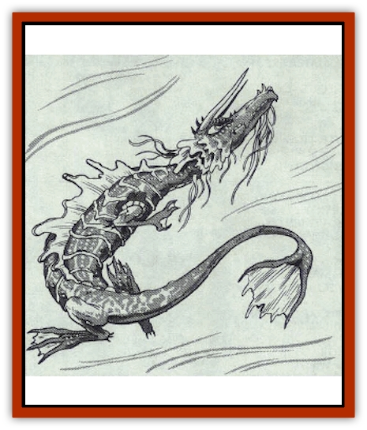

# Dragon - Oriental - River - Chiang Lung

| Statistic | **Dragon, Oriental, River (Chiang Lung)** |
| --- | --- |
| **Activity Cycle:** | Any |
| **Alignment:** | Lawful neutral (good) |
| **Armor Class:** | 0 (base) |
| **Climate/Terrain:** | Tropical, subtropical, and temperate lakes and rivers |
| **Damage/Attack:** | 1-8/1-8/3-36 |
| **Diet:** | Special |
| **Frequency:** | Rare |
| **Hit Dice:** | 15 (base) |
| **Intelligence:** | High to genius (11-18) |
| **Magic Resistance:** | Varies |
| **Morale:** | Fanatic (18) |
| **Movement:** | 12, Fl 18 (E), Sw 24 |
| **No. Appearing:** | 1-2 |
| **No. of Attacks:** | 3+special |
| **Organization:** | Solitary or pair |
| **Size:** | G (50' base) |
| **Special Attacks:** | Snatch, tail slap, and magical abilities |
| **Special Defenses:** | Varies |
| **THAC0:** | 5 |
| **Treasure:** | Special |
| **XP Value:** | Varies |

Chiang [[Dragon_Oriental_Lung_General_Information|lung]] resemble giant serpents; it is difficult to determine where their bodies end and their tails begin. Though wingless, they are able to fly though the power of magical blue pearls imbedded in their brains. Their bodies are various shades of blue and green; their bellies are brilliant yellow. Multi-colored beards sprout beneath the chins of young adult and Chiang lung are often encountered in human form, which they seem to prefer over their natural bodies.

Chiang lung speak their own tongue, the languages of [[Dragon_Oriental_Spirit_Shen_Lung|shen lung]], [[Fish|fishes]], and the Celestial Court, and all human languages.

**Combat:** Chiang lung prefer to avoid combat, but they fight fiercely to protect their domain. In combat, they charge for a claw/claw/bite attack, maneuvering into position for a tail slap at the earliest opportunity (only adult or older chiang lung can attack with a tail slap, inflicting damage equal to two claw attacks and affecting as many opponents as the dragon's age category; those within the sweep of the dragon's tail must roll successful saving throws vs. petrification or be stunned for 1d4+1 rounds).

If in human form, a chiang lung is automatically armed with a sword +5; this blade is so massive that others must make a successful bend bars/lift gates roll to use it.

**Breath Weapon/Special Abilities:** From birth, chiang lung can breathe both water and air and can polymorph three times per day to any form desired. They can expel storm clouds at will, enabling them to cause rain whenever and wherever they choose. They can also lower water in a one-square-mile radius per age level at will. Any person in physical contact with a chiang can breath and move underwater as if he were on dry land. As they age, chiang lung gain the following additional abilities (older chiang lung have all the abilities listed in the younger categories):

Young: *Bless* and *curse*, each once per round; Juvenile: *Omen* and *fate*, each once per round; Adult: *Dispel evil*, *control weather*, and *remove curse*, each once per day; Great wyrm: *Tsunami* once per day*

* Only when so ordered by the Celestial Bureaucracy; disobedience is punishable by death.

**Habitat/Society:** The Celestial Bureaucracy assigns a chiang lung to every river and lake. Their lairs are magical palaces located beneath the water's surface; regardless of the size of the river or lake, the palace is always opulent and immense. Unless freely given by the chiang lung, items taken from the palace become worthless upon reaching the surface. Chiang lung sometimes entertain virtuous scholars and men of learning and art on lavishly decorated boats, posing as wealthy nobles or government officials.

The daughters of chiang lung are often attracted to handsome human males, occasionally resulting in secret love affairs and marriage. Such liaisons usually end sadly when the daughters return home, never to see their husbands or lovers again. Children born of such a marriage are [[Spirit_Folk|spirit folk]].

**Ecology:** Chian lung can eat any type of mineral or gem, but they also have a taste for fish and sheep. They are always attended by lesser nature spirits (who also assume human form) in their palaces and have 1d6 shen lung acting as bodyguards and aides. There is a 75% chance of having 2d4 offspring in their palaces. When encountered outside their lair, there is a 75% chance they are accompanied by 1d4 lesser nature spirits and a 40% chance that 1-2 shen lung are present.

| Age Category | Body Lgt. (') | Tail Lgt (') | AC | MR | Treas. Type | XP Value |
| --- | --- | --- | --- | --- | --- | --- |
| 1 Hatchling | 4-13 | 3-10 | 3 | � | � | 2,000 |
| 2 Very young | 13-25 | 10-22 | 2 | � | � | 4,000 |
| 3 Young | 25-39 | 22-35 | 1 | � | � | 6,000 |
| 4 Juvenile | 39-51 | 35-47 | 0 | � | ½F | 8,000 |
| 5 Young adult | 51-63 | 47-57 | -1 | 35% | F | 11,000 |
| 6 Adult | 63-76 | 57-67 | -2 | 40% | F | 12,000 |
| 7 Mature adult | 76-90 | 67-87 | -3 | 45% | F | 13,000 |
| 8 Old | 90-103 | 87-97 | -4 | 50% | Fx2 | 14,000 |
| 9 Very old | 103-116 | 97-108 | -5 | 55% | Fx2 | 15,000 |
| 10 Venerable | 116-130 | 108-119 | -6 | 60% | Fx2 | 16,000 |
| 11 Wyrm | 130-144 | 119-130 | -7 | 65% | Fx3 | 17,000 |
| 12 Great Wyrm | 144-158 | 130-142 | -8 | 70% | Fx3 | 18,000 |

---
## Discovery & Documentation

**Source Publication:** MC3 Volume III Forgotten Realms Appendix I (1989)
**Campaign Setting:** Forgotten Realms
**Author(s):** William Connors, David Martin, Rick Swan, Gary Thomas

### Other Creatures Found in This Source Book
   * [[Asperii|Asperii]]
   * [[Belabra|Belabra]]
   * [[Berbalang|Berbalang]]
   * [[Bhaergala|Bhaergala]]
   * [[Bichir|Bichir]]
   * [[Bunyip|Bunyip]]
   * [[Burbur|Burbur]]
   * [[Cloaker|Cloaker]]
   * [[Crawling_Claw|Crawling Claw]]
   * [[Darkenbeast|Darkenbeast]]
   * [[Dracolich|Dracolich]]
   * [[Dragon_Oriental_Carp_Yu_Lung|Dragon, Oriental, Carp (Yu Lung)]]
   * [[Dragon_Oriental_Celestial_T'ien_Lung|Dragon, Oriental, Celestial (T'ien Lung)]]
   * [[Dragon_Oriental_Coiled_Pan_Lung|Dragon, Oriental, Coiled (Pan Lung)]]
   * [[Dragon_Oriental_Earth_Li_Lung|Dragon, Oriental, Earth (Li Lung)]]
   * [[Dragon_Oriental_Lung_General_Information|Dragon, Oriental (Lung), General Information]]
   * [[Dragon_Oriental_Sea_Lung_Wang|Dragon, Oriental, Sea (Lung Wang)]]
   * [[Dragon_Oriental_Spirit_Shen_Lung|Dragon, Oriental, Spirit (Shen Lung)]]
   * [[Dragon_Oriental_Typhoon_Tun_Mi_Lung|Dragon, Oriental, Typhoon (Tun Mi Lung)]]
   * [[Dragonet_Faerie_Dragon|Dragonet, Faerie Dragon]]
   * [[Firenewt|Firenewt]]
   * [[Firestar|Firestar]]
   * [[Fish_Ascallion|Fish, Ascallion]]
   * [[Fish_Vurgens|Fish, Vurgens]]
   * [[Meazel|Meazel]]
   * [[Medusa_Maedar|Medusa, Maedar]]
   * [[Mist_Crimson_Death|Mist, Crimson Death]]
   * [[Revenant|Revenant]]
   * [[Rhaumbusun|Rhaumbusun]]
   * [[Strider_Giant|Strider, Giant]]
   * [[Thessalmonster|Thessalmonster]]
   * [[Web_Living|Web, Living]]
   * [[Wemic|Wemic]]
