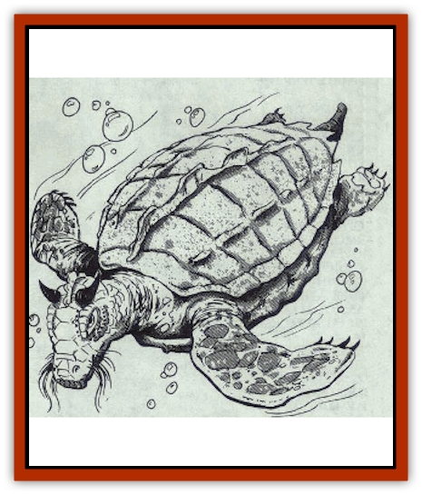

# Dragon - Oriental - Sea - Lung Wang

| Statistic | **Dragon, Oriental, Sea (Lung Wang)** |
| --- | --- |
| **Activity Cycle:** | Any |
| **Alignment:** | Neutral |
| **Armor Class:** | -2 (base) |
| **Climate/Terrain:** | Tropical, subtropical, temperate/Ocean |
| **Damage/Attack:** | 1-12/1-12/3-36 |
| **Diet:** | Special |
| **Frequency:** | Very rare |
| **Hit Dice:** | 15 (base) |
| **Intelligence:** | Very (11-12) |
| **Magic Resistance:** | Varies |
| **Morale:** | Fanatic (18 base) |
| **Movement:** | 3, Sw 12 |
| **No. Appearing:** | 1 |
| **No. of Attacks:** | 3+special |
| **Organization:** | Solitary |
| **Size:** | G (40' base) |
| **Special Attacks:** | Breath weapon and magical abilities |
| **Special Defenses:** | Varies |
| **THAC0:** | 5 |
| **Treasure:** | Special |
| **XP Value:** | Varies |

A relative of the [[Dragon_Turtle|dragon turtle]], a lung wang (sea dragon) has a turtle's body, a crested neck, and a head like a shen lung (spirit dragon), complete with long, golden whiskers. Its shell is made of thick green scales with silver flecks. Smaller scales, lighter green with golden flecks, cover its neck and head. Its hind legs are little more than stumpy flippers, but its front legs are formidable weapons - each is 80% the length of its shell, ending in two razor-sharped talons.

Lung wang speak their own tongue, the languages of shen lung, fishes, and the Celestial Court, and all human languages.

**Combat:** Though unable to fly and physically unable to attack with kicks, tail slaps, or wing buffets, lung wang are nevertheless awesome opponents and are especially menacing to passing ships.

If an unauthorized vessel enters the waters of a lung wang, it surfaces beneath the vessel and attempts to capsize it. The chance of capsizing a ship is equal to the percentage ration of the ship's size to the lung wang's size (divide the lung wang's size by the ship's size and multiply the result by 100; for instance, if a 20-foot lung wang attempts to capsize an 80-foot ship, it has a 25% chance of success). This chance never exceeds 95%; therefore, a lung wang always has a 95% chance of capsizing a ship the same size as itself or smaller.

Once a ship is capsized, the lung wang attacks with its breath weapon and attempts claw/claw/bite attacks on all victims it can reach. If the victims are sufficiently deferential to the lung wang and offer it a sizeable treasure (usually the ship's entire hoard), the lung wang may show mercy; otherwise, it will attempt to slaughter all of the ship's passengers as punishment for entering its water uninvited. Lung wang are equally merciless to underwater intruders, attacking them in a similar fashiaon.

**Breath Weapon/Special Abilities:** A lung wang's breath weapon is a cone of steam 100' long, 5' wide at the dragon's mouth, and 50' wide at the base. Damage caused by the breath weapon varies with the dragon's age (see table). Victims caught in the blast get to roll a saving throw vs. breath weapon for half damage. The breath weapon is as effective underwater as it is in the open air and can be used three times per day.

From birth, lung wang can breath both water and air. They have the *scaly command* power over 4d10 creatures times the age category of the [[Dragon_General_Information|dragon]] (a young lung wang, for instance, has the *scaly command* over 4d10x3 creatures). Lung wang are also immune to all heat and fire attacks, magical and otherwise.

As they age, lung wang gain the following additional abilities (each useable once per day):

Adult: *Wall of fog* (obscures vision in a radius equal to 50 feet multiplied by the dragon's age category); Old: *Suggestion*

**Habitat/Society:** As rulers of the sea, lung wang demand tribute from every passing ship. Regular travelers often work out an arrangement, dumping a pre-determined amount of treasure overboard at a given spot to placate the lung wang.

**Ecology:** Unlike other [[Dragon_Oriental_Lung_General_Information|oriental dragons]], lung wang are basically herbivorous and prefer to eat algae and seaweed. They will, however, eat fish and minerals and have been known to consume entire ships. Lung wang maintain cordial relationships with other oriental dragons, particularly shen lung. They are friendly with [[Shark|sharks]], [[Whale|whales]], and other ocean denizens on whom they rely for information. They do not get along with [[Dragon_Oriental_Typhoon_Tun_Mi_Lung|mi lung (typhoon dragons)]].

| Age Category | Body Diameter (') | AC | Breath Weapon | MR | Treas. Type | XP Value |
| --- | --- | --- | --- | --- | --- | --- |
| 1 Hatchling | 6-13 | 1 | 1d8+1 | � | � | 2,000 |
| 2 Very young | 13-22 | 0 | 2d8+2 | � | � | 5,000 |
| 3 Young | 22-32 | -1 | 3d8+3 | � | � | 7,000 |
| 4 Juvenile | 32-43 | -2 | 4d8+4 | � | H | 8,000 |
| 5 Young adult | 43-55 | -3 | 5d8+5 | 15% | Hx2 | 11,000 |
| 6 Adult | 55-66 | -4 | 6d8+6 | 20% | Hx2 | 12,000 |
| 7 Mature adult | 66-78 | -5 | 7d8+7 | 25% | Hx2 | 13,000 |
| 8 Old | 78-80 | -6 | 8d8+8 | 30% | HRx2 | 14,000 |
| 9 Very old | 80-93 | -7 | 9d8+9 | 35% | HRx2 | 15,000 |
| 10 Venerable | 93-106 | -8 | 10d8+10 | 40% | HRx2 | 16,000 |
| 11 Wyrm | 106-123 | -9 | 11d8+11 | 45% | HRx3 | 17,000 |
| 12 Great Wyrm | 123-135 | -10 | 12d8+12 | 50% | HRx3 | 18,000 |

---
## Discovery & Documentation

**Source Publication:** MC3 Volume III Forgotten Realms Appendix I (1989)
**Campaign Setting:** Forgotten Realms
**Author(s):** William Connors, David Martin, Rick Swan, Gary Thomas

### Other Creatures Found in This Source Book
   * [[Asperii|Asperii]]
   * [[Belabra|Belabra]]
   * [[Berbalang|Berbalang]]
   * [[Bhaergala|Bhaergala]]
   * [[Bichir|Bichir]]
   * [[Bunyip|Bunyip]]
   * [[Burbur|Burbur]]
   * [[Cloaker|Cloaker]]
   * [[Crawling_Claw|Crawling Claw]]
   * [[Darkenbeast|Darkenbeast]]
   * [[Dracolich|Dracolich]]
   * [[Dragon_Oriental_Carp_Yu_Lung|Dragon, Oriental, Carp (Yu Lung)]]
   * [[Dragon_Oriental_Celestial_T'ien_Lung|Dragon, Oriental, Celestial (T'ien Lung)]]
   * [[Dragon_Oriental_Coiled_Pan_Lung|Dragon, Oriental, Coiled (Pan Lung)]]
   * [[Dragon_Oriental_Earth_Li_Lung|Dragon, Oriental, Earth (Li Lung)]]
   * [[Dragon_Oriental_Lung_General_Information|Dragon, Oriental (Lung), General Information]]
   * [[Dragon_Oriental_River_Chiang_Lung|Dragon, Oriental, River (Chiang Lung)]]
   * [[Dragon_Oriental_Spirit_Shen_Lung|Dragon, Oriental, Spirit (Shen Lung)]]
   * [[Dragon_Oriental_Typhoon_Tun_Mi_Lung|Dragon, Oriental, Typhoon (Tun Mi Lung)]]
   * [[Dragonet_Faerie_Dragon|Dragonet, Faerie Dragon]]
   * [[Firenewt|Firenewt]]
   * [[Firestar|Firestar]]
   * [[Fish_Ascallion|Fish, Ascallion]]
   * [[Fish_Vurgens|Fish, Vurgens]]
   * [[Meazel|Meazel]]
   * [[Medusa_Maedar|Medusa, Maedar]]
   * [[Mist_Crimson_Death|Mist, Crimson Death]]
   * [[Revenant|Revenant]]
   * [[Rhaumbusun|Rhaumbusun]]
   * [[Strider_Giant|Strider, Giant]]
   * [[Thessalmonster|Thessalmonster]]
   * [[Web_Living|Web, Living]]
   * [[Wemic|Wemic]]
