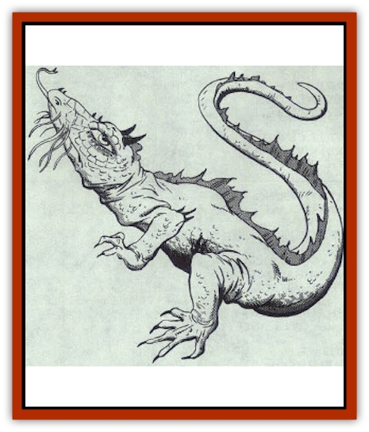

# Dragon - Oriental - Spirit - Shen Lung

| Statistic | **Dragon, Oriental, Spirit (Shen Lung)** |
| --- | --- |
| **Activity Cycle:** | Any |
| **Alignment:** | Chaotic neutral |
| **Armor Class:** | -1 (base) |
| **Climate/Terrain:** | Tropical, subtropical, temperate/Lakes and rivers |
| **Damage/Attack:** | 1-8/1-8/2-24/1-10 |
| **Diet:** | Special |
| **Frequency:** | Rare |
| **Hit Dice:** | 14 (base) |
| **Intelligence:** | High (13-14) |
| **Magic Resistance:** | Varies |
| **Morale:** | Fanatic (17) |
| **Movement:** | 12, Fl 18 (E), Sw 9 |
| **No. Appearing:** | 1-4 |
| **No. of Attacks:** | 4+special |
| **Organization:** | Solitary or clan |
| **Size:** | G (48' base) |
| **Special Attacks:** | Snatch, tail slap, kick, and magical abilities |
| **Special Defenses:** | Varies |
| **THAC0:** | 7 |
| **Treasure:** | Special |
| **XP Value:** | Varies |

Shen lung (spirit [[Dragon_General_Information|dragons]]) are slender and bright-eyed, with spiked tails, ridged backs, and two sharp horns rising from the tops of their heads. Golden whiskers grow from their snouts. The scales of hatchlings are dull shades of red, blue, green, orange, or any combination of these colors; the scales brighten into brilliant hues by the time a shen lung reaches the age of young adult. Though wingless, shen lung can fly through the power of a magical yellow pearl imbedded in their brains; the pearl is similar to that of the t'ien lung. Shen lung speak their own tongue (which they share with [[Dragon_Oriental_Coiled_Pan_Lung|pan lung]]), the languages of [[Dragon_Oriental_River_Chiang_Lung|chiang lung]], [[Fish|fishes]], reptiles, and the Celestial Court, and all human languages.

**Combat:** Unless the opponents are openly hostile, shen lung usually parley before combat. If the opponents are resistant or their responses are unsatisfactory, sher lung engage in vicious melee, augmenting their attacks with *water fire*, assaults from the companions under their *scaly command*, and, if available, *ice storm*. Unlike other [[Dragon_Oriental_Lung_General_Information|oriental dragons]], shen lung can perform claw/claw/bite/tail attacks; the powerful spiked tail can easily reach opponents to the dragons' side and front. Shen lung can also attack with tail slaps (only adult or older shen lung can attack as many opponents as the dragon's age category; those within the sweep of the dragon's tail must roll successful saving throws vs. petrification or be stunned for 1d4+1 rounds) and kicking attacks on opponents in back (kicks inflict claw damage; victims must roll their Dexterily or less on 1d20 or be kicked back 1d6 feet +1 foot per age category of the dragon and must also roll asuccessful saving throw vs. petrification, adjusted by the dragon's combat modifier, or fall).

**Breath Weapon/Special Abilities:** From birth, shen lung can breathe both water and air. They have the *scaly command* power over 2d10 creatures times the age level of the dragon (a young shen lung, for instance, has the scaly command power over 6d10 creatures). They also can produce *water fire* that inflicts 2d6 points of damage from dragons of age hatchling through young adult, 3d6 points of damage from dragons of age adult through very old, and 4d6 points of damage from dragons of age venerable through great wyrm. Shen lung are also immune to lightning and all forms of poison, but suffer double damage from all fire-based attacks, magical or otherwise. No insect, arachnid, or arthropod can approach a shen lung within a radius of 60'. As they age, shen lung gain the following additional abilities:

Young: *Bless* and *curse*, each once per day; Young adult: *Ice storm* three times per day; Adult: *Control weather *three times per day.

**Habitat/Society:** Shen lung are most commonly encountered in the company of the chiang lung they have been assigned by the Celestial Bureaucracy to assist and guard; 1d6 shen lung usually accompany a single chiang lung. Shen lung lair in modest but well-kept mansions of stone at the bottoms of rivers and lakes, usually not far from the palaces of their chiang lung.

**Ecology:** Shen lung sustain themselves on any type of precious gems, although they also enjoy fish and rodents. They are intensely loyal to their chiang lung and also maintain close relationships with nature spirits. Most are fascinated by humans, often taking human form to mingle in human villages. Humans, in turn, view shen lung as messengers of the gods and bringers of good fortune, constructing ornate shrines and staging elaborate ceremonies to gain their favor.

| Age Category | Body Lgt. (') | Tail Lgt. (') | AC | MR | Treas. Type | XP Value |
| --- | --- | --- | --- | --- | --- | --- |
| 1 Hatchling | 3-12 | 2-9 | 2 | � | � | 1,400 |
| 2 Very young | 12-23 | 9-19 | 1 | � | � | 3,000 |
| 3 Young | 23-34 | 19-32 | 0 | � | � | 6,000 |
| 4 Juvenile | 34-47 | 32-45 | -1 | � | ½H | 7,000 |
| 5 Young adult | 47-60 | 45-56 | -2 | 20% | H | 10,000 |
| 6 Adult | 60-73 | 56-67 | -3 | 25% | H | 11,000 |
| 7 Mature adult | 73-86 | 67-79 | -4 | 30% | H | 12,000 |
| 8 Old | 86-99 | 79-91 | -5 | 35% | Hx2 | 13,000 |
| 9 Very old | 100-112 | 91-103 | -6 | 40% | Hx2 | 14,000 |
| 10 Venerable | 112-125 | 103-115 | -7 | 45% | Hx2 | 15,000 |
| 11 Wyrm | 125-138 | 115-127 | -8 | 50% | Hx3 | 16,000 |
| 12 Great Wyrm | 138-151 | 127-140 | -9 | 55% | Hx3 | 17,000 |

---
## Discovery & Documentation

**Source Publication:** MC3 Volume III Forgotten Realms Appendix I (1989)
**Campaign Setting:** Forgotten Realms
**Author(s):** William Connors, David Martin, Rick Swan, Gary Thomas

### Other Creatures Found in This Source Book
   * [[Asperii|Asperii]]
   * [[Belabra|Belabra]]
   * [[Berbalang|Berbalang]]
   * [[Bhaergala|Bhaergala]]
   * [[Bichir|Bichir]]
   * [[Bunyip|Bunyip]]
   * [[Burbur|Burbur]]
   * [[Cloaker|Cloaker]]
   * [[Crawling_Claw|Crawling Claw]]
   * [[Darkenbeast|Darkenbeast]]
   * [[Dracolich|Dracolich]]
   * [[Dragon_Oriental_Carp_Yu_Lung|Dragon, Oriental, Carp (Yu Lung)]]
   * [[Dragon_Oriental_Celestial_T'ien_Lung|Dragon, Oriental, Celestial (T'ien Lung)]]
   * [[Dragon_Oriental_Coiled_Pan_Lung|Dragon, Oriental, Coiled (Pan Lung)]]
   * [[Dragon_Oriental_Earth_Li_Lung|Dragon, Oriental, Earth (Li Lung)]]
   * [[Dragon_Oriental_Lung_General_Information|Dragon, Oriental (Lung), General Information]]
   * [[Dragon_Oriental_River_Chiang_Lung|Dragon, Oriental, River (Chiang Lung)]]
   * [[Dragon_Oriental_Sea_Lung_Wang|Dragon, Oriental, Sea (Lung Wang)]]
   * [[Dragon_Oriental_Typhoon_Tun_Mi_Lung|Dragon, Oriental, Typhoon (Tun Mi Lung)]]
   * [[Dragonet_Faerie_Dragon|Dragonet, Faerie Dragon]]
   * [[Firenewt|Firenewt]]
   * [[Firestar|Firestar]]
   * [[Fish_Ascallion|Fish, Ascallion]]
   * [[Fish_Vurgens|Fish, Vurgens]]
   * [[Meazel|Meazel]]
   * [[Medusa_Maedar|Medusa, Maedar]]
   * [[Mist_Crimson_Death|Mist, Crimson Death]]
   * [[Revenant|Revenant]]
   * [[Rhaumbusun|Rhaumbusun]]
   * [[Strider_Giant|Strider, Giant]]
   * [[Thessalmonster|Thessalmonster]]
   * [[Web_Living|Web, Living]]
   * [[Wemic|Wemic]]
