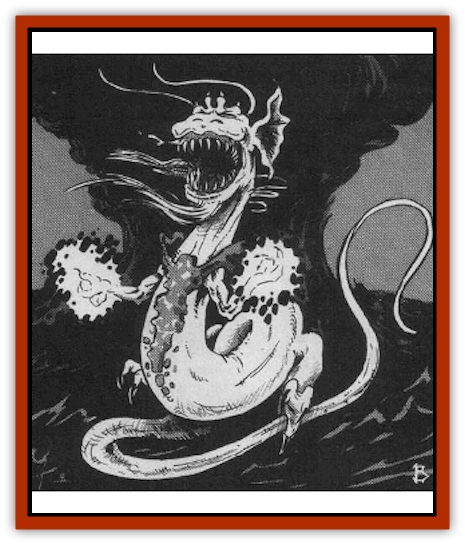

# Dragon - Oriental - Typhoon - Tun Mi Lung

| Statistic | **Dragon, Oriental, Typhoon (Tun Mi Lung)** |
| --- | --- |
| **Activity Cycle:** | Any |
| **Alignment:** | Neutral evil |
| **Armor Class:** | -3 (base) |
| **Climate/Terrain:** | Tropical, subtropical, temperate/Oceans |
| **Damage/Attack:** | 1-6/1-6/2-20 |
| **Diet:** | Special |
| **Frequency:** | Rare |
| **Hit Dice:** | 15 (base) |
| **Intelligence:** | Average (8-10) |
| **Magic Resistance:** | Varies |
| **Morale:** | Fanatic (17) |
| **Movement:** | 12, Fl 48 (E), Sw 12 |
| **No. Appearing:** | 1 |
| **No. of Attacks:** | 3 + special |
| **Organization:** | Solitary |
| **Size:** | G (60' base) |
| **Special Attacks:** | Snatch, tail slaps, and magical abilities |
| **Special Defenses:** | Varies |
| **THAC0:** | 5 |
| **Treasure:** | Special |
| **XP Value:** | Varies |

Tun mi lung, also known as typhoon [[Dragon_General_Information|dragons]], have been charged by the Celestial Emperor to dispense destructive hurricanes and typhoons, a task they greatly enjoy. Though tun mi lung are only supposed to cause storms when directed to do so by the Celestial Bureaucracy, they often ignore their orders, launching into rampages of destruction to ravage the coasts of warmer lands out of sheer maliciousness. Such is the power of the tun mi lung that the Celestial Emperor must send [[Dragon_Oriental_Celestial_T'ien_Lung|t'ien lung]] to rein them in.

The largest of the [[Dragon_Oriental_Lung_General_Information|oriental dragons]], tun mi lung have long, sinuous bodies covered with thick scales in a variety of colors, with blue-green, dark red, and violet among the most common. They have dark beady eyes, stringy beards dangling from their chins, and enormous jaws lined with hooked teeth as sharp as razors. Though wingless, tun mi lung can fly from the power of a magical black pearl imbedded in their brains.

Tun mi lung speak their own language, the languages of all sea creatures, the Sea Lords, and the Celestial Court, and all human languages.

**Combat:** If possible, tun mi lung will always attack with their *divine wind* power, supplemented with *lightning bolt* spells as needed. Otherwise, tun mi lung resort to melee combat, first casting *darkness* (if available), then ripping and snapping with claw/claw/bite attacks. Tun mi lung are physically unable to conduct effective kicking attacks, but can attack with tail slaps (only adult or older tun mi lung can attack with tail slaps, inflicting damage equal to two claw attacks and affecting as many opponents as the dragon's age category; those within the sweep of the dragon's tail must roll successful saving throws vs. petrification or be stunned for 1d4+1 rounds).

**Breath Weapon/Special Abilities:** From birth, tun mi lung can breathe both air and water and are immune to all water-based and air-based attacks. Additionally, they can summon a *divine wind* of great strength once per week. These winds automatically capsize small boats and have a 70% chance of capsizing large boats, a 70% chance of snapping tree trunks, a 70% chance of knocking man-sized victims to the ground (victims suffer 1d6 points of damage for every 10' blown by the wind). Flying victims arc blown backward 50-100', and all victims exposed to the winds suffer 1d10 points of damage per turn. The radius of the effect (in miles) equals five times the dragon's age level. The duration of the effect is 6d4 hours. As they age, tun mi lung gain the following additional powers:

Juvenile: *Darkness* with a radius equal to 50' times the dragon's age level, once per day; Adult: *Lighting bolt 20' long that inflicts 6d6 points of damage, three times per day (increasing to six times per day for dragons of venerable age or older)

**Habitat/Society:** Nothing conclusive is known of tun mi lung lairs, though it is believed that they maintain lavish palaces on the ocean floor. Because they are disliked by the more peaceful and cultured creatures of the sea, their lairs presumably are located in remote areas of the ocean. Tun mi lung spend most of their time roaming up and down the sea coasts or circling in the skies above the open ocean, usually in the centers of *divine winds* of their own creation, which move with them as they travel. Tun mi lung shun the company of other creatures, including other tun mi lung. Female tun mi lung abandon their offspring as soon as they hatch; infant mortality is high, accounting for the relative scarcity of this subspecies.

**Ecology:** When it comes to food, tun mi lung are the least choosy of all oriental dragons, equally fond of fish, precious gems, and capsized ships. Oblivious to the territorial claims of other dragons, tun mi lung are particularly disliked by the seafaring <a href="/appendix/dragosea"lung wang</a>.

| Age Category | Body Lgt. (') | Tail Lgt. (') | AC | MR | Treas. Type | X.P. Value |
| --- | --- | --- | --- | --- | --- | --- |
| 1 Hatchling | 9-21 | 7-17 | 0 | � | � | 2,000 |
| 2 Very young | 21-33 | 17-28 | -1 | � | � | 4,000 |
| 3 Young | 33-45 | 28-39 | -2 | � | � | 6,000 |
| 4 Juvenile | 45-57 | 39-50 | -3 | � | ½F | 7,000 |
| 5 Young adult | 57-70 | 50-62 | -4 | 25% | F | 10,000 |
| 6 Adult | 70-83 | 62-74 | -5 | 30% | F | 11.000 |
| 7 Mature adult | 83-96 | 74-86 | -6 | 35% | F | 12,000 |
| 8 Old | 96-110 | 86-98 | -7 | 40% | Fx2 | 13.000 |
| 9 Very old | 110-124 | 98-110 | -8 | 45% | Fx2 | 14,000 |
| 10 Venerable | 124-138 | 110-122 | -9 | 50% | Fx2 | 15,000 |
| 11 Wyrm | 138-152 | 122-134 | -10 | 55% | Fx3 | 16,000 |
| 12 Great Wyrm | 152-167 | 134-146 | -11 | 60% | Fx3 | 17,000 |

---
## Discovery & Documentation

**Source Publication:** MC3 Volume III Forgotten Realms Appendix I (1989)
**Campaign Setting:** Forgotten Realms
**Author(s):** William Connors, David Martin, Rick Swan, Gary Thomas

### Other Creatures Found in This Source Book
   * [[Asperii|Asperii]]
   * [[Belabra|Belabra]]
   * [[Berbalang|Berbalang]]
   * [[Bhaergala|Bhaergala]]
   * [[Bichir|Bichir]]
   * [[Bunyip|Bunyip]]
   * [[Burbur|Burbur]]
   * [[Cloaker|Cloaker]]
   * [[Crawling_Claw|Crawling Claw]]
   * [[Darkenbeast|Darkenbeast]]
   * [[Dracolich|Dracolich]]
   * [[Dragon_Oriental_Carp_Yu_Lung|Dragon, Oriental, Carp (Yu Lung)]]
   * [[Dragon_Oriental_Celestial_T'ien_Lung|Dragon, Oriental, Celestial (T'ien Lung)]]
   * [[Dragon_Oriental_Coiled_Pan_Lung|Dragon, Oriental, Coiled (Pan Lung)]]
   * [[Dragon_Oriental_Earth_Li_Lung|Dragon, Oriental, Earth (Li Lung)]]
   * [[Dragon_Oriental_Lung_General_Information|Dragon, Oriental (Lung), General Information]]
   * [[Dragon_Oriental_River_Chiang_Lung|Dragon, Oriental, River (Chiang Lung)]]
   * [[Dragon_Oriental_Sea_Lung_Wang|Dragon, Oriental, Sea (Lung Wang)]]
   * [[Dragon_Oriental_Spirit_Shen_Lung|Dragon, Oriental, Spirit (Shen Lung)]]
   * [[Dragonet_Faerie_Dragon|Dragonet, Faerie Dragon]]
   * [[Firenewt|Firenewt]]
   * [[Firestar|Firestar]]
   * [[Fish_Ascallion|Fish, Ascallion]]
   * [[Fish_Vurgens|Fish, Vurgens]]
   * [[Meazel|Meazel]]
   * [[Medusa_Maedar|Medusa, Maedar]]
   * [[Mist_Crimson_Death|Mist, Crimson Death]]
   * [[Revenant|Revenant]]
   * [[Rhaumbusun|Rhaumbusun]]
   * [[Strider_Giant|Strider, Giant]]
   * [[Thessalmonster|Thessalmonster]]
   * [[Web_Living|Web, Living]]
   * [[Wemic|Wemic]]
