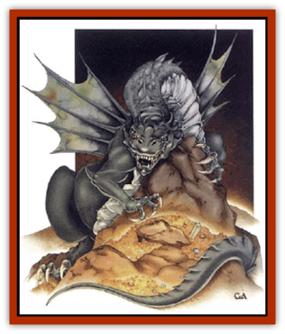

# Dragon - Prismatic

| Statistic | **Dragon, Prismatic** |
| --- | --- |
| **Activity Cycle:** | Day |
| **Alignment:** | Chaotic neutral |
| **Armor Class:** | 0 (base) |
| **Climate/Terrain:** | Temperate or tropical |
| **Damage/Attack:** | 1d6+1/1d6+1/1d20+2 |
| **Diet:** | Omnivore |
| **Frequency:** | Very rare |
| **Hit Dice:** | 11 (base) |
| **Intelligence:** | High (13-14) |
| **Magic Resistance:** | Varies |
| **Morale:** | Fanatic (17-18) |
| **Movement:** | 9, Fl 30 (C), Sw 12 |
| **No. Appearing:** | 1 (2-4) |
| **No. of Attacks:** | 3 + special |
| **Organization:** | Solitary (clan) |
| **Size:** | G (30' base length) |
| **Special Attacks:** | Breath weapon, spells, special |
| **Special Defenses:** | Fear |
| **THAC0:** | 9 (base) |
| **Treasure:** | See below |
| **XP Value:** | Varies |

Prismatic [[Dragon_General_Information|dragons]] are closely related to the gem dragons, although some of their characteristics, and their almost superstitious reverence for [[Dragon_Metallic_Copper|copper dragons]] suggest that they are somehow related to that subspecies as well. While all dragons tend to be greedy and self-important, prismatic dragons are extremely so. Sustained flattery and gifts of precious metals and gems can often influence and cloud the judgment of a prismatic dragon. A gift that exploits the dragon's boundless vanity, such as a mirror or a song exalting its wisdom and beauty can make this creature forget almost any wrong done to it.

While not evil, the prismatic dragon quickly grows impatient with talk that is not of immediate interest to it. Such banter is silenced in the most expedient manner, typically with a spell or fierce tail slap.

At birth, their scales are blight, mirrorlike silver except for several distinct bands of color at its midsection - red, orange, yellow, green, blue, and purple. Over time, the colors spread and fade, and the shiny scaled give way to pastel hues with dazzling refractive qualities (much like a holographic image). As its natural colors fade, the dragon gains great control over its shimmering scales. By the *adult* age, the scales are a homogeneous translucent blue-gray, with patches or bands of color confined to wing tips, claws, and face. A basic hypnotic pattern power develops that increases with age - *great wyrms* can make themselves virtually invisible and can project complex illusions simply by manipulating their scales.

Prismatic dragons speak their own language, which is both intelligible to speakers of the copper dragon tongue. They do not share a common language with other dragons, though many can converse with any intelligent creature (the chance for this is 10% + 5% per age category).

**Combat:** A prismatic dragon prefers to use its breath weapon or spells to kill, wound, or incapacitate its enemies, lest it run the risk (however slight) of having the beauty of its magnificent hide diminished by the weapons of "mortal pests". Insulting words or deeds may, however, cause these hot-tempered creatures to attack with abandon. Prismatic dragons eschew enchantment/charm spells as unnecessary for creatures as awesome as themselves. Conjuration/summoning and Alteration spells are much more to their liking.

**Breath Weapon:** The breath weapon is a cloud of gas, 10 feet high and 30 feet in diameter, that rolls forward 10 feet per round, dispersing in a number of rounds equal to the dragon's age category. This cloud contains swirling patterns of sparkling particles and bright, interweaving colors. In illumination of torch brightness or better, those who view the cloud must save vs. spell) or be affected as if by a rainbow pattern spell (Wisdom bonuses apply; dwarf and halfling Constitution bonuses and the illusionist specialty bonus to saving throws do not). Even the dragon itself can be affected by the hypnotic properties of the cloud; a prismatic dragon below *adult* age is enthralled on a roll of 1 on 1d20 for a round, checking once per round until it shakes off the effect.

The breath weapon itself transmutes water into a milky, luminous solid matter similar to mother-of-pearl. Although the material is not ice and does not melt, it does evaporate under the same conditions as liquid water; exposed to air or sunlight, a mass of this material will eventually dissolve. While solid, the water has the same saving throws as wood of the same thickness. When the gas cloud contacts a stream, river, lake, or similar body of water, the water solidifies to a depth of one-half inch per age category of the dragon (3 inches for an adult, age category 6).

Water-based creatures such as [[Elemental_Water_Kin_Water_Weird|water weirds]] and [[Elemental_Fire_Water|elementals]] must save vs. breath weapon or die. A surviving creature suffers 1d12 points of damage per age category and is *slowed* for 1d4 turns. The creature's physical attack damage is increased by 50% for as long as it is *slowed*.

Creatures with a high water content (such as humans and demihumans) are also vulnerable to the breath weapon. The gas permeates their skin, making it crack and flake away like peeling bark, and causing severe trauma to organs and muscles. This has three effects (modified by a saving throw):

<ul><li>Initial exposure to the gas causes 4d6 damage. Prolonged exposure does not inflict additional damage.</li><li>The equivalent of a *slow* spell for one round per age category of the dragon.</li><li>Additional damage while slowed: strenuous activity (running, melee) inflicts 1d8 per round, moderate activity (spellcasting, walking, firing a bow) inflicts 1d8-4 points of damage. No damage or negative damage means that a cast spell is not disrupted by pain.</li></ul>A successful saving throw vs. breath weapon halves the initial damage and duration of the *slow* effect, but does not affect the additional damage of straining traumatized muscles.

**Special Tactics:** Prismatic dragons often lie in ambush in a lake or deep river, using their wings or *waveform* power (achieved at *juvenile* age) to drench prey. If a drenched prey fails a saving throw against the breath weapon, all saturated clothing, hair, and so on hardens into a solid shell, much like a body cast. The shell must be broken before the victim can move again.

Wet surfaces that do not absorb water well (bare skin, leather, metal) will receive only a thin coating, as easily broken as an egg shell. Most people will have no trouble moving their hands or speaking.

Absorbent surfaces, such as normal clothing, must be shattered. A successful bend bars roll cracks the shell on one limb sufficiently to allow movement. An immobilized, statue-like victim can tip himself over, shattering the shell if it fails to save vs. crushing blow. No amount of tapping from within the shell can break it. A solid blow against AC 6 frees one limb or the torso if the shell fails its saving throw vs. crushing blow. The shell absorbs 5 points of damage, the rest affects the trapped victim. When one part of the shell shatters, the shell covering an adjacent limb is 50% likely to shatter as well.

**Special Abilities:** Prismatic dragons are not born with any special abilities, but soon develop formidable powers.

*Very young:* They can manipulate the color of their scales to produce a *color spray* effect once per day; *Juvenile: Waveform*, three times per day (molds a 20-foot cube of water per level into various forms, such as enormous waves; on solidified water this acts as a *stoneshape* spell); *Adult: Hypnotic pattern* twice per day, even while otherwise attacking or spellcasting; *Old: Camouflage* ability, 50% invisible, plus 10% per age category beyond old; *Venerable:* Illusionist spell effects: *change self*, *mislead*, *displace* (as *cloak of displacement*), *spectral force*, *hallucinatory terrain*, and *vacancy*; to a total of 20 rounds per day; *Great wyrm:* All of the above powers at will.

**Habitat/Society:** Most prismatic dragons come from an uncharted island in a tropical sea, where dozens of their kind live in an anarchic but rarely violent society. Here, power and prestige are won by competitions of magic, innate powers, and physical beauty. At the center of the island is a huge volcanic crater lined win immense crystals and precious gems. Away from the island, when more than one prismatic dragon is encountered, it is invariable a mother and young, not a mated pair. Prismatic dragon eggs are pale pink to yellow, with many copper flecks.

According to the legends of prismatic dragons, they and all other gem dragon species originated on the island. They say that the Creator Dragon (often described as a copper Great Wyrm) carved the gem dragons from the native consuls of the island and breathed life into them. As she dug deeper, the Creator Dragon found increasingly precious gems from which to shape her likeness. Eventually, she found the most precious and beautiful crystal she had ever seen. The other gems - [[Dragon_Gem_Emerald|emerald]], [[Dragon_Gem_Sapphire|sapphire]], [[Dragon_Mystara_Ruby|ruby]], diamond - were flat and ugly by comparison, so the Creator Dragon threw those dragons into the sea to drown. However, some escaped their fate, and their descendants now live a wrongful existence against her will. From this most beautiful gem, the Creator Dragon carved the first prismatic dragon and gave it life with her last breath.

**Ecology:** Like most dragons, prismatic dragons can eat almost anything. They prefer, however, to hunt and eat large fish and marine mammals, washing down their meal with quartz and sometimes cleansing the palate with some silver. In general, prismatic dragons consider the gem dragons their enemies, and use lesser species (like humans) to destroy them.

Strangely, prismatic dragons never mate on their home island, so young adults are encouraged to go out into the world. Females are welcomed back only if they return with young, but males may never return.

Every 20 to 22 years, a prismatic dragon female (*young adult* to *very old*) living abroad is overwhelmed by her mating instincts. The urge is very strong for she can mate successfully for only two weeks. During this time, she exhausts herself by flying as high and long as possible during the day, releasing powerful pheromones that can travel up to 200 miles. She also reflects the sunlight in urgent but graceful rhythms and color sequences. This light is a mating beacon that no males of the species can resist. When a male prismatic dragon is attracted, he abandons his usual activities (guarding his hoard and defending his territory from enemies) and scans the horizon for the beacon. If the pattern of the lights is clumsy, he may not respond. If more than one responds, they compete with mating lights of their own.

| Age | Body Lgt. (') | Tail Lgt. (') | AC | Spells W/P | MR | Treas. Type | XP Value |
| --- | --- | --- | --- | --- | --- | --- | --- |
| 1 Hatchling | 2-5 | 1-5 | 4 | Nil | Nil | Nil | 8,000 |
| 2 Very young | 5-12 | 5-12 | 2 | Nil | Nil | Nil | 9,000 |
| 3 Young | 12-22 | 12-21 | 1 | 1 | Nil | Nil | 10,000 |
| 4 Juvenile | 22-33 | 21-28 | 0 | 2 | Nil | ½H | 12,000 |
| 5 Young adult | 33-45 | 28-36 | 0 | 2 1 | 15% | H | 14,000 |
| 6 Adult | 45-60 | 36-45 | -1 | 3 1 | 20% | H | 15,000 |
| 7 Mature adult | 60-74 | 45-54 | -2 | 3 1 1 | 25% | E,H | 16,000 |
| 8 Old | 74-90 | 54-62 | -3 | 4 2 1 | 30% | E,H | 17,000 |
| 9 Very old | 90-117 | 62-75 | -4 | 4 2 2/1 | 35% | T,Hx2 | 18,000 |
| 10 Venerable | 117-120 | 75-81 | -5 | 4 3 2 1/1 1 | 40% | T,Hx2 | 21,000 |
| 11 Wyrm | 120-127 | 81-89 | -6 | 4 3 2 2/2 1 | 50% | Tx2,Hx2 | 23,000 |
| 12 Great Wyrm | 127-131 | 89-92 | -6 | 4 4 3 2 1/3 2 1 | 65% | T,Hx2,Z | 25,000 |

---
## Discovery & Documentation

**Source Publication:** Monstrous Compendium, 1997 Annual, Volume 4 (1995)
**Campaign Setting:** Advanced Dungeons & Dragons 2nd Edition
**Author(s):** Jon Pickens

### Other Creatures Found in This Source Book
   * [[Anemone_Giant_Sea|Anemone, Giant Sea]]
   * [[Asperii|Asperii]]
   * [[Bainligor|Bainligor]]
   * [[Beast_of_Chaos|Beast of Chaos]]
   * [[Blindheim|Blindheim]]
   * [[Bloodsipper_Far_Realm|Bloodsipper (Far Realm)]]
   * [[Bulette_Gohlbrorn|Bulette, Gohlbrorn]]
   * [[Child_of_the_Sea|Child of the Sea]]
   * [[Clockwork_Horror|Clockwork Horror]]
   * [[Clockwork_Swordsman|Clockwork Swordsman]]
   * [[Coral|Coral]]
   * [[Darklore|Darklore]]
   * [[Dharculus|Dharculus]]
   * [[Dolphin_Athas|Dolphin (Athas)]]
   * [[Dragon_Neutral_Moonstone|Dragon, Neutral, Moonstone]]
   * [[Dream_Stalker|Dream Stalker]]
   * [[Dragon-kin_Albino_Wyrm|Dragon-kin, Albino Wyrm]]
   * [[Echyan|Echyan]]
   * [[Firestar|Firestar]]
   * [[Firetail|Firetail]]
   * [[Fish_Ascallion|Fish, Ascallion]]
   * [[Fish_Deep_Ocean|Fish, Deep Ocean]]
   * [[Fish_Tropical|Fish, Tropical]]
   * [[Fish_Vurgens|Fish, Vurgens]]
   * [[Fogwarden|Fogwarden]]
   * [[Fraal|Fraal]]
   * [[Giant_Crag|Giant, Crag]]
   * [[Gibberling_Brood|Gibberling, Brood]]
   * [[Glutton_Sea|Glutton, Sea]]
   * [[Golden_Ammonite|Golden Ammonite]]
   * [[Golem_Brass_Minotaur|Golem, Brass Minotaur]]
   * [[Golem_Gemstone|Golem, Gemstone]]
   * [[Golem_Maggot|Golem, Maggot]]
   * [[Groundling|Groundling]]
   * [[Hermit_Sea|Hermit, Sea]]
   * [[Hound_of_Law|Hound of Law]]
   * [[Human_Amazon|Human, Amazon]]
   * [[Human_Pygmy|Human, Pygmy]]
   * [[Inquisitor|Inquisitor]]
   * [[Kercpa|Kercpa]]
   * [[Kreel|Kreel]]
   * [[Lycanthrope_Lythari|Lycanthrope, Lythari]]
   * [[Mercurial|Mercurial]]
   * [[Mold_Chromatic|Mold, Chromatic]]
   * [[Mummy_Bog|Mummy, Bog]]
   * [[Neh-thalggu|Neh-thalggu]]
   * [[Nymph_Grain|Nymph, Grain]]
   * [[Nymph_Unseelie|Nymph, Unseelie]]
   * [[Octopus_Octo-Jelly|Octopus, Octo-Jelly]]
   * [[Puddingfish|Puddingfish]]
   * [[Sea_Demon|Sea Demon]]
   * [[Shade|Shade]]
   * [[Shadowrath|Shadowrath]]
   * [[Shark_Athas|Shark (Athas)]]
   * [[Siren_Ravenloft|Siren (Ravenloft)]]
   * [[Skeleton_Variant|Skeleton, Variant]]
   * [[Skyfish|Skyfish]]
   * [[Spectral_Scion|Spectral Scion]]
   * [[Spyder_Fiend|Spyder Fiend]]
   * [[Squid_Squark|Squid, Squark]]
   * [[Tanar'ri_Lesser_Uridezu|Tanar'ri, Lesser, Uridezu]]
   * [[Troll_Mutate|Troll Mutate]]
   * [[Vaati|Vaati]]
   * [[Vampire_Cerebral|Vampire, Cerebral]]
   * [[Varkha|Varkha]]
   * [[Wizshade|Wizshade]]
   * [[Worm_Lukhorn|Worm, Lukhorn]]
   * [[Wyste|Wyste]]
   * [[Yugoloth_Lesser_Gacholoth|Yugoloth, Lesser, Gacholoth]]
   * [[Zombie_Mud|Zombie, Mud]]
