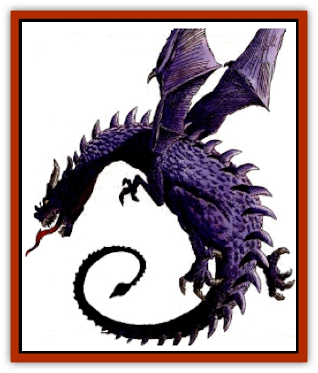
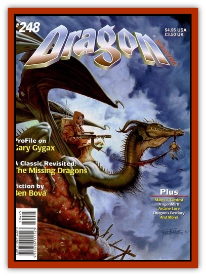

# Dragon - Purple - Energy

| Statistic | **Dragon, Purple (Energy)** |
| --- | --- |
| **Activity Cycle:** | Night (90%) |
| **Alignment:** | Neutral evil |
| **Armor Class:** | -1 (base) |
| **Climate/Terrain:** | Prairie, grasslands, and low scrub-covered hills |
| **Damage/Attack:** | 2-9/2-9/6-27 |
| **Diet:** | Special |
| **Frequency:** | Very rare |
| **Hit Dice:** | 13 (base) |
| **Intelligence:** | High (13-14) |
| **Magic Resistance:** | Varies |
| **Morale:** | Fanatic (17) |
| **Movement:** | 9, Fl 30 (C), Br 3 |
| **No. Appearing:** | 1 (2-5) |
| **No. of Attacks:** | 3+special |
| **Organization:** | Solitary or family |
| **Size:** | G (45' base) |
| **Special Attacks:** | Special |
| **Special Defenses:** | Varies |
| **THAC0:** | 7 |
| **Treasure:** | Special |
| **XP Value:** | Varies |

Purple [[Dragon_General_Information|Dragons]] are deeply, sadistically evil. They delight in spreading fear far and wide, combining raids for food with outright destruction and mayhem. They are the scourge of the prairies and farmlands, all the more terrifying because they are night hunters.

At birth, a purple dragon's scales are indigo. As the dragon matures, the scales become larger, thicker, harder, and darker. Adult dragons are completely violet, growing darker until they are nearly black at Great Wyrm age.

Purple dragons speak their own tongue and a language common to all evil dragons. Fourteen percent of hatchling purple dragons have an ability to communicate with any intelligent creature. The chance to possess this ability increases five percent per age category of the dragon.

**Combat:** A purple dragon prefers to attack with its claw/claw/bite routine. Its claws and teeth are serrated, leaving jagged tears in flesh that take twice as long to heal. Powerful enemies are first struck by its breath weapon before being engaged in physical combat. In general, purple dragons relish battle and go looking for it. If confronted with an unexpected situation, however, they are intelligent enough to back off and reconsider.

**Breath Weapon/Special Abilities:** Purple dragons are found in deep caves that open onto prairies, plains low foothills. Until mating time, they are solitary creatures like most dragons. Both parents will participate equally in raising the young, but the purple male is the primary hunter, being more violent and cruel.

Purple dragons will sometimes ally with evil humans or hill-dwelling creatures, providing protection in exchange for servitude and information. Purple dragons are generally haughty, however, and rarely consider other evil creatures, even other evil dragon subspecies, worth negotiating with.

**Habitat/Society:** Purple dragons prefer to live in dark underground places where the blinding effects of their breath weapon is at its height. Often they will dig their own lair if none exists naturally Should they encounter rock too hard to dig through, their breath weapon can burn up to 10' of stone at a time, getting the dragon past the obstacle and into easier digging again.

Purple dragons are mostly meat eaters, feeding on herd animals, farm animals, and inhabitants of lonely settlements. They hunt at night, their dark wings blending into the night sky. If possible they will hunt during thunderstorms, which they can anticipate with *predict weather*, as they enjoy the crash of thunder and the whip of rain, which mask their approach and have already frightened or unnerved those below.

If necessary, they can consume tuberous vegetables (potatoes, onions, carrots) if no meat is available, although this makes their temper even shorter.

Purple dragons generally have no natural enemies once past the first age of life. [[Giant_Verbeeg|Verbeeg]] and [[Giant_Hill|hill giants]] sometimes hunt Hatchlings in the foothills, and [[Ankheg|ankheg]] will prey on Hatchlings in the prairie. Purple parents will painfully slay any such creatures found in their lairs. Sometimes purple dragons encounter [[Dragon_Metallic_Copper|copper dragons]] in the foothills, and the coppers are fortunate to escape intact. On very rare occasions, purple dragons may meet [[Dragon_Metallic_Gold|gold dragons]] while airborne, and such is the arrogant ferocity of the purple dragon that it may challenge a gold dragon of equal size rather than attempting to flee. Usually the gold dragon will win an "even" fight like this - but not always!

| Age | Body | Tail | AC | Br. Weapon | Spells W/P | MR | Treas. Type | XP Value |
| --- | --- | --- | --- | --- | --- | --- | --- | --- |
| 1 Hatchling | 2-10 | 3-9 | 2 | 2d8+2 | Nil | Nil | Nil | 3,000 |
| 2 Very young | 10-21 | 9-18 | 1 | 4d8+4 | Nil | Nil | Nil | 4,000 |
| 3 Young | 21-32 | 18-27 | 0 | 6d8+6 | Nil | Nil | Nil | 6,000 |
| 4 Juvenile | 32-51 | 27-41 | -1 | 8d8+8 | 1 | Nil | ½H,S | 8,000 |
| 5 Young adult | 51-70 | 41-55 | -2 | 10d8+10 | 2 | 25% | H,S,½T | 10,000 |
| 6 Adult | 70-89 | 55-69 | -3 | 12d8+12 | 3 | 30% | H,S,½T | 13,000 |
| 7 Mature adult | 89-103 | 69-83 | -4 | 14d8+14 | 3 1 | 35% | H,S,½T | 14,000 |
| 8 Old | 103-117 | 83-97 | -5 | 16d8+16 | 3 2/1 | 40% | H,Sx2,T | 15,000 |
| 9 Very old | 117-131 | 97-111 | -6 | 18d8+18 | 3 3/2 | 45% | H,Sx2,T | 17,000 |
| 10 Venerable | 131-141 | 111-120 | -7 | 20d8+20 | 3 3 1/3 | 50% | H,Sx2,T | 18,000 |
| 11 Wyrm | 141-151 | 120-129 | -8 | 22d8+22 | 3 3 2/3 2 | 55% | H,Sx2,T | 19,000 |
| 12 Great Wyrm | 151-161 | 129-138 | -9 | 24d8+24 | 3 3 2 1/3 3 | 60% | H,Sx2,T | 20,000 |

---
## Discovery & Documentation

**Source Publication:** Dragon248 (1998)
**Campaign Setting:** Dragon Magazine
**Author(s):** Gregory W. Detwiler, Terry Dykstra

### Other Creatures Found in This Source Book
   * [[Amphitere|Amphitere]]
   * [[Cetus_Lesser|Cetus, Lesser]]
   * [[Dragonet|Dragonet]]
   * [[Dragon_Orange_Sodium|Dragon, Orange (Sodium)]]
   * [[Dragon_Yellow_Salt|Dragon, Yellow (Salt)]]
   * [[Gargouille|Gargouille]]
   * [[Hai_Riyo|Hai Riyo]]
   * [[Peluda|Peluda]]
   * [[Sirrush|Sirrush]]
   * [[Vore_Lekiniskiy_Master_Fire_Worm|Vore Lekiniskiy, Master Fire Worm]]
