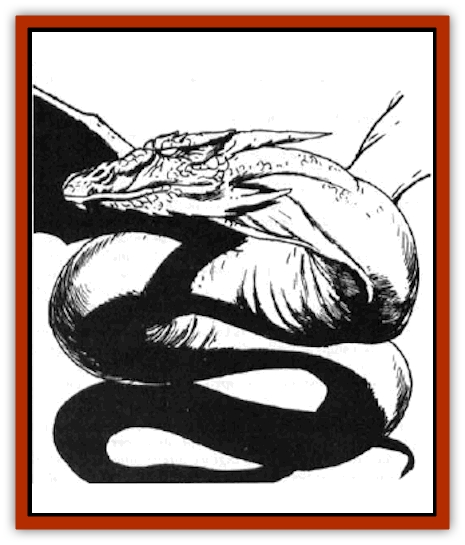

# Dragon - Radiant

| Statistic | **Dragon, Radiant** |
| --- | --- |
| **Activity Cycle:** | Any |
| **Alignment:** | Any |
| **Armor Class:** | 1 |
| **Climate/Terrain:** | Any space |
| **Damage/Attack:** | 2-20/2-20/4-40 |
| **Diet:** | Special |
| **Frequency:** | Very rare |
| **Hit Dice:** | 15 |
| **Intelligence:** | Exceptional (15) |
| **Magic Resistance:** | Varies |
| **Morale:** | Fanatic (18) |
| **Movement:** | 12, Fl 48 (B) |
| **No. Appearing:** | 1 (2-5) |
| **No. of Attacks:** | 3 + special |
| **Organization:** | Solitary or clan |
| **Size:** | G (100' base) |
| **Special Attacks:** | Special |
| **Special Defenses:** | Varies |
| **THAC0:** | 5 base |
| **Treasure:** | Special |
| **XP Value:** | Special |

The radiant [[Dragon_General_Information|dragon]], also called the *star dragon* or the *celestial dragon* (though not to be confused with the [[Dragon_Oriental_Celestial_T'ien_Lung|oriental dragon of the same name]]), is a sinuous, serpentine dragon with graceful, translucent wings. Its scales are a collection of glittering pearl-like shards of mica and gypsum, which cause the dragon's scales to shimmer in the starlight, giving the creature its name.

Radiant dragons can be of any alignment. unlike the tendencies toward good and evil of the chromatic and metallic dragons. There exist radiant dragons who terrorize the spaceways, those who act in a beneficial fashion, and those who prefer to set themselves up as whimsical king-gods on small, distant worlds. As a class, the radiant dragons are proud, haughty, and feel they are the ultimate in draconian development: they are, after all, the largest of their type.

Radiant dragons speak their own language and the common tongue. They are quick with languages and fond of mimicry, so they tend to speak in a number of accents matching those of the individuals they talk with. There is a 10% chance that even a hatchling will understand any given tongue, with an increase of 5% for every age category.

All common dragon attributes outlined in the [[Dragon_General_Information|Dragon General Information Page]] apply to radiant dragons as well. Modifications to the general description that apply specifically to fantasy space are listed below.

**Combat:** Actions of a radiant dragon depend on the situation and the individual. They rarely flee from a fight, however, depending on their huge size to keep them safe from opponents.

A radiant dragon will concentrate on the ship itself first, seeking to first destroy or eliminate any serious threats (such as ballistas and catapults). Of equal importance is elimination of the mages and any with magical powers. If the radiant dragon is aligned toward good, he will seek to neutralize them with *silence, 15' radius* spells (if available). If less concerned about killing, he will merely slay hostile wizards as he finds them.

The wing buffet used by *young adult* and older dragons is particularly potent in the small space of a ship, and has the effect of a "Ship Shaken" critical hit, and in addition inflicts 2-20 points of damage to all within the range of the attack (about 200 feet to either side).

In addition to the tail slap used by the radiant dragon against groups of creatures, the radiant dragon may grip a ship in the coils of its tail and inflict damage per round by squeezing it. The damage is 1-6 hull points against lighter materials such as wood or ceramic, but particularly heavy materials, such as stone and metal, suffer only 1-4 hull points damage. The dragon can make other attacks, and even attack other ships, while squeezing a ship.

As a general rule, radiant dragons will give a ship and crew the opportunity to leave, parley, or generally bow and scrape and beg for its kindness and mercy. Even the smallest of these creatures has an overweening sense of pride.

**Breath Weapon/Special Abilities:** The radiant dragon breathes glowing pulses of force that in some ways resemble *magic missiles*. They can breathe a single pulse of the listed damage, or any number of smaller pulses in the same round, provided that no pulse inflicts less than 2d12+1 points of damage. A *juvenile* radiant dragon (age 4) can breathe a single pulse of 8d12+4 points, or four pulses of 2d12+1 points, or two pulses of 4d12+2 points. Each pulse can strike a separate target. These pulses are unerring in their attacks, and will hit unless the victim makes a saving throw vs. breath weapon. If the victim fails its saving throw, it will be struck for the listed damage. If the victim makes its saving throw, it has dodged that pulse, which then evaporates.

The radiant dragon can use its breath weapon on physical objects (such as a ship) as well, inflicting 1 hull point of damage for every 10 hit points of damage its breath weapon causes. Other physical objects must save vs. spell to survive being hit by a pulse.

As radiant dragons age, they gain a number of innate abilities. *Juvenile* dragons can *restore* or *corrupt air* as per the spell. A *young adult* may use the *Bigby's interposing hand** spell, while *adults* can use the *Bigby's grasping hand** spell. A *mature adult* can *shapechange* three times in a standard day, gaining the abilities of the creature that it mimics, even to the point of spells and magical ability. *Venerable* radiant dragons can create a *wall of force* (as the wand), and a wyrm can use *forcecage* (as the spell). A great wyrm can create a prismatic sphere large enough to encapsulate itself and up to 4 other creatures of similar size. and to maintain it indefinitely.

* The radiant dragons refer to these as the *interposing claw* and *grasping claw* spells, and will declare loudly that this Bigby is an interloper who obviously stole their spells and gave them his name. A careful check by the sages indicate that the reverse is true: These spells did not appear commonly among the radiants until Bigby developed them. However, given the size and temperament of those dragons making the claim, few have chosen to argue the point with them.

**Habitat/Society:** Radiant dragons are totally spaceborne - indeed, their huge size would make them ungainly creatures on most worlds. Mature adults do mingle among mere mortals, often taking the face and the role of an adventurer or hero as the dragon passes through the asteroid citadels. A character who is faced with unpaid bills for services from places he has never visited may guess that his renown is great enough to earn him the mimicry of a radiant dragon. In some regions this is considered a great honor (once it is confirmed by detect lie and other divination spells). In other areas of space it is considered a blasted nuisance.

The radiant dragons are normally solitary and very territorial about their "turf", which can include up to the space surrounding a planet or moon. When they are found in numbers, they are usually a family group, and make their lair in an asteroid hollowed out by the parents. Some hollow asteroids that are used by certain human civilizations were created by these dragons.

When in family groups, radiant dragons are very protective, and slaying the young is a sure way of earning a radiant dragon's enmity. It will hunt down the individual responsible, devising nasty methods of revenge as it goes. There is a [[Giff|giff]] saying: "Better to be slain by a star dragon quickly, before it has a chance to think about it."

**Ecology:** Radiant dragons can survive long periods in space. They are sometimes seen near fire bodies with their wings spread, gliding on the heat, and it is surmised that they can take the energy from such celestial bodies and store it in their bodies, much like the [[Kindori|kindori]]. However, a selfish and hungry radiant dragon can just as easily descend on an asteroid citadel and clean out all other living things (particularly if it considers the asteroid its "own" from an earlier stage of life).

The clerical spell ability of the radiant dragons may make them the only living creatures of such great bulk to be natural spelljammers. They move in this fashion as a cleric with as many levels as the dragon's age when piloting a major helm, and the dragons can do so at will without tiring. On occasion they have used this ability to rescue or tow wrecked ships (in return for a promise of reward, or a statue in their name at least). Radiant dragon hatchlings stay close to their lairs and the protection of the parents, but sometimes they also sneak out and do some spelljamming.

It is unknown if the radiant dragons have spelljamming ability naturally or as the result of some deal with the [[Arcane|arcane]]. One school of thought indicates that the radiant dragons are the only natural spelljamming creatures, and the arcane use them to make their helms. A second school believes that the radiants gained this ability from the arcanes in exchange for transportation or other favors. The truth has yet to be revealed. The arcane and the radiant dragons, when brought into contact, have little to say to each other.

The radiant dragons are friendly with [[Dracon|dracons]] and [[Lizard_Man|lizard men]], whom they encourage to worship them at every chance. They are haughty toward men, elves, haflings, and most mammal-based races. They consider [[Mind_Flayer|mind flayers]], [[Beholder_and_Beholder-kin_I|beholders]], and [[Neogi|neogis]] to be genetic failures that have not had the sense to die off. This opinion is reciprocated by those races, which hunt the radiants whenever they have a chance and think they can beat them. In addition, radiant dragons are occasionally attacked by the largest [[Krajen|krajen]].

Radiant dragons can be encountered in any wildspace area and in the phlogiston. Their great size gives them their own atmospheric envelope, but unlike the similarly huge kindori, they do not encourage riders, and will often preen their scales to remove krajen spores and other hitchhikers. Their clerical abilities operate in any sphere that has dragons as a native life form. In those rare spheres without dragons, they still retain first and second level spells and their spelljamming ability.

| Age | Body Lgt. (') | Tail Lgt. (') | AC | Breath Weapon | Spells P | MR | Treas. Type | XP Value |
| --- | --- | --- | --- | --- | --- | --- | --- | --- |
| 1 Hatchling | 1-20 | 2-20 | 4 | 2d12+1 | 2 | Nil | Nil | 4,000 |
| 2 Very young | 21-60 | 21-60 | 3 | 4d12+2 | 2 2 | 20% | Nil | 7,000 |
| 3 Young | 61-80 | 61-80 | 2 | 6d12+3 | 2 2 2 | 25% | Nil | 12,000 |
| 4 Juvenile | 81-110 | 81-120 | 1 | 8d10+4 | 4 2 2 2 | 30% | E,R,T | 14,000 |
| 5 Young adult | 111-140 | 121-150 | 0 | 10d10+5 | 4 4 2 2 2 | 35% | H,R,T | 18,000 |
| 6 Adult | 141-200 | 151-220 | -1 | 12d12+6 | 4 4 4 2 2 2 | 40% | H,R,T | 19,000 |
| 7 Mature adult | 201-250 | 221-270 | -2 | 14d12+7 | 6 4 4 4 2 2 2 | 45% | H,R,Tx2 | 20,000 |
| 8 Old | 251-300 | 271-350 | -3 | 16d12+8 | 6 6 4 4 4 2 2 | 50% | H,R,Tx2 | 21,000 |
| 9 Very old | 301-350 | 351-425 | -4 | 18d12+9 | 6 6 6 4 4 4 2 | 55% | H,R,Tx2 | 22,000 |
| 10 Venerable | 351-400 | 426-500 | -5 | 20d12+10 | 8 6 6 6 4 4 4 | 60% | H,R,Tx3 | 23,000 |
| 11 Wyrm | 401-500 | 501-600 | -6 | 22d12+11 | 8 8 6 6 6 4 4 | 65% | H,R,Tx3 | 24,000 |
| 12 Great Wyrm | 501-600 | 601-800 | -7 | 24d12+12 | 8 8 8 6 6 4 4 | 70% | H,R,Tx4 | 25,000 |

---
## Discovery & Documentation

**Source Publication:** AD&D Adventures In Space (1989)
**Campaign Setting:** Spelljammer
**Author(s):** Jeff Grub

### Other Creatures Found in This Source Book
   * [[Arcane|Arcane]]
   * [[Beholder_and_Beholder-kin_I|Beholder and Beholder-kin I]]
   * [[Beholder_and_Beholder-kin_II|Beholder and Beholder-kin II]]
   * [[Dracon|Dracon]]
   * [[Elmarin|Elmarin]]
   * [[Ephemeral|Ephemeral]]
   * [[Giff|Giff]]
   * [[Kindori|Kindori]]
   * [[Krajen|Krajen]]
   * [[Neogi|Neogi]]
   * [[Scavver|Scavver]]
