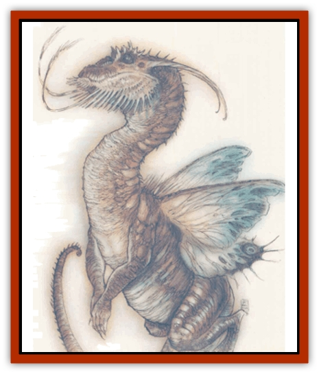

# Dragon - Rust

| Statistic | **Dragon, Rust** |
| --- | --- |
| **Activity Cycle:** | Any |
| **Alignment:** | Lawful neutral (evil) |
| **Armor Class:** | 0 (base) |
| **Climate/Terrain:** | Acheron |
| **Damage/Attack:** | 1d8/1d8/2d10 |
| **Diet:** | Special (metal and magic) |
| **Frequency:** | Rare |
| **Hit Dice:** | 12 (base) |
| **Intelligence:** | Low (6) |
| **Magic Resistance:** | Variable |
| **Morale:** | Fanatic (17) |
| **Movement:** | 15, Fl 30 (C), Br 12 |
| **No. Appearing:** | 1 |
| **No. of Attacks:** | 3+special |
| **Organization:** | Solitary |
| **Size:** | G (30-foot base) |
| **Special Attacks:** | See below |
| **Special Defenses:** | Variable |
| **THAC0:** | 9 (base) |
| **Treasure:** | Nil |
| **XP Value:** | Variable |

It's said by some that the rusting metal cubes of Acheron are transient, that they're another stage of something yet to come. Others (most notably the Doomguard) say that the cubes're in their final millennium, that they are falling prey to the entropy that's consuming the multiverse. To justify this theory, the Doomguard point to the rust dragons of Acheron.

Rust dragons are very similar in appearance to normal [[Dragon_General_Information|dragons]], though the latter group is reptilian and the former bears subtle insectoid features. The difference is apparent in only a few areas: The rust dragon's wings resemble those of a butterfly, and most normal dragons don't have the antennae of the rust dragon. Also, the rust dragon's teeth are jagged parts of its exoskeleton, rather than separate pieces of the creature's body.

The rust dragon looks much like a metallic dragon, but its skin is pitted and corroded-looking (woe to any berk who interprets this as a chink in the creature's armor!), splotched with orange, brown, and blood-red highlights. There's as many different appearances to a rust dragon as there are varieties of actual dragon, but there is only one true type of rust dragon. Those that're similar to [[Dragon_Metallic_Silver|silver dragons]] develop a skin that looks like a film of blackened silver; those similar to [[Dragon_Metallic_Brass|brass dragons]] become tarnished and discolored; and those similar to [[Dragon_Metallic_Copper|copper]] become green-tinted as if they had a finish of verdigris. This pattern is the same for all rust dragons; whatever their metal base, these dragons have the skin of that metal oxidized.

**Combat:** Rust dragons have all the combat abilities of normal dragons, with the instinct to use them, too. Unlike those dragons, however, rusts never gain the knowledge of spellcasting.

**Breath Weapon/Special Abilities:** As with the metallic dragons, rust dragons have two sorts of breath weapons. The first is a somewhat standard breath weapon, a spray of acid that spews forth in a stream 5 feet wide and extending 75 feet in a straight line. Those unlucky enough to be caught in this stream may save for half damage. The second type of breath weapon is more insidious, but no less damaging. It is a cone spray of oxidants and reddish-brown liquid that instantly rusts any material it touches. The cone is 5 feet wide, extends 75 feet, and is 30 feet wide at the base. Anything metal caught in it must save versus disintegration or immediately disappear into a cloud of rusty brown dust motes.

Rust dragons, unlike true dragons, receive no age abilities.

**Habitat/Society:** As solitary creatures, rust dragons do not often interact. When they do, or when they are forced together, they immediately become involved in a nonfatal struggle for dominance. The victor is the one who places its jaws around the other's head.

Rust dragons do not keep a hoard, preferring to roam as they will. A great wyrm might elect to keep a few choice gems, but most rust dragons have none of the draconic interest in keeping money. Instead they concentrate on gathering steel, iron, and occasionally spells for food and defense.

There's a relation between rust dragons and [[Rust_Monster|rust monsters]], the sages say, and they're not far off. It's been determined that rust monsters are insectoid in origin, that they hatch in great droves of eggs, and are then left to fend for themselves.

Many rust monsters don't survive to adulthood, and fewer still to old age. Those that do survive somehow make their way to Avalas on Acheron. There they find an isolated tunnel in one of the rusty cubes and begin a feeding frenzy. After a year of gorging themselves, they make cocoons of spun metal around themselves and enter into a three-year hibernation. When this time has expired they burst forth from the hardened cocon as *hatchling* rust dragons.

It's not known if rust monsters are native to Acheron, or if they originally came from the Prime and were somehow mutated into dragons by the magical nature of Acheron. Regardless, they're here now, and here they stay. There's never been a documented case of a rust dragon leaving the plane, and it's not entirely clear what purpose they serve, save to roam the metal cubes.

[[Achaierai|Achaierai]] sometimes gather the rust cocoons and raise rust dragons as pets. Perhaps the long hibernation under the watchful care of these strange birds has an effect on the metamorphosing creatures, for the rust dragons tolerate the presence of others of their kind and seem to view the achaierai with affection. The birds use the dragons to make tunnels in the iron cubes of Avalas, but what the rust dragons receive in return from the achaierai remains a mystery.

| Age | Body Lgt. (') | Tail Lgt. (') | AC | Breath Weapon | MR | XP Value |
| --- | --- | --- | --- | --- | --- | --- |
| 1 Hatchling | 3-7 | 2-5 | 3 | 2d6+1 | Nil | 4,000 |
| 2 Very young | 8-18 | 3-6 | 2 | 4d6+2 | Nil | 6,000 |
| 3 Young | 19-29 | 6-8 | 1 | 6d6+3 | Nil | 8,000 |
| 4 Juvenile | 30-40 | 10-16 | 0 | 8d6+4 | Nil | 10,000 |
| 5 Young adult | 41-51 | 15-20 | -1 | 10d6+5 | 15% | 13,000 |
| 6 Adult | 52-62 | 17-25 | -2 | 12d6+6 | 20% | 14,000 |
| 7 Mature adult | 63-73 | 21-30 | -3 | 14d6+7 | 25% | 15,000 |
| 8 Old | 74-84 | 25-35 | -4 | 16d6+8 | 30% | 16,000 |
| 9 Very old | 85-95 | 30-40 | -5 | 18d6+9 | 35% | 18,000 |
| 10 Venerable | 96-106 | 35-45 | -6 | 20d6+10 | 40% | 20,000 |
| 11 Wyrm | 107-117 | 40-50 | -7 | 22d6+11 | 45% | 21,000 |
| 12 Great Wyrm | 118-128 | 45-55 | -8 | 24d6+12 | 50% | 22,000 |

---
## Discovery & Documentation

**Source Publication:** Planes of Law (1995)
**Campaign Setting:** Planescape
**Author(s):** Colin McComb, Wolfgang Baur

### Other Creatures Found in This Source Book
   * [[Achaierai|Achaierai]]
   * [[Archon|Archon]]
   * [[Baatezu_Lesser_Kocrachon|Baatezu, Lesser, Kocrachon]]
   * [[Bladeling|Bladeling]]
   * [[Busen|Busen]]
   * [[Formian|Formian]]
   * [[Gear_Spirit|Gear Spirit]]
   * [[Hellcat|Hellcat]]
   * [[Kyton|Kyton]]
   * [[Moigno|Moigno]]
   * [[Parai|Parai]]
