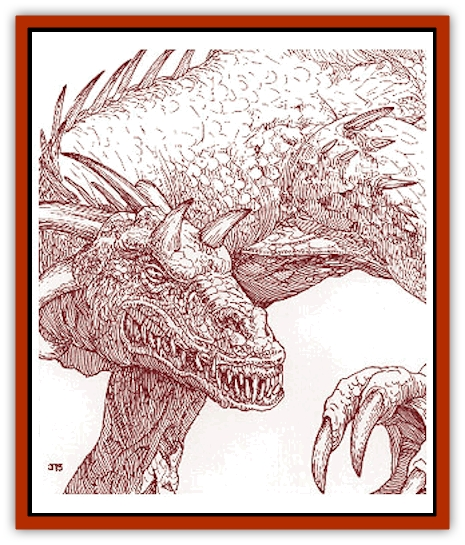

# Dragon - Savage Coast - Crimson

| Statistic | **Dragon (Savage Coast), Crimson** |
| --- | --- |
| **Activity Cycle:** | Day |
| **Alignment:** | Neutral evil |
| **Armor Class:** | Variable |
| **Climate/Terrain:** | Any cursed |
| **Damage/Attack:** | 1d8/1d8/4d6 |
| **Diet:** | Carnivore |
| **Frequency:** | Very rare |
| **Hit Dice:** | 13 (base) |
| **Intelligence:** | Genius (17-18) |
| **Magic Resistance:** | Variable |
| **Morale:** | Fanatic (17-18) |
| **Movement:** | 9, Fl 30 (C) |
| **No. Appearing:** | 1 |
| **No. of Attacks:** | 3+special |
| **Organization:** | Solitary |
| **Size:** | Variable |
| **Special Attacks:** | Variable |
| **Special Defenses:** | Variable |
| **THAC0:** | 7 (at 13 HD) |
| **Treasure:** | Variable |
| **XP Value:** | Variable |

The crimson [[Dragon_General_Information|dragon]] always looks out for its own best interests, seeking power of any kind - be it treasure, territory, or ability. Following this, they are always looking to expand their repertoire of Legacies, which they possess in abundance.

Crimson [[Dragon_Savage_Coast_General_Information|dragons]] are thought to be a variant of the [[Dragon_Chromatic_Red|red dragon]], possessing similarities in both color and physical characteristics. Crimson dragons are born with the deep, dull red coloring of a *mature* red dragon. As they grow older, their scales grow larger and thicker, turning such a dark crimson that they seem black. The scales also take on a metallic sheen - not shiny, but more of a polished sheen. This coloring greatly resembles *cinnabryl*.

*Hatchlings* have a 15% chance to be able to communicate with any intelligent creature. This chance increases 5% per age category of the dragon. All crimson dragons speak a dialect that can be understood by other crimson dragons as well as any dragons of evil alignment.

**Combat:** Crimson dragons never attack right away, preferring to toy with their opponents. They are masters of showmanship, bursting out of the brush or rising from the waters of a lake. Quite often, a crimson dragon will trigger several Legacies, in no particular direction, to provide a kind of magical fanfare for its emergence. Then it might draw a claw back, as if attacking, only to scratch at the side of its head in a presentation of nonchalance. Another favorite ploy is to draw in a deep breath, as if preparing for a breath weapon attack, and then watch the normally cool temperaments of adventurers shatter as they scramble about, diving for cover. This type of dragon is famous for being able to humiliate the most stalwart of opponents.

When an attack does come, the crimson dragon might use any of the dragon combat abilities. Tail slaps and wing buffets are good for raising the level of disarray. When finally ready to cause serious damage, its claw and bite combination takes down most opponents. It will never use its breath weapon before at least one feint, unless it has reason to believe (by way of how its opponents react to its appearance) the adventurers are expecting it. If so, it will use its breath weapon and feint later.

**Breath Weapon/Special Abilities:** The breath weapon of a crimson dragon is rather unique in that it does not grow stronger over the years. Any crimson dragon of *juvenile* age or better possesses a breath weapon which extends in a cone 100 feet long, 5 feet wide at its base, and 50 feet wide at its end. The breath weapon depletes all *cinnabryl* caught in the blast (therefore ruining any crimson essence as well). For each ounce of *cinnabryl* depleted with its breath weapon, there is a cumulative 3% chance that the crimson dragon will instantly gain a new Legacy.

**Habitat/Society:** A crimson dragon is truly a solitary creature. It maintain its own lair, never sharing with a mate. If more than one crimson dragon is encountered, it is almost always a mother with its young. Crimson dragons have one to three young, which are raised by the female and driven out of the lair before they reach *juvenile* age. Crimson dragons are very intelligent and cunning, allowing the young to survive on their own this early.

Crimson dragons can be found almost anywhere in the cursed lands of the Savage Coast. They never travel extremely high into the mountains, but they do like caves. Their lairs are often found along foothills or at lower mountain elevations. A crimson dragon might even dig out a lair, tunneling down into the soft earth of a temperate forest or in the plains. Though they avoid heavily traveled routes, the malevolent desire to deplete cinnabryl keeps them fairly close to civilization.

Because they like to travel about, crimson dragons often have more than one lair. They visit each region along the Savage Coast about once every few years. However, only one lair will possess its treasure hoard. The dragon carries all useful magical items and a few expensive baubles with it, sealing up its main lair when leaving. They never leave their treasure laying about to be discovered. A typical hoard will be hidden in the bottom of a deep cavern pool or in a collapsed section of a cave; it would be guarded by some animal and the mouth would be carefully hidden. If the lair was dug in soft ground, the dragon carefully fills it back in, leaving no trace of its passage.

Crimson dragons use their treasures and abilities to gain control over other intelligent creatures. Their personal goals are varied and secret, but these goals almost always include the domination of others. Also, crimson dragons tend to be slightly paranoid at times, even inventing a rival if one is not immediately apparent.

**Ecology:** A crimson dragon has quite an impact on the environment. First, it is a predatory hunter whose only enemies are the [[Aranea_Savage_Coast|araneas]], other dragons, and humanoids. It works to gain treasure and authority and seeks to deplete *cinnabryl* in any form it can be found. Crimson dragons see depleting *cinnabryl* as both their personal road to greater power (by gaining more Legacies) and a way to foil the araneas who need the magical metal to avoid Affliction. Of course, most humanoid races know only that these dragons are ruining natural deposits of *cinnabryl* wherever they find them. This alone makes them worth hunting in the eyes of most Savage Coast residents.

Crimson dragons are also hunted for other reasons, though. The hide of a crimson dragon offers the same protection as *cinnabryl*. Because only a few scales actually offer this special cinnabryl effect, only one set of armor can be made from each dragon hide. To make it into scale-mail armor, the scales must be removed and specially treated by an alchemist specialized in making crimson essence. Additionally, at least one *potion of crimson essence* is required in the process. The protection offered by the armor is limited to the wearer and lasts until seriously damaged. Any slashing, piercing, or magical attack which does more than 15 points of damage in a single attack requires an appropriate saving throw attempt for the armor. If the saving throw is failed, the dragon scales instantly release their magical essence in a cloud equivalent to a *smokepowder* detonation.

| Age | Body Lgt. (') | Tail Lgt. (') | AC | Spells W/P | MR | Treas. Type | XP Value |
| --- | --- | --- | --- | --- | --- | --- | --- |
| 1 Hatchling | 2-16 | 4-16 | 0 | Nil | Nil | Nil | 2,000 |
| 2 Very young | 16-27 | 16-25 | -1 | Nil | Nil | Nil | 3,000 |
| 3 Young | 27-42 | 25-34 | -2 | Nil | Nil | B | 5,000 |
| 4 Juvenile | 42-61 | 34-53 | -3 | Nil | Nil | B,I | 8,000 |
| 5 Young adult | 61-80 | 53-72 | -4 | Nil | 20% | B,I | 10,000 |
| 6 Adult | 80-99 | 72-91 | -5 | 1 | 25% | B,H | 12,000 |
| 7 Mature adult | 99-118 | 91-110 | -6 | 2 | 30% | B,H | 13,000 |
| 8 Old | 118-137 | 110-129 | -7 | 2 1 | 35% | B,H,U | 14,000 |
| 9 Very old | 137-157 | 129-148 | -8 | 2 2 | 40% | B,H,U | 15,000 |
| 10 Venerable | 157-177 | 148-168 | -9 | 2 2 1/1 | 45% | B,H,Ux2 | 16,000 |
| 11 Wyrm | 177-197 | 168-188 | -10 | 2 2 2/2 | 50% | B,H,Ux2 | 18,000 |
| 12 Great Wyrm | 197-217 | 188-208 | -11 | 3 2 2 1/2 1 | 55% | B,H,Ux3 | 20,000 |

---
## Discovery & Documentation

**Source Publication:** Monstrous Compendium Savage Coast Appendix (Online Exclusive) (1995)
**Campaign Setting:** Mystara
**Author(s):** Loren L Coleman, Ted James, Thomas Zuvich, Cindi M. Rice

### Other Creatures Found in This Source Book
   * [[Aranea_Savage_Coast|Aranea (Savage Coast)]]
   * [[Arashaeem|Arashaeem]]
   * [[Batracine|Batracine]]
   * [[Cat_Marine|Cat, Marine]]
   * [[Cinnavixen|Cinnavixen]]
   * [[Clockwork_Swordsman|Clockwork Swordsman]]
   * [[Critter_Temple|Critter, Temple]]
   * [[Cursed_One|Cursed One]]
   * [[Deathmare|Deathmare]]
   * [[Dragon_Savage_Coast_Red_Hawk|Dragon (Savage Coast), Red Hawk]]
   * [[Echyan|Echyan]]
   * [[Ee'aar|Ee'aar]]
   * [[Enduk|Enduk]]
   * [[Fachan_Savage_Coast|Fachan (Savage Coast)]]
   * [[Feliquine|Feliquine]]
   * [[Fiend_Narvaezan|Fiend, Narvaezan]]
   * [[Frelôn|Frelôn]]
   * [[Ghriest|Ghriest]]
   * [[Glutton_Sea|Glutton, Sea]]
   * [[Goatman|Goatman]]
   * [[Golem_Naâruk|Golem, Naâruk]]
   * [[Golem_Savage_Coast|Golem (Savage Coast)]]
   * [[Grudgling|Grudgling]]
   * [[Heraldic_Servant_I|Heraldic Servant I]]
   * [[Heraldic_Servant_II|Heraldic Servant II]]
   * [[Heraldic_Servant_III|Heraldic Servant III]]
   * [[Heraldic_Servant_IV|Heraldic Servant IV]]
   * [[Heraldic_Servant_V|Heraldic Servant V]]
   * [[Heraldic_Servant_General_Information|Heraldic Servant, General Information]]
   * [[Hermit_Sea|Hermit, Sea]]
   * [[Jorri|Jorri]]
   * [[Juhrion|Juhrion]]
   * [[Kla'a-tah|Kla'a-tah]]
   * [[Leech_Legacy|Leech, Legacy]]
   * [[Lich_Inheritor|Lich, Inheritor]]
   * [[Lizard_Kin_Savage_Coast|Lizard Kin (Savage Coast)]]
   * [[Lupasus|Lupasus]]
   * [[Lupin|Lupin]]
   * [[Lyra_Bird_Saragón|Lyra Bird, Saragón]]
   * [[Malfera|Malfera]]
   * [[Manscorpion_Nimmurian|Manscorpion, Nimmurian]]
   * [[Mythuínn_Folk|Mythuínn Folk]]
   * [[Neshezu|Neshezu]]
   * [[Nikt'oo|Nikt'oo]]
   * [[Nosferatu|Nosferatu]]
   * [[Omm-wa|Omm-wa]]
   * [[Omshirim|Omshirim]]
   * [[Parasite_Savage_Coast|Parasite (Savage Coast)]]
   * [[Phanaton|Phanaton]]
   * [[Plant_Savage_Coast|Plant (Savage Coast)]]
   * [[Pudding_Vermilion|Pudding, Vermilion]]
   * [[Rakasta|Rakasta]]
   * [[Ray_Forest|Ray, Forest]]
   * [[Shedu_Greater_Savage_Coast|Shedu, Greater (Savage Coast)]]
   * [[Shimmerfish|Shimmerfish]]
   * [[Skinwing|Skinwing]]
   * [[Spawn_of_Nimmur|Spawn of Nimmur]]
   * [[Spider-spy|Spider-spy]]
   * [[Spirit_Heroic|Spirit, Heroic]]
   * [[Spirit_Walleran|Spirit, Walleran]]
   * [[Succulus|Succulus]]
   * [[Swampmare|Swampmare]]
   * [[Symbiont_Shadow|Symbiont, Shadow]]
   * [[Tortle|Tortle]]
   * [[Troll_Legacy|Troll, Legacy]]
   * [[Trosip|Trosip]]
   * [[Tyminid|Tyminid]]
   * [[Utukku|Utukku]]
   * [[Voat|Voat]]
   * [[Voat_Herathian|Voat, Herathian]]
   * [[Vulturehound|Vulturehound]]
   * [[Wallara|Wallara]]
   * [[Wurmling|Wurmling]]
   * [[Wynzet|Wynzet]]
   * [[Yeshom|Yeshom]]
   * [[Zombie_Red|Zombie, Red]]
