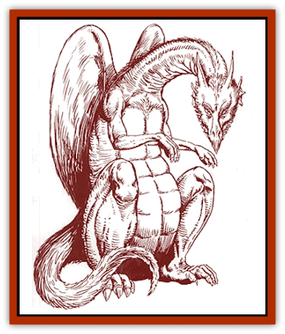

# Dragon - Savage Coast - Red Hawk

| Statistic | **Dragon (Savage Coast), Red Hawk** |
| --- | --- |
| **Activity Cycle:** | Day |
| **Alignment:** | Lawful neutral |
| **Armor Class:** | 0 (base) |
| **Climate/Terrain:** | Any/Mountains |
| **Damage/Attack:** | 1d6/1d6/4d6 |
| **Diet:** | Carnivore |
| **Frequency:** | Rare |
| **Hit Dice:** | 9 (base) |
| **Intelligence:** | High (13-14) |
| **Magic Resistance:** | Varies |
| **Morale:** | Champion (15-16) |
| **Movement:** | 8, Fl 36 (C) |
| **No. Appearing:** | 1d3 |
| **No. of Attacks:** | 3 |
| **Organization:** | Clan |
| **Size:** | Varies |
| **Special Attacks:** | Breath weapon |
| **Special Defenses:** | Varies |
| **THAC0:** | 11 (at 9 HD) |
| **Treasure:** | Special |
| **XP Value:** | Varies |

The red hawk dragon is native to the Arm of the Immortals Peninsula, but occasionally it is seen flying over the western lands of the Savage Coast. For obvious reasons, it is referred to as the "feathered dragon".

This creature is smaller and less bulky than most [[Dragon_General_Information|dragons]]. Its body is fairly streamlined for a creature of this size, tapering quickly into a stubbed tail. It uses its huge, powerful rear legs and versatile claws to walk around, while its forward arms are shorter and more useful in manipulative work than locomotion. The head of the red hawk dragon is angular, and the upper half of its mouth is hardened and pointed much like a beak.

Red hawk [[Dragon_Savage_Coast_General_Information|dragons]] are born covered in thick, bright red down, which later transforms into large, red feathers. During the dragon's *juvenile* years, scales start coming in, first covering critical locations, such as its chest and the brow ridges on its head. As it matures, the scales thicken and turn from a bright red to a reddish-brown, and the feathers turn dark red. By the time it reaches the young adult stage, most of the head is scaled except for a few decorative lines of feathers, and the chest and legs are completely scaled. The body is armored in several areas with large scales, leaving borders of small scales covered with feathers around the chest and down the back. The wings and tail stay fully feathered.

Red hawk dragons speak a common language among themselves. *Hatchlings* also have a 15% chance to communicate with any other intelligent creature. This chance increases 5% per age category. Red hawk dragons also know the languages of the [[Ee'aar|ee'aar]] and the <a href=\/appendix/enduk">enduks</a>.

**Combat:** On the ground, a red hawk dragon attacks with its bite and upper claws. If airborne, it rakes with its powerful rear claws for 2d6 points of damage each. If both rear claws hit and the target is less than 25 feet long, the dragon can hold the target immobile and carry it off. While gripping a target, the dragon gains a +5 attack bonus with its bite. A successful bend bars roll can force open one claw per round.

Three times per day, the red hawk dragon can use a fiery breath weapon. While not as strong as that of the red dragon, it is still considerable, inflicting (2 x Age Category)d6. While these creatures are immune to fire, they take double damage from all cold-based attacks.

**Habitat/Society:** Red hawk dragons are thought to be a cross between [[Dragon_Chromatic_Red|red dragons]] and giant [[Roc|rocs]]. They live only on the Arm of the Immortals Peninsula, though at times they can be found ranging out away from their familiar mountain habitat.

Red hawk dragons are social creatures, living in communities with others of their kind, though they often hunt solo. The communities sometimes number more than a dozen dragons - not including young. They mostly live in large caves. However, in the right conditions, they might take over an entire valley hidden deep within the mountains. They hunt along the slopes and plateaus but will sometimes venture beyond the mountains on extended hunting sprees. Inside the community, each red hawk dragon takes one mate and raises at least one set of young, ranging from two to four baby dragons. Though the parents are completely responsible for their young to begin with, after their first few years the entire community takes responsibility by helping with the young dragons.

**Ecology:** Red hawk dragons have no particular desire for wealth or power, though they do collect treasure. Proud of their lineage, they will suffer no affront to their collective dignity. They are the governing predator of their mountains, and any source of rivalry or impertinence is likely to find itself up against the entire community rather than just one dragon. They are on fairly good terms with the winged races of the ee'aar and enduk, and they remain neutral in regards to others. They hunt only creatures of Low Intelligence or below.

| Age | Body Lgt. (') | Tail Lgt. (') | AC | Spells W | MR | Treas. Type | XP Value |
| --- | --- | --- | --- | --- | --- | --- | --- |
| 1 Hatchling | 12-16 | 3-4 | 3 | Nil | Nil | Nil | 1,400 |
| 2 Very young | 16-20 | 4-5 | 2 | Nil | Nil | Nil | 2,000 |
| 3 Young | 20-25 | 5-7 | 1 | Nil | Nil | Qx2 | 4,000 |
| 4 Juvenile | 25-35 | 7-10 | 0 | Nil | Nil | Qx2,Y | 6,000 |
| 5 Young adult | 35-45 | 10-13 | -1 | Nil | Nil | Qx4,Yx4 | 9,000 |
| 6 Adult | 45-55 | 13-16 | -2 | Nil | 15% | I,Yx4 | 11,000 |
| 7 Mature adult | 55-67 | 16-19 | -3 | 1 | 20% | I,Yx4 | 13,000 |
| 8 Old | 67-79 | 19-22 | -4 | 2 | 25% | Z | 14,000 |
| 9 Very old | 79-91 | 22-25 | -5 | 2 1 | 30% | Z | 15,000 |
| 10 Venerable | 91-103 | 25-27 | -6 | 2 2 | 35% | F | 16,000 |
| 11 Wyrm | 103-115 | 27-29 | -7 | 2 2 1 | 40% | F | 18,000 |
| 12 Great Wyrm | 115-127 | 29-31 | -8 | 2 2 2 | 50% | F | 20,000 |

---
## Discovery & Documentation

**Source Publication:** Monstrous Compendium Savage Coast Appendix (Online Exclusive) (1995)
**Campaign Setting:** Mystara
**Author(s):** Loren L Coleman, Ted James, Thomas Zuvich, Cindi M. Rice

### Other Creatures Found in This Source Book
   * [[Aranea_Savage_Coast|Aranea (Savage Coast)]]
   * [[Arashaeem|Arashaeem]]
   * [[Batracine|Batracine]]
   * [[Cat_Marine|Cat, Marine]]
   * [[Cinnavixen|Cinnavixen]]
   * [[Clockwork_Swordsman|Clockwork Swordsman]]
   * [[Critter_Temple|Critter, Temple]]
   * [[Cursed_One|Cursed One]]
   * [[Deathmare|Deathmare]]
   * [[Dragon_Savage_Coast_Crimson|Dragon (Savage Coast), Crimson]]
   * [[Echyan|Echyan]]
   * [[Ee'aar|Ee'aar]]
   * [[Enduk|Enduk]]
   * [[Fachan_Savage_Coast|Fachan (Savage Coast)]]
   * [[Feliquine|Feliquine]]
   * [[Fiend_Narvaezan|Fiend, Narvaezan]]
   * [[Frelôn|Frelôn]]
   * [[Ghriest|Ghriest]]
   * [[Glutton_Sea|Glutton, Sea]]
   * [[Goatman|Goatman]]
   * [[Golem_Naâruk|Golem, Naâruk]]
   * [[Golem_Savage_Coast|Golem (Savage Coast)]]
   * [[Grudgling|Grudgling]]
   * [[Heraldic_Servant_I|Heraldic Servant I]]
   * [[Heraldic_Servant_II|Heraldic Servant II]]
   * [[Heraldic_Servant_III|Heraldic Servant III]]
   * [[Heraldic_Servant_IV|Heraldic Servant IV]]
   * [[Heraldic_Servant_V|Heraldic Servant V]]
   * [[Heraldic_Servant_General_Information|Heraldic Servant, General Information]]
   * [[Hermit_Sea|Hermit, Sea]]
   * [[Jorri|Jorri]]
   * [[Juhrion|Juhrion]]
   * [[Kla'a-tah|Kla'a-tah]]
   * [[Leech_Legacy|Leech, Legacy]]
   * [[Lich_Inheritor|Lich, Inheritor]]
   * [[Lizard_Kin_Savage_Coast|Lizard Kin (Savage Coast)]]
   * [[Lupasus|Lupasus]]
   * [[Lupin|Lupin]]
   * [[Lyra_Bird_Saragón|Lyra Bird, Saragón]]
   * [[Malfera|Malfera]]
   * [[Manscorpion_Nimmurian|Manscorpion, Nimmurian]]
   * [[Mythuínn_Folk|Mythuínn Folk]]
   * [[Neshezu|Neshezu]]
   * [[Nikt'oo|Nikt'oo]]
   * [[Nosferatu|Nosferatu]]
   * [[Omm-wa|Omm-wa]]
   * [[Omshirim|Omshirim]]
   * [[Parasite_Savage_Coast|Parasite (Savage Coast)]]
   * [[Phanaton|Phanaton]]
   * [[Plant_Savage_Coast|Plant (Savage Coast)]]
   * [[Pudding_Vermilion|Pudding, Vermilion]]
   * [[Rakasta|Rakasta]]
   * [[Ray_Forest|Ray, Forest]]
   * [[Shedu_Greater_Savage_Coast|Shedu, Greater (Savage Coast)]]
   * [[Shimmerfish|Shimmerfish]]
   * [[Skinwing|Skinwing]]
   * [[Spawn_of_Nimmur|Spawn of Nimmur]]
   * [[Spider-spy|Spider-spy]]
   * [[Spirit_Heroic|Spirit, Heroic]]
   * [[Spirit_Walleran|Spirit, Walleran]]
   * [[Succulus|Succulus]]
   * [[Swampmare|Swampmare]]
   * [[Symbiont_Shadow|Symbiont, Shadow]]
   * [[Tortle|Tortle]]
   * [[Troll_Legacy|Troll, Legacy]]
   * [[Trosip|Trosip]]
   * [[Tyminid|Tyminid]]
   * [[Utukku|Utukku]]
   * [[Voat|Voat]]
   * [[Voat_Herathian|Voat, Herathian]]
   * [[Vulturehound|Vulturehound]]
   * [[Wallara|Wallara]]
   * [[Wurmling|Wurmling]]
   * [[Wynzet|Wynzet]]
   * [[Yeshom|Yeshom]]
   * [[Zombie_Red|Zombie, Red]]
