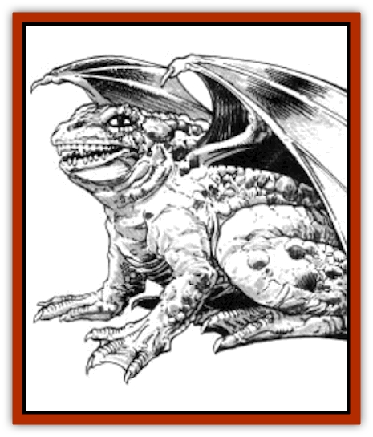

# Dragon - Sea

| Statistic | **Dragon, Sea** |
| --- | --- |
| **Activity Cycle:** | Any |
| **Alignment:** | Neutral evil |
| **Armor Class:** | -2 (base) |
| **Climate/Terrain:** | Tropical, subtropical, and temperate/Ocean |
| **Damage/Attack:** | 1-12/1-12/3-36 |
| **Diet:** | Special |
| **Frequency:** | Rare |
| **Hit Dice:** | 15 (base) |
| **Intelligence:** | Highly (13-14) |
| **Magic Resistance:** | Variable |
| **Morale:** | Fanatic (18) |
| **Movement:** | 3, Sw 12 |
| **No. Appearing:** | 1-6 |
| **No. of Attacks:** | 3 + special |
| **Organization:** | Solitary |
| **Size:** | G (35' base diameter) |
| **Special Attacks:** | Breath weapon and magical abilities |
| **Special Defenses:** | Variable |
| **THAC0:** | 5 (base) |
| **Treasure:** | Special |
| **XP Value:** | Variable |

Related to the [[Dragon_Turtle|dragon turtle]], the sea [[Dragon_General_Information|dragon]] resembles a [[Turtle_Giant|giant turtle]] with a dragon's head and massive flippers. A thick shell, usually black or dark green, covers most of its body. Its webbed toes and paddlelike flippers make land travel difficult. The sea dragon has no teeth.

Sea dragons speak their own tongue, and also the languages of fishes and evil dragons. They can also converse with any human or demihuman.

**Combat:** Any creature appearing in a sea dragon's territory without permission is considered to be an enemy. The sea dragon attacks with its breath weapon and front flippers, closing to finish off a wounded opponent with its powerful jaws.

A sea dragon attempts to capsize unauthorized vessels entering its territory. To determine the sea dragon's chance of capsizing a vessel, divide the dragon's size by the ship's size and multiply by 100. (For instance, if a 50-foot sea dragon attempts to capsize an 200-foot ship, it has a 25% chance of success.) This chance never exceeds 95% - a sea dragon always has a 95% chance of capsizing a ship the same size as itself or smaller.

Knowledgeable sailors crossing a sea dragon's territory often dump barrels of treasure overboard in hopes of placating it. Usually, anything less than the ship's entire cargo is considered an insult. Once the ship is capsized, the sea dragon tries to kill all of the ship's passengers.

**Breath Weapon/Special Abilities:** A sea dragon's breath weapon is a cone of steam 50 feet long that is five feet wide at the dragon's mouth and 30 feet wide at the base. Damage caused by the breath weapon varies with the dragon's age. A victim of the blast can roll a saving throw vs. breath weapon; success means only half damage was suffered. The breath weapon is as effective underwater as it is in the open air and can be used once every three combat rounds.

From birth, a sea dragon can breathe both water and air. It possesses a type of sonar that enables it to detect creatures and objects of man-size or larger up to 360 feet away in the water.

Once per day, a sea dragon has the *scaly command* power over a variable number of scaly creatures with animal intelligence or less (primarily reptiles and fishes) living in the water within a half-mile radius. The number of creatures under scaly command is 4d10 times the age category of the dragon. This control lasts for 2d6 turns and cannot be dispelled. No saving throws are allowed. Creatures under the *scaly command* of one sea dragon cannot fall under the control of another. Additionally, scaly creatures will never voluntarily attack a sea dragon.

As they age, sea dragons gain the following additional abilities, all useable three times per day:

*Adult: light*; *Old: entangle*; *Wyrm: suggestion*.

**Habitat/Society:** A sea dragon's territory is an area of several hundred square miles of ocean. Unless pursuing an enemy or laying eggs, a sea dragon rarely leaves its territory. Its lair is usually an immense stone castle on the ocean floor. Two sea dragons never share the same territory or lair, except during the annual mating season, a period of approximately three weeks.

A female sea dragon lays as many as 300 eggs in a deep nest on a sandy beach. After laying the eggs, she buries them, then returns to the ocean. The warm sun hatches the eggs, a process taking about eight weeks. However, it is rare that more than a few of the hatchlings survive.

**Ecology:** Essentially herbivorous, sea dragons mainly eat algae and seaweed, but also enjoy the occasional fish, mineral chunk, or swimming sailor. Their eggs are considered delicacies by many races, particularly the [[Minotaur_Krynn|minotaurs of Mithas]].

| Age | Body Dia. (') | AC | Breath Weapon | MR | Treas. Type | XP Value |
| --- | --- | --- | --- | --- | --- | --- |
| 1 Hatchling | 4-11 | 1 | 1d8+1 | Nil | Nil | 2,000 |
| 2 Very young | 11-20 | 0 | 2d8+2 | Nil | Nil | 5,000 |
| 3 Young | 20-29 | -1 | 3d8+3 | Nil | Nil | 7,000 |
| 4 Juvenile | 29-38 | -2 | 4d8+4 | 15% | E,C | 8,000 |
| 5 Young adult | 38-48 | -3 | 5d8+5 | 20% | C,H | 11,000 |
| 6 Adult | 48-58 | -4 | 6d8+6 | 25% | C,H | 12,000 |
| 7 Mature adult | 58-68 | -5 | 7d8+7 | 30% | C,H | 13,000 |
| 8 Old | 68-79 | -6 | 8d8+8 | 35% | C,Hx2 | 14,000 |
| 9 Very old | 79-90 | -7 | 9d8+9 | 40% | C,Hx2 | 15,000 |
| 10 Venerable | 90-101 | -8 | 10d8+10 | 45% | C,Hx2 | 16,000 |
| 11 Wyrm | 101-113 | -9 | 11d8+11 | 50% | C,Hx3 | 17,000 |
| 12 Great Wyrm | 113-125 | -10 | 12d8+12 | 55% | C,Hx3 | 18,000 |

---
## Discovery & Documentation

**Source Publication:** MC4 Dragonlance Appendix (w/binder #2) (1989)
**Campaign Setting:** Dragonlance
**Author(s):** Rick Swan

### Other Creatures Found in This Source Book
   * [[Anemone_Giant_Sea|Anemone, Giant Sea]]
   * [[Bear_Ice|Bear, Ice]]
   * [[Beast_Undead|Beast, Undead]]
   * [[Bird_Krynn|Bird (Krynn)]]
   * [[Disir|Disir]]
   * [[Draconian_Aurak|Draconian, Aurak]]
   * [[Draconian_Baaz|Draconian, Baaz]]
   * [[Draconian_Bozak|Draconian, Bozak]]
   * [[Draconian_Kapak|Draconian, Kapak]]
   * [[Draconian_General_Information|Draconian, General Information]]
   * [[Draconian_Sivak|Draconian, Sivak]]
   * [[Draconian_Proto-_Traag|Draconian, Proto-, Traag]]
   * [[Dragon_Amphi|Dragon, Amphi]]
   * [[Dragon_Astral|Dragon, Astral]]
   * [[Dragon_Kodragon|Dragon, Kodragon]]
   * [[Dragon_Krynn_Othlorx_General_Information|Dragon (Krynn), Othlorx, General Information]]
   * [[Dragon_Krynn_General_Information|Dragon (Krynn), General Information]]
   * [[Dreamshadow|Dreamshadow]]
   * [[Dreamwraith|Dreamwraith]]
   * [[Dwarf_Daergar|Dwarf, Daergar]]
   * [[Dwarf_Hill_Neidar|Dwarf, Hill, Neidar]]
   * [[Dwarf_Mountain_Hylar|Dwarf, Mountain, Hylar]]
   * [[Dwarf_Theiwar|Dwarf, Theiwar]]
   * [[Dwarf_Zakhar|Dwarf, Zakhar]]
   * [[Elf_Half-|Elf, Half-]]
   * [[Elf_High_Qualinesti|Elf, High, Qualinesti]]
   * [[Elf_High_Silvanesti|Elf, High, Silvanesti]]
   * [[Elf_Sea_Dargonesti|Elf, Sea, Dargonesti]]
   * [[Elf_Sea_Dimernesti|Elf, Sea, Dimernesti]]
   * [[Elf_Wild_Kagonesti|Elf, Wild, Kagonesti]]
   * [[Eyewing|Eyewing]]
   * [[Fetch|Fetch]]
   * [[Fire_Minion|Fire Minion]]
   * [[Fireshadow|Fireshadow]]
   * [[Gnome_Tinker|Gnome, Tinker]]
   * [[Gurik_Cha'ahl|Gurik Cha'ahl]]
   * [[Haunt_Knight|Haunt, Knight]]
   * [[Horax|Horax]]
   * [[Human_Krynn|Human (Krynn)]]
   * [[Imp_Blood_Sea|Imp, Blood Sea]]
   * [[Kalothagh|Kalothagh]]
   * [[Kani_Doll|Kani Doll]]
   * [[Kender|Kender]]
   * [[Kyrie|Kyrie]]
   * [[Lizard_Man_Krynn|Lizard Man (Krynn)]]
   * [[Minotaur_Krynn|Minotaur, Krynn]]
   * [[Ogre_High|Ogre, High]]
   * [[Ogre_Krynn|Ogre (Krynn)]]
   * [[Phaethon|Phaethon]]
   * [[Saqualaminoi|Saqualaminoi]]
   * [[Shadowperson|Shadowperson]]
   * [[Shimmerweed|Shimmerweed]]
   * [[Skrit|Skrit]]
   * [[Spectral_Minion|Spectral Minion]]
   * [[Spider_Krynn|Spider (Krynn)]]
   * [[Stag|Stag]]
   * [[Tayling|Tayling]]
   * [[Thanoi|Thanoi]]
   * [[Tylor|Tylor]]
   * [[Wichtlin|Wichtlin]]
   * [[Wyndlass|Wyndlass]]
   * [[Yaggol|Yaggol]]
