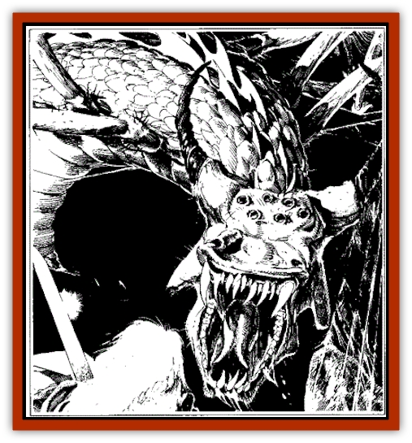

# Dragon - Spider

| Statistic | **Dragon, Spider** |
| --- | --- |
| **Activity Cycle:** | Any |
| **Alignment:** | Neutral evil |
| **Armor Class:** | 2 (base) |
| **Climate/Terrain:** | Subterranean caverns |
| **Damage/Attack:** | 1-8/1-8/4-16 |
| **Diet:** | Special |
| **Frequency:** | Very rare |
| **Hit Dice:** | 8 (base) |
| **Intelligence:** | High (13-14) |
| **Magic Resistance:** | ariable |
| **Morale:** | Fanatic (17) |
| **Movement:** | 12, Wb 12 |
| **No. Appearing:** | 1 |
| **No. of Attacks:** | 3 + special |
| **Organization:** | Solitary |
| **Size:** | G (25' base length) |
| **Special Attacks:** | Web, breath weapons |
| **Special Defenses:** | See below |
| **THAC0:** | 13 (at 8 HD) |
| **Treasure:** | Special |
| **XP Value:** | Variable |

Spider dragons are a creation of [[Handmaiden_of_Takhisis|Jiathuli]], Mistress of the Deathdark. She created the spider dragons in envy of Takhisis, the ruler of evil dragons. It was because of the creation of [[Spider|spider]] dragons that Takhisis imprisoned Jiathuli in the Deathdark; she also destroyed all but a handful of these creatures.

A spider dragon has a [[Dragon_General_Information|dragon's]] body (without the tail), with eight spidery legs and spider eyes on its draconian head. It lacks the magical abilities of most true dragons

**Combat:** Spider dragons attack with two types of breath weapons. The first spreads a web-like film in a cone shape, ten feet wide at its mouth, 30 feet wide at its base, and 90 feet long. This web-like film slows (as the spell) any who are caught in the area unless they roll a successful saving throw vs. dragon breath. All attacks made by people who are in this area suffer a –3 attack and damage roll penalty. The spider dragon suffers no penalties while within this webbing. This webbing remains until burned by magical fire.

The second breath weapon is a venomous spray in a ten-foot-wide, 50-foot-long line. This form of the breath weapon inflicts the damage indicated on the table below.

The spider dragon is immune to poisons, paralysis, and petrification, as well as *web* and *slow* spells and effects

In combat, the spider dragon tries to lure its prey into a small area (not difficult, given its subterranean dwelling), then use its web breath to keep its prey at a disadvantage

**Habitat/Society:** Spider dragons live solitary existences, mating at the young adult stage. Female spider dragons lay clutches of hundreds of eggs, but they devour all but two eggs. Spider dragons are ferocious predators, fearing only true dragons. At present, several spider dragons have been tamed and trained by the drow of Deathdark.

**Ecology:** Only a handful of spider dragons remain from the original batch that brought Takhisis's wrath down on Jiathuli. Spider dragons prefer to live on meat (spider horses and whisper spiders are considered delicacies). Their venom is a powerful acid that can cut through most woods, cloths, and ceramics in seconds.

| Age | Body Lgt. (') | AC | Breath Weapon | MR | Treas. Type | XP Value |
| --- | --- | --- | --- | --- | --- | --- |
| 1 Hatchling | 9-13 | 5 | 2d6+4 | Nil | Nil | 975 |
| 2 Very young | 14-16 | 4 | 3d6+6 | Nil | Nil | 1,400 |
| 3 Young | 17-21 | 3 | 4d6+8 | Nil | Nil | 2,000 |
| 4 Juvenile | 22-26 | 2 | 5d6+10 | Nil | R, T | 3,000 |
| 5 Young adult | 27-40 | 1 | 6d6+12 | 35% | R, T | 4,000 |
| 6 Adult | 41-65 | 0 | 7d6+14 | 40% | R, T | 6,500 |
| 7 Mature adult | 66-85 | 1 | 8d6+16 | 45% | R, T | 7,000 |
| 8 Old | 86-100 | -2 | 9d6+18 | 50% | R, T, X | 8,000 |
| 9 Very old | 101-115 | -3 | 10d6+20 | 55% | R, T, X | 9,000 |
| 10 Venerable | 116-130 | -4 | 11d6+22 | 60% | R, T, X | 10,000 |
| 11 Wyrm | 131-145 | -5 | 12d6+24 | 65% | R, T, X, Z | 11,000 |
| 12 Great Wyrm | 146-160 | -6 | 13d6+26 | 70% | R, T, X, Z | 12,000 |

---
## Discovery & Documentation

**Source Publication:** Wild Elves (1991)
**Campaign Setting:** Dragonlance
**Author(s):** Scott Bennie

### Other Creatures Found in This Source Book
   * [[Curotai|Curotai]]
   * [[Handmaiden_of_Takhisis|Handmaiden of Takhisis]]
   * [[Ice_Vampire|Ice Vampire]]
   * [[Spider_Horse|Spider Horse]]
   * [[Weapon_Living|Weapon, Living]]
