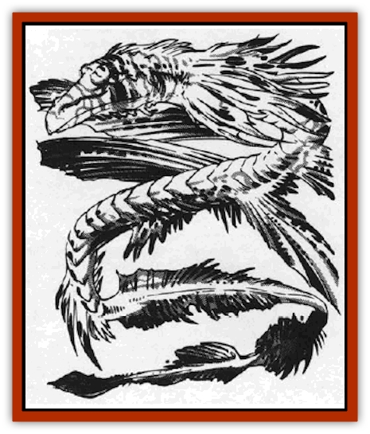

# Dragon - Stellar

| Statistic | **Dragon, Stellar** |
| --- | --- |
| **Activity Cycle:** | Any |
| **Alignment:** | Neutral |
| **Armor Class:** | -2 |
| **Climate/Terrain:** | Wildspace/phlogiston |
| **Damage/Attack:** | Variable |
| **Diet:** | Special |
| **Frequency:** | Very rare |
| **Hit Dice:** | 50 |
| **Intelligence:** | Godlike (21+) |
| **Magic Resistance:** | Variable |
| **Morale:** | Fearless (19-20) |
| **Movement:** | 12, Fl 48 (A) |
| **No. Appearing:** | 1 |
| **No. of Attacks:** | Special |
| **Organization:** | Solitary/tribal |
| **Size:** | G (1,200' base) |
| **Special Attacks:** | Special |
| **Special Defenses:** | Variable |
| **THAC0:** | 5 |
| **Treasure:** | See below |
| **XP Value:** | 54,000 |

Big, peaceful, and highly intelligent, these enormous philosophers of the phlogiston wander the flow seeking discourse with the keepers of the crystal spheres.

The scales of stellar [[Dragon_General_Information|dragons]] are iridescent deep purple, with a chrome drop at the tip of each scale. Gems of myriad colors and sizes adorn the scales in random patterns, giving the stellar dragon its name. Two main fins, like the fins of a lionfish, adorn either side of the central torso, and four enormous lace-like wings provide guidance and stability. Numerous other fins of various sizes cover the rest of the dragon's body. They have no visible arms or legs.

Stellar dragons, unlike their smaller kin, the [[Dragon_Radiant|radiants]], are neutral. They consider stooping to meddle in the affairs of smaller beings to be loutish and in bad taste. When they encounter humanoids, stellar dragons prefer to watch rather than involve themselves. Only rarely do they speak with lesser beings.

However, if one has information previously unknown to the dragon, this may gain its interest and even useful knowledge in trade. Information is the stellar dragon's food and drink, if anything is, and it is willing to trade in kind. (One rumor has it that the Greyhawk wizard Bigby learned his *interposing hand* and *grasping hand* spells from a stellar dragon in exchange for a juicy tidbit of information.)

Stellar dragons literally consume their knowledge, transforming it into clear or milky gems of varying size. These *gems of wisdom* and *pearls of knowledge* push their way outward to rest embedded in the dragon's scales. The number of gems and pearls studding its scales mark its status among other dragons. The encrustation also roughly indicates its age; younger dragons have few gems, whereas *venerable* stellars are literally covered in jewels. The chief, or mikado, is another case entirely (see below).

**Combat:** Though not normally aggressive, the stellar dragon can easily defend itself. Its unique "breath weapon" is gravitic: rather than emitting breath, it draws things into the dragon's internally generated sphere of annihilation. The mouth, a focus for the sphere, confines its gravitic attraction to a cone 1,200 yards long, 50' wide at the dragon's mouth and 600' wide at the base. A successful save vs. breath weapon negates the effect.

The stellar dragon has three other innate attacks. First, it can randomly *teleport* an attacker 500-6000 yards (1d12 hexes) in any direction.

Second, its titanic intellect lets it use any wizard's spell in the *Player's Handbook* without error. It can also modify or create spells to suit its needs; for example, it could merge *darkness, 50' radius* and *fireball* to create a *shadow flare* spell. It can repeat spells as often as needed.

Third, it can *summon* one denizen of another plane once per round for up to seven rounds (DM's choice of any monster up to half the dragon's own HD in strength). Summoned individuals serve the dragon slavishly, remaining for 2d6 rounds before they "snap" back to their home continuum.

**Habitat/Society:** The stellar dragons' range covers the entire cosmos, so their exact numbers are unknown; parties encounter them only rarely. However, once every 500 years, the stellar dragons convene for their mating ceremony. In this ceremony, the most worthy stellar dragons are selected by their tribal head, called the mikado. There is only one mikado at any time. The mikado is distinguished by the single crystal horn on his forehead.

Those dragons that the mikado selects as mates each produce a single offspring. This dragon, born fully sentient, leaves to make its own way among the stars.

Stellar dragon territories are vast, extending into other planes and dimensions. Individuals negotiate boundaries to prevent intrusion on each other's space. However, they haggle endlessly to obtain dynamic civilizations to monitor.

The dragons deal with attackers handily. However, if a party approaches the dragon with respect and choice information, chances are even that the dragon deigns to talk. Chances are equally good that the dragon is thinking (that is, digesting) and dismisses the interlopers.

The stellar dragon's ultimate goal is truth. It abhors dishonesty and misinformation. Though its information may be cryptic, it is never false. A lesser being's misinterpretation is that being's own fault. Misinformation causes a stellar dragon severe, painful indigestion. And as with its smaller kin, a dragon in pain is dangerous.

**Ecology:** The stellar dragon understands the underpinnings of the multiverse. These primeval watchers have seen the rise and fall of many civilizations. Such is the power of this knowledge that according to some texts, the power of artifacts and relics comes from the gems that encrust them, The crystallized everlasting knowledge of thousands of beings, say these legends, provides the power that runs these wonderful objects. How these gems were wrested from the stellar dragons remains unsaid.

*Gems of wisdom* and *pearls of knowledge* are valuable almost beyond calculation. The information they contain can be liberated and used to gain enormous profit. Sages and wizards do nearly anything to gain one.

| Age | Body Lgt. (') | Tail Lgt. (') | AC | Spells W | MR | Treas. Type |
| --- | --- | --- | --- | --- | --- | --- |
| 1 Hatchling | 10-100 | 20-100 | 2 | Nil | Nil | Any |
| 2 Very young | 101-200 | 101-200 | 1 | 1 | 10% | Any |
| 3 Young | 201-600 | 201-600 | 0 | 2 | 20% | Any |
| 4 Juvenile | 601-1,200 | 601-1,400 | -1 | 2 1 | 30% | Any |
| 5 Young adult | 1,201-2,000 | 1,400-2,200 | -2 | 3 2 | 35% | Any |
| 6 Adult | 2,001-3,000 | 2,200-3,200 | -3 | 4 2 1 | 40% | Any |
| 7 Mature adult | 3,001-4,000 | 3,201-4,300 | -4 | 4 2 2 | 45% | Any |
| 8 Old | 4,001-5,000 | 4,301-5,300 | -5 | 4 3 2 1 | 50% | Any |
| 9 Very old | 5,001-6,000 | 5,301-6,300 | -6 | 4 3 3 1 | 55% | Any |
| 10 Venerable | 6,001-8,000 | 6,301-8,400 | -7 | 4 3 3 2 | 60% | Any |
| 11 Wyrm | 8,001-10,000 | 8,401-11,000 | -8 | 4 3 3 3 | 65% | Any |
| 12 Great Wyrm | 10,001-1 million | 11,001-2 million | -9 | 4 4 3 3 1 | 70% | Any |

---
## Discovery & Documentation

**Source Publication:** MC9 Spelljammer Appendix II (1991)
**Campaign Setting:** Planescape
**Author(s):** Scott Davis, Newton Ewell, John Terra

### Other Creatures Found in This Source Book
   * [[Alchemy_Plant|Alchemy Plant]]
   * [[Allura|Allura]]
   * [[Aperusa|Aperusa]]
   * [[Autognome|Autognome]]
   * [[Bionoid|Bionoid]]
   * [[Bloodsac|Bloodsac]]
   * [[Buzzjewel|Buzzjewel]]
   * [[Constellate|Constellate]]
   * [[Contemplator|Contemplator]]
   * [[Dohwar|Dohwar]]
   * [[Dragon_Moon|Dragon, Moon]]
   * [[Dragon_Sun|Dragon, Sun]]
   * [[Dreamslayer|Dreamslayer]]
   * [[Dweomerborn|Dweomerborn]]
   * [[Fal|Fal]]
   * [[Feesu|Feesu]]
   * [[Fire_Bat|Fire Bat]]
   * [[Firebird|Firebird]]
   * [[Firelich|Firelich]]
   * [[Flowfiend|Flowfiend]]
   * [[Gadabout|Gadabout]]
   * [[Gammaroid|Gammaroid]]
   * [[Gonn|Gonn]]
   * [[Gossamer|Gossamer]]
   * [[Grav|Grav]]
   * [[Great_Dreamer|Great Dreamer]]
   * [[Greatswan|Greatswan]]
   * [[Grell_Colonial|Grell, Colonial]]
   * [[Gullion|Gullion]]
   * [[Insectare|Insectare]]
   * [[Lhee|Lhee]]
   * [[Mercurial_Slime|Mercurial Slime]]
   * [[Meteorspawn|Meteorspawn]]
   * [[Monitor|Monitor]]
   * [[Owl_Space|Owl, Space]]
   * [[Pristatic|Pristatic]]
   * [[Scro|Scro]]
   * [[Selkie_Star|Selkie, Star]]
   * [[Silatic|Silatic]]
   * [[Skullbird|Skullbird]]
   * [[Sleek|Sleek]]
   * [[Sluk|Sluk]]
   * [[Space_Swine|Space Swine]]
   * [[Sphinx_Astro-|Sphinx, Astro-]]
   * [[Spirit_Warrior|Spirit Warrior]]
   * [[Starfly_Plant|Starfly Plant]]
   * [[Stargazer|Stargazer]]
   * [[Undead_Stellar|Undead, Stellar]]
   * [[Witchlight_Marauder|Witchlight Marauder]]
   * [[Xixchil|Xixchil]]
   * [[Yitsan|Yitsan]]
   * [[Zurchin|Zurchin]]
