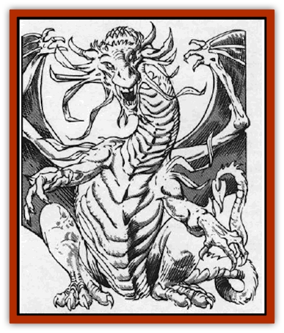

# Dragon - Sun

| Statistic | **Dragon, Sun** |
| --- | --- |
| **Activity Cycle:** | Any |
| **Alignment:** | Any good |
| **Armor Class:** | 1 (base) |
| **Climate/Terrain:** | Stars |
| **Damage/Attack:** | 1d10/1d10/3d8 |
| **Diet:** | Omnivore |
| **Frequency:** | Rare |
| **Hit Dice:** | 10 (base) |
| **Intelligence:** | Exceptional (15-16) |
| **Magic Resistance:** | Variable |
| **Morale:** | Elite (16) |
| **Movement:** | 12, Fl 36 (C) |
| **No. Appearing:** | 1 (2-5) |
| **No. of Attacks:** | 3 + special |
| **Organization:** | Solitary or clan |
| **Size:** | G (70' base) |
| **Special Attacks:** | Special |
| **Special Defenses:** | Variable |
| **THAC0:** | 11 (base) |
| **Treasure:** | Special |
| **XP Value:** | Variable |

The benevolent sun [[Dragon_General_Information|dragons]] live and cavort on the surface of suns. Though majestic and intelligent, they love life and freedom, showing this love in a playful attitude.

The sun dragon's coloration changes as it ages, matching stellar evolution. At hatching, they are fiery red; as *juveniles*, burnt orange; as *mature adults*, brilliant yellow; when *venerable*, bluish white. Finally, when a sun dragon becomes a *Great Wyrm*, it shrinks back to almost hatchling size and turns a flat white color.

Some people confuse these sun dragons for very young [[Dragon_Moon|moon dragons]], at much risk to their health.

Sun dragons speak their own language, as well as the language of all good dragons and Common. Though a happy race, they hate moon dragons, their mortal enemies.

**Combat:** Sun dragons have little interest in combat. Since they lair on the hot surfaces of suns, few opponents get close enough to invade their homes. When necessary, the sun dragon uses its breath weapon to soften up opponents (3d8 damage), then pauses so that enemies can reconsider and retreat. If the enemy does not, the dragon breathes again and charges, teeth and claws flashing (1d10 each).

Sometimes it acts like a big cat, picking up its enemies, batting them around, and swatting them into the air. In this case, the victims avoid claw damage but take 1d10 damage from the buffeting. Victims lose initiative and must make an ability check against half their Dexterity to take action in the following round.

**Breath Weapon/Special Abilities:** Sun dragons "spit" *fireballs* with a range of 240' and an explosion radius of 5' per age category of the sun dragon. The dragon can also coat the fiery wad with its special saliva, delaying the blast for up to ten rounds. The dragon can control the detonation time exactly.

Certain innate spell abilities manifest themselves at different ages. A dragon can use each spell ability three times a day. *Juvenile* dragons gain *heat metal*; *adults*, *fire shield*; and *very old* dragons, *prismatic spray*. Whenever a sun dragon takes flight, its entire body is suffused by *continual light*. Sun dragons are immune to all forms of fire; they save at -2 vs. cold-based attacks. Finally, a sun dragon can innately sense the presence of a moon dragon in its crystal sphere.

**Habitat/Society:** Sun dragons scoop out the fiery matter on a sun's surface and hollow out good-sized caverns for their needs. When a sun dragon lays its clutch of 1d4+1 fire-resistant eggs, it causes a solar flare to erupt on the sun's surface.

When a sun dragon dies of old age, the body collapses in on itself, creating a *sphere of annihilation*, (95% probability) or a *well of many worlds* (5%). These creations are unstable, with a 1% per day (cumulative) chance to dissipate unless a *permanency* spell is cast upon them.

Sun dragon treasure is coated with the beast's saliva to keep it from melting into nothingness. When the items are removed from the heat of the sun, the saliva freezes into a kind of sleet that can be easily removed.

Ecology: Sun dragons eat anything, but they are careful not to eat intelligent creatures, for they respect life.

| Age | Body Lgt. (') | Tail Lgt. (') | AC | Breath Weapon | Spells W | MR | Treas. Type | XP |
| --- | --- | --- | --- | --- | --- | --- | --- | --- |
| 1 Hatchling | 10-19 | 5-10 | 4 | 2d8+1 | Nil | Nil | Nil | 1,400 |
| 2 Very young | 20-29 | 11-16 | 3 | 3d8+2 | Nil | Nil | Nil | 2,000 |
| 3 Young | 30-39 | 17-22 | 2 | 4d8+3 | Nil | Nil | Nil | 3,000 |
| 4 Juvenile | 40-49 | 23-28 | 1 | 5d8+4 | 1 | 25% | Nil | 6,000 |
| 5 Young adult | 50-59 | 29-34 | 0 | 6d8+5 | 2 | 30% | Nil | 8,000 |
| 6 Adult | 60-69 | 35-40 | -1 | 7d8+6 | 2 1 | 35% | Nil | 9,000 |
| 7 Mature adult | 70-79 | 41-46 | -2 | 8d8+7 | 2 2 | 40% | Nil | 10,000 |
| 8 Old | 80-89 | 47-52 | -3 | 9d8+8 | 3 2 1 | 45% | Nil | 11,000 |
| 9 Very old | 90-99 | 53-58 | -4 | 10d8+9 | 3 3 1 | 50% | H | 12,000 |
| 10 Venerable | 100-109 | 59-64 | -5 | 11d8+10 | 3 3 2 | 55% | H | 13,000 |
| 11 Wyrm | 110-119 | 65-70 | -6 | 12d8+11 | 3 3 2 1 | 60% | H,Z | 14,000 |
| 12 Great Wyrm | 20-29 | 11-16 | -7 | 13d8+12 | 4 3 2 1 | 65% | B,H,Z | 15,000 |

---
## Discovery & Documentation

**Source Publication:** MC9 Spelljammer Appendix II (1991)
**Campaign Setting:** Planescape
**Author(s):** Scott Davis, Newton Ewell, John Terra

### Other Creatures Found in This Source Book
   * [[Alchemy_Plant|Alchemy Plant]]
   * [[Allura|Allura]]
   * [[Aperusa|Aperusa]]
   * [[Autognome|Autognome]]
   * [[Bionoid|Bionoid]]
   * [[Bloodsac|Bloodsac]]
   * [[Buzzjewel|Buzzjewel]]
   * [[Constellate|Constellate]]
   * [[Contemplator|Contemplator]]
   * [[Dohwar|Dohwar]]
   * [[Dragon_Moon|Dragon, Moon]]
   * [[Dragon_Stellar|Dragon, Stellar]]
   * [[Dreamslayer|Dreamslayer]]
   * [[Dweomerborn|Dweomerborn]]
   * [[Fal|Fal]]
   * [[Feesu|Feesu]]
   * [[Fire_Bat|Fire Bat]]
   * [[Firebird|Firebird]]
   * [[Firelich|Firelich]]
   * [[Flowfiend|Flowfiend]]
   * [[Gadabout|Gadabout]]
   * [[Gammaroid|Gammaroid]]
   * [[Gonn|Gonn]]
   * [[Gossamer|Gossamer]]
   * [[Grav|Grav]]
   * [[Great_Dreamer|Great Dreamer]]
   * [[Greatswan|Greatswan]]
   * [[Grell_Colonial|Grell, Colonial]]
   * [[Gullion|Gullion]]
   * [[Insectare|Insectare]]
   * [[Lhee|Lhee]]
   * [[Mercurial_Slime|Mercurial Slime]]
   * [[Meteorspawn|Meteorspawn]]
   * [[Monitor|Monitor]]
   * [[Owl_Space|Owl, Space]]
   * [[Pristatic|Pristatic]]
   * [[Scro|Scro]]
   * [[Selkie_Star|Selkie, Star]]
   * [[Silatic|Silatic]]
   * [[Skullbird|Skullbird]]
   * [[Sleek|Sleek]]
   * [[Sluk|Sluk]]
   * [[Space_Swine|Space Swine]]
   * [[Sphinx_Astro-|Sphinx, Astro-]]
   * [[Spirit_Warrior|Spirit Warrior]]
   * [[Starfly_Plant|Starfly Plant]]
   * [[Stargazer|Stargazer]]
   * [[Undead_Stellar|Undead, Stellar]]
   * [[Witchlight_Marauder|Witchlight Marauder]]
   * [[Xixchil|Xixchil]]
   * [[Yitsan|Yitsan]]
   * [[Zurchin|Zurchin]]
