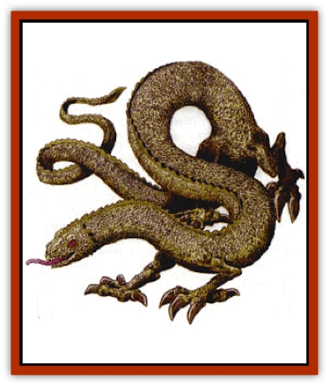

# Dragon - Yellow - Salt

| Statistic | **Dragon, Yellow (Salt)** |
| --- | --- |
| **Activity Cycle:** | Any |
| **Alignment:** | Lawful evil |
| **Armor Class:** | 0 (base) |
| **Climate/Terrain:** | Sea shore, salt marshes or inland salt lakes |
| **Damage/Attack:** | 1-8/1-8/3-18 |
| **Diet:** | Special |
| **Frequency:** | Very rare |
| **Hit Dice:** | 12 (base) |
| **Intelligence:** | Very (11-12) |
| **Magic Resistance:** | Varies |
| **Morale:** | Champion (15) |
| **Movement:** | 12, Fl 30 (C), Br 6, Sw 12 |
| **No. Appearing:** | 1 (2-5) |
| **No. of Attacks:** | 3+ special |
| **Organization:** | Solitary or family |
| **Size:** | G (30' base) |
| **Special Attacks:** | Special |
| **Special Defenses:** | Varies |
| **THAC0:** | 9 |
| **Treasure:** | Special |
| **XP Value:** | Varies |

[[Dragon_Yellow|Yellow Dragons]], or salt <a href="dragon">dragons</a>, delight in the torment of all creatures, particularly those of good alignment. They prepare ambushes where their yellowish-white color helps them blend in with the sand or salt-encrusted rock.

At birth, a salt dragon's tiny scales appear almost crystalline, like lemon-colored bits of glass. As the dragon matures, the scales are bleached by the sun and become progressively lighter. Throughout the dragon's life, its scales continue to harden but remain their original small size, requiring the constant production of additional scales. This process makes the salt dragon supple, more like a [[Snake|snake]] than a [[Lizard|lizard]], allowing it to burrow quickly into beach sand or salt flats, using pass without trace to obscure any disturbance. The claws are proportionately larger than normal for dragons. This helps in burrowing and, incidentally, makes the claw attacks more dangerous.

Salt dragons speak their own tongue and a language common to all evil dragons. Twelve percent of hatchling yellow dragons can communicate with any intelligent creature. The chance to possess this ability increases 5% per age category.

**Combat:** A yellow dragon attacks with its claw /claw/bite routine or with its breath weapon - a cone of white salt crystals. On land, the dragon invariably uses its breath weapon first, usually from ambush. Salt dragons notice which of their opponents has been blinded, concentrating their attacks on still-sighted members of an attacking group, returning afterward to finish off blinded ones before they recover.

Yellow dragons do not pursue a fight they are losing, preferring to escape and return another day to gain revenge. They head to sea to escape land-bound enemies, and they swim to land to escape aquatic enemies.

**Breath Weapon/Special Abilities:** Salt dragons are found by the seashore, in salt marshes and near inland salt flats or seas. They are solitary creatures except when paired for mating and raising hatchlings. As is common in carnivore family units, the female is the hunter, while the male guards the lair and the young.

Yellow dragons along the seacoast often cooperate with [[Sahuagin|sahuagin]]. Sometimes sahuagin serve as guards and servants of a salt dragon in return for its protection. Yellow dragons farther inland cooperate with lawful evil humans or demihumans who can survive in the salt marshes or salt flats, providing protection in exchange for obedience and information.

**Habitat/Society:** Salt dragons spend their early years entirely on land, mastering their breath weapons and the art of moving across (or through) sand, salt marsh or salt flats without leaving sign of their passage. At Young age they gain their *water breathing* ability and are willing to hunt at sea despite the obvious limitations to their breath weapon.

Yellow dragons enjoy meat in all its varieties. Along the seacoast, fish and aquatic mammals are the standard fare, while inland, cattle and herd animals are hunted. The cruel nature of the salt dragon drives it to seek intelligent prey for special occasions, raiding the settlements of good creatures. Captives are tormented until finally devoured.

Yellow dragons "salt" excess meat to preserve it for later meals for themselves and their servitors. Depending on the location of their lair and the nature of their guards and servants, the cooler areas of their cavern lairs might be filled with salted beef, goat, horse, or fish, as well as salted elf, human, triton, or merfolk. Owing to their immunity to poison, salt dragons can consume without ill effects old or spoiled salt meat that would be inedible to their servants, a useful survival trait should its lair be seiged. Yellow dragons prefer to drink salt water but may consume fresh water if necessary.

Yellow dragons who live by the sea have [[Dragon_Metallic_Bronze|bronze dragons]] as natural enemies, competing with them for food and seashore caverns. Knowing that bronze dragons are larger, stronger, and better spellcasters, salt dragons rarely fight a bronze without their [[Sahuagin|sahuagin]] allies alongside. A Venerable or older salt dragon might challenge an Adult or younger bronze dragon alone after first casting *protection from lightning* upon itself.

Yellow dragons who live in salt marshes are aware of [[Dragon_Chromatic_Black|black dragons]] farther upriver where the water is not salty, but the two subspecies generally keep apart. Hatchling or Very Young dragons are sought (carefully) by [[Bullywug|bullywugs</a or <a href="/appendix/yuanti">yuan-ti]] for food. Yellow dragons who lair in salt flats or by salt lakes rarely have neighbors due to the desolation of the land.

A yellow dragon bred with a [[Dragon_Chromatic_Blue|blue dragon]] produces a [[Dragon_Chromatic_Green|green dragon]]. What gives the green dragon crossbreed its distinctive chlorine breath weapon is its yellow parent's sodium chloride (salt) processing ability and its blue parent's electrical ability. The combination allows gaseous chlorine to be separated from the salt.

| Age | Body | Tail | AC | Br. Weapon | Spells W/P | MR | Treas.Type | XP Value |
| --- | --- | --- | --- | --- | --- | --- | --- | --- |
| 1 Hatchling | 3-6 | 2-4 | 3 | 2d4+2 | Nil | Nil | Nil | 1,400 |
| 2 Very young | 6-14 | 4-12 | 2 | 4d4+4 | Nil | Nil | Nil | 2,000 |
| 3 Young | 14-22 | 12-18 | 1 | 6d4+6 | Nil | Nil | Nil | 4,000 |
| 4 Juvenile | 22-31 | 18-24 | 0 | 8d4+8 | 1 | Nil | ½H | 7,000 |
| 5 Young adult | 31-41 | 24-34 | -1 | 10d4+10 | 2 | 20% | H | 9,000 |
| 6 Adult | 41-52 | 34-44 | -2 | 12d4+12 | 3 | 25% | H | 10,000 |
| 7 Mature adult | 52-64 | 44-54 | -3 | 14d4+14 | 3 1 | 30% | H | 11,000 |
| 8 Old | 64-77 | 54-64 | -4 | 16d4+16 | 3 2 | 35% | H,S | 13,000 |
| 9 Very old | 77-91 | 64-74 | -5 | 18d4+18 | 3 3 | 40% | H,S | 14,000 |
| 10 Venerable | 91-105 | 74-84 | -6 | 20d4+20 | 3 3 1/1 | 45% | K,S | 15,000 |
| 11 Wyrm | 105-121 | 84-94 | -7 | 22d4+22 | 3 3 2/2 | 50% | Hx2,S | 16,000 |
| 12 Great Wyrm | 121-138 | 94-104 | -8 | 24d4+24 | 3 3 3/3 | 55% | Hx2,S | 17,000 |

---
## Discovery & Documentation

**Source Publication:** Dragon248 (1998)
**Campaign Setting:** Dragon Magazine
**Author(s):** Gregory W. Detwiler, Terry Dykstra

### Other Creatures Found in This Source Book
   * [[Amphitere|Amphitere]]
   * [[Cetus_Lesser|Cetus, Lesser]]
   * [[Dragonet|Dragonet]]
   * [[Dragon_Orange_Sodium|Dragon, Orange (Sodium)]]
   * [[Dragon_Purple_Energy|Dragon, Purple (Energy)]]
   * [[Gargouille|Gargouille]]
   * [[Hai_Riyo|Hai Riyo]]
   * [[Peluda|Peluda]]
   * [[Sirrush|Sirrush]]
   * [[Vore_Lekiniskiy_Master_Fire_Worm|Vore Lekiniskiy, Master Fire Worm]]
