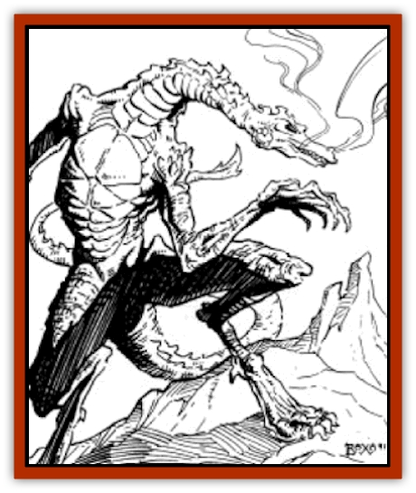

# Dragon of Tyr

| Statistic | **Dragon of Tyr** |
| --- | --- |
| **Activity Cycle:** | Any |
| **Alignment:** | Lawful evil |
| **Armor Class:** | -10 |
| **Climate/Terrain:** | Any |
| **Damage/Attack:** | 2d10+15/2d10+15/4d12/5d10 |
| **Diet:** | Omnivore |
| **Frequency:** | Unique |
| **Hit Dice:** | 32 (250 hit points) |
| **Intelligence:** | Supra-genius (20) |
| **Magic Resistance:** | 80% |
| **Morale:** | Fearless (20) |
| **Movement:** | 15, Fl 45 (A), Jp 5, Br 6 |
| **No. Appearing:** | 1 |
| **No. of Attacks:** | 4 + breath weapon or spell &amp; psionic |
| **Organization:** | Solitary |
| **Size:** | G (40' tall) |
| **Special Attacks:** | Breath weapon (25d12) |
| **Special Defenses:** | See below |
| **THAC0:** | -3 |
| **Treasure:** | (H) |
| **XP Value:** | 42,000 |

**Psionics Summary**

| Level | Dis/Sci/Dev | Attack/Defense | Score | PSPs |
| --- | --- | --- | --- | --- |
| 25 | 6/12/28 | EW,II,MT,PB,PsC/IF,MB,M-,TS,TW | 19 | Varies (usually 200+) |

**Clairsentience -** *Sciences:* clairvoyance, precognition; *Devotions:* combat mind, danger sense, poison sense.

**Psychokinesis -** *Sciences:* detonate, disintegrate, telekinesis; *Devotions:* animate shadow, ballistic attack, molecular agitation, soften.

**Psychometabolism -** *Sciences:* death field, life draining; *Devotions:* body equilibrium, cause decay, chameleon power, ectoplasmatic form, heightened senses, reduction, suspend animation.

**Psychoportation -** *Science:* teleport; *Devotions:* dimensional door, dimension walk, teleport trigger, time shift.

**Telepathy -** *Sciences:* psionic crush, tower of iron will; *Devotions:* contact, ego whip, id insinuation, intellect fortress, mental barrier, mind blank, mind thrust, mind link, psionic blast, thought shield.

**Metapsionics -** *Science:* ultrablast; *Devotions:* nil.

<b style="color:#4169e1;">Defiler Spells:** 1) *charm person*, *friends*, *hypnotism*, *sleep*, *chill touch*; 2) *bind*, *forget*, *ray of enfeeblement*, *scare*, *spectral hand*; 3) *hold person*, *suggestion*, *feign death*, *hold undead*, *vampiric touch*; 4) *confusion*, *emotion*, *fumble*, *contagion*, *enervation*; 5) *chaos*, *domination*, *feeblemind*, *animate dead*, *magic jar*; 6) *eyebite*, *mass suggestion*, *death spell*, *reincarnation*; 7) *shadow walk*, *control undead*,* finger of death*; 8) *binding*, *mass charm*, *sink*; 9) *Mordenkainen's disjunction*, *energy drain*.

Fortunately, there is only one [[Dragon_General_Information|dragon]] in the Tyr Region, and perhaps in the entire world of Athas (see [[Dragon_Athas|Dragon (Athas)]]). It is tall and thin, with a gnarled bone structure and swollen, bulbous joints. Its appearance is reptilian in many ways: it has a long, snake-like neck, whip-like tail, and scaly hide. Yet it walks on two legs, its hands have long, well-developed fingers and thumbs, its bone structure seems faintly humanoid, and its head is long and narrow, with a distinctly mammalian appearance.

**Combat:** The dragon is a terror in combat. It can attack simultaneously with its massive claws (2d10+15), its fang-filled mouth (4d12), and its whip-like tail (5d10). In addition to its melee attacks, the dragon can use one psionic power and cast one magical spell per round. For purposes of determining psionic power and spell effects, it is treated as 20th level psionicist and a 20th level defiler. The dragon's saving throw numbers are always "2".

Three times a day, the dragon can breath a cone of superheated sand during a round instead of using its psionic powers and casting a spell. This cone is five-feet wide at the base, fifty-feet long, and a hundred feet in diameter at its far end. The cone does 25d12 of damage, which is treated as both heat and abrasive damage.

The dragon can be hit only by +2 or better magical weapons. If these are not made of metal, the dragon suffers only ½ damage from the attack. Each round, the dragon automatically regenerates 10 hp. The dragon has an 80% magic resistance to all spells cast against it.

The dragon usually attacks like a hunter, first stalking and then chasing down its prey. Next, if its opponent consists of a large group of individuals, it attacks with its *death field* psionic power, but if the opponent is only a handful of individuals, it attacks them individually with its *life draining* power.

The dragon uses its breath weapon only as a last resort, for it is so destructive that nothing usually remains of any prey that it hits.

**Habitat/Society:** The dragon wanders over all parts of Athas, usually alone. Occasionally, it visits a sorcerer-king, leaving disaster and chaos in its wake.

---
## Discovery & Documentation

**Source Publication:** Dark Sun Campaign Setting (original) (1991)
**Campaign Setting:** Dark Sun
**Author(s):** Timothy B. Brown, Troy Denning, William W. Connors, J. Robert King, Brom and Tom Baxa,

### Other Creatures Found in This Source Book
   * [[Animal_Domestic_Athas_I|Animal, Domestic (Athas) I]]
   * [[Belgoi|Belgoi]]
   * [[Braxat|Braxat]]
   * [[Dune_Freak|Dune Freak]]
   * [[Gaj|Gaj]]
   * [[Giant_Athach|Giant, Athach]]
   * [[Gith|Gith]]
   * [[Jozhal|Jozhal]]
   * [[Kluzd|Kluzd]]
   * [[Silk_Wyrm|Silk Wyrm]]
   * [[Tembo|Tembo]]
   * [[Wezer|Wezer]]
