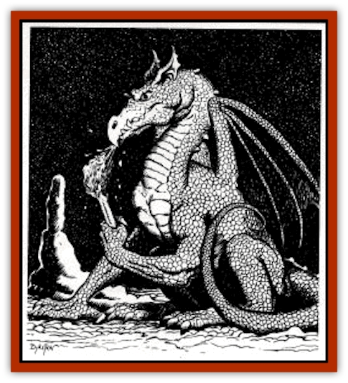

# Dragonet

| Statistic | **Dragonet** |
| --- | --- |
| **Activity Cycle:** | Any |
| **Alignment:** | Neutral |
| **Armor Class:** | 3 |
| **Climate/Terrain:** | Temperate or arctic mountains and hills |
| **Damage/Attack:** | 1-6/1-6/1-4 or 2-8 |
| **Diet:** | Carnivore |
| **Frequency:** | Rare |
| **Hit Dice:** | 5 |
| **Intelligence:** | Average (10) |
| **Magic Resistance:** | Nil |
| **Morale:** | Champion (15) |
| **Movement:** | 12, Fly 20 (B) |
| **No. Appearing:** | 1-2 |
| **No. of Attacks:** | 3 or 1 |
| **Organization:** | solitary |
| **Size:** | L (12' long) |
| **Special Attacks:** | Fiery breath, rake with rear claws for 1-4/1-4 |
| **Special Defenses:** | Poison blood, resistant to fire |
| **THAC0:** | 15 |
| **Treasure:** | E |
| **XP Value:** | 1400 |

The dragonet looks like a small dragon built for agility rather than power. It appears in varying shades of blue.

**Combat:** The dragonet attacks with a bite/claw/claw routine causing 1-6/1-4/1-4 hp damage. Alternatively, it can attack with its tail to cause 2-8 hp constriction damage. If it climbs on top of a fallen foe (on an attack roll of 12+), it can also inflict 1-4 hp clawing damage with each of its hind feet. Finally, it has a cone-shaped breath weapon of fire, one foot wide at the base, extending to a maximum width of 10 feet at a range of 20 feet. This tongue of flame inflicts 1-12 hp damage, or half if a saving throw vs. breath weapon is made. In return, the dragonet suffers only half damage from all fire-based attacks, or none at all if it makes its own saving throw.

The dragonet's bite is not venomous, but it has poison in its blood. Each time a PC actually inflicts damage on the dragonet in melee combat, the PC must save vs poison (Class N). The PCs saves at +2 if wearing full armor, including gauntlets and a great helm, the latter counting only if the visor is down.

**Habitat/Society:** Dragonets are solitary most of the time, but a mated pair live together in the same den during the breeding season to defend the young during the 4 months (late spring and summer) it takes them to reach maturity, Dragonets have 14 young at a time, and these are driven out as soon as they reach full maturity Dragonets are born with 1 HD and gain an additional HD each month until they mature at 5 HD.

**Ecology:** When their larger brethren are absent, dragonets are often top predators in the ecology of hilly or mountainous regions in the arctic and temperate regions of the world.

Dragonet blood is often used as an ingredient for the ink used in writing a scroll with the priest spell *poison* (the reverse of *neutralize poison*), while a leg bone might fashion the handle of a *dagger of venom*. More conventional alchemists use the blood in various cures for poison; the idea is to give the victim a tiny taste of the venom, one which he can resist, and then enhance this resistance with the other ingredients. (A healing or herbalism proficiency is required to work this feat.) Dragonet eggs and young are worth 1,000 gp each, as these creatures make excellent guard beasts if trained while still young.

---
## Discovery & Documentation

**Source Publication:** Dragon248 (1998)
**Campaign Setting:** Dragon Magazine
**Author(s):** Gregory W. Detwiler, Terry Dykstra

### Other Creatures Found in This Source Book
   * [[Amphitere|Amphitere]]
   * [[Cetus_Lesser|Cetus, Lesser]]
   * [[Dragon_Orange_Sodium|Dragon, Orange (Sodium)]]
   * [[Dragon_Purple_Energy|Dragon, Purple (Energy)]]
   * [[Dragon_Yellow_Salt|Dragon, Yellow (Salt)]]
   * [[Gargouille|Gargouille]]
   * [[Hai_Riyo|Hai Riyo]]
   * [[Peluda|Peluda]]
   * [[Sirrush|Sirrush]]
   * [[Vore_Lekiniskiy_Master_Fire_Worm|Vore Lekiniskiy, Master Fire Worm]]
