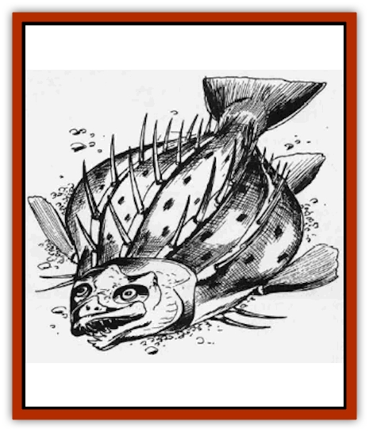

# Dragonfish

| Statistic | **Dragonfish** |
| --- | --- |
| **Activity Cycle:** | Dusk and night |
| **Alignment:** | Nil |
| **Armor Class:** | 5 |
| **Climate/Terrain:** | Subtropical to temperate, shallow fresh water pools, slow streams and rivers |
| **Damage/Attack:** | 1-6 |
| **Diet:** | Scavenger |
| **Frequency:** | Rare |
| **Hit Dice:** | 2 |
| **Intelligence:** | Non- (0) |
| **Magic Resistance:** | Nil |
| **Morale:** | Irregular (5) |
| **Movement:** | Sw 6 |
| **No. Appearing:** | 1 |
| **No. of Attacks:** | 1 |
| **Organization:** | Solitary |
| **Size:** | T (2' long) |
| **Special Attacks:** | Spines and poison |
| **Special Defenses:** | Natural camouflage |
| **THAC0:** | 19 |
| **Treasure:** | Nil |
| **XP Value:** | 270 |

These shy, solitary scavengers are only interested in staying alive and eating. Nevertheless, the two excellent self-defense methods evolved in these creatures make them a potentially deadly enemy for clumsy, inattentive adventurers.

Prefering to dwell in shallow freshwater pools or slow-moving streams and rivers, dragonfish are flat and covered with thick, hard scales of a mottled brown that give it a low Armor Class. The fishes' backs are lined with three to five rows of sharp, two-inch-long spines. Together, the scales and spines make the fishes' hides look much like that of a [[Dragon_General_Information|dragon]]. However, the dragonfish shares little else with its terrifying namesake.

**Combat:** Dragonfish are extremely difficult to spot in their natural habitat. Their mottled brown coloration allows them to blend in with the rocks and mud found at the bottom of the waters they inhabit. Because their natural camouflage is so successful, dragonfish can be spotted only 15% of the time, and only if the searchers know what they are looking for. Also, as dragonfish tend to be active at night, finding one is always extremely difficult.

Most adventurers meet dragonfish inadvertently as they cross the pools and streams where the fish reside. Dragonfish have sharp teeth and will bite for 1-6 points of damage if they are provoked. However, most adventurers literally stumble across the creatures in the water. These encounters are always painful for the unlucky wayfarer as the spines that line the fish's back are sharp enough to penetrate leather boots and will snap off, remaining in the wound as the fish and its attacker separate. A person stepping on or attempting to grab a dragonfish will be struck by 1-6 spines, each doing one point of damage.

The pain caused by the spines to anyone unlucky enough to step on a dragonfish (or foolish enough to try to grab one) is certainly minor when compared to the deadly poison the spines inject when they do any damage. This special poison is slow-acting, and creatures injected with the toxin suffer increasingly violent nausea and a high fever for four hours, and have a penalty of -1 on all attack rolls and saving throws for each hour of illness. (The penalty is cumulative, so, for example, after four hours, a victim of dragonfish poison will have a -4 penalty on all attack and saving throws.)

As these are the same symptoms that precede a death caused by dragonfish poison, it will be unclear if a character will survive the poisoning until the four hours of illness are over. Only after this time has elapsed can a saving throw versus poison be made by the victim (at a -4, like all saving throws alter four hours). Those failing the saving throw die with 1-4 turns. But even for those who save, the effects of the poison are long-lasting, and for the next 1d12 hours, a character surviving the poison will suffer a -2 penalty on all attack rolls.

During the four hour onset time, a *slow poison* spell will stop the penalties from adding up temporarily and, of course, a *neutralize poison* will negate all effects of the toxin. Only one saving throw against the poison is required, regardless of the number of spines that strike the character at once.

**Habitat/Society:** Dragonfish tend to dwell near the bottom of shallow bodies of water. Their diet consists largely of slow-moving snails, small fish, and the remains of other creatures that have recently died in the water. However, the dragonfish has been known to eat almost anything it can swallow, including small bits of metal such as coins or rings. The strong digestive acids in the fish's stomach break down anything it swallows very quickly, making it almost impossible to recover any undamaged treasure from a dragonfish's stomach.

The dragonfish is not territorial, but will protect a food source it discovers. Dragonfish abandon their young at birth, and both the male and female will prey upon any small dragonfish that cross their path. This is one of the primary population controls on the species.

**Ecology:** Intelligent races have discovered a large number of uses for the dragonfish. Dragonfish poison is highly toxic and a full-grown dragonfish can yield enough to kill a large number of creatures. It is natural that creatures who frequently use poison will have a standard method for capturing dragonfish. Also, dragonfish spines make excellent darts, as they are extremely strong and very sharp. (The spines also grow back on the fish. so harvesting them is possible.) The dragonfish skin is not wasted either, as it makes excellent material for scale armor. Using any part of the dragonfish is potentially deadly unless the poison sacks and spines are carefully removed first.

---
## Discovery & Documentation

**Source Publication:** MC1 Volume I (w/binder #1) (1991)
**Campaign Setting:** Advanced Dungeons & Dragons 2nd Edition
**Author(s):** Jay Batista, Scott Bennie, Grant Boucher, William W. Connors, Steve Gilbert, Heike Kubasch, James Lowder, David Edward Martin, Bruce Nesmith, Jean Rabe, Rick Swan, John J. Terra, Gary L. Thomas

### Other Creatures Found in This Source Book
   * [[Bat|Bat]]
   * [[Bear|Bear]]
   * [[Behir|Behir]]
   * [[Boar|Boar]]
   * [[Bookworm|Bookworm]]
   * [[Brownie|Brownie]]
   * [[Bugbear|Bugbear]]
   * [[Carrion_Crawler|Carrion Crawler]]
   * [[Cat_Great|Cat, Great]]
   * [[Catoblepas|Catoblepas]]
   * [[Dragon_General_Information|Dragon, General Information]]
   * [[Elemental_Air_Kin_Aerial_Servant|Elemental, Air Kin, Aerial Servant]]
   * [[Elemental_Earth_Kin_Sandling|Elemental, Earth Kin, Sandling]]
   * [[Elephant|Elephant]]
   * [[Gnoll|Gnoll]]
   * [[Hobgoblin|Hobgoblin]]
   * [[Homunculus|Homunculus]]
   * [[Hornet_Giant|Hornet, Giant]]
   * [[Horse|Horse]]
   * [[Hyena|Hyena]]
   * [[Jackal|Jackal]]
   * [[Jackalwere|Jackalwere]]
   * [[Korred|Korred]]
   * [[Lich|Lich]]
   * [[Lizard|Lizard]]
   * [[Lizard_Man|Lizard Man]]
   * [[Lycanthrope_General_Information|Lycanthrope, General Information]]
   * [[Lycanthrope_Seawolf|Lycanthrope, Seawolf]]
   * [[Lycanthrope_Werebear|Lycanthrope, Werebear]]
   * [[Lycanthrope_Weretiger|Lycanthrope, Weretiger]]
   * [[Lycanthrope_Werewolf|Lycanthrope, Werewolf]]
   * [[Manticore|Manticore]]
   * [[Medusa|Medusa]]
   * [[Mind_Flayer|Mind Flayer]]
   * [[Minotaur|Minotaur]]
   * [[Mudman|Mudman]]
   * [[Mummy|Mummy]]
   * [[Nixie|Nixie]]
   * [[Nymph|Nymph]]
   * [[Ogre|Ogre]]
   * [[Ooze_Slime_Jelly_I|Ooze/Slime/Jelly I]]
   * [[Ooze_Slime_Jelly_II|Ooze/Slime/Jelly II]]
   * [[Orc|Orc]]
   * [[Owl|Owl]]
   * [[Owlbear_I|Owlbear I]]
   * [[Pegasus|Pegasus]]
   * [[Piercer|Piercer]]
   * [[Pudding_Deadly|Pudding, Deadly]]
   * [[Rakshasa|Rakshasa]]
   * [[Rat|Rat]]
   * [[Ray|Ray]]
   * [[Remorhaz|Remorhaz]]
   * [[Satyr|Satyr]]
   * [[Scorpion|Scorpion]]
   * [[Selkie|Selkie]]
   * [[Shadow|Shadow]]
   * [[Skeleton|Skeleton]]
   * [[Skunk|Skunk]]
   * [[Snake|Snake]]
   * [[Spectre|Spectre]]
   * [[Spider|Spider]]
   * [[Sprite|Sprite]]
   * [[Toad_Giant|Toad, Giant]]
   * [[Treant|Treant]]
   * [[Troll|Troll]]
   * [[Umber_Hulk|Umber Hulk]]
   * [[Unicorn|Unicorn]]
   * [[Vampire|Vampire]]
   * [[Wight|Wight]]
   * [[Will_O'Wisp|Will O'Wisp]]
   * [[Wolf|Wolf]]
   * [[Wolfwere|Wolfwere]]
   * [[Wraith|Wraith]]
   * [[Wyvern|Wyvern]]
   * [[Yeti|Yeti]]
   * [[Yuan-ti|Yuan-ti]]
   * [[Zombie|Zombie]]
