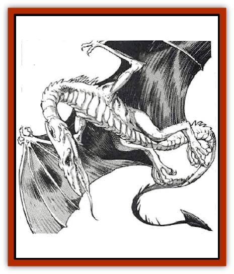

# Dragonnel

| Statistic | **Dragonnel** |
| --- | --- |
| **Activity Cycle:** | Night |
| **Alignment:** | Neutral (evil) |
| **Armor Class:** | Variable (typically 3) |
| **Climate/Terrain:** | Any/Non-artic (mostly the Pomarj) |
| **Damage/Attack:** | 1-6/1-6/4-16 |
| **Diet:** | Carnivore |
| **Frequency:** | Very rare |
| **Hit Dice:** | 8+4 |
| **Intelligence:** | Semi- (2.4) |
| **Magic Resistance:** | Nil |
| **Morale:** | Elite (13) |
| **Movement:** | 12, Fl 18 (C; D if mounted) |
| **No. Appearing:** | 1-4 |
| **No. of Attacks:** | 3 |
| **Organization:** | Solitary or band |
| **Size:** | H (24') |
| **Special Attacks:** | Tail slap (2-12) |
| **Special Defenses:** | Nil |
| **THAC0:** | 11 |
| **Treasure:** | Nil |
| **XP Value:** | 2,000 |

Dragonnels are distantly related to both [[Dragon_General_Information|dragons]] and [[Dinosaur_I|pteranodons]]. Their four legs, huge wings, and long tails give them a dragon-like appearance, and from a distance it is easy to mistake a dragonnel for one of its more fearsome cousins. Nevertheless, dragonnels are a distinct species, not a dragon subspecies. Closer inspection reveals a dragonel's toothy beak and warty, dinosaurlike hide.

At hatching, a dragonnel is glossy black with a red underbelly. As the creature ages, its underbelly fades to gray and its sides become dark red-violet. An adult dragonnel has long, maroon-colored spines on its back and white frills on its head.

Most dragonnels cannot speak, but 4% of wild adults can speak the tongue common to all evil dragons. Though not very bright, they tend to be evil, cunning, and malicious.

**Combat:** Dragonnels have no breath weapons; in battle, they strike with their clawed forefeet and bite with their beaks. If they do not attack with their claws, they can lash opponents behind with their tails.

**Habitat/Society:** Unlike their cousins, the dragons, wild dragonnels are mildly social, gathering for mutual defense, cooperative hunting, and to mate. Males in their prime stay away from other males, collecting small, semi-permanent harems of females. Females leave the band to lay eggs secretly, burying them in warm, moist earth. Once the eggs are laid, the females abandons them, often rejoining their old band, but sometimes remaining solitary until they find a new one.

Dragonnels are sometimes used as mounts for war and raiding; evil humans living among the humanoids of the Pomarj are the best-known dragonnel riders. Dragonnels carrying riders can fly at full speed if the total load does not exceed 360 pounds. However, if the load exceeds 100 pounds they lose maneuverability, which falls to the rating shown in parentheses. Dragonnels cannot (or will not) fly when carrying loads exceeding 360 pounds. Dragonnels can run at full speed carrying loads of up to 540 pounds, but if forced cany greater loads, they simply sit down and refuse to move. When serving as mounts they sometimes are equipped with leather barding, which lowers their AC to 2. Leather dragonnel barding weighs 180 pounds and costs 600 gp.

Needless to say, dragonnels are difficult to train, and they serve as mounts only grudgingly. Wild, adult dragonnels cannot be , trained, although evil beiis might be able to entice talking dragonnels into cooperating. During such negotiations, dragonnels are as vain and greedy as their cousins, the dragons. Normally a prospective dragonnel trainer must find a clutch of eggs, hatch them, and train them for about five years.

A trained dragonnel is controlled with a short goad with a metal tip and a weighted butt, and with four reins, one pair attached to each of the creature's jaws. Even trained dragonnels are untrustworthy mounts; more than one careless rider has received a painful, if not fatal, bite when approaching his steed unwarily and without a sharp goad in hand.

**Ecology:** Dragonnels are at home in almost any climate except the coldest and driest. At one time, they ranged the Flanaess from the Kron Hills and the Glorioles to the Drachensgrab Mountains, but they are now virtually extinct everywhere except the Pomarj, where they are used as steeds.

Dragonnel eggs are laid in clutches of 1d6+2. If incubated under warm, moist conditions, they hatch in 12 weeks. Hatchling dragonnels can fly almost immediately and mature in about three years.

Wild dragonnels prefer to hunt and kill large animals, such as cattle, elk, horses, or even an occasional human or demihuman. However, when necessary they scavenge or hunt nearly anything living - rodents, fish, humanoids, or anything else they can catch. Unlike dragons, they are true carnivores and cannot eat plants or exotic foods like gems or minerals. Domestic dragonnels thrive only on red meat, usually the equivalent of two horses or cows every month.

Although they have no natural enemies, wild dragonnels are hunted by humans, whose herds and flocks they raid, and by all species of dragons. Good dragons abhorr their stupidity and evil tendencies. Evil dragons simply resent the competition.

---
## Discovery & Documentation

**Source Publication:** MC5 Greyhawk Appendix (1989)
**Campaign Setting:** Advanced Dungeons & Dragons 2nd Edition
**Author(s):** Grant Boucher, William W. Connors, Steve Gilbert, Bruce Nesmith, Chris Mortika, Skip Williams

### Other Creatures Found in This Source Book
   * [[Aspis|Aspis]]
   * [[Beastman|Beastman]]
   * [[Bonesnapper|Bonesnapper]]
   * [[Booka|Booka]]
   * [[Brownie_Buckawn|Brownie, Buckawn]]
   * [[Brownie_Quickling|Brownie, Quickling]]
   * [[Crystalmist|Crystalmist]]
   * [[Dragon_Cloud|Dragon, Cloud]]
   * [[Dragon_Oerth_Greyhawk|Dragon (Oerth), Greyhawk]]
   * [[Dragonfly_Giant|Dragonfly, Giant]]
   * [[Elf_Grugach|Elf, Grugach]]
   * [[Elf_Valley|Elf, Valley]]
   * [[Golem_Necrophidius|Golem, Necrophidius]]
   * [[Grell_Wild|Grell, Wild]]
   * [[Grung|Grung]]
   * [[Hobgoblin_Norker|Hobgoblin, Norker]]
   * [[Hook_Horror|Hook Horror]]
   * [[Horgar|Horgar]]
   * [[Hound_Yeth|Hound, Yeth]]
   * [[Iguana_Giant|Iguana, Giant]]
   * [[Ingundi|Ingundi]]
   * [[Kech|Kech]]
   * [[Kyuss_Son_of|Kyuss, Son of]]
   * [[Mite|Mite]]
   * [[Needleman|Needleman]]
   * [[Plant_Carnivorous_Oerth|Plant, Carnivorous (Oerth)]]
   * [[Plant_Carnivorous_Vampire_Cactus|Plant, Carnivorous, Vampire Cactus]]
   * [[Plasmoid_General_Information|Plasmoid, General Information]]
   * [[Rat_Oerth|Rat (Oerth)]]
   * [[Raven_Crow|Raven/Crow]]
   * [[Scarecrow|Scarecrow]]
   * [[Shadow_Slow|Shadow, Slow]]
   * [[Skulk|Skulk]]
   * [[Snail|Snail]]
   * [[Sprite|Sprite]]
   * [[Taer|Taer]]
   * [[Tentamort|Tentamort]]
   * [[Turtle_Giant|Turtle, Giant]]
   * [[Tyrg|Tyrg]]
   * [[Wolf_Mist|Wolf, Mist]]
   * [[Wraith_Oerth|Wraith (Oerth)]]
   * [[Zygom|Zygom]]
