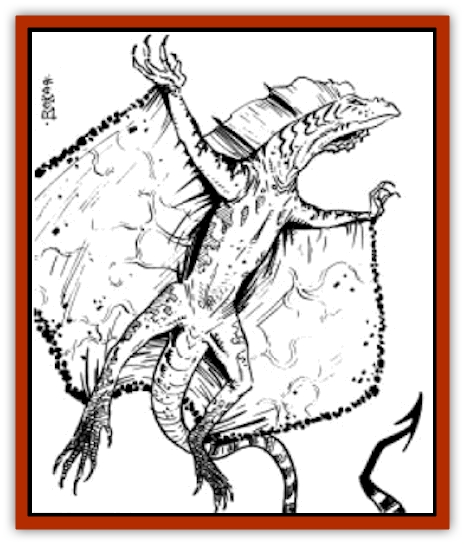

# Drake - Athas - Air

| Statistic | **Drake (Athas), Air** |
| --- | --- |
| **Activity Cycle:** | Any |
| **Alignment:** | Neutral |
| **Armor Class:** | -2 |
| **Climate/Terrain:** | Mountains |
| **Damage/Attack:** | 1-8+10/1-8+10/3-24/3-30 |
| **Diet:** | Carnivore |
| **Frequency:** | Very rare |
| **Hit Dice:** | 25+9 (170 hit points) |
| **Intelligence:** | Semi- (2-4) |
| **Magic Resistance:** | Nil |
| **Morale:** | Fearless (19) |
| **Movement:** | 9, Fl 30 (B), Jp 6 |
| **No. Appearing:** | 1 |
| **No. of Attacks:** | 4 |
| **Organization:** | Solitary |
| **Size:** | G (25'+ in length) |
| **Special Attacks:** | Bite/Swallow, Elemental, Psionic, Tail Lash |
| **Special Defenses:** | Psionic |
| **THAC0:** | 5 |
| **Treasure:** | Special |
| **XP Value:** | 34,000 |

**Psionics Summary**

| Level | Dis/Sci/Dev | Attack/Defense | Score | PSPs |
| --- | --- | --- | --- | --- |
| 15 | 4/3/14 | PsC,MT/M-,MB,TW | 17 | 150 |

**Clairsentience -** *Sciences:* nil; *Devotion:* all-round vision.

**Psychokinesis -** *Science:* telekinesis; *Devotions:* control winds, levitation.

**Psychometabolism -** *Sciences:* nil; *Devotion:* body equilibrium.

**Telepathy -** *Sciences:* ejection, tower of iron will; *Devotions:* awe, contact, ESP, false sensory input, invisibility, mental barrier, mind blank, mind thrust, psionic crush, synaptic static.

See also: [[Drake_Athas_General_Information|Drake (Athas), General Information]]

Air drakes are the longest and leanest of the four drake types. They have folds of loose skin that stretch between their front and back legs. This skin unfolds when they extend their legs creating a wing membrane. They have a long, lean frame and are light of bone, contributing to their speed and agility.

Air drakes are the most flighty and unpredictable of the species, making them dangerous adversaries. They spend most of their time soaring the Athasian skies.

**Combat:** Air drakes prefer to attack silently from the air and blind side their targets. They will use their psionic *invisibility* in order to get close enough to their prey to snare it. Failing that strategy, air drakes will use their psionic *awe* ability to gain initiative on their victim. From the air, the drake will attack with its two front claws (1d8 + 10) and attempt to lift its opponent high into the air. If the victim struggles, the air drake will also use its bite attack (3d8), biting the victim and shaking its head from side-to-side with all of its might. This doubles the damage caused by the first bite attack. Once airborne, the air drake will soar quite high and then drop its prey. If the victim is huge or gargantuan, the drake will do a fly-by maneuver and attempt to strike with both front claws and tail (3d10). Air drakes especially hate psionic attacks. They will use *synaptic static* or *ejection* if a psionicist gets through its defenses.

Air drakes have a special elemental attack. They are able to *gate* a 100-yard diameter, circular bubble of tornado-like winds from the elemental plane of air. Anyone caught inside the area will be buffeted for 2d6 points of damage (save versus breath weapon for half damage). The winds will prevent flying creatures from passing through the area and, depending on the terrain, may create a minor sandstorm if in contact with the ground. A victim inside the area of effect will take 3d6 worth of damage instead of buffeting damage (save versus breath for half damage). The effect only lasts one turn. The drake can do this once every 15 days.

**Habitat/Society:** Air drakes do not keep a single residence. They prefer a dozen or so "safe" areas. Because they move around so much, air drakes gather and horde few possessions and treasure. Often if they find an object which pleases them, they will store it at a lofty, inaccessible location. They will leave it and return to visit only when the mood strikes them. Little infuriates an air drake more than having one of these precious items stolen.

**Ecology:** Air drakes prefer their food thoroughly softened before eating it. To accomplish this, a drake will swoop, grab its prey, soar into the sky, and then drop it. Air drakes often choose crags or rocky outcroppings for "tenderizing their meat". If the prey can fly, it will take the victim aloft and dive straight for the ground, releasing its prey and pulling up at the last minute. Most creatures are incapable of recovering quickly enough to save themselves from this fatal flight. Spellcasters, certain psionicists, and creatures who possess magical abilities of flight get one round of action before impact. Creatures with maneuverability Class A or B have the control to avoid impact. Class C flyers may try and slow their air speed; if successful they take half damage. Lower classes of maneuverability do not have the ability to gain control quickly enough to save themselves.

An average adult air drake can lift 1,000 pounds without difficulty. Heavier objects lower the drakes maneuverability one class per additional 200 pounds.

---
## Discovery & Documentation

**Source Publication:** MC12 Dark Sun Appendix I - Terrors of the Desert (1991)
**Campaign Setting:** Dark Sun
**Author(s):** Tom Prusa, Louis J. Prosperi, Walter M. Baas

### Other Creatures Found in This Source Book
   * [[Animal_Herd_Athas|Animal, Herd (Athas)]]
   * [[Animal_Household_Athas|Animal, Household (Athas)]]
   * [[Antloid_Desert|Antloid, Desert]]
   * [[Banshee_Dwarf|Banshee, Dwarf]]
   * [[Beetle_Agony|Beetle, Agony]]
   * [[Bog_Wader|Bog Wader]]
   * [[Brambleweed|Brambleweed]]
   * [[B'rohg|B'rohg]]
   * [[Burnflower|Burnflower]]
   * [[Cat_Psionic|Cat, Psionic]]
   * [[Cha'thrang|Cha'thrang]]
   * [[Cistern_Fiend|Cistern Fiend]]
   * [[Clam_Giant|Clam, Giant]]
   * [[Cloud_Ray|Cloud Ray]]
   * [[Drake_Athas_Earth|Drake (Athas), Earth]]
   * [[Drake_Athas_Fire|Drake (Athas), Fire]]
   * [[Drake_Athas_Water|Drake (Athas), Water]]
   * [[Dune_Runner|Dune Runner]]
   * [[Dune_Trapper|Dune Trapper]]
   * [[Elemental_Athas_Greater_Air|Elemental (Athas), Greater, Air]]
   * [[Elemental_Athas_Greater_Earth|Elemental (Athas), Greater, Earth]]
   * [[Elemental_Athas_Greater_Fire|Elemental (Athas), Greater, Fire]]
   * [[Elemental_Athas_Greater_Water|Elemental (Athas), Greater, Water]]
   * [[Elemental_Athas_Lesser_Air_Earth|Elemental (Athas), Lesser, Air/Earth]]
   * [[Elemental_Athas_Lesser_Fire_Water|Elemental (Athas), Lesser, Fire/Water]]
   * [[Elemental_Athas_General_Information|Elemental (Athas), General Information]]
   * [[Erdland|Erdland]]
   * [[Esperweed|Esperweed]]
   * [[Flailer|Flailer]]
   * [[Floater|Floater]]
   * [[Giant_Athas|Giant (Athas)]]
   * [[Golem_Athas_I|Golem (Athas) I]]
   * [[Golem_Athas_II|Golem (Athas) II]]
   * [[Golem_Athas_III|Golem (Athas) III]]
   * [[Golem_Athas_General_Information|Golem (Athas), General Information]]
   * [[Halfling_Renegade|Halfling, Renegade]]
   * [[Hej-kin|Hej-kin]]
   * [[Id_Fiend|Id Fiend]]
   * [[Insect_Swarm_Athas|Insect Swarm (Athas)]]
   * [[Kank_Wild|Kank, Wild]]
   * [[Kirre|Kirre]]
   * [[Megapede|Megapede]]
   * [[Mul_Wild|Mul, Wild]]
   * [[Nightmare_Beast|Nightmare Beast]]
   * [[Plant_Carnivorous_Athas|Plant, Carnivorous (Athas)]]
   * [[Pterran|Pterran]]
   * [[Pterrax|Pterrax]]
   * [[Pulp_Bee|Pulp Bee]]
   * [[Pyreen|Pyreen]]
   * [[Rasclinn|Rasclinn]]
   * [[Razorwing|Razorwing]]
   * [[Roc_Athas|Roc (Athas)]]
   * [[Sand_Bride|Sand Bride]]
   * [[Sand_Cactus|Sand Cactus]]
   * [[Sand_Vortex|Sand Vortex]]
   * [[Scrab|Scrab]]
   * [[Silt_Horror|Silt Horror]]
   * [[Silt_Runner|Silt Runner]]
   * [[Sink_Worm|Sink Worm]]
   * [[Sloth_Athas|Sloth (Athas)]]
   * [[So-ut|So-ut]]
   * [[Spider_Cactus|Spider Cactus]]
   * [[Spider_Crystal|Spider, Crystal]]
   * [[Spirit_of_the_Land|Spirit of the Land]]
   * [[T'Chowb|T'Chowb]]
   * [[Thrax|Thrax]]
   * [[Tohr-kreen_I|Tohr-kreen I]]
   * [[Villichi|Villichi]]
   * [[Zhackal|Zhackal]]
   * [[Zombie_Plant|Zombie Plant]]
