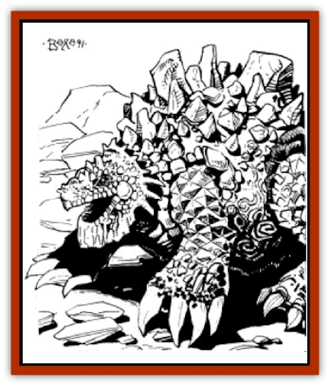

# Drake - Athas - Earth

| Statistic | **Drake (Athas), Earth** |
| --- | --- |
| **Activity Cycle:** | Any |
| **Alignment:** | Neutral |
| **Armor Class:** | -4 |
| **Climate/Terrain:** | Any |
| **Damage/Attack:** | 1-12+12/1-12+12/3-36/4-48 |
| **Diet:** | Carnivore |
| **Frequency:** | Very Rare |
| **Hit Dice:** | 25 +8 (175 hit points) |
| **Intelligence:** | Semi-(2-4) |
| **Magic Resistance:** | Nil |
| **Morale:** | Fearless(19) |
| **Movement:** | 12 |
| **No. Appearing:** | 1 |
| **No. of Attacks:** | 4 |
| **Organization:** | Solitary |
| **Size:** | G (30'+ long) |
| **Special Attacks:** | Bite/Swallow, Elemental, Psionic, Tail Lash |
| **Special Defenses:** | Psionic |
| **THAC0:** | 5 |
| **Treasure:** | Special |
| **XP Value:** | 33,000 |

**Psionics Summary**

| Level | Dis/Sci/Dev | Attack/Defense | Score | PSPs |
| --- | --- | --- | --- | --- |
| 15 | 4/5/16 (23) | PsC,II/M-,IF,TW | 17 | 150 |

**Clairsentience -** *Science:* sensitivity to psychic impressions; *Devotion:* combat mind.

**Psychokinesis -** *Sciences:* detonate, telekinesis; *Devotions:* animate object, molecular agitation, molecular manipulation, soften.

**Psychometabolism -** *Science:* shadow form; *Devotions:* cause decay, expansion, immovability, reduction.

**Telepathy -** *Science:* tower of iron will; *Devotions:* awe, contact, false sensory input, id insinuation, intellect fortress, mind blank, psionic crush.

See also: [[Drake_Athas_General_Information|Drake (Athas), General Information]]

Often mistaken for an outcropping of rock, earth drakes are by far the physically strongest of the species.

The gray, black, and brown reptilian creature is covered with thousands of small, spiny scales. The massive forelegs are designed for digging through solid stone. The hindlegs are equally as powerful and may also be used for digging, but most often serve as anchors. Earth drakes' tails are short but incredibly thick, which forces the monsters to swagger when they walk. Earth drakes' heads are wedge-shaped. The scales on the top of the head overlap to protect the earholes. The creature's eyes are inset and covered by two eyelids - a soft, inner eyelid which is airtight, and an outer, protective, scaly eyelid which is highly puncture-resistant.

**Combat:** They prefer to trap creatures in their lair and eat the victim(s) at their leisure. A drake will use its psionic *detonate* and *animate object* abilities to trap intruders before beginning its physical attacks. Earth drakes charge their target and attack with their powerful front claws first (1d12+12), then rend the target with their gaping maw (3d12). After the first bite, it will shake its head from side-to-side with all of its might, thus doubling the damage caused by the first attack.

Earth drakes are the only drakes that will fight to the death, convinced that they are stronger than any opponent (except the [[Dragon_of_Tyr|Dragon]]). They can use their physical attacks and one psionic attack simultaneously.

Earth drakes have a special elemental attack. They are able to gate 50-cubic-feet of solid matter in the form of dirt, stones, and boulders from the elemental plane of earth. It is possible to move through this material from the elemental plane by either mining or brute force (using bare hands to dig free).

The material must be gated onto a solid surface (i.e., the material cannot be gated to an area above the desired location and then dropped). Anyone caught inside the area must make a successful saving throw versus petrification to be thrown clear of the material. A failed save means the victim is trapped under the matter. He will suffer 1d2 points of damage per turn and may eventually suffocate if unable to get free of the area (see "Holding Breath", p 122 of the *Player's Handbook*). The material produced by this effect becomes a permanent fixture in its new location. The drake is only able to produce this effect once every 15 days.

**Habitat/Society:** Whether they dig into the bedrock beneath the sands of the Athasian desert or into a hillside, earth drakes always cover the front of their habitat with loose dirt. This creates a collapsible front entrance which the earth drake uses to defend its lair. Earth drakes resent the encroachments of humanity, and they especially dislike any type of permanent buildings. An earth drake thinks nothing of travelling many miles in order to destroy man-made settlements.

**Ecology:** Earth drakes enjoy a battle before a meal. The more fight a creature puts up, the better the drake will enjoy eating it. Earth drakes are known to dig themselves in along trading routes for opportunities to do battle and dine on [[Animal_Domestic_Athas_I|mekillots]].

---
## Discovery & Documentation

**Source Publication:** MC12 Dark Sun Appendix I - Terrors of the Desert (1991)
**Campaign Setting:** Dark Sun
**Author(s):** Tom Prusa, Louis J. Prosperi, Walter M. Baas

### Other Creatures Found in This Source Book
   * [[Animal_Herd_Athas|Animal, Herd (Athas)]]
   * [[Animal_Household_Athas|Animal, Household (Athas)]]
   * [[Antloid_Desert|Antloid, Desert]]
   * [[Banshee_Dwarf|Banshee, Dwarf]]
   * [[Beetle_Agony|Beetle, Agony]]
   * [[Bog_Wader|Bog Wader]]
   * [[Brambleweed|Brambleweed]]
   * [[B'rohg|B'rohg]]
   * [[Burnflower|Burnflower]]
   * [[Cat_Psionic|Cat, Psionic]]
   * [[Cha'thrang|Cha'thrang]]
   * [[Cistern_Fiend|Cistern Fiend]]
   * [[Clam_Giant|Clam, Giant]]
   * [[Cloud_Ray|Cloud Ray]]
   * [[Drake_Athas_Air|Drake (Athas), Air]]
   * [[Drake_Athas_Fire|Drake (Athas), Fire]]
   * [[Drake_Athas_Water|Drake (Athas), Water]]
   * [[Dune_Runner|Dune Runner]]
   * [[Dune_Trapper|Dune Trapper]]
   * [[Elemental_Athas_Greater_Air|Elemental (Athas), Greater, Air]]
   * [[Elemental_Athas_Greater_Earth|Elemental (Athas), Greater, Earth]]
   * [[Elemental_Athas_Greater_Fire|Elemental (Athas), Greater, Fire]]
   * [[Elemental_Athas_Greater_Water|Elemental (Athas), Greater, Water]]
   * [[Elemental_Athas_Lesser_Air_Earth|Elemental (Athas), Lesser, Air/Earth]]
   * [[Elemental_Athas_Lesser_Fire_Water|Elemental (Athas), Lesser, Fire/Water]]
   * [[Elemental_Athas_General_Information|Elemental (Athas), General Information]]
   * [[Erdland|Erdland]]
   * [[Esperweed|Esperweed]]
   * [[Flailer|Flailer]]
   * [[Floater|Floater]]
   * [[Giant_Athas|Giant (Athas)]]
   * [[Golem_Athas_I|Golem (Athas) I]]
   * [[Golem_Athas_II|Golem (Athas) II]]
   * [[Golem_Athas_III|Golem (Athas) III]]
   * [[Golem_Athas_General_Information|Golem (Athas), General Information]]
   * [[Halfling_Renegade|Halfling, Renegade]]
   * [[Hej-kin|Hej-kin]]
   * [[Id_Fiend|Id Fiend]]
   * [[Insect_Swarm_Athas|Insect Swarm (Athas)]]
   * [[Kank_Wild|Kank, Wild]]
   * [[Kirre|Kirre]]
   * [[Megapede|Megapede]]
   * [[Mul_Wild|Mul, Wild]]
   * [[Nightmare_Beast|Nightmare Beast]]
   * [[Plant_Carnivorous_Athas|Plant, Carnivorous (Athas)]]
   * [[Pterran|Pterran]]
   * [[Pterrax|Pterrax]]
   * [[Pulp_Bee|Pulp Bee]]
   * [[Pyreen|Pyreen]]
   * [[Rasclinn|Rasclinn]]
   * [[Razorwing|Razorwing]]
   * [[Roc_Athas|Roc (Athas)]]
   * [[Sand_Bride|Sand Bride]]
   * [[Sand_Cactus|Sand Cactus]]
   * [[Sand_Vortex|Sand Vortex]]
   * [[Scrab|Scrab]]
   * [[Silt_Horror|Silt Horror]]
   * [[Silt_Runner|Silt Runner]]
   * [[Sink_Worm|Sink Worm]]
   * [[Sloth_Athas|Sloth (Athas)]]
   * [[So-ut|So-ut]]
   * [[Spider_Cactus|Spider Cactus]]
   * [[Spider_Crystal|Spider, Crystal]]
   * [[Spirit_of_the_Land|Spirit of the Land]]
   * [[T'Chowb|T'Chowb]]
   * [[Thrax|Thrax]]
   * [[Tohr-kreen_I|Tohr-kreen I]]
   * [[Villichi|Villichi]]
   * [[Zhackal|Zhackal]]
   * [[Zombie_Plant|Zombie Plant]]
