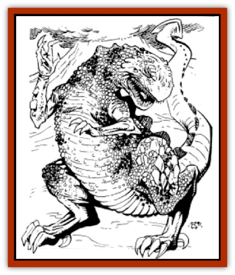

# Drake - Athas - Fire

| Statistic | **Drake (Athas), Fire** |
| --- | --- |
| **Activity Cycle:** | Any |
| **Alignment:** | Neutral evil |
| **Armor Class:** | -3 |
| **Climate/Terrain:** | Any |
| **Damage/Attack:** | 1-10+10/1-10+10/3-24/4-32 |
| **Diet:** | Carnivore |
| **Frequency:** | Very rare |
| **Hit Dice:** | 20 +8 (145 hit points) |
| **Intelligence:** | Semi- (2-4) |
| **Magic Resistance:** | Nil |
| **Morale:** | Fearless (19) |
| **Movement:** | 12, Jp 3 |
| **No. Appearing:** | 1 |
| **No. of Attacks:** | 4 |
| **Organization:** | Solitary |
| **Size:** | G (25'+ long) |
| **Special Attacks:** | Bite/Swallow, Elemental, Psionic, Tail Lash |
| **Special Defenses:** | Psionic |
| **THAC0:** | 5 |
| **Treasure:** | Special |
| **XP Value:** | 28,000 |

**Psionics Summary**

| Level | Dis/Sci/Dev | Attack/Defense | Score | PSPs |
| --- | --- | --- | --- | --- |
| 15 | 4/5/17(24) | EW,PsC/M-,MB,TS | 18 | 150 |

**Clairsentience -** *Sciences:* nil; *Devotions:* feel light, hear light.

**Psychokinesis -** *Science:* telekinesis; *Devotions:* control flames, control lights, molecular agitation.

**Psychometabolism -** *Sciences:* energy containment, shadow form; *Devotions:* displacement, double pain, ectoplasmatic form.

**Telepathy -** *Sciences:* mind link, mass domination; *Devotions:* awe, contact, ego whip, false sensory input, inflict pain, mind bar, mental barrier, mind blank, psionic crush, thought shield.

See also: [[Drake_Athas_General_Information|Drake (Athas), General Information]]

Fire drakes are the most evil and malicious of the drakes. They enjoy inflicting pain for the pleasure of watching their victims writhe in agony. A fire drake's greatest delight comes from torturing a potential "meal".

Fire drakes are large, spiny, reptilian creatures with pebblelike skin. Each "pebble" is actually a scale. They are red-and-black mottled, similar in color to the dying embers of a fire, and their skin is very glossy. Fire drakes have four legs. The front two are smaller with very sharp claws, while the back legs are longer and thicker.

**Combat:** When engaged in combat they make snorting sounds which are often taken for laughter. Fire drakes will not hesitate to use their psionic abilities in order to *inflict pain* or *double pain*. Their ability to psionically *create* and *control fire* makes them dangerous to delvers who enter lairs with fire-based light sources (torches, lanterns, etc.) Their cruel front claws (1d10+10), their wicked teeth (3d8), and their vicious tail (4d8) make fire drakes formidable foes. If possible, the fire drake will use its bite attack on an opponent. The wicked drake may attempt to use the victim as a small shield to deflect incoming blows. This is not so much a standard defense as it is an amusement for the fire drake. If truly threatened, it will use psionic *shadow form* or *ectoplasmic form* to flee.

Fire drakes, like other drakes, have a special elemental attack. They are able to gate a 50' diameter sphere of fire from the elemental plane of fire. The fire will burn for 1d6+4 rounds. An unprotected being must save versus breath weapon or take 4d10 worth of fire damage per round that they remain in the fire (save for half damage). Any combustible material within the sphere will ignite upon contact with the fire. Anyone unfortunate to be holding or wearing such items suffers 3d6 worth of additional burn damage (save versus breath weapon for half damage); any other combustible materials within 10' of the flames must make a saving throw. Unprotected and nonmagical metal within the fire becomes super-heated and melts within 2 rounds. Those carrying or wearing such items suffer 2d4 worth of damage in the first round and 3d10 in following rounds (for the duration of the flames). The drake is only able to produce this effect once per Athasian week.

**Habitat/Society:** Fire drakes prefer to live near natural volcanic action or in areas where they can bask all day in the hot Athasian sun. At night, they retreat to an area of safety or bury themselves under the hot sand. They do this to insulate themselves from the cool evening air. Fire drakes seem equally at home in the moist heat of the Hinterlands and the dry desert wastes.

**Ecology:** The flakes of hide are valuable spell components for fire-based magic. The unusual pebble hide of the fire drake is shed once every three years or after being damaged, and new scales begin to grow underneath.

Fire drakes are carnivores, feeding mostly on humanoids, [[Animal_Domestic_Athas_I|kanks]], and other animals. They will eat [[Animal_Domestic_Athas_I|erdlu]] only after the creature has been burnt. The hide of the fire drake is the most highly prized of all the drakes as it tends to make the wearer immune to some of the sun's devastating effects. Anyone protected by a fire drake hide (either wearing it or riding in a vehicle covered by it) needs only half the amount of water a day, depending on their activity. Although nonmagical, fire drake hide adds +2 to fire-related saving throws for the wearer. Fire drake hide will not burn if exposed to nonmagical flames. The heat ray from [[Burnflower|burnflowers]] can't penetrate the protection of a fire drake hide.

---
## Discovery & Documentation

**Source Publication:** MC12 Dark Sun Appendix I - Terrors of the Desert (1991)
**Campaign Setting:** Dark Sun
**Author(s):** Tom Prusa, Louis J. Prosperi, Walter M. Baas

### Other Creatures Found in This Source Book
   * [[Animal_Herd_Athas|Animal, Herd (Athas)]]
   * [[Animal_Household_Athas|Animal, Household (Athas)]]
   * [[Antloid_Desert|Antloid, Desert]]
   * [[Banshee_Dwarf|Banshee, Dwarf]]
   * [[Beetle_Agony|Beetle, Agony]]
   * [[Bog_Wader|Bog Wader]]
   * [[Brambleweed|Brambleweed]]
   * [[B'rohg|B'rohg]]
   * [[Burnflower|Burnflower]]
   * [[Cat_Psionic|Cat, Psionic]]
   * [[Cha'thrang|Cha'thrang]]
   * [[Cistern_Fiend|Cistern Fiend]]
   * [[Clam_Giant|Clam, Giant]]
   * [[Cloud_Ray|Cloud Ray]]
   * [[Drake_Athas_Air|Drake (Athas), Air]]
   * [[Drake_Athas_Earth|Drake (Athas), Earth]]
   * [[Drake_Athas_Water|Drake (Athas), Water]]
   * [[Dune_Runner|Dune Runner]]
   * [[Dune_Trapper|Dune Trapper]]
   * [[Elemental_Athas_Greater_Air|Elemental (Athas), Greater, Air]]
   * [[Elemental_Athas_Greater_Earth|Elemental (Athas), Greater, Earth]]
   * [[Elemental_Athas_Greater_Fire|Elemental (Athas), Greater, Fire]]
   * [[Elemental_Athas_Greater_Water|Elemental (Athas), Greater, Water]]
   * [[Elemental_Athas_Lesser_Air_Earth|Elemental (Athas), Lesser, Air/Earth]]
   * [[Elemental_Athas_Lesser_Fire_Water|Elemental (Athas), Lesser, Fire/Water]]
   * [[Elemental_Athas_General_Information|Elemental (Athas), General Information]]
   * [[Erdland|Erdland]]
   * [[Esperweed|Esperweed]]
   * [[Flailer|Flailer]]
   * [[Floater|Floater]]
   * [[Giant_Athas|Giant (Athas)]]
   * [[Golem_Athas_I|Golem (Athas) I]]
   * [[Golem_Athas_II|Golem (Athas) II]]
   * [[Golem_Athas_III|Golem (Athas) III]]
   * [[Golem_Athas_General_Information|Golem (Athas), General Information]]
   * [[Halfling_Renegade|Halfling, Renegade]]
   * [[Hej-kin|Hej-kin]]
   * [[Id_Fiend|Id Fiend]]
   * [[Insect_Swarm_Athas|Insect Swarm (Athas)]]
   * [[Kank_Wild|Kank, Wild]]
   * [[Kirre|Kirre]]
   * [[Megapede|Megapede]]
   * [[Mul_Wild|Mul, Wild]]
   * [[Nightmare_Beast|Nightmare Beast]]
   * [[Plant_Carnivorous_Athas|Plant, Carnivorous (Athas)]]
   * [[Pterran|Pterran]]
   * [[Pterrax|Pterrax]]
   * [[Pulp_Bee|Pulp Bee]]
   * [[Pyreen|Pyreen]]
   * [[Rasclinn|Rasclinn]]
   * [[Razorwing|Razorwing]]
   * [[Roc_Athas|Roc (Athas)]]
   * [[Sand_Bride|Sand Bride]]
   * [[Sand_Cactus|Sand Cactus]]
   * [[Sand_Vortex|Sand Vortex]]
   * [[Scrab|Scrab]]
   * [[Silt_Horror|Silt Horror]]
   * [[Silt_Runner|Silt Runner]]
   * [[Sink_Worm|Sink Worm]]
   * [[Sloth_Athas|Sloth (Athas)]]
   * [[So-ut|So-ut]]
   * [[Spider_Cactus|Spider Cactus]]
   * [[Spider_Crystal|Spider, Crystal]]
   * [[Spirit_of_the_Land|Spirit of the Land]]
   * [[T'Chowb|T'Chowb]]
   * [[Thrax|Thrax]]
   * [[Tohr-kreen_I|Tohr-kreen I]]
   * [[Villichi|Villichi]]
   * [[Zhackal|Zhackal]]
   * [[Zombie_Plant|Zombie Plant]]
