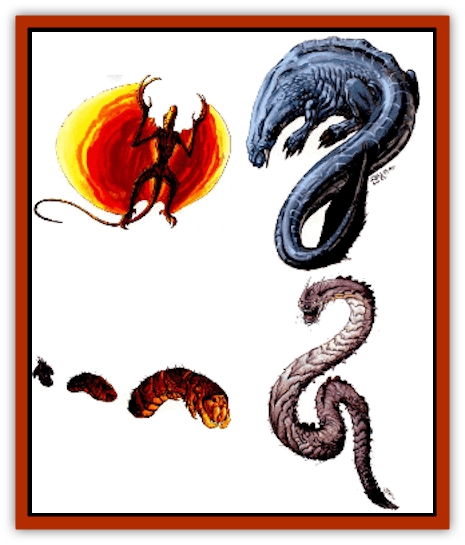

# Drake - Lesser - Athas - General Information

Lesser drakes are so named because of their psionic power compared to elemental [[Drake_Athas_General_Information|drakes]], rather than their size. Although they come from the paraelemental planes, they have lost all memories of their origins and are unable to return there. Their psionic powers are less developed than those of the elemental drakes, but they are formidable foes in physical combat and have sufficient power to survive on Athas.

Lesser drakes are carnivorous and prefer to eat [[Animal_Domestic_Athas_I|erdlu]] or [[Halfling_Athas|halfling]] over any other meat. The [[Drake_Lesser_Athas_Magma|magma drake]] is fond of [[Dwarf_Athas|dwarf]] meat.

**Combat:** Lesser drakes prefer physical combat over psionics. The exact form of the attack depends on the drake.

Lesser drakes use all their efforts against a single opponent until that opponent is subdued. [[Drake_Lesser_Athas_Sun|Sun drakes]] and [[Drake_Lesser_Athas_Silt|silt drakes]] swallow their foes live, but magma drakes and [[Drake_Lesser_Athas_Rain|rain drakes]] prefer food that is not alive. Any creature swallowed is attacked by the drake's digestive fluids, receiving 6-15 points of damage per round. Inanimate objects dissolve in a few hours. Magical items must successfully save vs. acid or suffer the same fate.

Lesser drakes fight especially well against their specific elemental drake foes, gaining a +2 on all attack rolls against these creatures. The lesser drakes battle the elemental drakes furiously until one or the other is dead.

These titanic struggles can cause immense damage to the area in which they occur. Adventurers and others are well advised to avoid these contests, they are unlikely to survive to tell of it.

Lesser drakes have no breath weapons or elemental attacks, but they all have a tail attack. This attack varies (see individual entries). Targets hit by a tail attack must successfully save vs. petrification at -2 or be stunned for 1-6 (1d6) rounds.

Lesser drakes, except the silt drake, have innate psionic abilities that do not use PSPs. These powers are defensive and are not as fearsome as the elemental drakes' powers.

These powers are the same for all lesser drakes:

<ul><li>**Clairsentience:** *Devotions* - all round vision, radial navigation.</li><li>**Psychokinesis:** *Devotion* - inertial barrier.</li><li>**Psychometabolism:** *Devotion* - body control.</li></ul>A lesser drake's *body control* power is automatically linked to their paraelemental home plane. The innate abilities function as described in *The Complete Psionics Handbook*. They cost no points to invoke or to maintain.

**Habitat/Society:** Although they are not common, many people have seen a lesser drake, and some have even lived to tell about it. Hunting the silt drake is an important ritual in the [[Aarakocra_Athas|Athasian aarakocra]] society. Hunting a lesser drake is not an undertaking to be treated lightly. Lucky hunters may catch an aging specimen and emerge victorious, but more likely, the drake devours the hunting party. The natural life span of a lesser drake is measured in decades rather than years.

The habitat of a lesser drake is dictated in part by its origin on the elemental planes. The actual lair is hard to find, if it exists. The silt drake has no fixed lair. The lair is about twice as large as the drake and is easily defensible from within. Lesser drakes generally get along well with other creatures from their plane of origin. Conversely, elemental creatures from other planes are almost always attacked by lesser drakes. The drakes view them as just another food source.

High-level psionicists with a high degree of beast mastery can attempt to master a lesser drake. Lesser drakes are less resistant to control and are more fearsome in physical combat.

**Ecology:** The hide of a lesser drake can bring a high price in the right market. It can also attract the attention of the templars who may mistake the hide for that of an elemental drake. Possession of an elemental drake's hide is punishable by death, so a seller of lesser drake hides must be careful where he sells the hide. Possession of a lesser drake hide is not a punishable offense.

Lesser drake hides make superior quality leather for armor and for luxury items, such as stuffed chairs. If the hide is made into armor it gives extra protection against specific attacks. Magma drake and sun drake armor give a +2 bonus to saves against any fire-based attack and reduce the damage to either half if the save is failed, or one-fourth if the save is successful. Silt drake armor gives the same protection against any form of choking, suffocation, or dust storm. Rain drake armor slows dehydration by 50% and affords the same bonuses against dehydrating attacks as the other armors do against their special attack form. The teeth and claws of lesser drakes can be made into edged weapons of high quality, granting a +1 to all damage they inflict. The bones of lesser drakes may be formed into bludgeoning weapons with the same +1 bonus to damage because of their solid construction.

To make the armor from any drake's hide requires at least a month and costs 5 gp to make. Only a skilled craftsman can make the armor and only one suit may be made from a single hide. Unscrupulous craftsmen often take the commission and then deliver the completed suit to the local templars or other officials.

The construction of edged weapons or clubs from drake teeth, claws, or bones, requires two weeks per weapon, a skilled craftsman, and a minimum of 1 gp per weapon. Even then, the weapons are only +1 for damage and have no attack bonus.

The digestive juices of lesser drakes can be used in fine metallurgy, or wherever corrosive liquids are required, but last only 2-5 (1d4+1) days after the drake dies. The meat has an unpleasant taste for humans and demihumans. No other part of the lesser drakes is useful.

Lesser drakes are very shy when it comes to mating. Twice a year they head for the most isolated parts of their chosen regions in search of a mate. Responsibility for incubation of the eggs is shared by both adults, but the male leaves as soon as the eggs hatch. Incubation takes three weeks. The young are very independent and leave their mother a few days after hatching. In that few days they dry out from the egg fluids, eat small chunks of meat provided by their mother, and learn to move about by whatever form is normal for their kind. The size of a young lesser drake triples or even quadruples in the first few days after hatching. After this initial spurt, lesser drakes grow 6 to 8 feet per year for about 10 years.

---
## Discovery & Documentation

**Source Publication:** Dark Sun Appendix II - Terrors Beyond Tyr (1991)
**Campaign Setting:** Dark Sun
**Author(s):** Jim Atkiss, Steve Brown, Timothy B. Brown, Andrew P. Morris, Bruce Nesmith, Wes Nicholson, Bill Slavicsek

### Other Creatures Found in This Source Book
   * [[Aarakocra_Athas|Aarakocra (Athas)]]
   * [[Animal_Domestic_Athas_II|Animal, Domestic (Athas) II]]
   * [[Aviarag|Aviarag]]
   * [[Baazrag|Baazrag]]
   * [[Baazrag_Boneclaw|Baazrag, Boneclaw]]
   * [[Bloodgrass|Bloodgrass]]
   * [[Cactus_Hunting|Cactus, Hunting]]
   * [[Cactus_Rock|Cactus, Rock]]
   * [[Cilops|Cilops]]
   * [[Crodlu|Crodlu]]
   * [[Dagorran|Dagorran]]
   * [[Dhaot|Dhaot]]
   * [[Drake_Lesser_Athas_Magma|Drake, Lesser (Athas), Magma]]
   * [[Drake_Lesser_Athas_Rain|Drake, Lesser (Athas), Rain]]
   * [[Drake_Lesser_Athas_Silt|Drake, Lesser (Athas), Silt]]
   * [[Drake_Lesser_Athas_Sun|Drake, Lesser (Athas), Sun]]
   * [[Dray|Dray]]
   * [[Drik|Drik]]
   * [[Dune_Reaper|Dune Reaper]]
   * [[Dwarf_Athas|Dwarf (Athas)]]
   * [[Elemental_Beast_Athas_Air|Elemental Beast (Athas), Air]]
   * [[Elemental_Beast_Athas_Earth|Elemental Beast (Athas), Earth]]
   * [[Elemental_Beast_Athas_Fire|Elemental Beast (Athas), Fire]]
   * [[Elemental_Beast_Athas_Water|Elemental Beast (Athas), Water]]
   * [[Elf_Athas|Elf (Athas)]]
   * [[Fael|Fael]]
   * [[Feylaar|Feylaar]]
   * [[Fordorran|Fordorran]]
   * [[Giant_Half-giant|Giant, Half-giant]]
   * [[Giant_Shadow|Giant, Shadow]]
   * [[Golem_Athas_Magma|Golem (Athas), Magma]]
   * [[Golem_Athas_Salt|Golem (Athas), Salt]]
   * [[Golem_Athas_General_Information|Golem (Athas), General Information]]
   * [[Gorak|Gorak]]
   * [[Halfling_Athas|Halfling (Athas)]]
   * [[Human_Athas|Human (Athas)]]
   * [[Jhakar|Jhakar]]
   * [[Kaisharga|Kaisharga]]
   * [[Kes'trekel|Kes'trekel]]
   * [[Klar|Klar]]
   * [[Krag|Krag]]
   * [[Kragling|Kragling]]
   * [[Lirr|Lirr]]
   * [[Mastyrial|Mastyrial]]
   * [[Meorty|Meorty]]
   * [[Mul|Mul]]
   * [[Nikaal|Nikaal]]
   * [[Paraelemental_Beast_General_Information|Paraelemental Beast, General Information]]
   * [[Paraelemental_Beast_Magma|Paraelemental Beast, Magma]]
   * [[Paraelemental_Beast_Rain|Paraelemental Beast, Rain]]
   * [[Paraelemental_Beast_Silt|Paraelemental Beast, Silt]]
   * [[Paraelemental_Beast_Sun|Paraelemental Beast, Sun]]
   * [[Pakubrazi|Pakubrazi]]
   * [[Psionocus|Psionocus]]
   * [[Psurlon|Psurlon]]
   * [[Raaig|Raaig]]
   * [[Retriever_Obsidian|Retriever, Obsidian]]
   * [[Ruktoi|Ruktoi]]
   * [[Ruvoka_Athas|Ruvoka (Athas)]]
   * [[Sand_Howler|Sand Howler]]
   * [[Scorpion_Athas|Scorpion (Athas)]]
   * [[Seed_Brain|Seed, Brain]]
   * [[Silt_Horror_Black|Silt Horror, Black]]
   * [[Silt_Horror_Magma|Silt Horror, Magma]]
   * [[Silt_Horror_Red|Silt Horror, Red]]
   * [[Silt_Spawn|Silt Spawn]]
   * [[Slig|Slig]]
   * [[Spider_Athas|Spider (Athas)]]
   * [[Spinewyrm|Spinewyrm]]
   * [[Ssurran|Ssurran]]
   * [[Stalking_Horror|Stalking Horror]]
   * [[Tarek|Tarek]]
   * [[Tari|Tari]]
   * [[Thri-kreen|Thri-kreen]]
   * [[T'liz|T'liz]]
   * [[Tohr-kreen_II|Tohr-kreen II]]
   * [[Tohr-kreen_III|Tohr-kreen III]]
   * [[Trin|Trin]]
   * [[Tul'k|Tul'k]]
   * [[Undead_Athas_General_Information|Undead (Athas), General Information]]
   * [[Wraith_Athas|Wraith (Athas)]]
   * [[Xerichou|Xerichou]]
   * [[Zombie_Thinking|Zombie, Thinking]]
