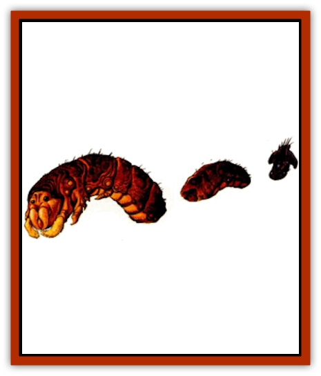

# Drake - Lesser - Athas - Magma

| Statistic | **Drake, Lesser (Athas), Magma** |
| --- | --- |
| **Activity Cycle:** | Any |
| **Alignment:** | Neutral |
| **Armor Class:** | 0 |
| **Climate/Terrain:** | Any volcanic area |
| **Damage/Attack:** | 1d12+6/1d12+6/5d6/1d12 |
| **Diet:** | Carnivore |
| **Frequency:** | Very rare |
| **Hit Dice:** | 13 |
| **Intelligence:** | Low (5-7) |
| **Magic Resistance:** | Nil |
| **Morale:** | Champion (16) |
| **Movement:** | 18, Br 6, Sw 12 |
| **No. Appearing:** | 1 |
| **No. of Attacks:** | 4 |
| **Organization:** | Solitary |
| **Size:** | G (60' long) |
| **Special Attacks:** | Swallow, constriction |
| **Special Defenses:** | Nil |
| **THAC0:** | 8 |
| **Treasure:** | Special |
| **XP Value:** | 9,000 |

**Psionics Summary**

| Level | Dis/Sci/Dev | Attack/Defense | Score | PSPs |
| --- | --- | --- | --- | --- |
| 13 | 2/2/7 | EW,PsC/IF,TW | 11 | 40 |

**Clairsentience -** *Sciences:* nil; *Devotions:* danger sense, feel sound, radial navigation.

**Telepathy -** *Sciences:* mind link, probe; *Devotions:* ego whip, contact, mind bar, psionic crush.

See also: [[Drake_Lesser_Athas_General_Information|Drake, Lesser (Athas), General Information]]

Magma drakes are enormous creatures that look like worms with two claws just behind their heads. The drake can swallow creatures as large as 12 feet long. Their bodies are covered with thick scales in varying shades of red. The magma drake has two large black eyes set toward the top of its head and has a flaring snout. The nose and eyes have protective flaps of very tough skin that close when the drake is swimming through molten lava.

**Combat:** The magma drake attacks from below the surface, often leaping out of a pool of molten lava to surprise its prey. It can attack creatures as high as 20 feet above the ground in the this fashion. Creatures near the edge of a pool must make a Dexterity check or be spattered by lava for 1-8 (1d8) points of damage when the drake leaps.

The first attack of a magma drake is its bite. With a roll of 4 or more greater than the THAC0, the drake swallows any creature less than 12 feet long. Swallowed creatures cannot attack physically, but may use psionics. They start to take damage from the drake's digestive juices after 2 rounds.

Each of the claws inflicts 7.18 (1d12+6) points of damage. The drake can lash out with its tail, inflicting 1-12 (1d12) points of damage on a hit. Also, if the drake's attack roll is 4 or more greater than its tail's THAC0, the victim has been caught in the tail and may be constricted for an additional 2-16 (2d8) points of damage per round. A successful Bend Bars/Lift Gates roll breaks the drake's grip.

A magma drake fights from within molten lava if it can. To attack a drake that is fighting in this way, an opponent must have the initiative, or the drake slips back into the lava before it can be attacked. If the optional weapon speed factors are used, the drake has a +12 modifier to its initiative roll.

**Habitat/Society:** Magma drakes prefer to live in caverns in or near active volcanoes. They are at home in the lava and can survive submerged for as long as three hours. Magma drakes use their *life detection* power to locate prey.

Magma drakes collect any object that is red in color. They have a unique concept of value. They find red cloth most pleasing, but are constantly puzzled and infuriated by its lack of durability in the lava. They can be bribed with any red objects, but respond best to cloth.

Magma drakes are the mortal enemy of [[Drake_Athas_Earth|earth drakes]], which they hunt whenever possible. Magma drakes use their superior intelligence to offset the earth drakes' greater psionic powers. They do not hesitate to attack an earth drake with psionics, nor do they hesitate to use its *mass domination* power to coerce other creatures into aiding. If magma drakes are victorious, they show gratitude toward any creature that aided them.

**Ecology:** Magma drakes mate every other year. The female lays her eggs just beneath the surface of an active lava pool, attached to the edge so they don't sink. Young drakes are self-sufficient a few minutes after hatching.

The hide, teeth, and claws of a magma drake bring a high price in any market. However, obtaining these items might cost more in lives than is worth the effort.

---
## Discovery & Documentation

**Source Publication:** Dark Sun Appendix II - Terrors Beyond Tyr (1991)
**Campaign Setting:** Dark Sun
**Author(s):** Jim Atkiss, Steve Brown, Timothy B. Brown, Andrew P. Morris, Bruce Nesmith, Wes Nicholson, Bill Slavicsek

### Other Creatures Found in This Source Book
   * [[Aarakocra_Athas|Aarakocra (Athas)]]
   * [[Animal_Domestic_Athas_II|Animal, Domestic (Athas) II]]
   * [[Aviarag|Aviarag]]
   * [[Baazrag|Baazrag]]
   * [[Baazrag_Boneclaw|Baazrag, Boneclaw]]
   * [[Bloodgrass|Bloodgrass]]
   * [[Cactus_Hunting|Cactus, Hunting]]
   * [[Cactus_Rock|Cactus, Rock]]
   * [[Cilops|Cilops]]
   * [[Crodlu|Crodlu]]
   * [[Dagorran|Dagorran]]
   * [[Dhaot|Dhaot]]
   * [[Drake_Lesser_Athas_General_Information|Drake, Lesser (Athas), General Information]]
   * [[Drake_Lesser_Athas_Rain|Drake, Lesser (Athas), Rain]]
   * [[Drake_Lesser_Athas_Silt|Drake, Lesser (Athas), Silt]]
   * [[Drake_Lesser_Athas_Sun|Drake, Lesser (Athas), Sun]]
   * [[Dray|Dray]]
   * [[Drik|Drik]]
   * [[Dune_Reaper|Dune Reaper]]
   * [[Dwarf_Athas|Dwarf (Athas)]]
   * [[Elemental_Beast_Athas_Air|Elemental Beast (Athas), Air]]
   * [[Elemental_Beast_Athas_Earth|Elemental Beast (Athas), Earth]]
   * [[Elemental_Beast_Athas_Fire|Elemental Beast (Athas), Fire]]
   * [[Elemental_Beast_Athas_Water|Elemental Beast (Athas), Water]]
   * [[Elf_Athas|Elf (Athas)]]
   * [[Fael|Fael]]
   * [[Feylaar|Feylaar]]
   * [[Fordorran|Fordorran]]
   * [[Giant_Half-giant|Giant, Half-giant]]
   * [[Giant_Shadow|Giant, Shadow]]
   * [[Golem_Athas_Magma|Golem (Athas), Magma]]
   * [[Golem_Athas_Salt|Golem (Athas), Salt]]
   * [[Golem_Athas_General_Information|Golem (Athas), General Information]]
   * [[Gorak|Gorak]]
   * [[Halfling_Athas|Halfling (Athas)]]
   * [[Human_Athas|Human (Athas)]]
   * [[Jhakar|Jhakar]]
   * [[Kaisharga|Kaisharga]]
   * [[Kes'trekel|Kes'trekel]]
   * [[Klar|Klar]]
   * [[Krag|Krag]]
   * [[Kragling|Kragling]]
   * [[Lirr|Lirr]]
   * [[Mastyrial|Mastyrial]]
   * [[Meorty|Meorty]]
   * [[Mul|Mul]]
   * [[Nikaal|Nikaal]]
   * [[Paraelemental_Beast_General_Information|Paraelemental Beast, General Information]]
   * [[Paraelemental_Beast_Magma|Paraelemental Beast, Magma]]
   * [[Paraelemental_Beast_Rain|Paraelemental Beast, Rain]]
   * [[Paraelemental_Beast_Silt|Paraelemental Beast, Silt]]
   * [[Paraelemental_Beast_Sun|Paraelemental Beast, Sun]]
   * [[Pakubrazi|Pakubrazi]]
   * [[Psionocus|Psionocus]]
   * [[Psurlon|Psurlon]]
   * [[Raaig|Raaig]]
   * [[Retriever_Obsidian|Retriever, Obsidian]]
   * [[Ruktoi|Ruktoi]]
   * [[Ruvoka_Athas|Ruvoka (Athas)]]
   * [[Sand_Howler|Sand Howler]]
   * [[Scorpion_Athas|Scorpion (Athas)]]
   * [[Seed_Brain|Seed, Brain]]
   * [[Silt_Horror_Black|Silt Horror, Black]]
   * [[Silt_Horror_Magma|Silt Horror, Magma]]
   * [[Silt_Horror_Red|Silt Horror, Red]]
   * [[Silt_Spawn|Silt Spawn]]
   * [[Slig|Slig]]
   * [[Spider_Athas|Spider (Athas)]]
   * [[Spinewyrm|Spinewyrm]]
   * [[Ssurran|Ssurran]]
   * [[Stalking_Horror|Stalking Horror]]
   * [[Tarek|Tarek]]
   * [[Tari|Tari]]
   * [[Thri-kreen|Thri-kreen]]
   * [[T'liz|T'liz]]
   * [[Tohr-kreen_II|Tohr-kreen II]]
   * [[Tohr-kreen_III|Tohr-kreen III]]
   * [[Trin|Trin]]
   * [[Tul'k|Tul'k]]
   * [[Undead_Athas_General_Information|Undead (Athas), General Information]]
   * [[Wraith_Athas|Wraith (Athas)]]
   * [[Xerichou|Xerichou]]
   * [[Zombie_Thinking|Zombie, Thinking]]
