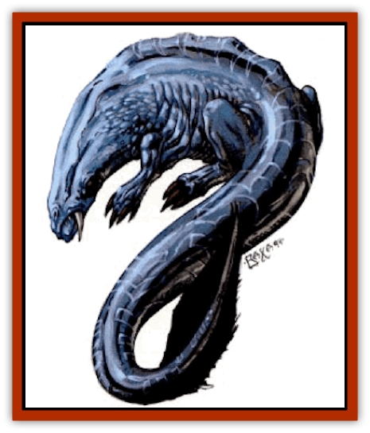

# Drake - Lesser - Athas - Rain

| Statistic | **Drake, Lesser (Athas), Rain** |
| --- | --- |
| **Activity Cycle:** | Any |
| **Alignment:** | Any neutral |
| **Armor Class:** | 1 |
| **Climate/Terrain:** | Verdant belt |
| **Damage/Attack:** | 2d6 (&times;2 or &times;4)/3d8 |
| **Diet:** | Carnivore |
| **Frequency:** | Very rare |
| **Hit Dice:** | 14+6 |
| **Intelligence:** | Average (10) |
| **Magic Resistance:** | Nil |
| **Morale:** | Champion (15) |
| **Movement:** | 12, Sw 18 |
| **No. Appearing:** | 1 |
| **No. of Attacks:** | 3 or 5 |
| **Organization:** | Solitary |
| **Size:** | G (50' long) |
| **Special Attacks:** | Swallow |
| **Special Defenses:** | Nil |
| **THAC0:** | 6 |
| **Treasure:** | Special |
| **XP Value:** | 7,000 |

**Psionics Summary**

| Level | Dis/Sci/Dev | Attack/Defense | Score | PSPs |
| --- | --- | --- | --- | --- |
| 15 | 2/1/5 | PsC/IF | 9 | 30 |

**Clairsentience -** *Sciences:* nil; *Devotion:* combat mind.

**Telepathy -** *Science:* mind link; *Devotions:* domination, contact, phobia amplification, psionic crush.

See also: [[Drake_Lesser_Athas_General_Information|Drake, Lesser (Athas), General Information]]

Rain drakes appear as large lizards with glistening silver scales and eel-like tails. They have long, pointed snouts and two black eyes set back in the head. Their front and hind legs are connected by loose flaps of skin that help them glide through the water. They have webbed feet and claws on all four limbs.

**Combat:** Rain drakes attack with either two or four claws and a bite. Each claw inflicts 2-12 (2d6) points of damage. If the combat is in a body of water, the drake can use all four claws, otherwise it rears up and crashes down on its victims. The crashing attack gains a +1 bonus to the attack roll and damage. Spears and other weapons can be set against this attack and should be treated as spears set against a charging opponent.

Rain drakes' bites inflict 3-24 (3d8) points of damage. A roll of 4 or more greater than the THAC0 means the opponent has been swallowed whole. Swallowed creatures cannot attack physically, but can use psionic powers. The swallowed creature starts to receive damage from digestive juices after 2 rounds inside the drake.

Rain drakes fight in water, if possible, and they can "swim" even in light rain. Although rain drakes cannot fly, they can use even a small amount of water to swim through the air.

If rain drakes burst through the top of a rain cloud, they immediately take 2-20 (2d10) points of damage from the sun's rays. Rain drakes are susceptible to attacks using heat or dehydration and might flee if such an attack is used on them.

**Habitat/Society:** Rain drakes loath [[Drake_Athas_Water|water drakes]]. Rain drakes have several advantages over their enemies; they need less water to survive and maneuver, they are smarter, and they are faster. The racial hatred is sufficient to make rain drakes lose all concept of self-preservation.

Rain drakes make their lairs in pools beneath waterfalls if they can, but any body of water is a possible lair. The lair usually is a water-filled grotto, but it may have a dry patch with an air pocket.

Rain drakes can survive out of water for a few hours in the night or if any cloud cover is producing rain. They dehydrate if their hide is not wet. Rain drakes can smell water as far as 10 miles away.

The life span of rain drakes depends on the amount of water available, but their life is measured in centuries. Mating occurs once every 5 to 10 years and only after rainfall. Unlike other drakes, rain drakes bear 1-2 young. Young drakes are sent out to find their own territory a few days after birth.

Rain drakes like to collect items that resemble rain drops. Anything from glass beads to diamonds may be found in a rain drake's trove. They have no concept of value - any piece of their treasure is as valuable to them as another.

**Ecology:** Rain drakes are the top of the food chain in the water, as they are prey only for water drakes. They are the rarest of all the lesser drakes because they are limited to areas near water. Their hides, teeth, and claws are valuable commodities but they must be kept wet, or be specially treated once the drake is dead.

---
## Discovery & Documentation

**Source Publication:** Dark Sun Appendix II - Terrors Beyond Tyr (1991)
**Campaign Setting:** Dark Sun
**Author(s):** Jim Atkiss, Steve Brown, Timothy B. Brown, Andrew P. Morris, Bruce Nesmith, Wes Nicholson, Bill Slavicsek

### Other Creatures Found in This Source Book
   * [[Aarakocra_Athas|Aarakocra (Athas)]]
   * [[Animal_Domestic_Athas_II|Animal, Domestic (Athas) II]]
   * [[Aviarag|Aviarag]]
   * [[Baazrag|Baazrag]]
   * [[Baazrag_Boneclaw|Baazrag, Boneclaw]]
   * [[Bloodgrass|Bloodgrass]]
   * [[Cactus_Hunting|Cactus, Hunting]]
   * [[Cactus_Rock|Cactus, Rock]]
   * [[Cilops|Cilops]]
   * [[Crodlu|Crodlu]]
   * [[Dagorran|Dagorran]]
   * [[Dhaot|Dhaot]]
   * [[Drake_Lesser_Athas_General_Information|Drake, Lesser (Athas), General Information]]
   * [[Drake_Lesser_Athas_Magma|Drake, Lesser (Athas), Magma]]
   * [[Drake_Lesser_Athas_Silt|Drake, Lesser (Athas), Silt]]
   * [[Drake_Lesser_Athas_Sun|Drake, Lesser (Athas), Sun]]
   * [[Dray|Dray]]
   * [[Drik|Drik]]
   * [[Dune_Reaper|Dune Reaper]]
   * [[Dwarf_Athas|Dwarf (Athas)]]
   * [[Elemental_Beast_Athas_Air|Elemental Beast (Athas), Air]]
   * [[Elemental_Beast_Athas_Earth|Elemental Beast (Athas), Earth]]
   * [[Elemental_Beast_Athas_Fire|Elemental Beast (Athas), Fire]]
   * [[Elemental_Beast_Athas_Water|Elemental Beast (Athas), Water]]
   * [[Elf_Athas|Elf (Athas)]]
   * [[Fael|Fael]]
   * [[Feylaar|Feylaar]]
   * [[Fordorran|Fordorran]]
   * [[Giant_Half-giant|Giant, Half-giant]]
   * [[Giant_Shadow|Giant, Shadow]]
   * [[Golem_Athas_Magma|Golem (Athas), Magma]]
   * [[Golem_Athas_Salt|Golem (Athas), Salt]]
   * [[Golem_Athas_General_Information|Golem (Athas), General Information]]
   * [[Gorak|Gorak]]
   * [[Halfling_Athas|Halfling (Athas)]]
   * [[Human_Athas|Human (Athas)]]
   * [[Jhakar|Jhakar]]
   * [[Kaisharga|Kaisharga]]
   * [[Kes'trekel|Kes'trekel]]
   * [[Klar|Klar]]
   * [[Krag|Krag]]
   * [[Kragling|Kragling]]
   * [[Lirr|Lirr]]
   * [[Mastyrial|Mastyrial]]
   * [[Meorty|Meorty]]
   * [[Mul|Mul]]
   * [[Nikaal|Nikaal]]
   * [[Paraelemental_Beast_General_Information|Paraelemental Beast, General Information]]
   * [[Paraelemental_Beast_Magma|Paraelemental Beast, Magma]]
   * [[Paraelemental_Beast_Rain|Paraelemental Beast, Rain]]
   * [[Paraelemental_Beast_Silt|Paraelemental Beast, Silt]]
   * [[Paraelemental_Beast_Sun|Paraelemental Beast, Sun]]
   * [[Pakubrazi|Pakubrazi]]
   * [[Psionocus|Psionocus]]
   * [[Psurlon|Psurlon]]
   * [[Raaig|Raaig]]
   * [[Retriever_Obsidian|Retriever, Obsidian]]
   * [[Ruktoi|Ruktoi]]
   * [[Ruvoka_Athas|Ruvoka (Athas)]]
   * [[Sand_Howler|Sand Howler]]
   * [[Scorpion_Athas|Scorpion (Athas)]]
   * [[Seed_Brain|Seed, Brain]]
   * [[Silt_Horror_Black|Silt Horror, Black]]
   * [[Silt_Horror_Magma|Silt Horror, Magma]]
   * [[Silt_Horror_Red|Silt Horror, Red]]
   * [[Silt_Spawn|Silt Spawn]]
   * [[Slig|Slig]]
   * [[Spider_Athas|Spider (Athas)]]
   * [[Spinewyrm|Spinewyrm]]
   * [[Ssurran|Ssurran]]
   * [[Stalking_Horror|Stalking Horror]]
   * [[Tarek|Tarek]]
   * [[Tari|Tari]]
   * [[Thri-kreen|Thri-kreen]]
   * [[T'liz|T'liz]]
   * [[Tohr-kreen_II|Tohr-kreen II]]
   * [[Tohr-kreen_III|Tohr-kreen III]]
   * [[Trin|Trin]]
   * [[Tul'k|Tul'k]]
   * [[Undead_Athas_General_Information|Undead (Athas), General Information]]
   * [[Wraith_Athas|Wraith (Athas)]]
   * [[Xerichou|Xerichou]]
   * [[Zombie_Thinking|Zombie, Thinking]]
