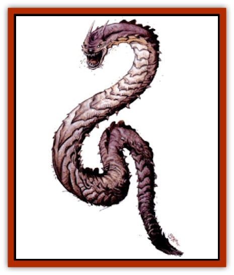

# Drake - Lesser - Athas - Silt

| Statistic | **Drake, Lesser (Athas), Silt** |
| --- | --- |
| **Activity Cycle:** | Day |
| **Alignment:** | Neutral |
| **Armor Class:** | 4 |
| **Climate/Terrain:** | Sea of Silt |
| **Damage/Attack:** | 5d10/2d8 |
| **Diet:** | Carnivore |
| **Frequency:** | Rare |
| **Hit Dice:** | 12 |
| **Intelligence:** | Low (5-7) |
| **Magic Resistance:** | Nil |
| **Morale:** | Elite (13-14) |
| **Movement:** | 6, Sw 18 |
| **No. Appearing:** | 1-2 |
| **No. of Attacks:** | 2 |
| **Organization:** | Solitary |
| **Size:** | G (70' long) |
| **Special Attacks:** | Swallow, constriction |
| **Special Defenses:** | See below |
| **THAC0:** | 9 |
| **Treasure:** | Nil |
| **XP Value:** | 7,000 |

**Psionics Summary**

| Level | Dis/Sci/Dev | Attack/Defense | Score | PSPs |
| --- | --- | --- | --- | --- |
| 12 | 2/2/7 | EW,II/MB,TS | 11 | 40 |

**Psychometabolism -** *Science:* death field; *Devotions:* suspend animation, chameleon power.

**Telepathy -** *Science:* mind link; *Devotions:* contact, ego whip, life detection, psionic drain, id insinuation.

The silt [[Drake_Lesser_Athas_General_Information|drake]] is a long, sand-colored serpent. It has a blunt head with two horns and a huge maw. The drake can unhinge its bottom jaw to open its mouth even wider for very large prey.

**Combat:** The silt drake locates its prey by using its psionic abilities. Its preferred attack mode is to swim through the silt below its prey and then explode out of the dust at high speed. This attack gives a -4 to its opponent's surprise roll. If coming up from the depths of the silt, the drake can attack creatures as high as 30 feet above the ground. Fighting from the silt slows the drake's attack rate to one attack every 2 rounds, but opponents suffer a -4 penalty to their attack rolls. If opponents wait for the drake to surface before attacking, they can attack only if they have a better initiative than the drake. A silt drake suffers only half the normal penalty to initiative for large creatures when it attacks from the silt in this manner (see the rules for weapons speeds and initiative in the *Player's Handbook*).

A silt drake attacks with a bite (5-50 points of damage) and a crushing tail (2-16 points of damage). If the drake bites, a roll of 4 or more greater than the THAC0 means it swallows any opponent smaller than large-sized. Swallowed opponents begin to take damage from the digestive juices after 2 rounds. Swallowed creatures cannot attack, but may use psionics.

When the drake attacks with its tail, a roll of 4 or more greater than the THAC0 means the drake has wrapped its tail around the opponent and can constrict for 2-16 (2d8) points of damage per round. A successful Strength check allows a trapped opponent to break free. To sever the tail, an opponent must inflict damage to it equal to one-fifth of the drake's hit points.

**Habitat/Society:** The silt drake is a migratory and solitary creature. It has no permanent lair or territory.

Once a year, a male drake issues a call through the dust to any females nearby. If a female answers the call, the male and female drake mate briefly and then separate. The female lays her eggs in the deepest parts of the Sea of Silt and abandons them. A clutch consists of 3-6 eggs. They hatch after four weeks in the dust. The young drakes immediately start out in search of food. Often, the most available food is the rest of the clutch.

The horns on the silt drake's head are sensory organs. The silt drake uses the horns to help it search for prey.

**Ecology:** The silt drake hunts and attacks anything that moves. Even [[Silt_Horror|silt horrors]] are food for the drake. Silt horrors, [[Aarakocra_Athas|aarakocra]], and humans or demihumans are the only natural enemies of the silt drake. The silt drake is at the top of the food chain and only a silt horror will eat one.

The silt drake has no need for treasure and has no hoard. The drake's stomach sometimes contains an uncut gem. The drake's digestive juices are extremely corrosive and dissolve all metals, animal products (including leather), and plant matter (including cloth) in a few days.

The teeth of a silt drake are highly prized by aarakocra as badges of courage. The silt drake teeth can be used to make a sharp knife by anyone with the skill to do it.

---
## Discovery & Documentation

**Source Publication:** Dark Sun Appendix II - Terrors Beyond Tyr (1991)
**Campaign Setting:** Dark Sun
**Author(s):** Jim Atkiss, Steve Brown, Timothy B. Brown, Andrew P. Morris, Bruce Nesmith, Wes Nicholson, Bill Slavicsek

### Other Creatures Found in This Source Book
   * [[Aarakocra_Athas|Aarakocra (Athas)]]
   * [[Animal_Domestic_Athas_II|Animal, Domestic (Athas) II]]
   * [[Aviarag|Aviarag]]
   * [[Baazrag|Baazrag]]
   * [[Baazrag_Boneclaw|Baazrag, Boneclaw]]
   * [[Bloodgrass|Bloodgrass]]
   * [[Cactus_Hunting|Cactus, Hunting]]
   * [[Cactus_Rock|Cactus, Rock]]
   * [[Cilops|Cilops]]
   * [[Crodlu|Crodlu]]
   * [[Dagorran|Dagorran]]
   * [[Dhaot|Dhaot]]
   * [[Drake_Lesser_Athas_General_Information|Drake, Lesser (Athas), General Information]]
   * [[Drake_Lesser_Athas_Magma|Drake, Lesser (Athas), Magma]]
   * [[Drake_Lesser_Athas_Rain|Drake, Lesser (Athas), Rain]]
   * [[Drake_Lesser_Athas_Sun|Drake, Lesser (Athas), Sun]]
   * [[Dray|Dray]]
   * [[Drik|Drik]]
   * [[Dune_Reaper|Dune Reaper]]
   * [[Dwarf_Athas|Dwarf (Athas)]]
   * [[Elemental_Beast_Athas_Air|Elemental Beast (Athas), Air]]
   * [[Elemental_Beast_Athas_Earth|Elemental Beast (Athas), Earth]]
   * [[Elemental_Beast_Athas_Fire|Elemental Beast (Athas), Fire]]
   * [[Elemental_Beast_Athas_Water|Elemental Beast (Athas), Water]]
   * [[Elf_Athas|Elf (Athas)]]
   * [[Fael|Fael]]
   * [[Feylaar|Feylaar]]
   * [[Fordorran|Fordorran]]
   * [[Giant_Half-giant|Giant, Half-giant]]
   * [[Giant_Shadow|Giant, Shadow]]
   * [[Golem_Athas_Magma|Golem (Athas), Magma]]
   * [[Golem_Athas_Salt|Golem (Athas), Salt]]
   * [[Golem_Athas_General_Information|Golem (Athas), General Information]]
   * [[Gorak|Gorak]]
   * [[Halfling_Athas|Halfling (Athas)]]
   * [[Human_Athas|Human (Athas)]]
   * [[Jhakar|Jhakar]]
   * [[Kaisharga|Kaisharga]]
   * [[Kes'trekel|Kes'trekel]]
   * [[Klar|Klar]]
   * [[Krag|Krag]]
   * [[Kragling|Kragling]]
   * [[Lirr|Lirr]]
   * [[Mastyrial|Mastyrial]]
   * [[Meorty|Meorty]]
   * [[Mul|Mul]]
   * [[Nikaal|Nikaal]]
   * [[Paraelemental_Beast_General_Information|Paraelemental Beast, General Information]]
   * [[Paraelemental_Beast_Magma|Paraelemental Beast, Magma]]
   * [[Paraelemental_Beast_Rain|Paraelemental Beast, Rain]]
   * [[Paraelemental_Beast_Silt|Paraelemental Beast, Silt]]
   * [[Paraelemental_Beast_Sun|Paraelemental Beast, Sun]]
   * [[Pakubrazi|Pakubrazi]]
   * [[Psionocus|Psionocus]]
   * [[Psurlon|Psurlon]]
   * [[Raaig|Raaig]]
   * [[Retriever_Obsidian|Retriever, Obsidian]]
   * [[Ruktoi|Ruktoi]]
   * [[Ruvoka_Athas|Ruvoka (Athas)]]
   * [[Sand_Howler|Sand Howler]]
   * [[Scorpion_Athas|Scorpion (Athas)]]
   * [[Seed_Brain|Seed, Brain]]
   * [[Silt_Horror_Black|Silt Horror, Black]]
   * [[Silt_Horror_Magma|Silt Horror, Magma]]
   * [[Silt_Horror_Red|Silt Horror, Red]]
   * [[Silt_Spawn|Silt Spawn]]
   * [[Slig|Slig]]
   * [[Spider_Athas|Spider (Athas)]]
   * [[Spinewyrm|Spinewyrm]]
   * [[Ssurran|Ssurran]]
   * [[Stalking_Horror|Stalking Horror]]
   * [[Tarek|Tarek]]
   * [[Tari|Tari]]
   * [[Thri-kreen|Thri-kreen]]
   * [[T'liz|T'liz]]
   * [[Tohr-kreen_II|Tohr-kreen II]]
   * [[Tohr-kreen_III|Tohr-kreen III]]
   * [[Trin|Trin]]
   * [[Tul'k|Tul'k]]
   * [[Undead_Athas_General_Information|Undead (Athas), General Information]]
   * [[Wraith_Athas|Wraith (Athas)]]
   * [[Xerichou|Xerichou]]
   * [[Zombie_Thinking|Zombie, Thinking]]
